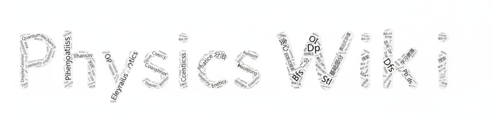

[](https://physics-learning-wiki.github.io/Physics-Learning-Wiki/)

# 欢迎来到 **Physics Learning Wiki**！

[](https://github.com/Physics-Learning-Wiki/Physics-Learning-Wiki/actions/workflows/build.yml)  [](https://github.com/Physics-Learning-Wiki/Physics-Learning-Wiki)


## 项目简介

**Physics-Learning-Wiki** 是一个面向物理爱好者与大学本科生的系统化物理学习站点。项目当前将“本科入门/自学主线”放在第一优先级，目标不是简单汇总零散条目，而是帮助读者建立一条可持续扩展的学习路径：先完成主线，再进入专题、竞赛和更进阶的内容。

项目内容覆盖主线学科模块、数学与实验支撑模块、计算工具以及专题强化页面，并逐步补齐路线图、模块导学页和章节写作规范。


## 鸣谢

感谢 [OI wiki](https://oi-wiki.org/) 以及 OI wiki 的贡献者们提供的框架、内容与技术支持！
感谢所有为 **Physics Learning Wiki** 做出贡献的朋友们！
> 由于学物理的同学们并不常有GitHub账号，您在页面中可能会看到一些“匿名同学”做出的贡献，这些贡献大多为同学们联系项目成员帮忙提交的内容，也十分感谢他们的付出！


## 目录总体框架

项目的主要内容组织在 `docs/` 目录下，包含以下模块：

- **intro**：项目说明、学习路线、贡献入口与写作规范。
- **math**：物理学习所需的数学工具。
- **mechanics / thermodynamics / electromagnetism / optics / modern**：本科物理主线学科模块。
- **experiment**：实验、测量、误差分析与仪器基础。
- **tools**：LaTeX、Python、仿真和绘图等计算与表达工具。
- **contest**：竞赛与专题强化页面，作为总站主线之外的支线模块。
- **glossary / references / problem-bank**：术语、参考资料与后续扩展资源。
- **structure**：关于知识分层与内容组织方式的结构说明。


## 部署

本项目使用 [MkDocs](https://github.com/mkdocs/mkdocs) 进行部署，推荐使用以下步骤在本地运行：

### 环境准备

1. 克隆仓库：

```bash
git clone https://github.com/Physics-Learning-Wiki/Physics-Learning-Wiki.git --depth=1
cd Physics-Learning-Wiki
```

2. 安装依赖：

```bash
pip install uv
uv sync --index-url https://pypi.tuna.tsinghua.edu.cn/simple/
```

3. 安装自定义主题（Windows 下请使用 Git Bash 执行）：

```bash
./scripts/pre-build/install-theme.sh
```

### 本地运行

- 启动本地服务器：

```bash
uv run mkdocs serve -v
```

- 构建静态页面：

```bash
uv run mkdocs build -v
```

---

## 如何参与贡献

我们欢迎所有对物理学习感兴趣的小伙伴参与贡献！

- **GitHub 协作**：通过 Pull Request 修正文案、补充内容或改进脚本与页面结构。
- **邮箱投稿**：如果您不熟悉 GitHub，也可以把成稿、提纲、笔记或讲义发送到 [submit@folderrewind.top](mailto:submit@folderrewind.top)，由编辑组协助整理。
- **报告问题**：通过 [Issues](https://github.com/Physics-Learning-Wiki/Physics-Learning-Wiki/issues) 提交问题、建议或结构改进意见。

具体的贡献方式请参考 [贡献指南](docs/intro/htc.md) 与 [内容编写指引](docs/intro/writing.md)。


## 版权声明

<a rel="license" href="https://creativecommons.org/licenses/by-sa/4.0/"></a><br />除特别注明外，项目中除了代码部分均采用<a rel="license" href="https://creativecommons.org/licenses/by-sa/4.0/deed.zh">(Creative Commons BY-SA 4.0) 知识共享署名 - 相同方式共享 4.0 国际许可协议</a>及附加的 [The Star And Thank Author License](https://github.com/zTrix/sata-license) 进行许可。

换言之，使用过程中您可以自由地共享、演绎，但是必须署名、以相同方式共享、分享时没有附加限制，

而且应该为 GitHub 仓库点赞（Star）:P

引用本项目时，请使用以下 BibTeX：

```bibtex
@misc{physics-learning-wiki,
  author = {Physics-Learning-Wiki Team},
  title = {Physics-Learning-Wiki},
  year = {2025},
  publisher = {GitHub},
  journal = {GitHub Repository},
  howpublished = {\url{https://github.com/Physics-Learning-Wiki/Physics-Learning-Wiki}},
}
```
