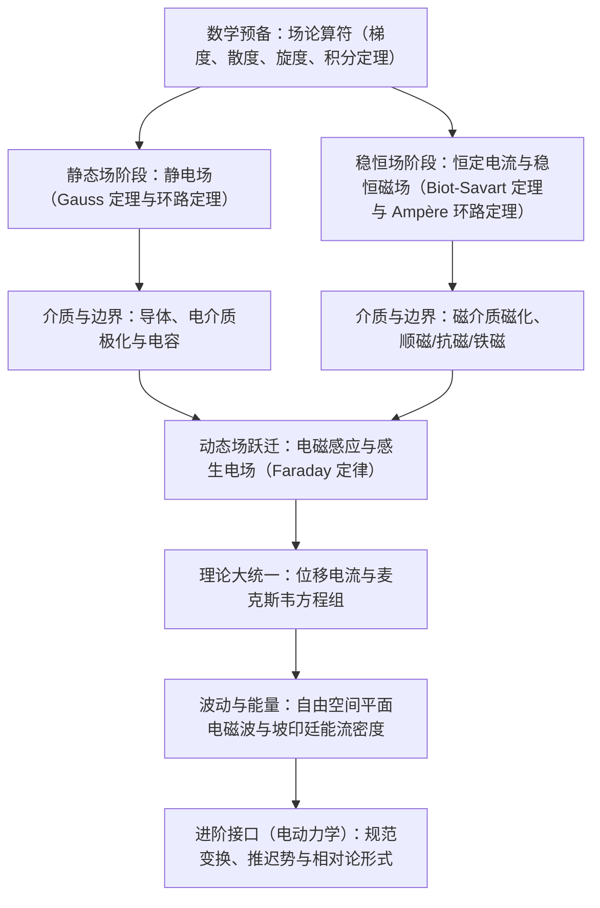

## 电磁学课程路线

《电磁学》（Electromagnetism）是大学物理主线中第一门系统展现「局域场论」（Field Theory）思想的课程．

在学习力学时，我们的思维模式往往是「物体 A 直接推了物体 B」；而进入电磁学后，核心观念变成了：

> **电荷在周围空间中激发了电磁场，电磁场以光速在空间传播，并对处在场中的其他带电体施加力的作用．场本身不仅是相互作用的媒介，更是拥有能量、动量与角动量的独立客观实在．**

这一思想不仅解释了光本质上是一种电磁波，更为狭义相对论和量子电动力学奠定了基石．

***

## 核心思维跃迁

| 维度         | 高中/入门电磁现象           | 大学本科电磁学                                                                                              | 进阶电动力学（四大力学）               |
| :--------- | :------------------ | :--------------------------------------------------------------------------------------------------- | :------------------------- |
| **相互作用机制** | 超距作用（电荷间瞬间产生引力或斥力）  | 局域场论（电磁场在空间连续分布并以有限光速传递）                                                                             | 规范场论（$U(1)$ 局部规范对称性决定相互作用） |
| **数学工具**   | 标量代数、简单几何分量投影       | 场论微积分（梯度 $\nabla\varphi$、散度 $\nabla\cdot\boldsymbol{E}$、旋度 $\nabla\times\boldsymbol{B}$、高斯/斯托克斯积分定理） | 张量分析、四维闵氏时空微分形式、狭义相对论协变化   |
| **理论核心**   | 实验定律叠加（库仑、欧姆、焦耳、安培） | 麦克斯韦方程组（电荷激发散度场、时变激发旋度场）                                                                             | 达朗贝尔波动方程、推迟势与相对论带电粒子多极辐射   |

***

## 课程教学大纲与 Wiki 知识页精准映射

| 教学模块              | 核心物理与数学概念                                                                                                                                                                      | Wiki 对应知识页                                                                                                                                                                     | 状态与学习建议                                  |
| :---------------- | :----------------------------------------------------------------------------------------------------------------------------------------------------------------------------- | :----------------------------------------------------------------------------------------------------------------------------------------------------------------------------- | :--------------------------------------- |
| **1. 数学准备与场论工具**  | 标量场与矢量场、梯度（方向导数）、散度（通量源汇）、旋度（环量涡旋）、高斯定理与斯托克斯定理                                                                                                                                 | -[梯度、散度与旋度](../math/vector-analysis/operators.md) -[矢量积分定理](../math/vector-analysis/integral-theorems.md) -[曲线坐标系](../math/vector-analysis/curvilinear-coordinates.md) | **\[成熟]** 必须熟练掌握「散度描述通量密度、旋度描述环流密度」的几何直观 |
| **2. 静电场基本规律**    | 电荷守恒、库仑定律、电场强度叠加、真空中的高斯定理（微分与积分形式）、环路定理与电势标量场                                                                                                                                  | -[静电场](../electromagnetism/electrostatics.md) -[格林函数方法](../math/eigenfunction-methods/greens-function.md)                                                                  | **\[起草中]** 重点训练通过对称性选取高斯面求解场强的思维         |
| **3. 静电场中的导体与介质** | 静电平衡条件、静电屏蔽、电容与电容器、电介质极化强度矢量 $\boldsymbol{P}$、电位移矢量 $\boldsymbol{D}$、电场能量密度 $w_e = \frac{1}{2}\boldsymbol{D}\cdot\boldsymbol{E}$                                               | -[物质中的电磁场](../electromagnetism/matter.md) -[勒让德多项式](../math/special-functions/legendre.md)                                                                                 | **\[起草中]** 明确区分自由电荷与极化束缚电荷的物理来源          |
| **4. 恒定电流与直流电路**  | 电流密度矢量 $\boldsymbol{j}$、电荷守恒与电流连续性方程 $\nabla\cdot\boldsymbol{j} = -\frac{\partial \rho}{\partial t}$、微分欧姆定律 $\boldsymbol{j}=\sigma\boldsymbol{E}$、电动势概念                        | -[恒定电流与电路](../electromagnetism/dc-circuit.md)                                                                                                                                  | **\[起草中]** 牢固建立从连续场模型过渡到集总参数电路模型的桥梁      |
| **5. 稳恒磁场**       | 磁感应强度 $\boldsymbol{B}$、毕奥 - 萨伐尔定律、磁场的高斯定理（无单极子 $\nabla\cdot\boldsymbol{B}=0$）、安培环路定理（微分与积分形式）、磁矢势 $\boldsymbol{A}$ 基础                                                          | -[恒定磁场](../electromagnetism/magnetostatics.md)                                                                                                                                 | **\[起草中]** 重点训练通过闭合回路利用安培环路定理求解对称磁场      |
| **6. 磁力与磁介质**     | 洛伦兹力、安培力矩与磁矩、磁化强度 $\boldsymbol{M}$、磁场强度 $\boldsymbol{H}$、介质中的环路定理 $\nabla\times\boldsymbol{H}=\boldsymbol{j}_f$                                                                | -[物质中的电磁场](../electromagnetism/matter.md)                                                                                                                                      | **\[起草中]** 明确区分自由传导电流与分子磁化束缚电流           |
| **7. 电磁感应与时变场**   | 法拉第电磁感应定律、动生电动势（洛伦兹力做功）与感生电动势（涡旋电场）、自感与互感、磁场能量密度 $w_m = \frac{1}{2}\boldsymbol{B}\cdot\boldsymbol{H}$                                                                          | -[电磁感应](../electromagnetism/induction.md)                                                                                                                                      | **\[起草中]** 核心在于理解变化的磁场激发非保守的涡旋电场         |
| **8. 交流电路与暂态**    | 简谐交流电、复阻抗法与相量图、RLC 串联/并联谐振、品质因数 $Q$、交流电有效值与功率因数                                                                                                                                | -[交流电路](../electromagnetism/ac-circuit.md) -[复数与几何表示](../math/complex-analysis/complex-numbers.md)                                                                         | **\[起草中]** 学习将微分方程代数化求解的经典工程物理方法         |
| **9. 麦克斯韦方程组**    | 位移电流假说、麦克斯韦方程组完整形式（积分与微分）、介质本构关系、电磁场能量守恒与坡印廷定理（Poynting Theorem）                                                                                                               | -[麦克斯韦方程组与电磁波](../electromagnetism/maxwell.md) -[经典物理偏微分方程](../math/differential-equations/pde-intro.md)                                                                   | **\[重点建设中]** 经典电磁学的顶峰，揭示电磁场相互激发的统一规律     |
| **10. 电磁波与辐射**    | 波动方程推导、电磁波速度 $c = 1/\sqrt{\mu_0\varepsilon_0}$、平面横电磁波性质（$\boldsymbol{E} \perp \boldsymbol{B} \perp \boldsymbol{k}$）、能流密度矢量 $\boldsymbol{S}=\boldsymbol{E}\times\boldsymbol{H}$ | -[麦克斯韦方程组与电磁波](../electromagnetism/maxwell.md) -[傅里叶变换](../math/transforms/fourier-transform.md)                                                                           | **\[重点建设中]** 完成从电磁学通往光学（波动光学与物理光学）的跨学科连接 |
| **11. 通往电动力学的接口** | 标势与矢势、规范自由度与库仑/洛伦兹规范、达朗贝尔非齐次波动方程、狭义相对论时空协变化初探                                                                                                                                  | - 电动力学进阶（规划中）                                                                                                                                                                  | **\[高阶理论展望]** 引导学有余力的同学向理论物理深水区迈进        |

***

## 核心物理辨析与易错点

### 1. 为什么必须引入「位移电流」？

在静态或恒定电流下，安培环路定理为 $\nabla\times\boldsymbol{B} = \mu_0\boldsymbol{j}$．然而，若对该式两边取散度，由于数学恒等式「任意矢量的旋度之散度恒为零」($\nabla\cdot(\nabla\times\boldsymbol{B})\equiv 0$)，便会导出 $\nabla\cdot\boldsymbol{j}=0$．

在电容器充放电等非恒定情形下，电荷连续性方程表明 $\nabla\cdot\boldsymbol{j} = -\frac{\partial \rho}{\partial t} \neq 0$！为了解决这一不可调和的矛盾，麦克斯韦敏锐地意识到：**变化的电场必定等效于一种电流**．引入位移电流密度 $\boldsymbol{j}_d = \frac{\partial \boldsymbol{D}}{\partial t}$ 后，方程变为：

$$
\nabla\times\boldsymbol{H} = \boldsymbol{j}_f + \frac{\partial \boldsymbol{D}}{\partial t}
$$

两边取散度恰好与电荷守恒完全自洽．正是这一深刻的理论预言，揭示了电与磁在空间中交替激发形成电磁波的机制．

### 2. 动生电动势与感生电动势的区别

-   **动生电动势**：导体在不随时间变化的磁场中运动时产生，非静电起源是 **磁场对导体中随动电荷施加的洛伦兹力**，本质不需要电场发生变化；
-   **感生电动势**：磁场随时间变化时在空间中激发了 **涡旋电场（感生电场）**，即使导体不动，该涡旋电场也会对电荷做功，本质是麦克斯韦方程中 $\nabla\times\boldsymbol{E} = -\frac{\partial \boldsymbol{B}}{\partial t}$ 的体现．
