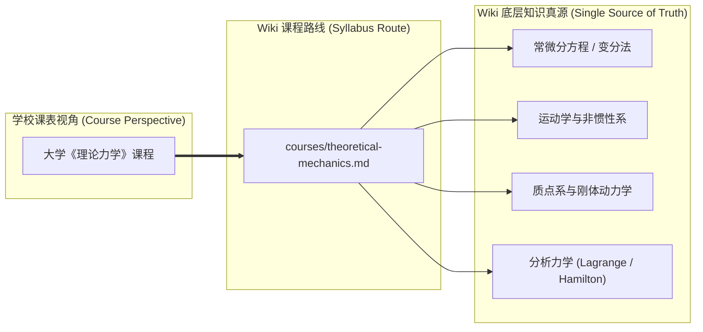

## 课程路线总览

高校物理学专业的培养方案通常是以「学期课程」为单位推进的（例如大二上学期学习《理论力学》与《电磁学》，大二下学期学习《热力学与统计物理》与《电动力学》，大三学习《量子力学》等）．

然而，Physics Learning Wiki 的底层正文是严格按照**客观物理知识领域**（力学、热学、电磁学、光学、现代物理、数学工具等）单源组织的．这导致很多刚进入大二的同学会产生困惑：

- *“我正在学《理论力学》，为什么 Wiki 里只有《经典力学》？”*
- *“理论力学课上讲的广义坐标、拉格朗日方程和刚体惯量张量，应该在 Wiki 里的哪里找？”*
- *“我只想顺着学校课表的节奏复习，有没有一份对应的阅读指南？”*

为了解决这一矛盾，我们建立了**课程路线（Course Routes）**体系．

---

## 课程路线的设计原则

1. **正文单源，路线聚合**：课程路线本身**不重复书写知识正文**，而是扮演教学大纲（Syllabus）与导航地图的角色，将分散在经典力学、数学工具、实验物理等模块中的正文按课程逻辑串联起来．
2. **标明先修与待建**：每一门课程路线都会明确列出先修数学基础与普物基础，并清晰标注各章节在 Wiki 中的完成状态（`[已有完整内容]`、`[可复用基础]`、`[重点建设中]`），让读者明确学习预期．
3. **连通普物与四大力学**：帮助读者完成从大一「普通物理的现象与解题技巧」向大二「理论物理的形式体系与场论表述」的关键思维跃迁．

---

## 当前已上线的课程路线

| 课程名称 | 对应年级阶段 | 核心特色与思想跃迁 | 路线入口 |
| :--- | :--- | :--- | :--- |
| **理论力学** | 大二上 / 理工科核心 | 从牛顿矢量力学跃迁到达朗贝尔原理与拉格朗日/哈密顿分析力学体系 | [进入理论力学路线](./theoretical-mechanics.md) |
| **电磁学** | 大一/大二 / 普物核心 | 从超距作用库仑定律跃迁到局域场论与麦克斯韦方程组 | [进入电磁学路线](./electromagnetism.md) |
| **数学物理方法** | 大二上/下 / 物理核心 | 从孤立微积分公式计算跃迁到物理偏微分方程定解、Sturm–Liouville 本征理论与格林函数通用解法 | [进入数学物理方法路线](./mathematical-methods-for-physics.md) |

---

## 后续规划路线

随着 Wiki 正文的逐步扩展，后续将陆续上线以下课程视图：

- [ ] **热力学与统计物理**：连接宏观唯象热力学定律与微观系综统计理论
- [ ] **电动力学**：以张量分析、狭义相对论协变形式与辐射场为核心的理论电磁体系
- [ ] **量子力学**：以态矢量、算符代数、薛定谔方程与定态微扰论为主线

---

## 怎样配合课程使用 Wiki

1. **课前预习**：通过课程路线查看本周知识点依赖的先修内容（尤其是数学工具与普物概念），快速补齐断层；
2. **课后复习**：对照课程大纲表格点击进入底层正文，重点阅读正文中的「物理图像引入」与「反例/常见误区」；
3. **备考与攻坚**：跟随路线图中的核心思维导图梳理知识脉络，识别知识点之间的横向关联．
