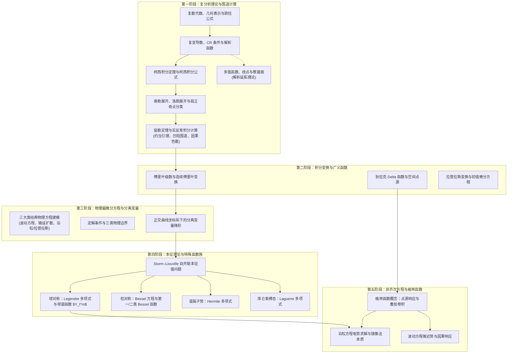

# 数学物理方法课程路线

《数学物理方法》（Mathematical Methods for Physics）是物理学及相关理工科专业本科阶段承上启下的 **核心中轴课程**．它向上承接高等数学与线性代数，向下直接支撑理论力学、电动力学、量子力学以及热力学与统计物理（“四大力学”）．

很多同学从大一微积分进入数理方法时，往往产生强烈的挫败感：*“公式越来越长，复变积分、特殊函数推导铺天盖地，背了一堆正交公式和留数法则，却不知道它们在物理里到底有什么用？”*

> “The shortest path between two truths in the real domain passes through the complex domain.” —— Jacques Hadamard  
> （联系两个实数领域中真理的最短路径往往穿过复数领域．）

理论物理学家与数学家早已指出，引入虚数与复分析绝非脱离现实的人为游戏，而是洞察物理对称性与规律演化的最简捷利器．诺贝尔物理学奖得主杨振宁先生在《虚数与量子力学》中深入剖析过虚数在微观物理中的本质地位；物理诺奖得主费曼将欧拉公式誉为“数学上最值得注意的公式，我们的无价之宝”；A. Zee（徐一鸿）在《Fly by Night Physics》中更感慨道：*“当我们踏入复分析的世界，展现在眼前的是一个奇妙无双的洞见王国．那些初学时令人惊叹的定理，其优雅与宏大气度始终令人折服．”*

本路线旨在打破“纯数学技巧死记硬背”的误区：**本路线不重复搬运枯燥公理，而是按照高校标准教学节奏，有机串联 Wiki 底层语义化的数学物理知识库，清晰标明每一个数学工具在后续现代物理中的核心出口与实战方法，并配备系统的精选例题与自测题库．**

---

## 核心思维跃迁与认知体系

### 1. 实数与复数的“微积分三部曲”对照

复变微积分在形式上平行于实微积分，但在内涵上展现出远为强大的内在刚性与“全息性”：

| 微积分维度 | 实数微积分三部曲 | 复数微积分三部曲 | 物理学与分析学启示 |
| :--- | :--- | :--- | :--- |
| **第一步：微分** | **实一元/多元导数与偏导** $$\lim_{\Delta x \to 0}\frac{f(x+\Delta x)-f(x)}{\Delta x}$$ | **复导数与柯西-黎曼（C-R）方程** $$\lim_{\Delta z \to 0}\frac{f(z+\Delta z)-f(z)}{\Delta z}$$ 要求极限沿复平面**任意方向**逼近均唯一独立 | 复可微要求极度严苛：实部与虚部自动满足二维 Laplace 方程 $\nabla^2 u = \nabla^2 v = 0$，天然契合二维无源静电场与无旋理想流体． |
| **第二步：积分** | **实定向线积分与面积分** $$\int_C (P\mathrm{d}x + Q\mathrm{d}y)$$ | **复平面围道积分 (Contour Integrals)** $$\oint_C f(z)\mathrm{d}z$$ | 闭路变形原理：只要围道变形不跨越奇点，积分值严格不变；复积分本质由边界拓扑与奇点性质完全决定． |
| **第三步：联系微积分的基本定理** | **微积分基本定理与广义 Stokes 公式** $$\int_a^b f'(x)\mathrm{d}x = f(b) - f(a)$$ $$\int_{\partial \Sigma} \omega = \int_\Sigma \mathrm{d}\omega$$ | **柯西积分公式与留数定理** $$f(z_0) = \frac{1}{2\pi i}\oint_C \frac{f(z)}{z - z_0}\mathrm{d}z$$ $$\oint_C f(z)\mathrm{d}z = 2\pi i \sum \mathrm{Res}$$ | **全息特性**：内部任意点函数值与各阶导数完全由边界围道上的值决定！**可微一次即保证无穷次可微**；复积分将繁复的实数定积分降维为局域奇点代数计算． |

---

### 2. 数理方法核心思维跨越

| 维度 | 大一高等数学与线性代数 | 大学《数学物理方法》与理论物理 |
| :--- | :--- | :--- |
| **方程类型** | 单变量初等方程、常系数一阶/二阶常微分方程 | 偏微分方程（波动方程、热传导方程、泊松/拉普拉斯方程）与定解边值问题 |
| **求解范式** | 套用微积分不定积分技巧与代数初等解 | **分离变量法** 将偏微分方程降阶为常微分方程本征值问题，通过 **正交函数基叠加** 满足定解边界条件 |
| **函数视角** | 初等函数（多项式、三角、指数、对数） | **函数空间与正交完备系**（Fourier 基、Legendre 多项式、Bessel 函数、球谐函数 $Y_l^m$、Hermite/Laguerre 多项式） |
| **代数与分析统一** | 矩阵对角化与微分方程相互割裂 | **线性算符谱理论**：微分算符自共轭（Hermitian）推广了有限维实对称矩阵，特征向量升级为连续/离散本征函数系 |
| **非齐次解法** | 常数变易法、待定系数法 | **格林函数法**：物理点源 $\delta(\boldsymbol{r}-\boldsymbol{r}')$ 响应与空间卷积统一求解任意非齐次边值问题 |

---

### 3. 数学物理方法知识架构图

---

## 课程大纲与 Wiki 核心知识库精准映射

下表将标准高校《数学物理方法》教学主干与 Wiki 知识页进行全面对照，并标明在四大力学中的物理出口：

| 教学阶段 | 核心知识点与数学工具 | Wiki 对应知识页 | 成熟度状态 | 四大力学中的物理对应应用 |
| :--- | :--- | :--- | :--- | :--- |
| **1. 复变函数基础** | 复数几何表示、多值方根、复数乘幂、欧拉公式、三角级数求和、割圆方程 | [复数与几何表示](../math/complex-analysis/complex-numbers.md) | **[成熟]** | 交流电路复阻抗相量、平面单色波复振幅、量子波函数概率幅与规范对称性 |
| **2. 解析性与调和场** | 复可微性判定、柯西-黎曼方程（直角与极坐标）、单点可导与解析反例、共轭调和函数与实轴代换技巧 | [解析函数与柯西-黎曼条件](../math/complex-analysis/analytic-functions.md) | **[成熟]** | 二维静电场复势与电力线正交性、无旋不可压缩流体流函数、保角映射 |
| **3. 复积分与柯西定理** | 柯西积分定理、闭路变形、柯西积分公式与高阶导数公式、解析函数全息性、扇形围道与菲涅尔积分 | [复变积分与柯西定理](../math/complex-analysis/contour-integrals.md) | **[成熟]** | 恩绍定理（静电不可悬浮）的复分析源头、光波动菲涅尔衍射、Wick 转动高斯路径积分 |
| **4. 级数展开与奇点** | 幂级数收敛、泰勒定理证明、逐项微积分、圆环域洛朗展开、Fibonacci 展开、孤立奇点严格分类、无穷远点 | [级数展开与奇点](../math/complex-analysis/series-expansion.md) | **[成熟]** | 贝塞尔函数母函数生成关系、量子力学散射 $S$ 矩阵极点分析与共振束缚态 |
| **5. 留数定理与实积分** | 留数诞生哲学、极点商式法则、五大积分围道范式（实轴、半圆、扇形、凹陷围道、矩形）、因果色散 | [留数定理与实积分计算](../math/complex-analysis/residue-calculus.md) | **[成熟]** | 振动阻尼系统频域响应、介电常数 Kramers–Kronig 色散关系、量子场论费曼 $i\epsilon$ 处方 |
| **6. 积分变换与广义函数** | 狄拉克 $\delta$ 函数、分立/连续傅里叶变换、卷积定理、拉普拉斯变换解初值问题 | [狄拉克 Delta 函数](../math/transforms/delta-function.md) [傅里叶级数](../math/transforms/fourier-series.md) [傅里叶变换](../math/transforms/fourier-transform.md) [拉普拉斯变换](../math/transforms/laplace-transform.md) | **[成熟]** | 频域谱分析、光学傅里叶衍射、量子力学坐标与动量表象变换、电路冲激响应 |
| **7. 物理偏微分方程建立** | 弦振动与电磁波动方程、热传导/扩散方程、稳恒泊松/拉普拉斯方程、三类定解边界条件 | [经典物理偏微分方程](../math/differential-equations/pde-intro.md) | **[成熟]** | 连续介质波动动力学、经典电动力学麦克斯韦边值定解、非平衡热传导 |
| **8. 分离变量法** | 空间-时间分离、正交坐标系坐标分离、齐次边界确定本征值与本征函数、正交完备基展开 | [分离变量法定解法](../math/differential-equations/separation-of-variables.md) | **[成熟]** | 两端固定琴弦驻波振动、矩形金属空腔谐振电磁模、长方体导体热传导 |
| **9. Sturm–Liouville 理论** | 自共轭微分算子、本征值实数性、本征函数带权正交完备性、广义傅里叶展开 | [Sturm–Liouville 理论](../math/eigenfunction-methods/sturm-liouville.md) | **[成熟]** | 量子力学定态薛定谔方程本征态、厄米算符可观测量定理的泛函母体 |
| **10. 柱对称与 Bessel 函数** | 柱坐标拉普拉斯算子、Bessel 方程级数解、第一/二类 Bessel 函数、虚宗量与半整数阶 Bessel 函数 | [贝塞尔函数](../math/special-functions/bessel.md) | **[成熟]** | 圆形鼓膜振动驻波模式、圆柱形电磁波导（TE/TM 模）、圆孔夫琅禾费衍射 |
| **11. 球对称与 Legendre/球谐函数** | 球坐标角向方程、Legendre 多项式、连带 Legendre 函数、正交归一球谐函数 $Y_l^m(\theta,\phi)$ | [勒让德多项式](../math/special-functions/legendre.md) [球谐函数](../math/special-functions/spherical-harmonics.md) | **[成熟]** | 静电场多极矩展开、球形导体边值问题、中心势场定态薛定谔方程角动量本征态 |
| **12. 量子正交多项式** | 谐振子与 Hermite 多项式、氢原子库仑束缚态与 Laguerre 多项式、生成元与递推关系 | [厄米多项式](../math/special-functions/hermite.md) [拉盖尔多项式](../math/special-functions/laguerre.md) | **[成熟]** | 一维量子谐振子能级与波函数节点、氢原子电子轨道能级与径向几率密度 |
| **13. 格林函数方法** | 点源脉冲响应、基本解、第一/二类齐次边界格林函数、镜像法理论本质、推迟势积分 | [格林函数方法](../math/eigenfunction-methods/greens-function.md) | **[成熟]** | 静电学点电荷镜像法严密论证、时变电磁辐射推迟势、量子散射玻恩近似 |

---

## 学习建议与常见思维误区

### 1. 为什么说 Sturm–Liouville 理论是数理方法的“总纲”？

初学者极易把傅里叶级数、勒让德多项式、贝塞尔函数当成五花八门、毫不相干的特殊技巧记忆负担．
其实，只要在微分方程中写出 **自共轭微分算子**：

$$
\mathcal{L} y = -\dfrac{\mathrm{d}}{\mathrm{d}x}\left[p(x)\dfrac{\mathrm{d}y}{\mathrm{d}x}\right] + q(x)y = \lambda w(x)y
$$

你就会发现：
- 当 $p(x)=1, q(x)=0, w(x)=1$ 时，本征函数就是三角函数 $\sin(kx), \cos(kx)$，展开即为 **傅里叶级数**；
- 当 $p(x)=1-x^2, q(x)=0, w(x)=1$ 时，本征函数就是 **勒让德多项式** $P_l(x)$；
- 当 $p(x)=x, q(x)=-m^2/x, w(x)=x$ 时，本征函数就是 **贝塞尔函数** $J_m(kx)$；
- 推广到复 Hilbert 空间时，微分算子的自共轭性正是量子力学中 **厄米算符（Hermitian Operator）实数可观测量定理** 的无限维泛函体现！抓住了这条红线，所有特殊函数就全盘皆活．

### 2. 怎样理解“分离变量”的物理本质？

分离变量法并非一种碰运气的代数戏法，它深刻依赖于系统的 **几何对称性** 与 **物理无耦合性**：
- 当边界条件在笛卡尔坐标系下各坐标平面上独立成立时，方程可以分离为 $X(x)Y(y)Z(z)$；
- 当系统具备球对称或轴对称时，在球坐标或柱坐标下拉普拉斯算子自然解耦为径向与角向算符；
- 分离变量产生的常数（分离常数 $\lambda$）在物理上对应了系统的 **守恒量（如角动量 $l(l+1)$、磁量子数 $m$）或特征空间波数**．

### 3. 格林函数的物理图景：从点源到连续源

求解线性偏微分方程 $\mathcal{L}u = f(\boldsymbol{r})$ 时，如果右端源项 $f(\boldsymbol{r})$ 非常复杂，直接积分极其困难．格林函数的思想是：
1. **单位点源响应**：先求单个位于 $\boldsymbol{r}'$ 处的单位点源 $\delta(\boldsymbol{r}-\boldsymbol{r}')$ 激发的场 $G(\boldsymbol{r},\boldsymbol{r}')$；
2. **线性叠加原理**：任意连续源 $f(\boldsymbol{r}')$ 均可看作无数点源的线性加权叠加 $\int f(\boldsymbol{r}')\delta(\boldsymbol{r}-\boldsymbol{r}')\mathrm{d}\boldsymbol{r}'$；
3. **通解直接卷积**：由算子线性性，总场即为点源响应的连续积分：

$$
u(\boldsymbol{r}) = \int G(\boldsymbol{r},\boldsymbol{r}') f(\boldsymbol{r}') \mathrm{d}\boldsymbol{r}'
$$

这正是为什么静电学中点电荷电势 $\frac{1}{4\pi\varepsilon_0 |\boldsymbol{r}-\boldsymbol{r}'|}$ 天然就是全空间三维 Poisson 方程的自由空间格林函数．
