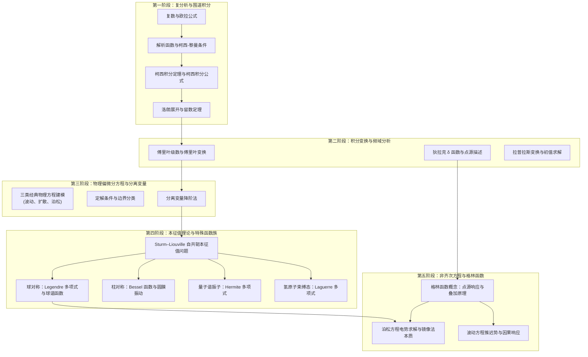

## 数学物理方法课程路线

《数学物理方法》（Mathematical Methods for Physics）是物理学及相关专业本科阶段承上启下的**核心中轴课程**．它向上承接高等数学与线性代数，向下直接支撑理论力学、电动力学、量子力学以及热力学与统计物理．

很多同学从大一微积分进入数理方法时，往往产生强烈的挫败感：*“公式越来越长，复变积分、特殊函数推导铺天盖地，背了一堆正交公式却不知道它们在物理里到底有什么用？”*

本路线旨在打破“纯数学公式背诵”的教学误区：**本路线不重复搬运数学正文，而是按照高校标准教学节奏，串联 Wiki 底层语义化的数学工具页面，并清晰标明每一个数学工具在后续四大力学中的物理应用场景．**

---

## 核心思维跃迁

| 维度 | 大一高等数学与线性代数 | 大学《数学物理方法》与理论物理 |
| :--- | :--- | :--- |
| **方程类型** | 单变量初等方程、常系数一阶/二阶常微分方程 | 偏微分方程（波动方程、热传导方程、泊松/拉普拉斯方程）与定解边值问题 |
| **求解范式** | 套用特定微积分积分技巧与代数初等解 | **分离变量法** 将偏微分方程降阶为常微分方程本征值问题，通过**正交基叠加**满足定解条件 |
| **函数视角** | 初等函数（多项式、三角、指数、对数） | **函数空间与正交完备系**（Fourier 基、Legendre 多项式、Bessel 函数、球谐函数） |
| **代数与分析统一** | 矩阵代数与微积分相互割裂 | **线性算符谱理论**：微分算符自共轭（Hermitian）推广了有限维实对称矩阵，特征向量升级为本征函数 |
| **非齐次解法** | 常数变易法、待定系数法 | **格林函数法**：物理点源/脉冲响应与积分卷积统一求解任意非齐次边值问题 |

---

## 课程大纲与 Wiki 底层知识库精准映射

下表将标准高校《数学物理方法》教学主干与 Wiki 知识页进行对照，方便读者结合课表有针对性地预习与复习：

| 教学阶段 | 核心知识点与数学工具 | Wiki 对应知识页 | 成熟度状态 | 四大力学中的物理对应应用 |
| :--- | :--- | :--- | :--- | :--- |
| **1. 复变函数基础** | 复数几何表示、复变微分、解析性判别、柯西-黎曼条件 | - [复数与几何表示](../math/complex-analysis/complex-numbers.md) - [解析函数与柯西-黎曼条件](../math/complex-analysis/analytic-functions.md) | **[成熟]** | 交流电路复阻抗相量、二维不可压缩流体与静电复势 |
| **2. 复积分与留数计算** | 柯西积分定理/公式、高阶微商、洛朗级数展开、孤立奇点、留数定理 | - [复变积分与柯西定理](../math/complex-analysis/contour-integrals.md) - [级数展开与奇点](../math/complex-analysis/series-expansion.md) - [留数定理与实积分](../math/complex-analysis/residue-calculus.md) | **[重点建设]** | 振动阻尼响应实积分、量子散射矩阵极点分析与因果色散（Kramers–Kronig 关系） |
| **3. 积分变换与广义函数** | 狄拉克 $\delta$ 函数、连续与分立傅里叶变换、卷积定理、拉普拉斯变换 | - [狄拉克 Delta 函数](../math/transforms/delta-function.md) - [傅里叶级数](../math/transforms/fourier-series.md) - [傅里叶变换](../math/transforms/fourier-transform.md) - [拉普拉斯变换](../math/transforms/laplace-transform.md) | **[重点建设]** | 电磁波频域谱分析、光学衍射傅里叶光学、量子力学坐标与动量表象变换 |
| **4. 物理偏微分方程建立** | 弦振动与电磁波动方程、热传导方程、稳恒静电势拉普拉斯/泊松方程、定解边界条件 | - [经典物理偏微分方程](../math/differential-equations/pde-intro.md) | **[重点建设]** | 经典电磁场高斯与安培环路定解、连续介质波动动力学 |
| **5. 分离变量法** | 空间-时间分离、正交坐标系坐标分离、边界条件确定特征值与特征函数、级数叠加求通解 | - [分离变量法定解法](../math/differential-equations/separation-of-variables.md) | **[重点建设]** | 有限长两端固定弦的驻波振动、长方体空腔谐振腔电磁模、金属板热传导 |
| **6. Sturm–Liouville 理论** | 线性微分算符自共轭性、本征值实数性、本征函数正交完备性、广义傅里叶级数展开 | - [Sturm–Liouville 理论](../math/eigenfunction-methods/sturm-liouville.md) | **[核心架构]** | 量子力学定态薛定谔方程本征态、全系正交函数展开的数学母体 |
| **7. 特殊函数：柱对称与 Bessel 函数** | 柱坐标分离变量、Bessel 方程与第一/二类 Bessel 函数、半整数阶与虚宗量 Bessel 函数 | - [贝塞尔函数](../math/special-functions/bessel.md) | **[重点建设]** | 圆形鼓膜振动、圆柱形电磁波导模式（TE/TM 模）、圆孔弗朗禾费衍射 |
| **8. 特殊函数：球对称与 Legendre/球谐函数** | 球坐标分离变量、Legendre 多项式、连带 Legendre 函数、单位球面正交归一球谐函数 $Y_l^m$ | - [勒让德多项式](../math/special-functions/legendre.md) - [球谐函数](../math/special-functions/spherical-harmonics.md) | **[重点建设]** | 静电场多极矩展开、球形导体边值问题、中心势场量子轨道角动量算符本征态 |
| **9. 特殊函数：量子正交多项式** | 一维谐振子与 Hermite 多项式、氢原子库仑束缚态与 Laguerre 多项式 | - [厄米多项式](../math/special-functions/hermite.md) - [拉盖尔多项式](../math/special-functions/laguerre.md) | **[重点建设]** | 量子谐振子波函数节点、氢原子原子轨道能级与波函数径向分布 |
| **10. 格林函数方法** | 点源脉冲响应、基本解、齐次边界格林函数、电磁泊松方程与波动方程积分反演 | - [格林函数方法](../math/eigenfunction-methods/greens-function.md) | **[重点建设]** | 静电场点电荷镜像法理论本质、电磁辐射推迟势、量子散射玻恩近似 |

---

## 学习建议与常见误区

### 1. 为什么说 Sturm–Liouville 理论是数理方法的“总纲”？
初学者极易把傅里叶级数、勒让德多项式、贝塞尔函数当成五花八门、毫不相干的记忆负担．
其实，只要在微分方程中写出 **自共轭微分算子**：

$$
\mathcal{L} y = -\dfrac{\mathrm{d}}{\mathrm{d}x}\left[p(x)\dfrac{\mathrm{d}y}{\mathrm{d}x}\right] + q(x)y = \lambda w(x)y
$$

你就会发现：
- 当 $p(x)=1, q(x)=0, w(x)=1$ 时，本征函数就是三角函数 $\sin(kx), \cos(kx)$，展开即为 **傅里叶级数**；
- 当 $p(x)=1-x^2, q(x)=0, w(x)=1$ 时，本征函数就是 **勒让德多项式** $P_l(x)$；
- 当 $p(x)=x, q(x)=-m^2/x, w(x)=x$ 时，本征函数就是 **贝塞尔函数** $J_m(kx)$；
- 当推广到复空间函数时，算子自共轭性正是量子力学中 **厄米算符实数可观测值定理** 的无限维泛函体现！抓住了这条主线，特殊函数就全盘皆活．

### 2. 怎样理解“分离变量”的物理本质？
分离变量法并非一种碰运气的代数戏法，它深刻依赖于系统的**几何对称性**与**物理相互作用的无耦合性**：
- 当边界条件在笛卡尔坐标系下各坐标平面上独立成立时，方程可以分离为 $X(x)Y(y)Z(z)$；
- 当系统具备球对称或轴对称时，在球坐标或柱坐标下拉普拉斯算符自然解耦为径向与角向算符；
- 分离变量产生的常数（分离常数 $\lambda$）正是系统的**守恒物理量或空间特征波数**．

### 3. 格林函数的物理图景：从点源到连续源
求解偏微分方程 $\mathcal{L}u = f(\boldsymbol{r})$ 时，如果右端源项 $f(\boldsymbol{r})$ 非常复杂，直接积分极其困难．格林函数的思想是：
1. **单位点源响应**：先求单个位于 $\boldsymbol{r}'$ 处的单位点源 $\delta(\boldsymbol{r}-\boldsymbol{r}')$ 激发的场 $G(\boldsymbol{r},\boldsymbol{r}')$；
2. **线性叠加积分**：任意连续源 $f(\boldsymbol{r}')$ 均可看作无数点源的线性加权叠加 $\int f(\boldsymbol{r}')\delta(\boldsymbol{r}-\boldsymbol{r}')\mathrm{d}\boldsymbol{r}'$；
3. **通解直接卷积**：由算符线性性，总场即为点源响应的连续积分：

$$
u(\boldsymbol{r}) = \int G(\boldsymbol{r},\boldsymbol{r}') f(\boldsymbol{r}') \mathrm{d}\boldsymbol{r}'
$$

这就是为什么静电学中点电荷电势 $1/(4\pi\varepsilon_0 |\boldsymbol{r}-\boldsymbol{r}'|)$ 天然就是全空间泊松方程的格林函数．
