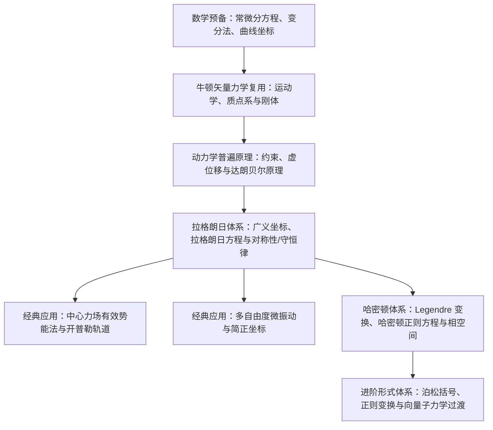

## 理论力学课程路线

《理论力学》（Theoretical Mechanics / Classical Mechanics）是物理学及相关理工科专业本科阶段的第一门理论物理课程．

很多同学从大一普通物理力学进入大二理论力学时，最直观的感受是：*“明明又是质点、刚体和振动，为什么算起来完全不一样了？”*

这门课程的核心，实际上是完成了物理学历史上从 **矢量力学（牛顿体系）** 向 **分析力学（拉格朗日与哈密顿体系）** 的伟大跃迁．

---

## 核心思维跃迁

| 维度 | 普通物理力学（牛顿体系） | 理论力学（分析力学体系） |
| :--- | :--- | :--- |
| **研究基石** | 力与加速度（矢量 $\boldsymbol{F}=m\boldsymbol{a}$） | 动能与势能（标量 $T, V$，拉格朗日量 $L=T-V$） |
| **约束处理** | 必须求解繁琐的未知法向约束力、支持力、张力 | 引入广义坐标消去理想约束反力，自由度即独立变量数 |
| **坐标依赖** | 强依赖于选定的笛卡尔坐标系或特定曲线坐标 | 任意选取广义坐标，方程形式在点变换下保持协变 |
| **与高等物理的连接** | 直观但不易推广到微观与场论 | 分析力学是统计物理、电动力学、量子力学和量子场论的标准形式语言 |

---

## 课程教学大纲与 Wiki 知识页精准映射

下表将标准高校《理论力学》教学大纲与 Wiki 底层知识库页面进行对照．读者可按此表格循序渐进地学习：

| 教学模块 | 核心物理与数学概念 | Wiki 对应知识页 | 状态与学习建议 |
| :--- | :--- | :--- | :--- |
| **1. 数学准备** | 常微分方程求解、曲线正交坐标系、泛函极值与变分法 | - [常微分方程](../math/differential-equations/ode-intro.md) - [曲线坐标系](../math/vector-analysis/curvilinear-coordinates.md) - [变分法](../math/variational-methods/calculus-of-variations.md) | **[成熟]** 重点掌握欧拉-拉格朗日微分方程与泛函变分思想 |
| **2. 质点运动学与动力学** | 矢径、速度、加速度、牛顿定律、非惯性系与惯性力（科里奥利力） | - [运动学基础概念](../mechanics/kinematics/basic-concepts.md) - [参考系与坐标系](../mechanics/kinematics/reference-frames.md) - [牛顿运动定律](../mechanics/dynamics/newton-laws.md) - [惯性力与转动参考系](../mechanics/dynamics/inertial-force.md) | **[成熟]** 可直接复用普物力学基础，重点强化非惯性系动力学 |
| **3. 动量、能量与角动量** | 动能定理、保守力与势能、角动量守恒、质点系质心运动定理 | - [动量与能量](../mechanics/dynamics/momentum-energy.md) - [质点系动力学](../mechanics/dynamics/system-of-particles.md) | **[成熟]** 牢固建立守恒量与初积分的物理图景 |
| **4. 刚体定轴转动与定点运动** | 刚体角速度矢量、惯量张量、主惯性轴、定点运动欧拉角、欧拉动力学方程 | - [力矩与角动量](../mechanics/rigid-body/torque-angular-momentum.md) - [转动惯量](../mechanics/rigid-body/moment-of-inertia.md) - [刚体平面平行运动](../mechanics/rigid-body/rigid-body.md) - [复摆](../mechanics/rigid-body/compound-pendulum.md) | **[部分待扩充]** 普物内容已完备；刚体主轴与欧拉角进阶部分正计划补齐 |
| **5. 中心力场与引力** | 二体问题简化为单体问题、有效势能曲线、开普勒轨道方程与偏心率 | - [万有引力与天体物理](../mechanics/gravitation.md) | **[重点建设中]** 推荐自学时先掌握通过角动量守恒与有效势定性分析轨道的方法 |
| **6. 约束与广义坐标** | 几何约束与运动约束、完整与非完整约束、虚位移、自由度与广义坐标 | - 分析力学先修（建设中） | **[待建设节点]** 核心在于理解为什么虚位移 $\delta \boldsymbol{r}$ 是在固定时间 $\mathrm{d}t=0$ 下允许的微小位移 |
| **7. 达朗贝尔原理与动力学普遍方程** | 虚功原理、理想约束反力虚功为零、达朗贝尔惯性力假想平衡 | - 分析力学先修（建设中） | **[待建设节点]** 牛顿力学通往拉格朗日力学的桥梁 |
| **8. 拉格朗日力学** | 第一类拉格朗日方程（待定乘子法）、第二类拉格朗日方程、拉格朗日函数 $L=T-V$、广义动量与循环坐标、诺特定理（对称性与守恒律） | - [拉格朗日力学](../mechanics/analytical/lagrangian.md) | **[重点建设中]** 理论力学的灵魂章节，学习重点是建立 $L$ 并写出正确的微分方程 |
| **9. 多自由度微振动** | 平衡位置附近的泰勒展开、简正模、固有频率矩阵特征值求解、简正坐标解耦 | - [线性振动](../mechanics/oscillation-wave/linear-oscillation.md) - [振动的合成](../mechanics/oscillation-wave/superposition.md) | **[普物已完备，待扩充]** 可复用一维振动，多自由度简正模拓展为后续重点 |
| **10. 哈密顿力学** | 勒让德变换（Legendre Transformation）、哈密顿函数 $H=p\dot{q}-L$、哈密顿正则方程、相空间几何图景与刘维尔定理（Liouville Theorem） | - [哈密顿力学](../mechanics/analytical/hamiltonian.md) | **[重点建设中]** 一阶微分方程组的对称结构，量子力学算符表象的直接前身 |
| **11. 进阶形式理论** | 正则变换、母函数、泊松括号（Poisson Bracket）、哈密顿-雅可比方程（Hamilton-Jacobi Equation） | - 分析力学进阶（规划中） | **[高阶选修]** 奠定经典力学与量子力学对应原理的基石 |

---

## 学习建议与常见误区

### 1. 什么时候用牛顿法，什么时候用拉格朗日法？
- **牛顿法**：适用于自由度极少（单质点）、受力关系简单且必须直接求解支持力/绳子张力的情况；
- **拉格朗日法**：适用于系统包含多自由度、几何约束复杂（如连杆机构、滚动无滑、摆串系统）的情况．拉格朗日法通过构造标量动能 $T$ 与势能 $V$，完全避免了分析每一个接触面上的内反力．

### 2. 区分虚位移 $\delta \boldsymbol{r}$ 与实位移 $\mathrm{d}\boldsymbol{r}$
- **实位移** $\mathrm{d}\boldsymbol{r}$ 是质点在真实时间流逝 $\mathrm{d}t$ 内实际发生的位移，受力、初速度与约束共同决定；
- **虚位移** $\delta \boldsymbol{r}$ 是假想在**同一时刻**（时间“被冻结”，$\delta t = 0$）符合当时约束条件的任意微小位移．只有理解这一区别，才能理解为什么理想约束力在虚位移上做的虚功之和恒为零．

### 3. 广义动量与守恒律
在拉格朗日函数中，如果某个广义坐标 $q_k$ 不显式出现（即 $\frac{\partial L}{\partial q_k} = 0$），则称 $q_k$ 为**循环坐标**，对应的广义动量 $p_k = \frac{\partial L}{\partial \dot{q}_k}$ 必定是运动守恒量．这不仅是一种解题技巧，更是**诺特定理**在力学中的直接体现：空间平移不变性对应动量守恒，空间各向同性对应角动量守恒，时间均匀性对应能量守恒．
