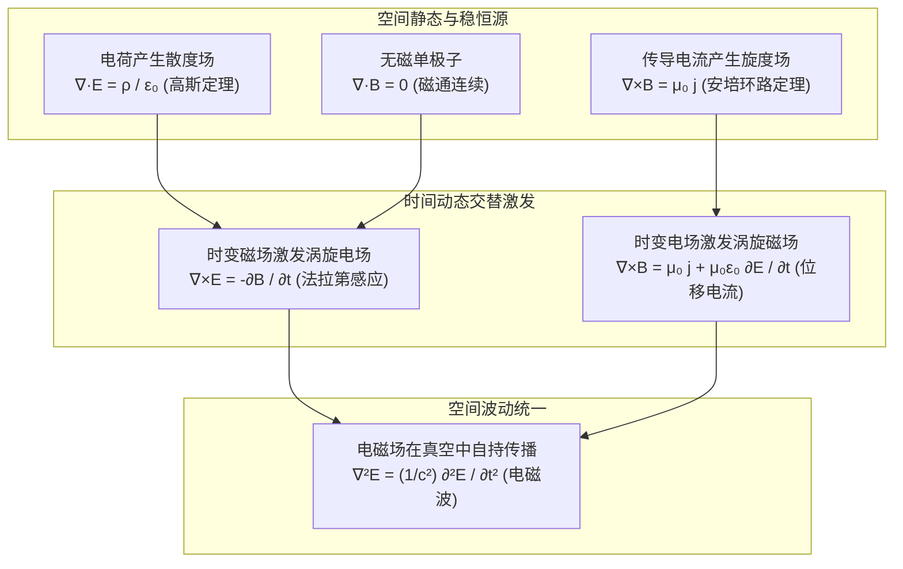

## 电磁学概览

**电磁学 (Electromagnetism)** 研究带电粒子之间的相互作用、电流与电路、稳恒与时变电磁场、电磁感应以及电磁波．它是大学物理主线中第一门系统展现「局域场论」（Field Theory）思想的核心领域，不仅统一了电、磁、光三类看似迥异的自然现象，更是狭义相对论和量子电动力学的摇篮．

> [!TIP] 大学《电磁学》跟课导引
> 如果你正在学习大学本科阶段的必修课《电磁学》，建议优先查阅 **[电磁学课程路线](../courses/electromagnetism.md)**．该路线按高校标准大纲梳理了从超距作用到场论语言的跃迁脉络，系统列出了微积分数学先修、普物知识映射与进阶理论接口．

---

## 1. 核心理论图景：麦克斯韦方程组的演进

经典电磁学的全部规律可以浓缩在真空中的 **麦克斯韦方程组 (Maxwell's Equations)** 之中：

这组方程深刻揭示了场的本质：
1. **电荷是静电场的源**（散度不为零），静电场线从正电荷出发终止于负电荷；
2. **磁场不存在磁单极子源**（散度恒为零），磁感应线永远闭合；
3. **变化的磁场在空间激发涡旋电场**（非保守场，电磁感应）；
4. **变化的电场在空间激发涡旋磁场**（麦克斯韦位移电流），使得电磁能量能够脱离电荷与电流独立在真空中以光速 $c = 1/\sqrt{\mu_0\varepsilon_0}$ 传播．

---

## 2. 知识模块全景与建设看板

Wiki 的电磁学模块正处于从骨架向完整正文迭代的建设阶段．下表明确展示了各章节的内容规划与当前成熟度：

| 知识模块 | 对应章节与文件 | 成熟度 | 核心物理思想与公式 |
| :--- | :--- | :--- | :--- |
| **静电场** | [静电场](./electrostatics.md) | **`status: planned`** | 库仑定律、场强叠加原理、高斯通量定理、环路定理与电势标量场、导体静电平衡与电容 |
| **恒定电流与电路** | [恒定电流与电路](./dc-circuit.md) | **`status: planned`** | 电流密度 $\boldsymbol{j}$、电荷连续性方程、微观与宏观欧姆定律、电动势与基尔霍夫定律 |
| **恒定磁场** | [恒定磁场](./magnetostatics.md) | **`status: planned`** | 毕奥-萨伐尔定律、安培力与洛伦兹力、无散场特性、安培环路定理与磁矢势基础 |
| **电磁感应** | [电磁感应](./induction.md) | **`status: planned`** | 法拉第定律、动生电动势（洛伦兹力）与感生电动势（涡旋电场）、自感与互感、磁场能量 |
| **交流电路** | [交流电路](./ac-circuit.md) | **`status: planned`** | 复阻抗法、相量图、RLC 谐振电路、交流电品质因数与功率 |
| **麦克斯韦方程组与电磁波** | [麦克斯韦方程组与电磁波](./maxwell.md) | **`status: planned`** | 位移电流假说、麦克斯韦方程组积分与微分形式、电磁波波动方程、坡印廷能流密度矢量 $\boldsymbol{S} = \boldsymbol{E}\times\boldsymbol{H}$ |
| **物质中的电磁场** | [物质中的电磁场](./matter.md) | **`status: planned`** | 电介质极化与束缚电荷、电位移矢量 $\boldsymbol{D}$、磁介质磁化与分子电流、磁场强度 $\boldsymbol{H}$、介质边界条件 |

---

## 3. 学习与写作指引

- **先修数学工具**：建议在进入磁场与麦克斯韦方程组前，先熟练阅读 [梯度、散度与旋度](../math/vector-analysis/operators.md)、[矢量积分定理](../math/vector-analysis/integral-theorems.md) 以及 [曲线坐标系](../math/vector-analysis/curvilinear-coordinates.md)；在涉及静电边值与波动时，可结合 [三类物理偏微分方程](../math/differential-equations/pde-intro.md) 与 [格林函数方法](../math/eigenfunction-methods/greens-function.md) 进行深化；
- **参与内容贡献**：本模块的写作规范详见 [电磁学章节编写说明](./electromagnetism-writing.md)．我们强烈欢迎贡献者按照规范逐步丰富各章节的物理推导与典型例题！
