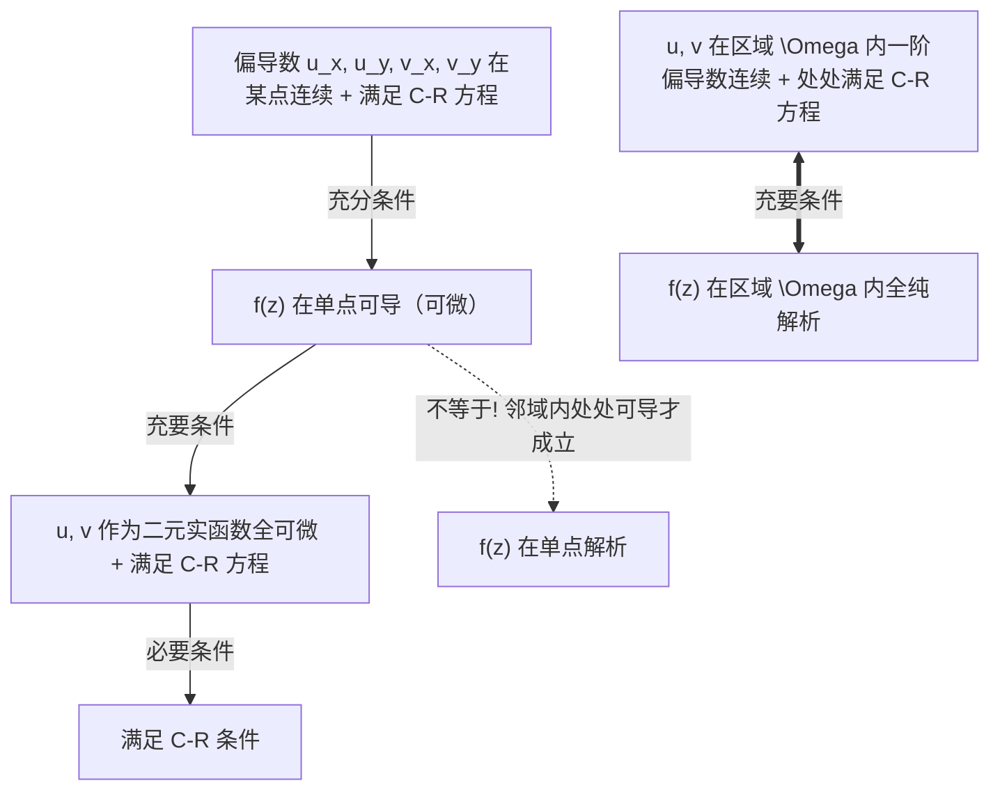

---
assessments:
  - placement: footer
    set: math.complex-analysis.foundations
status: review
author: Physics Learning Wiki Team
description: 讨论复变函数的复可微性、柯西-黎曼（C-R）条件（直角与极坐标）、单点可导与区域解析的四类经典反例体系、Wirtinger 微积分、共轭调和函数与实轴代换反求技巧及其在二维静电场与流体复势中的物理图像．
page_id: math.complex-analysis.analytic-functions
---

# 解析函数与柯西-黎曼条件

## 物理问题引入：为什么复可微会自动导出拉普拉斯方程？

在多元实数微积分中，即使一个二元实函数 $u(x, y)$ 在某点的所有偏导数均存在，甚至方向导数均存在，它也可能在临近区域表现出不连续等极度病态的行为．
然而，在复变函数中，只要我们对复变函数：

$$
f(z) = u(x, y) + i v(x, y)
$$

提出看似平淡无奇的要求——**复可微（Complex Differentiable）**，一系列震撼的分析学奇迹就会随之发生：

1. **实部与虚部自动满足二维拉普拉斯方程**：
   
   $$
   \nabla^2 u = \dfrac{\partial^2 u}{\partial x^2} + \dfrac{\partial^2 u}{\partial y^2} = 0, \quad \nabla^2 v = \dfrac{\partial^2 v}{\partial x^2} + \dfrac{\partial^2 v}{\partial y^2} = 0
   $$

2. **等值线簇处处正交**：曲线族 $u(x, y) = C_1$ 与 $v(x, y) = C_2$ 在复平面上凡相交处切线必定互相垂直；
3. **一阶可微自动保证无穷阶光滑**：不存在“一阶可导但二阶导数不存在”的实分析尴尬局面．

这正是为什么复分析天然就是二维静电场（等势线与电力线正交且空间无源电势满足 $\nabla^2 \phi = 0$）与二维无旋不可压缩流体（速度势与流函数正交）最完美的数学模型．

---

## 1. 复导数严格定义与严苛性

设区域 $D \subset \mathbb{C}$ 为复平面的开集，$f(z)$ 是定义在 $D$ 上的单值复变函数．若对于 $z_0 \in D$，差商极限：

$$
f'(z_0) = \lim_{\Delta z \to 0} \dfrac{f(z_0 + \Delta z) - f(z_0)}{\Delta z}
$$

存在且唯一，则称 $f(z)$ 在点 $z_0$ **可导 (Differentiable)**（或可微）．

???+ warning "注意：极限方向的任意性与路径独立性"
    在实数轴上一元极限只有从左侧（$\Delta x \to 0^-$）和从右侧（$\Delta x \to 0^+$）两个逼近方向；  
    而在复平面上，增量 $\Delta z = \Delta x + i\Delta y = |\Delta z|e^{i\alpha}$ 能够以**任意辐角、沿任意连续曲线**从四面八方向原点逼近！  
    要求极限值对所有可能的趋近路径、所有方向完全无关且严格相等，构成了对函数实部与虚部的一组极强约束——**柯西-黎曼条件 (Cauchy-Riemann Conditions)**．

---

## 2. 柯西-黎曼条件 (Cauchy-Riemann Conditions)

### 2.1 直角坐标下的推导

设 $f(z) = u(x, y) + iv(x, y)$ 在点 $z$ 处复可导．根据定义，极限与趋向路径无关：

1. **沿平行于实轴方向逼近**（令 $\Delta y = 0, \Delta z = \Delta x \to 0$）：
   
   $$
   f'(z) = \lim_{\Delta x \to 0} \dfrac{[u(x+\Delta x, y) - u(x, y)] + i[v(x+\Delta x, y) - v(x, y)]}{\Delta x} = \dfrac{\partial u}{\partial x} + i\dfrac{\partial v}{\partial x}
   $$

2. **沿平行于虚轴方向逼近**（令 $\Delta x = 0, \Delta z = i\Delta y \to 0$）：
   
   $$
   f'(z) = \lim_{\Delta y \to 0} \dfrac{[u(x, y+\Delta y) - u(x, y)] + i[v(x, y+\Delta y) - v(x, y)]}{i\Delta y} = \dfrac{1}{i}\left(\dfrac{\partial u}{\partial y} + i\dfrac{\partial v}{\partial y}\right) = \dfrac{\partial v}{\partial y} - i\dfrac{\partial u}{\partial y}
   $$

两式必须恒等，实部与虚部分别对应相等，即得到著名的 **柯西-黎曼方程（C-R 条件）**：

$$
\begin{cases}
\dfrac{\partial u}{\partial x} = \dfrac{\partial v}{\partial y} \\[8pt]
\dfrac{\partial u}{\partial y} = -\dfrac{\partial v}{\partial x}
\end{cases}
$$

**复导数的多种等价表达形式**：

$$
f'(z) = \dfrac{\partial u}{\partial x} + i\dfrac{\partial v}{\partial x} = \dfrac{\partial v}{\partial y} - i\dfrac{\partial u}{\partial y} = \dfrac{\partial u}{\partial x} - i\dfrac{\partial u}{\partial y} = \dfrac{\partial v}{\partial y} + i\dfrac{\partial v}{\partial x}
$$

**导数模长平方的物理对称性**：

$$
|f'(z)|^2 = \left(\dfrac{\partial u}{\partial x}\right)^2 + \left(\dfrac{\partial v}{\partial x}\right)^2 = \left(\dfrac{\partial u}{\partial y}\right)^2 + \left(\dfrac{\partial v}{\partial y}\right)^2 = \left(\dfrac{\partial u}{\partial x}\right)^2 + \left(\dfrac{\partial u}{\partial y}\right)^2 = \det \mathbf{J}_f
$$

其中 $\det \mathbf{J}_f = u_x v_y - u_y v_x$ 是由 $(x, y) \to (u, v)$ 坐标映射的雅可比行列式．在保角映射中，它直接代表了局部面积的几何放大系数．

---

### 2.2 极坐标下的推导

在具有轴对称或柱对称的物理系统（如点电荷、线电流、圆柱波导）中，极坐标 $(r, \theta)$ 远比直角坐标自然．

设 $z = r e^{i\theta} = r\cos\theta + i r\sin\theta$，函数写为 $f(z) = u(r, \theta) + i v(r, \theta)$．  
由多元微积分多元链式法则：

$$
\dfrac{\partial u}{\partial r} = \cos\theta \dfrac{\partial u}{\partial x} + \sin\theta \dfrac{\partial u}{\partial y}, \quad \dfrac{\partial u}{\partial \theta} = -r\sin\theta \dfrac{\partial u}{\partial x} + r\cos\theta \dfrac{\partial u}{\partial y}
$$

$$
\dfrac{\partial v}{\partial r} = \cos\theta \dfrac{\partial v}{\partial x} + \sin\theta \dfrac{\partial v}{\partial y}, \quad \dfrac{\partial v}{\partial \theta} = -r\sin\theta \dfrac{\partial v}{\partial x} + r\cos\theta \dfrac{\partial v}{\partial y}
$$

代入直角坐标下的 C-R 条件 $u_x = v_y, u_y = -v_x$，消去直角偏导数，整理即得 **极坐标下的柯西-黎曼条件**：

$$
\begin{cases}
\dfrac{\partial u}{\partial r} = \dfrac{1}{r} \dfrac{\partial v}{\partial \theta} \\[8pt]
\dfrac{\partial v}{\partial r} = -\dfrac{1}{r} \dfrac{\partial u}{\partial \theta}
\end{cases}
$$

在此坐标下，复导数可直接计算为：

$$
f'(z) = e^{-i\theta}\left(\dfrac{\partial u}{\partial r} + i\dfrac{\partial v}{\partial r}\right) = \dfrac{e^{-i\theta}}{r}\left(\dfrac{\partial v}{\partial \theta} - i\dfrac{\partial u}{\partial \theta}\right)
$$

---

## 3. 算子视角：Wirtinger 微积分与 $\partial f/\partial z^* = 0$

将 $z = x+iy$ 与 $z^* = x-iy$ 视为两个互相独立的复变量：

$$
x = \dfrac{z + z^*}{2}, \quad y = \dfrac{z - z^*}{2i}
$$

定义复偏导数算子（Wirtinger 算子）：

$$
\dfrac{\partial}{\partial z} \equiv \dfrac{1}{2}\left(\dfrac{\partial}{\partial x} - i\dfrac{\partial}{\partial y}\right), \quad \dfrac{\partial}{\partial z^*} \equiv \dfrac{1}{2}\left(\dfrac{\partial}{\partial x} + i\dfrac{\partial}{\partial y}\right)
$$

作用于复变函数 $f(z) = u + iv$：

$$
\dfrac{\partial f}{\partial z^*} = \dfrac{1}{2}\left[\left(\dfrac{\partial u}{\partial x} + i\dfrac{\partial v}{\partial x}\right) + i\left(\dfrac{\partial u}{\partial y} + i\dfrac{\partial v}{\partial y}\right)\right] = \dfrac{1}{2}\left[\left(\dfrac{\partial u}{\partial x} - \dfrac{\partial v}{\partial y}\right) + i\left(\dfrac{\partial v}{\partial x} + \dfrac{\partial u}{\partial y}\right)\right]
$$

**核心定理**：柯西-黎曼条件严格等价于：

$$
\dfrac{\partial f}{\partial z^*} = 0
$$

> **现代物理视点**：解析函数（全纯函数）的深刻本质就是：**它纯粹只是复变量 $z$ 的函数，在形式上完全不显含其共轭变量 $z^*$！**  
> 凡是显式出现 $z^*$、实部 $x = \frac{z+z^*}{2}$ 或模长 $|z|^2 = z z^*$ 的函数，通常都破坏了解析性．

### 共轭函数的解析性辨析

- **函数 $f^*(z)$**：若 $f(z)$ 解析，由于 $f^*(z) = u(x, y) - iv(x, y)$，其虚部取负号导致 C-R 条件变为 $u_x = -v_y, u_y = v_x$．与原 C-R 条件联立可知 $u_x = u_y = v_x = v_y = 0$．因此 **$f^*(z)$ 一般处处不解析（除非其为常数）**；
- **函数 $f^*(z^*)$**：由于 $f^*(z^*) = u(x, -y) - iv(x, -y)$，自变量与函数值虚部同时取负号，负负得正，代入验证知其严格满足 C-R 条件．因此 **$f^*(z^*)$ 依然是全纯解析函数**．这一性质正是后续量子力学与经典电磁学中 **施瓦茨反射原理 (Schwarz Reflection Principle)** 的基石．

---

## 4. 可导、可微与解析的深度辨析与经典反例体系

初学者极易混淆“单点可导”、“单点可微”与“区域解析”的概念层次．以下总结三者的严格充要逻辑：

### 经典反例 1：满足 C-R 方程但在该点不可导

考虑如下经典构造函数：

$$
f(z) = \begin{cases} \dfrac{\bar{z}^2}{z}, & z \neq 0 \\ 0, & z = 0 \end{cases}
$$

1. **验证在 $z = 0$ 处满足 C-R 方程**：  
   展开实部与虚部：$u = \frac{x^3 - 3xy^2}{x^2+y^2}, v = \frac{y^3 - 3x^2 y}{x^2+y^2}$．由偏导数定义计算原点处的导数：
   
   $$
   u_x(0, 0) = \lim_{x \to 0} \frac{u(x, 0) - 0}{x} = 1, \quad u_y(0, 0) = 0
   $$
   
   $$
   v_x(0, 0) = 0, \quad v_y(0, 0) = \lim_{y \to 0} \frac{v(0, y) - 0}{y} = 1
   $$
   
   显然 $u_x(0,0) = v_y(0,0) = 1$ 且 $u_y(0,0) = -v_x(0,0) = 0$，**在原点形式上严格满足 C-R 方程**；
2. **但在原点不可导**：  
   按复导数定义考察差商，令 $z$ 沿不同斜率的射线 $x = my$ 逼近原点：
   
   $$
   \lim_{z \to 0} \dfrac{f(z) - f(0)}{z} = \lim_{z \to 0}\dfrac{\bar{z}^2}{z^2} = \dfrac{(my - iy)^2}{(my + iy)^2} = \dfrac{(m - i)^2}{(m + i)^2}
   $$
   
   极限值强烈依赖于路径斜率 $m$（例如沿实轴 $m \to \infty$ 极限为 $1$，沿对角线 $m = 1$ 极限为 $-1$），极限不存在！**故该函数在原点不可导**．

### 经典反例 2：在单点严格可导，但在该点不解析

考虑函数：

$$
f(z) = |z|^2 = x^2 + y^2
$$

其实部 $u = x^2 + y^2$，虚部 $v = 0$．偏导数为 $u_x = 2x, u_y = 2y, v_x = 0, v_y = 0$．
1. **在原点 $z = 0$ 处**：$u, v$ 的一阶偏导数连续且满足 $u_x = v_y = 0, u_y = -v_x = 0$．根据充分条件，**$f(z)$ 在 $z = 0$ 点严格复可导**，且 $f'(0) = 0$；
2. **但在原点不解析**：在原点的任意去心邻域内（只要 $(x, y) \neq (0, 0)$），$u_x = 2x \neq 0$ 或 $u_y = 2y \neq 0$，C-R 条件被彻底破坏，邻域内处处不可导．由于解析性要求在某开邻域内处处可导，**故 $f(z)$ 在原点单点不解析**．

### 经典反例 3：在一条直线上可导，但在全复平面处处不解析

考察函数：

$$
f(z) = x^2 + y + i(y^2 - x)
$$

计算偏导数：$u_x = 2x, u_y = 1, v_x = -1, v_y = 2y$．
- 检验 C-R 条件：
  
  $$
  \begin{cases} u_x = v_y \iff 2x = 2y \iff y = x \\ u_y = -v_x \iff 1 = -(-1) = 1 \quad (\text{恒成立}) \end{cases}
  $$

因为偏导数处处连续，该函数**在直线 $y = x$ 上的每一个点都复可导**；  
但在该直线上任意一点的任意开邻域内，总包含不属于该直线的点（在这些点上不满足 C-R），因此**没有任何一个邻域是处处可导的**．结论：该函数在全复平面上**处处不解析**！

### 经典反例 4：全平面满足 C-R 方程，但在原点甚至不连续

考察函数：

$$
f(z) = \begin{cases} \exp\left(-\dfrac{1}{z^4}\right), & z \neq 0 \\ 0, & z = 0 \end{cases}
$$

1. 在 $z \neq 0$ 处，$f(z)$ 为初等全纯函数的复合，自然满足 C-R 方程；
2. 在原点 $z = 0$ 处，沿实轴有 $f(x) = e^{-1/x^4}$，沿虚轴有 $f(iy) = e^{-1/y^4}$，其偏导数均为 0，所以在原点也形式上满足 C-R 条件；
3. **然而检验沿射线 $z = r e^{i\pi/4}$（$r \to 0^+$）逼近原点的极限**：
   
   $$
   z^4 = r^4 e^{i\pi} = -r^4 \implies \lim_{r \to 0^+} f\left(r e^{i\pi/4}\right) = \lim_{r \to 0^+} \exp\left(\dfrac{1}{r^4}\right) = +\infty
   $$
   
   函数在原点不仅不等于定义值 $0$，而且严重发散！它在原点甚至不连续，根本不可能在包含原点的邻域内解析．

---

## 5. 调和函数与共轭调和函数的重构实战

### 5.1 调和性与拉普拉斯方程

若实二元函数 $\Phi(x, y)$ 具有二阶连续偏导数且满足二维 Laplace 方程 $\nabla^2 \Phi = \Phi_{xx} + \Phi_{yy} = 0$，则称其实调和函数．

若 $f(z) = u + iv$ 解析，对 C-R 条件分别求导：

$$
u_{xx} = (v_y)_x = v_{xy}, \quad u_{yy} = (-v_x)_y = -v_{yx}
$$

因偏导数连续，混合偏导与求导顺序无关 $v_{xy} = v_{yx}$，两式相加得：

$$
u_{xx} + u_{yy} = 0, \quad \text{同理可得 } v_{xx} + v_{yy} = 0
$$

若调和函数 $u$ 与 $v$ 满足 C-R 条件，则称 $v$ 是 $u$ 的 **共轭调和函数 (Harmonic Conjugate)**．

### 5.2 反求解析函数的三大实用法宝

已知解析函数的实部 $u(x, y)$（或虚部 $v(x, y)$），如何重构完整的 $f(z)$？

#### 法宝 1：全微分积分法
利用 C-R 条件构造全微分：

$$
\mathrm{d}v = \dfrac{\partial v}{\partial x}\mathrm{d}x + \dfrac{\partial v}{\partial y}\mathrm{d}y = \left(-\dfrac{\partial u}{\partial y}\right)\mathrm{d}x + \left(\dfrac{\partial u}{\partial x}\right)\mathrm{d}y
$$

通过曲线积分或不定积分求出 $v(x, y)$，再合成 $f(z) = u + iv$．

#### 法宝 2：实轴代换技巧（全纯延拓法，极速技巧）
根据解析函数的唯一性定理，若我们在实轴 $y = 0$ 上有 $f(x) = u(x, 0) + i v(x, 0)$，那么将实变量 $x$ 解析延拓至复变量 $z$，全复平面上的表达式即可直接写为：

$$
f(z) = u(z, 0) + i v(z, 0) + C
$$

或者先求导：$f'(z) = u_x(z, 0) - i u_y(z, 0)$，再对 $z$ 积分一次！这在高校竞赛与考试中能节省 80% 的繁琐多元积分时间．

???+ example "例题 1：已知虚部求解析函数"
    已知解析函数虚部 $v(x, y) = \dfrac{y}{x^2 + y^2}$，求其解析表达式．  
    **解法（全微分法）**：  
    
    $$
    u_x = v_y = \dfrac{x^2 - y^2}{(x^2 + y^2)^2}, \quad u_y = -v_x = \dfrac{2xy}{(x^2 + y^2)^2}
    $$
    
    $$
    \mathrm{d}u = \dfrac{x^2 - y^2}{(x^2 + y^2)^2}\mathrm{d}x + \dfrac{2xy}{(x^2 + y^2)^2}\mathrm{d}y = \mathrm{d}\left(-\dfrac{x}{x^2 + y^2}\right) \implies u = -\dfrac{x}{x^2 + y^2} + C
    $$
    
    因此：
    
    $$
    f(z) = u + iv = \dfrac{-x + iy}{x^2 + y^2} + C = \dfrac{-z^*}{|z|^2} + C = -\dfrac{1}{z} + C \quad (C \in \mathbb{R})
    $$

???+ example "例题 2：已知实部与虚部之和求解析函数"
    直角坐标系中解析函数实部与虚部满足：$u(x, y) + v(x, y) = -(x + y)(x^2 - 4xy + y^2)$，求 $f(z)$．  
    **解**：展开多项式：$u + v = -x^3 + 3x^2 y + 3xy^2 - y^3$．  
    分别对 $x, y$ 求偏导并代入 C-R 条件（$v_x = -u_y, v_y = u_x$）：
    
    $$
    u_x - u_y = -3x^2 + 6xy + 3y^2
    $$
    
    $$
    u_y + u_x = 3x^2 + 6xy - 3y^2
    $$
    
    两式联立相加除以 2 得 $u_x = 6xy$，相减得 $u_y = 3x^2 - 3y^2$．全微分积分得 $u(x, y) = 3x^2 y - y^3 + C_1$．  
    虚部为 $v = (u+v) - u = -x^3 + 3xy^2 - C_1$．组合得：
    
    $$
    f(z) = (3x^2 y - y^3) + i(-x^3 + 3xy^2) + C = -i(x + iy)^3 + C = -i z^3 + C
    $$

???+ example "例题 3：非初等根号虚部的解析函数重构"
    已知解析函数虚部为 $v(x, y) = \sqrt{-x + \sqrt{x^2 + y^2}}$，求 $f(z)$．  
    **极坐标巧妙解法**：令 $x = r\cos\theta, y = r\sin\theta$（取 $r > 0, 0 < \theta \le \pi$）：
    
    $$
    v = \sqrt{-r\cos\theta + r} = \sqrt{2r\sin^2\frac{\theta}{2}} = \sqrt{2r}\sin\frac{\theta}{2}
    $$
    
    由极坐标 C-R 条件：
    
    $$
    \dfrac{\partial u}{\partial r} = \dfrac{1}{r}\dfrac{\partial v}{\partial \theta} = \dfrac{1}{\sqrt{2r}}\cos\frac{\theta}{2} \implies u(r, \theta) = \sqrt{2r}\cos\frac{\theta}{2} + C
    $$
    
    合成解析函数：
    
    $$
    f(z) = u + iv = \sqrt{2r}\left(\cos\frac{\theta}{2} + i\sin\frac{\theta}{2}\right) + C = \sqrt{2z} + C \quad (C \in \mathbb{R})
    $$

---

## 6. 物理模型：静电复势与流体正交网格

在二维无源静电场中，电势 $\phi(x, y)$ 满足二维拉普拉斯方程 $\nabla^2 \phi = 0$．令其为一个解析函数的实部：

$$
W(z) = \phi(x, y) + i \psi(x, y)
$$

称 $W(z)$ 为 **复势 (Complex Potential)**．
- 实部曲线族 $\phi(x, y) = C_1$ 是 **等势线**；
- 虚部曲线族 $\psi(x, y) = C_2$ 是 **电力线**；
- 梯度点积计算表明：
  
  $$
  \nabla\phi \cdot \nabla\psi = \dfrac{\partial\phi}{\partial x}\dfrac{\partial\psi}{\partial x} + \dfrac{\partial\phi}{\partial y}\dfrac{\partial\psi}{\partial y} = \left(\dfrac{\partial\psi}{\partial y}\right)\left(\dfrac{\partial\psi}{\partial x}\right) + \left(-\dfrac{\partial\psi}{\partial x}\right)\left(\dfrac{\partial\psi}{\partial y}\right) \equiv 0
  $$

等势线与电力线在任意点严格正交！
此外，复电场强度矢量可直接通过对复势求导给出：

$$
E_x - i E_y = -\dfrac{\mathrm{d}W}{\mathrm{d}z}
$$

将实向量分析的求梯度运算直接升华为简单的单变量一阶复求导．在二维理想无旋不可压缩流体中，$\phi$ 为速度势，$\psi$ 为流函数，复速度为 $v_x - iv_y = \frac{\mathrm{d}W}{\mathrm{d}z}$，构成了机翼升力计算（茹科夫斯基变换）的理论基石．

---

## 7. 学习衔接

- **上一节**：复数代数与几何表示，参见 [复数与几何表示](./complex-numbers.md)；
- **下一节**：研究解析函数在闭合路径上的积分性质，进入 [复变积分与柯西定理](./contour-integrals.md)．

---

## 知识小测与巩固练习 {#practice}

> [!TIP] 课后核心技能自测点
> 1. 能否在 1 分钟内证明：若解析函数 $|f(z)|$ 为常数，则 $f(z)$ 必为常数？
> 2. 函数 $f(z) = \bar{z}^2$ 在哪些点满足 C-R 条件？在哪些点可导？在哪些点解析？
> 3. 已知实部 $u = e^x(x\cos y - y\sin y)$，能否用“实轴代换法”在 20 秒内写出 $f(z)$？
