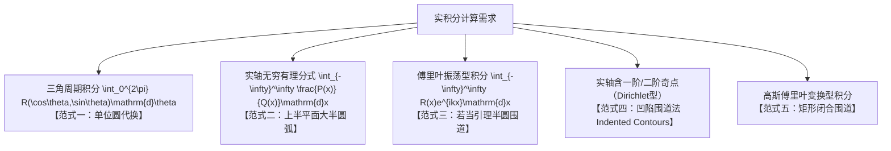

---
assessments:
  - placement: footer
    set: math.complex-analysis.residue-physics
status: review
author: Physics Learning Wiki Team
description: 掌握留数诞生的几何直觉、极点极限法则与商式法则、无穷远点留数、留数定理、五大实积分围道计算范式（实轴、半圆、扇形、凹陷围道、矩形围道）以及物理因果律、Kramers–Kronig 色散关系与费曼 $i\epsilon$ 处方．
page_id: math.complex-analysis.residue-calculus
---

# 留数定理与实积分计算

## 物理问题引入：如何用复数“绕道”解决算不出来的实积分？

在理论物理中，从经典电动力学辐射场计算、阻尼系统受迫共振响应，到量子散射截面与量子场论单圈传播子积分，物理学家无时无刻不在面对形如下式的实数反常定积分：

$$
I = \int_{-\infty}^{+\infty} \dfrac{\cos(k x)}{x^2 + a^2} \mathrm{d}x, \quad \int_0^\infty \dfrac{\sin x}{x} \mathrm{d}x, \quad \int_0^\infty \dfrac{\sin^2 x}{x^2}\mathrm{d}x
$$

若使用大一微积分的初等换元或分部积分，根本无法找到初等原函数进行牛顿-莱布尼茨公式计算．
然而，复分析提供了一种“降维打击”式的数学策略：

1. **复化延拓**：将实数轴上的被积函数延拓到复平面 $z = x + iy$；
2. **闭合围道**：给实轴积分补上一段半圆弧、扇形或矩形路径，使其成为封闭围道；
3. **留数定理**：围道内的积分完全不依赖于整条路径的繁琐细节，**仅仅由被包围奇点处的局部代数系数（留数）之和乘以 $2\pi i$ 直接决定**！

实数领域中几乎不可逾越的积分天堑，在复平面上只需做简单的代数除法与求导即可迎刃而解．

---

## 1. 留数的诞生哲学与计算工具箱

### 1.1 留数 (Residue) 诞生的代数直觉

设 $z_0$ 为函数 $f(z)$ 的孤立奇点．在以 $z_0$ 为中心的去心圆环域内将函数作洛朗级数展开：

$$
f(z) = \dots + \dfrac{b_2}{(z - z_0)^2} + \dfrac{b_1}{z - z_0} + a_0 + a_1(z - z_0) + a_2(z - z_0)^2 + \dots
$$

现在，我们用一个包含 $z_0$ 的逆时针简单闭合曲线 $C$ 对整个级数进行逐项积分．回顾基础整幂积分公式：

$$
\oint_C (z - z_0)^n \mathrm{d}z = \begin{cases} 2\pi i, & n = -1 \\ 0, & n \neq -1 \end{cases}
$$

- 所有正整数次幂项 $(z-z_0)^n$（$n \ge 0$）沿闭合回路的积分全部为零（柯西积分定理）；
- 所有负二次及更高负幂次项 $(z-z_0)^{-k}$（$k \ge 2$）沿闭回路的积分也全部为零（由高阶导数推广公式）；
- **全级数无穷多项积分之后，唯独只有负一次幂项 $\frac{b_1}{z - z_0}$ 留下了非零的数值贡献 $2\pi i b_1$！**

因为 $b_1$（习惯上也记作 $a_{-1}$ 或 $c_{-1}$）是围道积分中唯一“遗留”下来的非零核心，物理学家与数学家称之为 **留数 (Residue)**，记为：

$$
\operatorname{Res}[f(z), z_0] = b_1 = a_{-1}
$$

### 1.2 极点留数的极速计算法则

在物理实战中，无须每次都求出完整的洛朗级数，而是利用如下求导与极限法则快速求得留数：

#### 法则 1：一阶单极点极限法与“商式法则”
若 $z_0$ 为一阶单极点，直接乘以 $(z - z_0)$ 消除分母后取极限：

$$
\operatorname{Res}[f, z_0] = \lim_{z \to z_0} (z - z_0) f(z)
$$

???+ tip "商式法则（物理中应用最广的留数公式）"
    若被积函数为分式 $f(z) = \dfrac{P(z)}{Q(z)}$，其中 $P(z_0) \neq 0$，$z_0$ 为分母 $Q(z)$ 的一阶单零点（即 $Q(z_0) = 0$ 且 $Q'(z_0) \neq 0$），利用洛必达法则：
    
    $$
    \operatorname{Res}[f, z_0] = \lim_{z \to z_0} (z - z_0)\dfrac{P(z)}{Q(z)} = \lim_{z \to z_0} P(z) \cdot \lim_{z \to z_0} \dfrac{z - z_0}{Q(z) - Q(z_0)} = \dfrac{P(z_0)}{Q'(z_0)}
    $$
    
    只需将极点代入分子，除以分母的导数，即可在数秒内算出留数！

#### 法则 2：$m$ 阶高阶极点法则
若 $z_0$ 为 $m$ 阶极点（$m \ge 2$），两端乘 $(z-z_0)^m$ 并求 $m-1$ 阶导数：

$$
\operatorname{Res}[f, z_0] = \dfrac{1}{(m - 1)!} \lim_{z \to z_0} \dfrac{\mathrm{d}^{m-1}}{\mathrm{d}z^{m-1}}\left[(z - z_0)^m f(z)\right]
$$

#### 法则 3：无穷远点留数与全平面留数和定理
定义扩充复平面中无穷远点 $z = \infty$ 的留数（注意围道方向关于无穷远点为**顺时针**，负号来源于此外侧积分取向）：

$$
\operatorname{Res}[f(z), \infty] = -\dfrac{1}{2\pi i}\oint_{C_R} f(z)\mathrm{d}z = -\operatorname{Res}\left[\dfrac{1}{z^2}f\left(\dfrac{1}{z}\right), 0\right]
$$

**全平面留数和定理**：若函数 $f(z)$ 在扩充复平面 $\bar{\mathbb{C}}$ 上除有限个孤立奇点 $z_1, \dots, z_n$ 外处处解析，则**其在全平面所有有限奇点的留数与无穷远点留数之和严格为零**：

$$
\sum_{k=1}^n \operatorname{Res}[f(z), z_k] + \operatorname{Res}[f(z), \infty] = 0
$$

当围道内部包含大量繁琐奇点，而围道外部奇点极少（或只有无穷远点）时，利用此定理从外部反求可极大简化运算．

---

## 2. 留数定理 (Residue Theorem)

**定理（柯西留数定理）**：设简单闭曲线 $C$ 为正向闭围道，$f(z)$ 在 $C$ 上全纯解析，在 $C$ 内部除有限个孤立奇点 $z_1, z_2, \dots, z_n$ 外处处解析，则：

$$
\oint_C f(z)\mathrm{d}z = 2\pi i \sum_{k=1}^n \operatorname{Res}[f(z), z_k]
$$

???+ example "例题：Fibonacci 生成函数在不同半径圆周上的围道积分"
    计算积分 $I_R = \oint_{|z|=R} \dfrac{z}{1 - z - z^2}\mathrm{d}z$．  
    分母零点为两个单极点：$z_1 = \dfrac{\sqrt{5}-1}{2} \approx 0.618$，$z_2 = -\dfrac{\sqrt{5}+1}{2} \approx -1.618$．  
    由商式法则计算两奇点的留数（$P(z) = z, Q(z) = 1 - z - z^2, Q'(z) = -1 - 2z$）：
    
    $$
    \operatorname{Res}[F, z_1] = \left.\dfrac{z}{-1 - 2z}\right|_{z_1} = \dfrac{\frac{\sqrt{5}-1}{2}}{-1 - (\sqrt{5}-1)} = -\dfrac{\sqrt{5}-1}{2\sqrt{5}} = \dfrac{5 - \sqrt{5}}{10}
    $$
    
    $$
    \operatorname{Res}[F, z_2] = \left.\dfrac{z}{-1 - 2z}\right|_{z_2} = \dfrac{-\frac{\sqrt{5}+1}{2}}{-1 + (\sqrt{5}+1)} = -\dfrac{\sqrt{5}+1}{2\sqrt{5}} = -\dfrac{5 + \sqrt{5}}{10}
    $$
    
    1. **当 $R = 0.5$ 时**：圆周内无任何奇点，由柯西定理：$I_{0.5} = 0$；
    2. **当 $R = 1.0$ 时**：圆周内仅包含奇点 $z_1$：
       
       $$
       I_{1.0} = 2\pi i \operatorname{Res}[F, z_1] = 2\pi i \left(\dfrac{5 - \sqrt{5}}{10}\right) = \pi i \dfrac{5 - \sqrt{5}}{5}
       $$
    
    3. **当 $R = 2.0$ 时**：圆周同时包含 $z_1$ 与 $z_2$：
       
       $$
       I_{2.0} = 2\pi i (\operatorname{Res}[F, z_1] + \operatorname{Res}[F, z_2]) = 2\pi i \left(\dfrac{5 - \sqrt{5}}{10} - \dfrac{5 + \sqrt{5}}{10}\right) = 2\pi i \left(-\dfrac{1}{\sqrt{5}}\right) = -\dfrac{2\pi i}{\sqrt{5}}
       $$

---

## 3. 理论物理实积分的五大围道计算范式

根据被积函数的代数与解析特征，求解实数定积分有五大经典围道范式：

---

### 范式一：单位圆代换求解三角函数周期积分

适用于形如 $\int_0^{2\pi} R(\cos\theta, \sin\theta)\mathrm{d}\theta$ 的有理三角积分．  
令 $z = e^{i\theta}$（$\theta$ 从 $0$ 变到 $2\pi$ 正向绕单位圆周 $C: |z| = 1$ 一周）：

$$
\cos\theta = \dfrac{z + z^{-1}}{2}, \quad \sin\theta = \dfrac{z - z^{-1}}{2i}, \quad \mathrm{d}\theta = \dfrac{\mathrm{d}z}{iz}
$$

将三角定积分完全化为单位圆周上的复有理分式围道积分，通过留数定理求出落在 $|z| < 1$ 内部的极点留数之和．

???+ example "例题：计算 $\int_0^{2\pi} \frac{\mathrm{d}\theta}{a + \cos\theta}$ ($a > 1$)"
    代入参数化变换：
    
    $$
    I = \oint_{|z|=1} \dfrac{1}{a + \frac{z + z^{-1}}{2}} \dfrac{\mathrm{d}z}{iz} = \oint_{|z|=1} \dfrac{2}{i(z^2 + 2az + 1)}\mathrm{d}z
    $$
    
    分母零点为 $z_\pm = -a \pm \sqrt{a^2 - 1}$．由于 $a > 1$：
    
    - $|z_-| = a + \sqrt{a^2 - 1} > 1$（位于圆外）；
    - $|z_+| = a - \sqrt{a^2 - 1} < 1$（唯一位于单位圆内的单极点）．  
    由商式法则计算 $z_+$ 处的留数：
    
    $$
    \operatorname{Res} = \left.\dfrac{2/i}{2z + 2a}\right|_{z = z_+} = \dfrac{2/i}{2\sqrt{a^2 - 1}} = \dfrac{1}{i\sqrt{a^2 - 1}}
    $$
    
    代入留数定理：
    
    $$
    I = 2\pi i \cdot \dfrac{1}{i\sqrt{a^2 - 1}} = \dfrac{2\pi}{\sqrt{a^2 - 1}}
    $$

---

### 范式二：无穷实轴有理分式积分

适用于 $\int_{-\infty}^{+\infty} \frac{P(x)}{Q(x)}\mathrm{d}x$，其中分母在实轴上无实根，且分母次数比分子至少高 2 次（$\deg Q \ge \deg P + 2$）．  
补上半平面大半圆弧 $C_R: z = R e^{i\theta}$（$\theta \in [0, \pi]$）．当 $R \to \infty$ 时大圆弧积分由于 $\sim 1/R$ 衰减为 0．

$$
\int_{-\infty}^{+\infty} \dfrac{P(x)}{Q(x)}\mathrm{d}x = 2\pi i \sum_{\operatorname{Im} z_k > 0} \operatorname{Res}\left[\dfrac{P(z)}{Q(z)}, z_k\right]
$$

---

### 范式三：傅里叶振荡积分与约当引理 (Jordan's Lemma)

适用于求解频域谱响应反演积分：

$$
I = \int_{-\infty}^{+\infty} R(x) e^{ikx}\,\mathrm{d}x \quad (k > 0)
$$

**引理（约当引理 / Jordan's Lemma）**：  
设 $C_R$ 为上半平面大半圆弧 $z = R e^{i\theta}$（$\theta \in [0, \pi]$）．若在此半圆弧上函数 $R(z)$ 一致地满足当 $R \to \infty$ 时 $M_R = \max_{z \in C_R}|R(z)| \to 0$（仅需一次衰减，不要求二次衰减！），且 $k > 0$，则：

$$
\lim_{R \to \infty} \int_{C_R} R(z) e^{ikz}\mathrm{d}z = 0
$$

> **证明要点**：在 $C_R$ 上 $|e^{ikz}| = |e^{ik R(\cos\theta + i\sin\theta)}| = e^{-k R\sin\theta}$．  
> 
>
> $$
> \left|\int_{C_R} R(z)e^{ikz}\mathrm{d}z\right| \le M_R R \int_0^\pi e^{-k R\sin\theta}\mathrm{d}\theta = 2 M_R R \int_0^{\pi/2} e^{-k R\sin\theta}\mathrm{d}\theta
> $$
>
> 
> 利用若当不等式 $\sin\theta \ge \frac{2}{\pi}\theta$：
> 
>
> $$
> \le 2 M_R R \int_0^{\pi/2} e^{-k R\frac{2\theta}{\pi}}\mathrm{d}\theta = 2 M_R R \cdot \dfrac{\pi}{2kR}\left(1 - e^{-kR}\right) = \dfrac{\pi}{k} M_R (1 - e^{-kR}) \xrightarrow{M_R \to 0} 0
> $$

???+ example "例题：求解狄拉克滤波实积分 $\int_{-\infty}^\infty \frac{\cos kx}{x^2 + a^2}\mathrm{d}x$ ($k > 0, a > 0$)"
    构造辅助积分 $\oint_C \frac{e^{ikz}}{z^2 + a^2}\mathrm{d}z$．围道由实轴 $[-R, R]$ 和上半平面半圆弧 $C_R$ 构成．  
    
    - 分母极点为 $z = \pm ia$；仅有 $z = ia$ 位于上半平面闭围道内部；
    - 计算单极点留数（商式法则）：
      
      $$
      \operatorname{Res}[f, ia] = \left.\dfrac{e^{ikz}}{2z}\right|_{z = ia} = \dfrac{e^{ik(ia)}}{2ia} = \dfrac{e^{-ka}}{2ia}
      $$
    
    - 由约当引理，半圆弧积分趋于 0．取极限 $R \to \infty$：
      
      $$
      \int_{-\infty}^{+\infty} \dfrac{e^{ikx}}{x^2 + a^2}\mathrm{d}x = 2\pi i \cdot \dfrac{e^{-ka}}{2ia} = \dfrac{\pi}{a}e^{-ka}
      $$
    
    取其实部即得：
    
    $$
    \int_{-\infty}^{+\infty} \dfrac{\cos kx}{x^2 + a^2}\mathrm{d}x = \dfrac{\pi}{a}e^{-ka}
    $$

---

### 范式四：实轴奇点与凹陷围道法 (Indented Contours)

当被积函数的奇点恰好落在实数积分路径上（例如原点 $x = 0$）时，我们必须构造**绕过该实数奇点的微小圆弧**（顺时针或逆时针小半圆凹陷）．

**小圆弧引理（分数留数引理）**：  
若 $z_0$ 为一阶单极点，圆弧 $C_\varepsilon$ 的半径为 $\varepsilon$，圆心角为 $\alpha$（顺时针方向），则当 $\varepsilon \to 0$ 时：

$$
\lim_{\varepsilon \to 0} \int_{C_\varepsilon} f(z)\mathrm{d}z = -\alpha i \operatorname{Res}[f(z), z_0]
$$

若为顺时针小半圆弧（$\alpha = \pi$），其积分贡献严格等于 $-\pi i \operatorname{Res}[f, z_0]$．

???+ example "例题 1：Dirichlet 积分 $\int_0^\infty \frac{\sin x}{x}\mathrm{d}x = \frac{\pi}{2}$"
    辅助复函数 $F(z) = \dfrac{e^{iz}}{z}$，在原点具有一阶极点．  
    设计上半平面闭合凹陷围道 $\Gamma$（由 $[-R, -\varepsilon]$、小半圆弧 $C_\varepsilon$（从 $-\varepsilon$ 顺时针绕至 $\varepsilon$）、$[\varepsilon, R]$ 及大半圆弧 $C_R$ 构成）．  
    围道内部处处全纯，由柯西定理：
    
    $$
    \oint_\Gamma \dfrac{e^{iz}}{z}\mathrm{d}z = 0
    $$
    
    1. 大圆弧 $C_R$ 由约当引理衰减趋于 0；
    2. 小半圆弧 $C_\varepsilon$ 在原点展开：$\frac{e^{iz}}{z} = \frac{1 + iz + \dots}{z} = \frac{1}{z} + i + \dots$．参数化 $z = \varepsilon e^{i\theta}$（$\theta$ 从 $\pi$ 变到 $0$）：
       
       $$
       \int_{C_\varepsilon} \dfrac{e^{iz}}{z}\mathrm{d}z = \int_\pi^0 \dfrac{1}{\varepsilon e^{i\theta}} i\varepsilon e^{i\theta}\mathrm{d}\theta = i \int_\pi^0 \mathrm{d}\theta = -i\pi
       $$
    
    3. 实轴两段合并（对负半轴作代换 $x \to -t$）：
       
       $$
       \int_{-R}^{-\varepsilon} \dfrac{e^{ix}}{x}\mathrm{d}x + \int_\varepsilon^R \dfrac{e^{ix}}{x}\mathrm{d}x = \int_\varepsilon^R \dfrac{e^{ix} - e^{-ix}}{x}\mathrm{d}x = 2i\int_\varepsilon^R \dfrac{\sin x}{x}\mathrm{d}x
       $$
    
    取极限 $\varepsilon \to 0, R \to \infty$ 代入柯西等式：
    
    $$
    2i \int_0^\infty \dfrac{\sin x}{x}\mathrm{d}x - i\pi = 0 \implies \int_0^\infty \dfrac{\sin x}{x}\mathrm{d}x = \dfrac{\pi}{2}
    $$

???+ example "例题 2：二阶极点凹陷围道求 $\int_0^\infty \frac{\sin^2 x}{x^2}\mathrm{d}x$"
    由偶函数对称性与二倍角降幂：
    
    $$
    I = \int_0^\infty \dfrac{\sin^2 x}{x^2}\mathrm{d}x = \dfrac{1}{4}\int_{-\infty}^{+\infty} \dfrac{1 - \cos 2x}{x^2}\mathrm{d}x
    $$
    
    构造复变辅助函数 $f(z) = \dfrac{1 - e^{2iz}}{z^2}$，由于分子在 $z = 0$ 处有一阶零点，原点为**一阶极点**．  
    在相同的上半平面凹陷围道上积分，由柯西定理 $\oint_\Gamma f(z)\mathrm{d}z = 0$．  
    
    - 实轴两段实部给出 $4I$；
    - 大圆弧衰减为 0；
    - 小圆弧上展开分子：$\frac{1 - (1 + 2iz - 2z^2 + \dots)}{z^2} = -\frac{2i}{z} + 2 + \dots$．  
      顺时针积分为 $-2i(-i\pi) = -2\pi$．  
    代回柯西方程：
    
    $$
    4I - 2\pi = 0 \implies I = \int_0^\infty \dfrac{\sin^2 x}{x^2}\mathrm{d}x = \dfrac{\pi}{2}
    $$

---

### 范式五：矩形闭合围道与高斯傅里叶变换

???+ example "例题：证明高斯函数傅里叶变换的自对偶性 $\int_{-\infty}^{+\infty} e^{-\pi x^2} e^{-2\pi i x \xi}\mathrm{d}x = e^{-\pi \xi^2}$"
    设 $\xi > 0$．考察全纯整函数 $f(z) = e^{-\pi z^2}$．  
    构造顶点分别为 $-R, R, R + i\xi, -R + i\xi$ 的矩形闭合围道 $\gamma_R$．由柯西积分定理：
    
    $$
    \oint_{\gamma_R} e^{-\pi z^2}\mathrm{d}z = 0
    $$
    
    1. **底边**（$y = 0$）：$\int_{-R}^R e^{-\pi x^2}\mathrm{d}x \xrightarrow{R \to \infty} 1$（标准高斯积分）；
    2. **左右两侧竖直边**（$x = \pm R$）：由于被积函数含有模长衰减因子 $e^{-\pi(R^2 - y^2)} \le e^{-\pi R^2} e^{\pi \xi^2}$，当 $R \to \infty$ 时指数衰减至 0；
    3. **顶边**（$z = x + i\xi, x$ 从 $R$ 变到 $-R$）：
       
       $$
       \int_R^{-R} e^{-\pi(x + i\xi)^2}\mathrm{d}x = -\int_{-R}^R e^{-\pi(x^2 - \xi^2 + 2ix\xi)}\mathrm{d}x = -e^{\pi\xi^2}\int_{-R}^R e^{-\pi x^2} e^{-2\pi i x\xi}\mathrm{d}x
       $$
    
    四边求和令 $R \to \infty$：
    
    $$
    1 + 0 - e^{\pi\xi^2}\int_{-\infty}^{+\infty} e^{-\pi x^2} e^{-2\pi i x\xi}\mathrm{d}x + 0 = 0 \implies \int_{-\infty}^{+\infty} e^{-\pi x^2} e^{-2\pi i x\xi}\mathrm{d}x = e^{-\pi\xi^2}
    $$

---

## 4. 理论物理中的深度连接：因果律与极点规约

在相对论与量子物理中，“结果不能先于原因发生”是物理世界的基本铁律——**因果律 (Causality)**．这一物理原理在复分析中表现为极其深刻的数学结构：

### 4.1 柯西主值（P.V.）与索霍茨基-普列梅利 (Sokhotski–Plemelj) 公式

当极点落在实轴上时，物理学家在虚轴方向加上微小的扰动 $x \pm i\epsilon$（$\epsilon \to 0^+$）以实现规约：

$$
\lim_{\epsilon \to 0^+} \dfrac{1}{x \pm i\epsilon} = \mathcal{P}\dfrac{1}{x} \mp i\pi \delta(x)
$$

其中 $\mathcal{P}$ 代表柯西主值（Cauchy Principal Value），$\delta(x)$ 是狄拉克点源函数．第一项对应色散反应，第二项虚部严格对应因果吸收！

### 4.2 克拉默斯-克勒尼希 (Kramers–Kronig) 色散关系

在光学与凝聚态物理中，物质的复介电常数 $\varepsilon(\omega) = \varepsilon_1(\omega) + i\varepsilon_2(\omega)$．因果响应要求响应函数在上半复平面全纯解析．利用柯西积分公式沿实轴和上半平面大圆积分，实部与虚部被必然绑定在一起：

$$
\varepsilon_1(\omega) - 1 = \dfrac{2}{\pi}\mathcal{P}\int_0^\infty \dfrac{\omega' \varepsilon_2(\omega')}{\omega'^2 - \omega^2}\mathrm{d}\omega'
$$

这证明了：**任何有折射色散的物理介质，必然存在吸收；吸收谱的反常积分完全决定了折射率！**

### 4.3 量子场论费曼 $i\epsilon$ 处方

在求解相对论 Klein-Gordon 波动方程自由传播子（格林函数）时，奇点落在动量实轴上（$p^2 - m^2 = 0$）．为了确保粒子向前传播、反粒子向后传播的时间因果律，费曼规定将分母微扰为：

$$
\Delta_F(p) = \dfrac{1}{p^2 - m^2 + i\epsilon}
$$

将实轴上的极点轻微推入第二、第四象限，使得在留数定理围道积分时严格选择推迟势或超前势，奠定了微观量子电动力学协变化微扰计算的数学基石．

---

## 5. 学习衔接

- **上一节**：洛朗级数展开与奇点分类，参见 [级数展开与奇点](./series-expansion.md)；
- **下一步**：复分析基础篇已全面通关！建议读者进入数学物理方法的第二大中轴支柱——**[积分变换与广义函数](../transforms/fourier-transform.md)**，学习复积分在傅里叶反演与拉普拉斯逆变换中的威力．

---

## 知识小测与巩固练习 {#practice}

> [!TIP] 课后核心技能自测点
>
> 1. 用商式法则计算 $f(z) = \frac{e^z}{z^4 - 1}$ 在 $z = i$ 处的留数；
> 2. 计算实定积分 $\int_{-\infty}^\infty \frac{x^2}{(x^2+1)(x^2+4)}\mathrm{d}x$；
> 3. 说明为什么约当引理中圆弧半径仅需一次衰减（$M_R \to 0$），而普通有理分式需要二次衰减（$M_R \sim 1/R^2$）？
