---
assessments:
  - placement: footer
    set: math.complex-analysis.foundations
  - placement: footer
    set: math.complex-analysis.integrals-series
  - placement: footer
    set: math.complex-analysis.residue-physics
status: review
author: Physics Learning Wiki Team
description: 复数与复变函数模块知识枢纽与全景导航，系统覆盖复数代数、全纯解析、柯西定理与公式、洛朗级数、奇点分类与留数计算等大学数理方法核心内容．
page_id: math.complex-analysis.hub
---

# 复数与复变函数

> “The shortest path between two truths in the real domain passes through the complex domain.” —— Jacques Hadamard  
> （联系两个实数领域中真理的最短路径往往穿过复数领域．）

复数与复变函数论（Complex Analysis）不仅是纯粹数学中最为纯净优雅的瑰宝，更是现代物理理论的大厦中轴．从经典力学简谐振动与交流电路相量法，到二维无源静电场与流体力学复势，再到量子力学中复概率幅的波函数干涉与相对论量子场论中的散射矩阵解析性（S-Matrix Analyticity）、色散关系与因果律，复分析构成了物理学家不可或缺的通用语言．

本模块依据高校物理类《数学物理方法》课程体系与教学规律，系统化构建了由浅入深、逻辑严密的复变函数知识体系．

---

## 知识全景逻辑图

```mermaid
flowchart TD
    subgraph S1 ["1. 复数基础与几何"]
        M1["复数代数运算与阿根图复平面"] --> M2["欧拉公式、极坐标与棣莫弗定理"]
        M2 --> M3["多值根式、复对数与复幂次运算"]
        M3 --> M4["物理三角多项式复指数求和"]
    end

    subgraph S2 ["2. 解析函数与调和场"]
        M4 --> N1["复导数定义（路径无关性）"]
        N1 --> N2["柯西-黎曼（C-R）条件（直角与极坐标）"]
        N2 --> N3["单点可导 vs 区域解析（反例辨析）"]
        N3 --> N4["共轭调和函数与实轴代换反求技巧"]
        N4 --> N5["物理复势：等势线与流线严格正交"]
    end

    subgraph S3 ["3. 柯西定理与积分公式"]
        N5 --> P1["复平面围道积分与闭路变形原理"]
        P1 --> P2["柯西积分定理（格林公式证明）"]
        P2 --> P3["柯西积分公式（边界决定内部的全息性）"]
        P3 --> P4["高阶导数推广公式（可导即无穷阶可微）"]
        P4 --> P5["实积分求解：扇形围道菲涅尔积分与 Wick 转动"]
    end

    subgraph S4 ["4. 级数展开与奇点体系"]
        P5 --> Q1["泰勒定理证明与收敛半径几何意义"]
        Q1 --> Q2["洛朗定理与圆环域双边展开"]
        Q2 --> Q3["经典展开实战：部分分式法与 Fibonacci 生成函数"]
        Q3 --> Q4["特殊函数生成关系：Bessel 母函数"]
        Q4 --> Q5["孤立奇点严格分类（可去奇点、极点、本性奇点）"]
        Q5 --> Q6["无穷远点解析性与黎曼球面"]
    end

    subgraph S5 ["5. 留数定理与实积分计算"]
        Q6 --> R1["留数诞生的几何直觉（为什么只有 $a_{-1}$ 幸存）"]
        R1 --> R2["极点留数实用法则与商式法则 $P/Q'$"]
        R2 --> R3["留数定理核心公式与扩充复平面留数和定理"]
        R3 --> R4["五大实反常积分围道计算范式（半圆、凹陷、矩形等）"]
        R4 --> R5["物理因果律、Kramers-Kronig 色散与极点规约"]
    end
```

---

## 模块专题导航

-   **[1. 复数与几何表示](./complex-analysis/complex-numbers.md)**

    ***

    复数代数运算、阿根图复平面、欧拉公式、极坐标与棣莫弗定理；多值方根与辐角主值；单位根割圆方程；物理三角多项式复指数求和；多值函数初探（$\ln i, i^i$）与交流相量、量子概率幅应用．

-   **[2. 解析函数与柯西-黎曼条件](./complex-analysis/analytic-functions.md)**

    ***

    复可微性严格定义；直角坐标与极坐标下的柯西-黎曼（C-R）条件；Wirtinger 算子 $\frac{\partial f}{\partial z^*}=0$；单点可导与区域解析的四大经典反例体系；共轭调和函数与实轴代换技巧；二维静电场与流体力学复势．

-   **[3. 复变积分与柯西定理](./complex-analysis/contour-integrals.md)**

    ***

    复围道积分与闭路变形原理；柯西积分定理及格林公式严密推导；复合闭路定理；柯西积分公式与高阶导数推广公式；无穷次可微全息特性；菲涅尔积分扇形围道严格求解与 Wick 虚时间转动．

-   **[4. 级数展开与奇点](./complex-analysis/series-expansion.md)**

    ***

    复数项级数绝对收敛；泰勒定理证明与逐项微积分；洛朗定理圆环域双边展开；Fibonacci 生成函数在同心三圆环区域的展开范式；Bessel 函数母函数；孤立奇点严格三分类；无穷远点与黎曼球面立体投影．

-   **[5. 留数定理与实积分计算](./complex-analysis/residue-calculus.md)**

    ***

    留数诞生的代数直觉；极点商式求法则；无穷远点留数；留数定理核心表述；五大实反常积分围道范式（实轴、半圆、扇形、凹陷围道、矩形围道）；物理因果律、Kramers–Kronig 色散关系与费曼 $i\epsilon$ 处方．

---

## 学习路线与自测实践衔接

- **理论进阶**：建议初学者遵循上方卡片 1 至 5 的自然编排顺序循序渐进；
- **全景脉络**：查阅 **[数学物理方法课程路线](../courses/mathematical-methods-for-physics.md)**，纵览本模块与后续积分变换、偏微分方程及特殊函数的接口；
- **自测刷题**：复分析模块为后续四大力学计算提供了必备的“重火力计算工具”，学完各专题后请前往各节末尾的自测卡片进行针对性习题检测．

---

## 知识小测与巩固练习 {#practice}

> [!NOTE] 模块题集预告
> 《数学物理方法·复分析基础》专题测试题库正在持续录入与上线中．第二阶段将开放以下精品测试集：
>
> 1. **复数代数与几何表示速算测验**（极坐标代换、三角求和、复多项式根）；
> 2. **柯西-黎曼方程与解析性辨析测验**（正误判别、反例甄别、共轭调和函数重构）；
> 3. **围道积分与柯西公式实战测验**（奇点包含性判定、闭回路积分快速求值）；
> 4. **洛朗级数展开与奇点分类测验**（同心环域展开、奇点性态识别）；
> 5. **留数定理与实积分综合闯关测验**（留数商式法则计算、实反常积分求值）．
