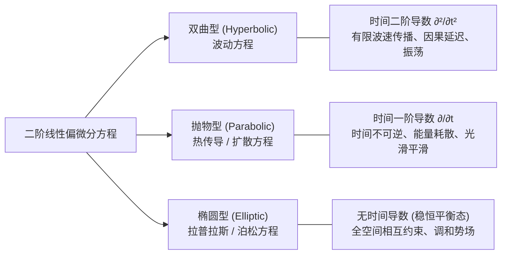

## 经典物理偏微分方程

## 物理问题引入：当物理量在三维空间中弥散时

常微分方程研究的是孤立质点随时间演化的轨迹 $x(t)$．
然而，真实物理世界充满了**连续场 (Continuous Fields)**：
- 传播在空间中的光与声波 $u(x, y, z, t)$；
- 传导在金属块各处的温度场 $T(x, y, z, t)$；
- 充满全宇宙的静电势与引力势 $\phi(x, y, z)$．

这些物理量同时依赖于时间 $t$ 与空间坐标 $(x, y, z)$．描述连续介质动力学与场论的数学工具，就是包含了多元偏导数的 **偏微分方程 (Partial Differential Equations, PDE)**．

---

## 1. 三类经典物理偏微分方程的物理推导与分类

大学物理主干理论几乎全部围绕以下三类二阶线性偏微分方程展开：

### 1.1 波动方程 (Wave Equation，双曲型)
考虑线密度为 $\rho$、张力为 $T$ 的一维绷紧弹性弦，取一小微元 $\Delta x$．
微元两侧的垂直合力为 $T \sin\theta_2 - T \sin\theta_1 \approx T\left(\left.\frac{\partial u}{\partial x}\right|_{x+\Delta x} - \left.\frac{\partial u}{\partial x}\right|_x\right) \approx T \dfrac{\partial^2 u}{\partial x^2}\Delta x$．
根据牛顿第二定律 $(\rho\Delta x)\dfrac{\partial^2 u}{\partial t^2} = T \dfrac{\partial^2 u}{\partial x^2}\Delta x$，令波速 $v = \sqrt{T/\rho}$：

$$
\nabla^2 u = \dfrac{1}{v^2}\dfrac{\partial^2 u}{\partial t^2}
$$

**物理特性**：以确定速度 $v$ 向外传播，波形在无耗散介质中保持不变，服从严格的超距因果光锥约束．

### 1.2 热传导与扩散方程 (Heat Equation，抛物型)
考虑各向同性介质中的热流动：
1. **傅里叶实验定律**：热流密度与温度负梯度成正比：$\boldsymbol{q} = -\kappa \nabla T$；
2. **能量守恒连续性**：微元净吸收热量等于内能增加率：$-\nabla\cdot\boldsymbol{q} = c\rho \dfrac{\partial T}{\partial t}$．

将两式联立，令热扩散系数 $a^2 = \dfrac{\kappa}{c\rho}$：

$$
\nabla^2 T = \dfrac{1}{a^2}\dfrac{\partial T}{\partial t}
$$

**物理特性**：时间具有单向不可逆性（热力学第二定律熵增方向）；初始尖锐分布会被迅速平滑耗散．

### 1.3 泊松方程与拉普拉斯方程 (Poisson & Laplace Equation，椭圆型)
在静电场中，根据麦克斯韦高斯通量定理 $\nabla\cdot\boldsymbol{E} = \dfrac{\rho}{\varepsilon_0}$，电场由标量电势负梯度给出 $\boldsymbol{E} = -\nabla\phi$：

$$
\nabla^2 \phi = -\dfrac{\rho(\boldsymbol{r})}{\varepsilon_0} \quad (\text{泊松方程})
$$

在无电荷的真空区域（$\rho = 0$），退化为著名的 **拉普拉斯方程**：

$$
\nabla^2 \phi = 0
$$

**物理特性**：描述稳恒终态与平衡场，区域内任意一点的势等于其周围球面上势的平均值（平均值定理），不存在孤立极大/极小值．

---

## 2. 定解问题的完整构成

偏微分方程的通解通常包含任意未知函数，无法单独确定物理系统的具体行为．一个良定的 **定解问题 (Well-posed Problem)** 必须包含三要素：

$$
\boxed{\text{定解问题} = \text{偏微分方程} + \text{空间边界条件} + \text{初始条件}}
$$

### 2.1 初始条件 (Initial Conditions, IC)
给出时间起算时刻（$t=0$）全空间的物理状态：
- 波动方程（时间二阶）：需要初始位移 $u(x,0) = \phi(x)$ 和初始速度 $\left.\frac{\partial u}{\partial t}\right|_{t=0} = \psi(x)$；
- 热传导方程（时间一阶）：只需初始温度分布 $T(x,0) = f(x)$；
- 泊松方程（静态平衡）：无需初始条件．

### 2.2 三类典型边界条件 (Boundary Conditions, BC)
在空间区域边界 $\partial\Omega$ 上施加的物理约束：

| 边界类型 | 数学表述 | 典型物理场景 |
| :--- | :--- | :--- |
| **第一类边界 (狄利克雷 Dirichlet)** | $\left.u\right|_{\partial\Omega} = f(\boldsymbol{r})$ | 琴弦两端固定不动（$u=0$）；金属导体表面接地电势为零（$\phi=0$） |
| **第二类边界 (诺伊曼 Neumann)** | $\left.\dfrac{\partial u}{\partial n}\right|_{\partial\Omega} = g(\boldsymbol{r})$ | 绝热容器边界热流为零（$\frac{\partial T}{\partial n}=0$）；长笛管口自由端压力梯度为零 |
| **第三类边界 (罗宾 Robin / 混合)** | $\left.\left(\alpha u + \beta \dfrac{\partial u}{\partial n}\right)\right|_{\partial\Omega} = h(\boldsymbol{r})$ | 牛顿冷却对流换热边界；弹性阻尼端部支撑 |

---

## 3. 线性偏微分方程的叠加原理

若 $u_1(\boldsymbol{r}, t)$ 与 $u_2(\boldsymbol{r}, t)$ 是齐次偏微分方程及齐次边界条件的两个特解，则它们的线性组合：

$$
u(\boldsymbol{r}, t) = C_1 u_1(\boldsymbol{r}, t) + C_2 u_2(\boldsymbol{r}, t)
$$

依然满足方程与齐次边界条件．
**求解偏微分方程的通用纲领**：通过某种结构化方法寻找一组正交完备的“简单特解基底”，再通过积分或级数无限叠加，去逐一满足给定的复杂初始条件或非齐次边界！

---

## 4. 学习衔接

- **下一节**：学习将偏微分降维求解的最强方法，进入 [偏微分方程分离变量法](./separation-of-variables.md)；
- **物理应用**：在 [电磁学：静电场](../../electromagnetism/electrostatics.md) 中掌握拉普拉斯方程边值求解．
