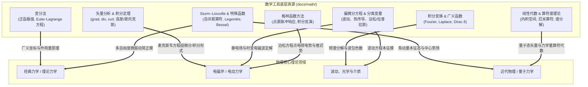

## 数学工具概览

**数学是物理学的通用语言**．物理学的每一次重大飞跃，都伴随着数学描述工具的深刻革新：微积分催生了牛顿经典力学，矢量分析与偏微分方程孕育了麦克斯韦电动力学，非欧几何奠定了爱因斯坦广义相对论，而复线性空间与自共轭算符谱理论则赋予了量子力学严格的形式体系．

在 Physics Learning Wiki 中，数学模块不是纯数学家式的“公理体系复刻”，而是坚持 **“物理问题驱动 (Why-first)”**：从真实的物理现象与理论困境切入，说明为什么旧工具不再够用、新的数学工具如何应运而生，并最终回到物理问题的求解中．

> [!TIP] 大学《数学物理方法》跟课导引
> 如果你正在学习大学本科阶段的核心课程《数学物理方法》，强烈建议优先查阅 **[数学物理方法课程路线](../courses/mathematical-methods-for-physics.md)**．该路线按高校标准大纲梳理了从复变积分、傅里叶变换到偏微分方程分离变量、Sturm–Liouville 本征理论与格林函数的学习链条，并系统标注了各工具在理论力学、电磁学与量子力学中的直接接口．

---

## 1. 核心理论图景：数学工具与物理主线的双向赋能

数学工具库作为 Wiki 的核心底层支撑，与各大理论物理主线紧密耦合：

---

## 2. 知识模块全景与建设看板

根据 **Issue #14** 的长远规划，底层数学工具库划分为 10 个专业领域，兼顾自学者的**顺序学习**与物理正文的**最小原子化引用**：

| 知识领域 | 包含的核心主题 | 建设状态 | 支撑物理课程 |
| :--- | :--- | :--- | :--- |
| **基础微积分** | [极限与连续](./calculus/limit.md)、[导数与微分](./calculus/derivative.md)、[积分学](./calculus/integral.md) | **`status: stable`** | 普通物理力学、热学宏观定律 |
| **线性代数与算符代数** | [向量与矩阵](./linear-algebra/matrix.md)、[线性空间](./linear-algebra/space.md)、[线性算符](./linear-algebra/operators.md)、[本征值与对角化](./linear-algebra/eigenvalues.md)、[内积空间](./linear-algebra/inner-product.md)、[厄米与酉变换](./linear-algebra/hermitian-unitary.md) | **`status: draft`** | 理论力学微振动简正坐标、量子力学力学量算符与表象变换 |
| **矢量分析与场论** | [梯度、散度与旋度](./vector-analysis/operators.md)、[积分定理](./vector-analysis/integral-theorems.md)、[曲线坐标系](./vector-analysis/curvilinear-coordinates.md) | **`status: stable`** | 流体力学、电磁场论、麦克斯韦方程组 |
| **常微分与偏微分方程** | [常微分方程基础](./differential-equations/ode-intro.md)、[二阶线性微分方程](./differential-equations/second-order-ode.md)、[幂级数解法](./differential-equations/series-solution.md)、[三类物理偏微分方程](./differential-equations/pde-intro.md)、[分离变量法定解](./differential-equations/separation-of-variables.md) | **`status: draft`** | 质点动力学、阻尼受迫振子、弦振动、静电边值问题 |
| **积分变换与广义函数** | [狄拉克 Delta 函数](./transforms/delta-function.md)、[傅里叶级数](./transforms/fourier-series.md)、[傅里叶变换](./transforms/fourier-transform.md)、[拉普拉斯变换](./transforms/laplace-transform.md) | **`status: draft`** | 交流电分析、光学干涉与衍射、不确定性原理 |
| **复分析体系** | [复数与几何表示](./complex-analysis/complex-numbers.md)、[解析函数](./complex-analysis/analytic-functions.md)、[复积分与柯西定理](./complex-analysis/contour-integrals.md)、[洛朗级数展开](./complex-analysis/series-expansion.md)、[留数定理与实积分计算](./complex-analysis/residue-calculus.md) | **`status: draft`** | 简谐振动相量法、二维静电复势、因果响应与色散关系 |
| **本征函数与格林函数** | [Sturm–Liouville 本征值理论](./eigenfunction-methods/sturm-liouville.md)、[格林函数方法](./eigenfunction-methods/greens-function.md) | **`status: draft`** | 数理方法核心枢纽、点源激发电磁势、量子态展开与微扰论 |
| **特殊函数族** | [伽马与贝塔函数](./special-functions/gamma-beta.md)、[勒让德多项式](./special-functions/legendre.md)、[球谐函数](./special-functions/spherical-harmonics.md)、[贝塞尔函数](./special-functions/bessel.md)、[厄米多项式](./special-functions/hermite.md)、[拉盖尔多项式](./special-functions/laguerre.md) | **`status: draft`** | 球对称/轴对称静电场、圆膜与波导、量子谐振子、氢原子轨道 |
| **变分法与极值原理** | [变分法基础与欧拉-拉格朗日方程](./variational-methods/calculus-of-variations.md) | **`status: stable`** | 理论力学哈密顿原理、几何光学费马原理、量子微扰与变分法 |
| **概率论与数理统计** | [概率论基础](./probability-statistics/basic-concepts.md)、[随机变量分布](./probability-statistics/one-dimensional-random-variables-and-distributions.md)、[数字特征](./probability-statistics/characteristic-values-of-random-variables.md)、[大数定律](./probability-statistics/law-of-large-numbers-and-central-limit-theorem.md)、[参数估计与假设检验](./probability-statistics/parameter-estimation.md) | **`status: stable`** | 气体动理论速率分布、热力学与统计物理微观系综、实验物理误差与数据拟合 |

---

## 3. 学习与编写指引

1. **从物理场景出发**：当你遇到数学难点时，不要孤立地死记公式，应通过页面开头的“物理问题引入”弄清其产生原因与几何图像；
2. **渐进式依赖**：
   - 基础微积分与矢量分析是全站所有物理学科的共同地基；
   - 微分方程、积分变换、复分析与特殊函数是进入大二大三理论物理的必修桥梁；
   - 概率与数理统计优先配合实验物理与统计物理阅读；
3. **内容贡献约定**：参与数学工具编写时，请遵循统一的 LaTeX 公式与三态页面生命周期规范，详情参见 [内容编写指引](../intro/writing.md)．
