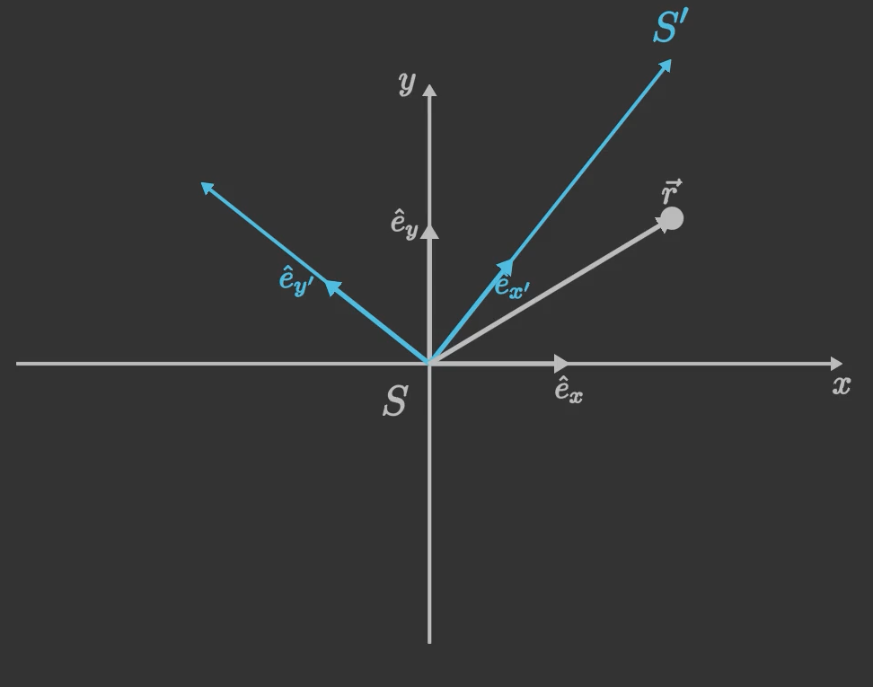

## 惯性力 (Inertial Forces)

惯性力是一类虚拟力，它们出现在非惯性参考系中，用于解释物体在该参考系中的运动。由于非惯性参考系本身是加速的，因此需要引入惯性力来补偿加速度的影响，使牛顿运动定律在非惯性系中仍然适用。

## 1. 惯性力的定义
在非惯性参考系中，惯性力的大小和方向由参考系的加速度决定。惯性力的表达式为：

$$
\boldsymbol{F}_\text{inertial} = -m\boldsymbol{a}_\text{ref}
$$

其中：

- $m$ 是物体的质量；
- $\boldsymbol{a}_\text{ref}$ 是非惯性参考系相对于惯性参考系的加速度；
- $\boldsymbol{F}_\text{inertial}$ 是惯性力，方向与参考系加速度的方向相反。

惯性力并不是一种真实的力，而是一种数学上的修正项，用于在非惯性系中应用牛顿定律。

??? note "例题"
    一辆汽车以 $2\,\mathrm{m/s^2}$ 的加速度向前行驶，车内有一质量为 $10\,\mathrm{kg}$ 的物体。求物体在汽车参考系中受到的惯性力。

    **解答：**

    $$
    \boldsymbol{F}_\text{inertial} = -m\boldsymbol{a}_\text{ref} = -10 \times 2 = -20\,\mathrm{N}
    $$

    惯性力的大小为 $20\,\mathrm{N}$，方向与汽车加速度方向相反。

## 2. 常见的惯性力

### 2.1 离心力 (Centrifugal Force)
离心力是由于旋转参考系的角速度而产生的惯性力。它的大小与物体的质量、旋转角速度和到旋转轴的距离有关。

#### 公式：

$$
\boldsymbol{F}_\text{centrifugal} = m\omega^2\boldsymbol{r}
$$

其中：

- $m$ 是物体的质量；
- $\omega$ 是旋转参考系的角速度；
- $\boldsymbol{r}$ 是物体到旋转轴的距离。

#### 特点：

- 离心力的方向总是指向远离旋转轴的方向。
- 离心力的大小与距离 $r$ 成正比。

??? note "例题"
    一物体质量为 $5\,\mathrm{kg}$，位于距离旋转轴 $2\,\mathrm{m}$ 的位置，旋转角速度为 $3\,\mathrm{rad/s}$。求物体受到的离心力。

    **解答：**

    $$
    \boldsymbol{F}_\text{centrifugal} = m\omega^2r = 5 \times 3^2 \times 2 = 90\,\mathrm{N}
    $$

    物体受到的离心力为 $90\,\mathrm{N}$，方向远离旋转轴。

### 2.2 科里奥利力 (Coriolis Force)
科里奥利力是由于物体在旋转参考系中运动而产生的惯性力。它的存在是非惯性参考系中一个重要的现象，尤其在地球自转的背景下，科里奥利力对天气系统、海洋流动等有重要影响。

#### 引入：
假设有一个矢量 $\boldsymbol{P}$，它表示某物体的位置、速度或其他物理量。我们希望研究 $\boldsymbol{P}$ 的变化率（即导数）在惯性参考系和旋转参考系中的关系。

1. **惯性参考系中的变化率**：
   在惯性参考系中，矢量 $\boldsymbol{P}$ 的变化率为：

$$
\left(\dfrac{d\boldsymbol{P}}{dt}\right)_\text{inertial}
$$

2. **旋转参考系中的变化率**：
   在旋转参考系中，矢量 $\boldsymbol{P}$ 的变化率不仅包括惯性参考系中的变化，还需要考虑参考系本身的旋转。设旋转参考系的角速度为 $\boldsymbol{\omega}$，则有：

$$
\left(\dfrac{d\boldsymbol{P}}{dt}\right)_\text{inertial} = \left(\dfrac{d\boldsymbol{P}}{dt}\right)_\text{rotating} + \boldsymbol{\omega} \times \boldsymbol{P}
$$

   其中：

   - $\left(\frac{d\boldsymbol{P}}{dt}\right)_\text{rotating}$ 是矢量 $\boldsymbol{P}$ 在旋转参考系中的变化率；
   - $\boldsymbol{\omega} \times \boldsymbol{P}$ 是由于参考系旋转引入的附加项。

#### 推导：

##### 1. 坐标系设置
设惯性系 $S$ 的坐标为 $(x, y, z)$，对应基矢量为 $\hat{e}_x, \hat{e}_y, \hat{e}_z$。旋转系 $S'$ 的坐标为 $(x', y', z')$，对应基矢量为 $\hat{e}_{x'}, \hat{e}_{y'}, \hat{e}_{z'}$。两坐标系原点重合，且 $S'$ 绕 $z$ 轴以恒定角速度 $\omega$ 旋转，故角速度矢量 $\vec{\omega} = \omega \hat{e}_z$。为简化，设 $t=0$ 时两坐标系完全重合，则坐标变换关系为：

$$
\begin{aligned}
x &= x' \cos(\omega t) - y' \sin(\omega t), \\
y &= x' \sin(\omega t) + y' \cos(\omega t), \\
z &= z'.
\end{aligned}
$$

基矢量变换关系为：

$$
\begin{aligned}
\hat{e}_{x'} &= \cos(\omega t) \hat{e}_x + \sin(\omega t) \hat{e}_y, \\
\hat{e}_{y'} &= -\sin(\omega t) \hat{e}_x + \cos(\omega t) \hat{e}_y, \\
\hat{e}_{z'} &= \hat{e}_z.
\end{aligned}
$$

##### 2. 位置矢量与速度变换
位置矢量在惯性系和旋转系中表示为：

$$
\vec{r} = x \hat{e}_x + y \hat{e}_y + z \hat{e}_z = x' \hat{e}_{x'} + y' \hat{e}_{y'} + z' \hat{e}_{z'}.
$$

在惯性系中对时间求导得速度：

$$
\vec{v}_{\text{in}} = \dfrac{d\vec{r}}{dt} = \dfrac{d}{dt}(x' \hat{e}_{x'} + y' \hat{e}_{y'} + z' \hat{e}_{z'}).
$$

注意旋转系基矢量随时间变化，其导数为：

$$
\dfrac{d\hat{e}_{x'}}{dt} = \omega \hat{e}_{y'}, \quad \dfrac{d\hat{e}_{y'}}{dt} = -\omega \hat{e}_{x'}, \quad \dfrac{d\hat{e}_{z'}}{dt} = 0.
$$

代入得：

$$
\begin{aligned}
\vec{v}_{\text{in}} &= \left( \dfrac{dx'}{dt} \hat{e}_{x'} + \dfrac{dy'}{dt} \hat{e}_{y'} + \dfrac{dz'}{dt} \hat{e}_{z'} \right) + \left( x' \omega \hat{e}_{y'} - y' \omega \hat{e}_{x'} \right) \\
&= \vec{v}_{\text{rot}} + \omega (x' \hat{e}_{y'} - y' \hat{e}_{x'}),
\end{aligned}
$$

其中 $\vec{v}_{\text{rot}} = \frac{dx'}{dt} \hat{e}_{x'} + \frac{dy'}{dt} \hat{e}_{y'} + \frac{dz'}{dt} \hat{e}_{z'}$ 为旋转系中测得的速度。而第二项可写为 $\vec{\omega} \times \vec{r}$，因为：

$$
\vec{\omega} \times \vec{r} = (\omega \hat{e}_{z'}) \times (x' \hat{e}_{x'} + y' \hat{e}_{y'} + z' \hat{e}_{z'}) = \omega x' \hat{e}_{y'} - \omega y' \hat{e}_{x'}.
$$

故速度变换公式为：

$$
\vec{v}_{\text{in}} = \vec{v}_{\text{rot}} + \vec{\omega} \times \vec{r}.
$$

##### 3. 加速度变换与科里奥利力项
对惯性系速度再求导得加速度：

$$
\vec{a}_{\text{in}} = \dfrac{d\vec{v}_{\text{in}}}{dt} = \dfrac{d}{dt}(\vec{v}_{\text{rot}} + \vec{\omega} \times \vec{r}).
$$

分别计算两项。首先，对旋转系中的速度矢量 $\vec{v}_{\text{rot}}$ 求导时，需考虑其基矢量的旋转，利用旋转系中对矢量的时间导数关系：

$$
\left( \dfrac{d\vec{Q}}{dt} \right)_{\text{in}} = \left( \dfrac{d\vec{Q}}{dt} \right)_{\text{rot}} + \vec{\omega} \times \vec{Q},
$$

其中 $\left( \frac{d\vec{Q}}{dt} \right)_{\text{rot}}$ 表示在旋转系中观察时 $\vec{Q}$ 的变化率（仅对分量求导，基矢量视为不变）。将 $\vec{Q}$ 取为 $\vec{v}_{\text{rot}}$，得：

$$
\dfrac{d\vec{v}_{\text{rot}}}{dt} = \left( \dfrac{d\vec{v}_{\text{rot}}}{dt} \right)_{\text{rot}} + \vec{\omega} \times \vec{v}_{\text{rot}}.
$$

而 $\left( \frac{d\vec{v}_{\text{rot}}}{dt} \right)_{\text{rot}}$ 正是旋转系中测得的加速度 $\vec{a}_{\text{rot}}$。故：

$$
\dfrac{d\vec{v}_{\text{rot}}}{dt} = \vec{a}_{\text{rot}} + \vec{\omega} \times \vec{v}_{\text{rot}}.
$$

其次，对 $\vec{\omega} \times \vec{r}$ 求导（设 $\vec{\omega}$ 恒定）：

$$
\dfrac{d}{dt}(\vec{\omega} \times \vec{r}) = \vec{\omega} \times \dfrac{d\vec{r}}{dt} = \vec{\omega} \times \vec{v}_{\text{in}} = \vec{\omega} \times (\vec{v}_{\text{rot}} + \vec{\omega} \times \vec{r}) = \vec{\omega} \times \vec{v}_{\text{rot}} + \vec{\omega} \times (\vec{\omega} \times \vec{r}).
$$

将两部分合并：

$$
\vec{a}_{\text{in}} = \vec{a}_{\text{rot}} + \vec{\omega} \times \vec{v}_{\text{rot}} + \vec{\omega} \times \vec{v}_{\text{rot}} + \vec{\omega} \times (\vec{\omega} \times \vec{r}) = \vec{a}_{\text{rot}} + 2\vec{\omega} \times \vec{v}_{\text{rot}} + \vec{\omega} \times (\vec{\omega} \times \vec{r}).
$$

##### 4. 旋转系中的有效力
在惯性系中，牛顿第二定律为 $m\vec{a}_{\text{in}} = \vec{F}_{\text{real}}$。代入加速度变换式：

$$
m\vec{a}_{\text{rot}} + 2m\vec{\omega} \times \vec{v}_{\text{rot}} + m\vec{\omega} \times (\vec{\omega} \times \vec{r}) = \vec{F}_{\text{real}}.
$$

移项得旋转系中的运动方程：

$$
m\vec{a}_{\text{rot}} = \vec{F}_{\text{real}} - 2m\vec{\omega} \times \vec{v}_{\text{rot}} - m\vec{\omega} \times (\vec{\omega} \times \vec{r}).
$$

因此，在旋转系中观察时，除了真实力 $\vec{F}_{\text{real}}$ 外，还需引入两个惯性力：

- **科里奥利力**：$\vec{F}_{\text{cor}} = -2m\vec{\omega} \times \vec{v}_{\text{rot}}$，
- **离心力**：$\vec{F}_{\text{cen}} = -m\vec{\omega} \times (\vec{\omega} \times \vec{r})$。

#### 特点：
- **方向**：科里奥利力的方向由右手法则确定。右手四指指向 $\boldsymbol{v}$ 的方向，弯向 $\boldsymbol{\omega}$ 的方向，大拇指指向科里奥利力的方向。
- **大小**：科里奥利力的大小与物体的速度和旋转角速度成正比。
- **性质**：科里奥利力是一种惯性力，仅在旋转参考系中存在。

??? note "例题"
    一质量为 $2\,\mathrm{kg}$ 的物体以 $5\,\mathrm{m/s}$ 的速度沿东向运动，所在参考系的角速度为 $0.1\,\mathrm{rad/s}$，方向指向北。求物体受到的科里奥利力。

    **解答：**

    $$
    \boldsymbol{F}_\text{Coriolis} = 2m(\boldsymbol{v} \times \boldsymbol{\omega})
    $$

    设 $\boldsymbol{v} = 5\hat{i}$，$\boldsymbol{\omega} = 0.1\hat{j}$，则：

    $$
    \boldsymbol{v} \times \boldsymbol{\omega} = \begin{vmatrix}
    \hat{i} & \hat{j} & \hat{k} \\
    5 & 0 & 0 \\
    0 & 0.1 & 0
    \end{vmatrix} = \hat{k} \cdot (5 \times 0.1) = 0.5\hat{k}
    $$

    $$
    \boldsymbol{F}_\text{Coriolis} = 2 \times 2 \times 0.5\hat{k} = 2\hat{k}\,\mathrm{N}
    $$

    科里奥利力的大小为 $2\,\mathrm{N}$，方向竖直向上。

### 2.3 欧拉力 (Euler Force)
欧拉力是由于旋转参考系的角速度变化而产生的惯性力。它的大小与物体的质量和角速度的变化率有关。

#### 公式：

$$
\boldsymbol{F}_\text{Euler} = -m\dfrac{d\boldsymbol{\omega}}{dt} \times \boldsymbol{r}
$$

其中：
- $m$ 是物体的质量；
- $\frac{d\boldsymbol{\omega}}{dt}$ 是角速度的变化率；
- $\boldsymbol{r}$ 是物体到旋转轴的距离。

#### 特点：
- 欧拉力的方向由右手法则确定。
- 欧拉力仅在角速度变化时存在。

??? note "例题"
    一物体质量为 $1\,\mathrm{kg}$，位于距离旋转轴 $3\,\mathrm{m}$ 的位置，旋转参考系的角速度变化率为 $0.2\,\mathrm{rad/s^2}$。求物体受到的欧拉力。

    **解答：**

    $$
    \boldsymbol{F}_\text{Euler} = -m\dfrac{d\boldsymbol{\omega}}{dt} \times \boldsymbol{r} = -1 \times 0.2 \times 3 = -0.6\,\mathrm{N}
    $$

    欧拉力的大小为 $0.6\,\mathrm{N}$，方向由右手法则确定。