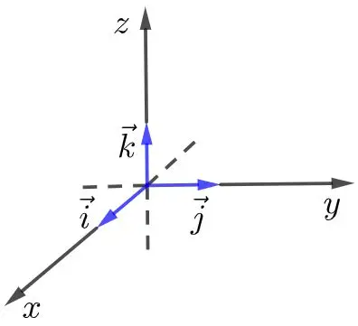
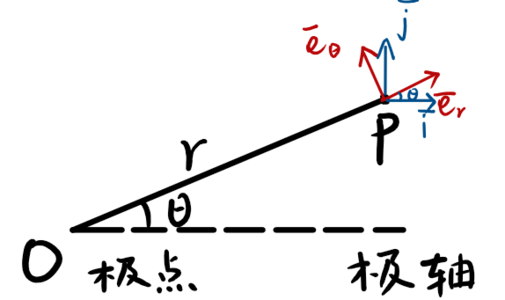
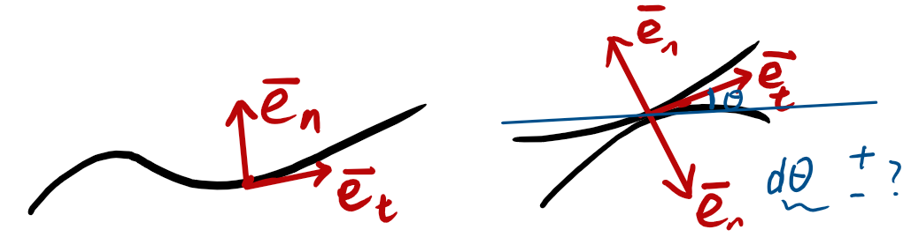

??? warning "注意"
    本页内容正在编写中，部分内容可能不完整或存在错误，敬请谅解．欢迎补充和指正！

## 参考系与坐标系 (Reference Frames and Coordinate Systems)

在物理学中，参考系和坐标系是描述物体运动的基本工具．理解它们对于分析运动学问题至关重要．在实际的分析过程中，选择合适的参考系和坐标系可以简化计算并提供更清晰的物理意义．

### 参考系 (Reference Frames)

参考系是观察和测量物体运动的视角．某物体的运动总是相对于某个参考系而言的．例如研究一辆行驶中汽车的运动时，可以选择地面作为参考系，站在地面上的人看来，此时汽车是 **运动的**．如果选择汽车内的座椅为参考系，坐着车中的人观察到汽车是 **静止的**．为什么会出现这种差异呢？这是参考系的选择不同导致的．常见的参考系类型包括：

-   **惯性参考系**：在这种参考系中，牛顿第一定律成立，即物体在没有外力作用时保持静止或匀速直线运动．
    -   举例：地面参考系、远离引力场的空间参考系等．

-   **非惯性参考系**：在这种参考系中，观察到的物体运动会受到额外的惯性力影响，例如旋转参考系中的离心力．关于非惯性参考系的详细讲解见 [惯性力](../dynamics/inertial-force.md)．
    -   举例：加速中的汽车参考系、旋转的地球参考系等．

### 坐标系 (Coordinate Systems)

坐标系是用于描述物体位置的数学工具．常见的坐标系包括直角坐标系、极坐标系和球坐标系．

#### 直角坐标系 (Cartesian Coordinates)

使用 x、y、z 轴来描述物体的位置，适用于大多数平面和空间运动问题．

-   **位置矢量**:$\boldsymbol{r} = x\hat{\boldsymbol{i}} + y\hat{\boldsymbol{j}} + z\hat{\boldsymbol{k}}$

-   **速度**:$\boldsymbol{v} = \frac{d\boldsymbol{r}}{dt} = \dot{x}\hat{\boldsymbol{i}} + \dot{y}\hat{\boldsymbol{j}} + \dot{z}\hat{\boldsymbol{k}}$

-   **加速度**:$\boldsymbol{a} = \frac{d\boldsymbol{v}}{dt} = \ddot{x}\hat{\boldsymbol{i}} + \ddot{y}\hat{\boldsymbol{j}} + \ddot{z}\hat{\boldsymbol{k}}$

??? note "例题：抛物运动"
    一颗炮弹以 $v_0 = 50\,\mathrm{m/s}$ 的初速度从地面以 $\theta = 60^\circ$ 的仰角发射，忽略空气阻力，求：
    
    1.  炮弹的飞行时间；
    2.  最大高度；
    3.  落地点与发射点的水平距离．
    
    **解答：**
    
    1.  **飞行时间：**
    
        -   初速度分解：
    
        $$
        v_{0x} = v_0 \cos\theta, \quad v_{0y} = v_0 \sin\theta  
        $$
    
        -   飞行时间由垂直方向运动决定：
    
        $$
        t = \dfrac{2v_{0y}}{g} = \dfrac{2v_0 \sin\theta}{g}  
        $$
    
        代入 $v_0 = 50\,\mathrm{m/s}$，$\theta = 60^\circ$，$g = 9.8\,\mathrm{m/s^2}$：
    
        $$
        t \approx 8.84\,\mathrm{s}  
        $$
    
    2.  **最大高度：**
    
        -   最大高度由垂直方向速度为零时的位置决定：
    
        $$
        h = \dfrac{v_{0y}^2}{2g} = \dfrac{(v_0 \sin\theta)^2}{2g}  
        $$
    
             代入数据：
    
        $$
        h \approx 95.92\,\mathrm{m}  
        $$
    
    3.  **水平距离：**
    
        -   水平距离由水平速度和飞行时间决定：
    
        $$
        x = v_{0x} \cdot t = v_0 \cos\theta \cdot \dfrac{2v_0 \sin\theta}{g}  
        $$
    
             利用 $\sin(2\theta) = 2\sin\theta\cos\theta$：
    
        $$
        x = \dfrac{v_0^2 \sin(2\theta)}{g}  
        $$
    
             代入数据：
    
        $$
        x \approx 220.94\,\mathrm{m}  
        $$

#### 平面极坐标系 (Polar Coordinates)

使用距离和角度来描述位置，适用于圆周运动和旋转运动问题．

定义径向单位矢量 $\hat{\boldsymbol{e}}_r$ 和横向（切向）单位矢量 $\hat{\boldsymbol{e}}_\theta$．注意这两个基矢量随位置变化，即随时间变化．

**位置**:$\boldsymbol{r} = r\hat{\boldsymbol{e}}_r$

**速度**:

$$
\boldsymbol{v} = \dfrac{d}{dt}(r\hat{\boldsymbol{e}}_r) = \dot{r}\hat{\boldsymbol{e}}_r + r\dot{\hat{\boldsymbol{e}}}_r = \dot{r}\hat{\boldsymbol{e}}_r + r\dot{\theta}\hat{\boldsymbol{e}}_\theta
$$

其中 $\dot{r}$ 为径向速度，$r\dot{\theta}$ 为横向速度．

**加速度**:

$$
\boldsymbol{a} = (\ddot{r} - r\dot{\theta}^2)\hat{\boldsymbol{e}}_r + (r\ddot{\theta} + 2\dot{r}\dot{\theta})\hat{\boldsymbol{e}}_\theta
$$

$\ddot{r}\hat{\boldsymbol{e}}_r$: 径向加速度分量．

$-r\dot{\theta}^2\hat{\boldsymbol{e}}_r$:**向心加速度**．

$r\ddot{\theta}\hat{\boldsymbol{e}}_\theta$: 切向加速度分量．

$2\dot{r}\dot{\theta}\hat{\boldsymbol{e}}_\theta$:**科里奥利加速度**(Coriolis acceleration) 的一部分形式．

??? note "证明"
    在极坐标系中，单位矢量 $\hat{\boldsymbol{e}}_r$ 和 $\hat{\boldsymbol{e}}_\theta$ 随角度 $\theta$ 变化，因此求导时需注意基矢量的变化．
    
    **重要推论**   
    在图 1 中可以看出：
    
    $$
    \begin{aligned}  
        \hat{\boldsymbol{e}}_r &= \cos\theta\,\hat{\boldsymbol{i}} + \sin\theta\,\hat{\boldsymbol{j}} \\  
        \hat{\boldsymbol{e}}_\theta &= -\sin\theta\,\hat{\boldsymbol{i}} + \cos\theta\,\hat{\boldsymbol{j}}  
    \end{aligned}  
    $$
    
    $$
    \begin{aligned}  
        \dfrac{d\hat{\boldsymbol{e}}_r}{d\theta} &= -\sin\theta\,\hat{\boldsymbol{i}} + \cos\theta\,\hat{\boldsymbol{j}} = \hat{\boldsymbol{e}}_\theta \\  
        \dfrac{d\hat{\boldsymbol{e}}_\theta}{d\theta} &= -\cos\theta\,\hat{\boldsymbol{i}} - \sin\theta\,\hat{\boldsymbol{j}} = -\hat{\boldsymbol{e}}_r  
    \end{aligned}  
    $$
    
    则
    
    $$
    \begin{aligned}  
        \dfrac{d\hat{\boldsymbol{e}}_r}{dt} &= \dfrac{d\hat{\boldsymbol{e}}_r}{d\theta}\dfrac{d\theta}{dt} = \dot{\theta}\,\hat{\boldsymbol{e}}_\theta \\  
        \dfrac{d\hat{\boldsymbol{e}}_\theta}{dt} &= \dfrac{d\hat{\boldsymbol{e}}_\theta}{d\theta}\dfrac{d\theta}{dt} = -\dot{\theta}\,\hat{\boldsymbol{e}}_r  
    \end{aligned}  
    $$
    
    **1. 速度的推导：**
    
    位置矢量为 $\boldsymbol{r} = r\hat{\boldsymbol{e}}_r$．
    
    对时间求导：
    
    $$
    \boldsymbol{v} = \dfrac{d\boldsymbol{r}}{dt} = \dfrac{d}{dt}(r\hat{\boldsymbol{e}}_r) = \dot{r}\hat{\boldsymbol{e}}_r + r\dfrac{d\hat{\boldsymbol{e}}_r}{dt}  
    $$
    
    由于 $\hat{\boldsymbol{e}}_r$ 随 $\theta$ 变化，$\frac{d\hat{\boldsymbol{e}}_r}{dt} = \dot{\theta}\hat{\boldsymbol{e}}_\theta$，所以：
    
    $$
    \boldsymbol{v} = \dot{r}\hat{\boldsymbol{e}}_r + r\dot{\theta}\hat{\boldsymbol{e}}_\theta  
    $$
    
    **2. 加速度的推导：**
    
    对速度再求导：
    
    $$
    \boldsymbol{a} = \dfrac{d\boldsymbol{v}}{dt} = \dfrac{d}{dt}(\dot{r}\hat{\boldsymbol{e}}_r + r\dot{\theta}\hat{\boldsymbol{e}}_\theta)  
    $$
    
    展开后：
    
    $$
    \boldsymbol{a} = \ddot{r}\hat{\boldsymbol{e}}_r + \dot{r}\dfrac{d\hat{\boldsymbol{e}}_r}{dt} + \dot{r}\dot{\theta}\hat{\boldsymbol{e}}_\theta + r\ddot{\theta}\hat{\boldsymbol{e}}_\theta + r\dot{\theta}\dfrac{d\hat{\boldsymbol{e}}_\theta}{dt}  
    $$
    
    其中
    
    $$
    \dfrac{d\hat{\boldsymbol{e}}_r}{dt} = \dot{\theta}\hat{\boldsymbol{e}}_\theta,\quad \dfrac{d\hat{\boldsymbol{e}}_\theta}{dt} = -\dot{\theta}\hat{\boldsymbol{e}}_r  
    $$
    
    代入后整理得：
    
    $$
    \boldsymbol{a} = (\ddot{r} - r\dot{\theta}^2)\hat{\boldsymbol{e}}_r + (r\ddot{\theta} + 2\dot{r}\dot{\theta})\hat{\boldsymbol{e}}_\theta  
    $$
    
    这就是极坐标系下速度和加速度的标准表达式．

??? note "例题：圆周运动"
    一颗卫星沿半径为 $r = 7000\,\mathrm{km}$ 的圆轨道匀速运行，周期为 $T = 90\,\mathrm{min}$，求：
    
    1.  卫星的角速度；
    2.  卫星的线速度；
    3.  卫星的向心加速度．
    
    **解答：**
    
    1.  **角速度：**
    
        -   角速度由周期决定：
    
        $$
        \omega = \dfrac{2\pi}{T}  
        $$
    
             代入 $T = 90\,\mathrm{min} = 5400\,\mathrm{s}$：
    
        $$
        \omega \approx 0.00116\,\mathrm{rad/s}  
        $$
    
    2.  **线速度：**
    
        -   线速度由角速度和半径决定：
    
        $$
        v = \omega r  
        $$
    
             代入 $r = 7000\,\mathrm{km} = 7.0 \times 10^6\,\mathrm{m}$：
    
        $$
        v \approx 8136\,\mathrm{m/s}  
        $$
    
    3.  **向心加速度：**
    
        -   向心加速度由线速度和半径决定：
    
        $$
        a_c = \dfrac{v^2}{r}  
        $$
    
             代入数据：
    
        $$
        a_c \approx 9.46\,\mathrm{m/s^2}  
        $$

#### 自然坐标系 (Intrinsic Coordinates)

以质点运动轨迹上的点为原点，沿切向 $\hat{\boldsymbol{\tau}}$ 和法向 $\hat{\boldsymbol{n}}$ 分解．其中 $\rho$ 为曲率半径，$\Theta$ 为轨迹切线与某参考方向的夹角．

$\hat{\boldsymbol{\tau}} = \frac{d\hat{\boldsymbol{r}}}{ds}$

$\hat{\boldsymbol{n}} = \pm\frac{d\hat{\boldsymbol{\tau}}}{d\Theta}$

$\rho = \pm\frac{ds}{d\Theta}$

-   **速度**:$\boldsymbol{v} = v\hat{\boldsymbol{\tau}}$

-   **切向加速度**:$a_\tau = \dot{v}$

-   **法向加速度**:$a_n =\frac{v^2}{\rho}$

??? note "证明"
    在自然坐标系中，速度和加速度可分解为切向和法向分量．证明如下：
    
    设质点在轨迹上的弧长为 $s$，速度大小为 $v = \frac{ds}{dt}$，切向单位矢量为 $\hat{\boldsymbol{\tau}}$，法向单位矢量为 $\hat{\boldsymbol{n}}$，曲率半径为 $\rho$．
    
    **1. 速度表达式：**
    
    位置矢量 $\boldsymbol{r}(s)$ 沿轨迹变化，速度为
    
    $$
    \boldsymbol{v} = \dfrac{d\boldsymbol{r}}{dt} = \dfrac{d\boldsymbol{r}}{ds} \dfrac{ds}{dt} = \hat{\boldsymbol{\tau}}\, v  
    $$
    
    **2. 加速度分解：**
    
    对速度求导：
    
    $$
    \boldsymbol{a} = \dfrac{d\boldsymbol{v}}{dt} = \dfrac{d}{dt}(v\hat{\boldsymbol{\tau}})  
    $$
    
    展开为：
    
    $$
    \boldsymbol{a} = \dfrac{dv}{dt}\hat{\boldsymbol{\tau}} + v\dfrac{d\hat{\boldsymbol{\tau}}}{dt}  
    $$
    
    其中，$\frac{dv}{dt}$ 是速度大小的变化，$\frac{d\hat{\boldsymbol{\tau}}}{dt}$ 是方向的变化．
    
    又有
    
    $$
    \dfrac{d\hat{\boldsymbol{\tau}}}{dt} = \dfrac{d\hat{\boldsymbol{\tau}}}{ds} \dfrac{ds}{dt} = \dfrac{d\hat{\boldsymbol{\tau}}}{ds} v  
    $$
    
    而 $\frac{d\hat{\boldsymbol{\tau}}}{ds} = \frac{1}{\rho} \hat{\boldsymbol{n}}$，所以
    
    $$
    \dfrac{d\hat{\boldsymbol{\tau}}}{dt} = \dfrac{v}{\rho} \hat{\boldsymbol{n}}  
    $$
    
    代入加速度表达式：
    
    $$
    \boldsymbol{a} = \dfrac{dv}{dt}\hat{\boldsymbol{\tau}} + v \cdot \dfrac{v}{\rho} \hat{\boldsymbol{n}} = \dfrac{dv}{dt}\hat{\boldsymbol{\tau}} + \dfrac{v^2}{\rho}\hat{\boldsymbol{n}}  
    $$
    
    **3. 切向加速度：**
    
    $$
    a_\tau = \dfrac{dv}{dt}  
    $$
    
    表示速度大小的变化．
    
    **4. 法向加速度：**
    
    $$
    a_n = \dfrac{v^2}{\rho}  
    $$
    
    表示速度方向的变化，指向轨迹的曲率中心．
    
    因此，自然坐标系下速度和加速度的分解式得证．

??? note "例题：弯道上的汽车"
    一辆汽车以 $v = 20\,\mathrm{m/s}$ 的速度通过半径为 $r = 50\,\mathrm{m}$ 的水平弯道，求：
    
    1.  汽车的向心加速度；
    2.  如果弯道倾角为 $\theta = 15^\circ$，汽车不打滑所需的最小摩擦系数．
    
    **解答：**
    
    1.  **向心加速度：**
    
        -   向心加速度由速度和半径决定：
    
        $$
        a_c = \dfrac{v^2}{r}  
        $$
    
             代入 $v = 20\,\mathrm{m/s}$，$r = 50\,\mathrm{m}$：
    
        $$
        a_c = 8\,\mathrm{m/s^2}  
        $$
    
    2.  **最小摩擦系数：**
    
        -   在倾斜弯道上，摩擦力和重力提供向心力：
    
        $$
        \mu \geq \dfrac{v^2}{rg \cos\theta} - \tan\theta  
        $$
    
             代入 $g = 9.8\,\mathrm{m/s^2}$，$\theta = 15^\circ$：
    
        $$
        \mu \geq 0.36  
        $$

### 参考系与坐标系的转换

在物理学中，复杂运动的分析常常需要在不同参考系和坐标系之间进行转换．这样做可以让问题变得更简单，或者让物理意义更加清晰．下面详细讲解两种常见的转换：

#### 1. 参考系转换

参考系转换就是改变我们观察和描述运动的「视角」．比如：

-   **平移参考系**：假设你在地面上看一辆行驶的汽车，汽车是运动的．如果你坐在汽车里，汽车对你来说是静止的，外面的景物在移动．这就是参考系的平移转换．
-   **旋转参考系**：比如在旋转的游乐场上，地面上的人看到你在做圆周运动，而你自己会感受到一种「离心力」，这是因为你所处的参考系在旋转．

参考系转换的数学处理通常包括：

-   **速度的转换**：物体在新参考系中的速度 = 物体在原参考系中的速度 + 参考系本身的速度．
-   **加速度的转换**：如果参考系是非惯性的（比如加速或旋转），还要加上惯性力项．

#### 2. 坐标系转换

坐标系转换是改变我们描述位置和运动的「工具」．常见的有：

-   **直角坐标系与极坐标系的转换**：
    -   直角坐标系用 $(x, y)$ 表示位置，极坐标系用 $(r, \theta)$ 表示位置．
    -   转换公式：

        $$
        \begin{aligned}
        x &= r\cos\theta \\
        y &= r\sin\theta
        \end{aligned}
        $$

        反过来：

        $$
        \begin{aligned}
        r &= \sqrt{x^2 + y^2} \\
        \theta &= \arctan\left(\dfrac{y}{x}\right)
        \end{aligned}
        $$

-   **旋转矩阵**：如果坐标轴发生旋转，可以用旋转矩阵把一个坐标系中的向量转换到另一个坐标系．例如，二维旋转角度为 $\phi$ 时：

    $$
    \begin{pmatrix}
    x' \\
    y'
    \end{pmatrix}
    =
    \begin{pmatrix}
    \cos\phi & -\sin\phi \\
    \sin\phi & \cos\phi
    \end{pmatrix}
    \begin{pmatrix}
    x \\
    y
    \end{pmatrix}
    $$

-   参考系转换是改变观察者的位置或运动状态，影响速度和加速度的表达．

-   坐标系转换是改变描述位置和运动的数学方式，常用公式或矩阵进行转换．

??? note "例题：船与水流"
    一艘船以相对于水的速度 $v_b = 4\,\mathrm{m/s}$ 垂直于河岸划行，河水以 $v_w = 3\,\mathrm{m/s}$ 的速度平行于河岸流动．河宽为 $d = 100\,\mathrm{m}$．
    
    1.  求船相对于地面的速度大小和方向；
    2.  船到达对岸所需的时间；
    3.  船到达对岸时与出发点的水平偏移距离．
    
    **解答：**
    
    1.  **相对速度：**
    
        -   船相对于地面的速度由矢量合成：
    
        $$
        \boldsymbol{v}_\text{地} = \boldsymbol{v}_b + \boldsymbol{v}_w  
        $$
    
        -   速度大小：
    
        $$
        v_\text{地} = \sqrt{v_b^2 + v_w^2} = \sqrt{4^2 + 3^2} = 5\,\mathrm{m/s}  
        $$
    
        -   方向：
    
        $$
        \theta = \arctan\left(\dfrac{v_w}{v_b}\right) = \arctan\left(\dfrac{3}{4}\right) \approx 36.87^\circ  
        $$
    
             即偏离垂直方向 $36.87^\circ$．
    
    2.  **到达时间：**
        -   到达时间由垂直方向运动决定：
        $$
        t = \dfrac{d}{v_b} = \dfrac{100}{4} = 25\,\mathrm{s}  
        $$
    
    3.  **水平偏移：**
        -   水平偏移由水流速度和时间决定：
        $$
        x = v_w \cdot t = 3 \cdot 25 = 75\,\mathrm{m}  
        $$
