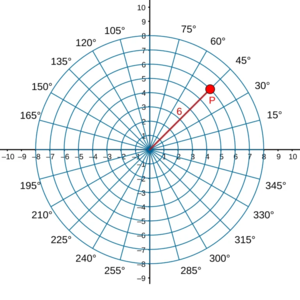

author: Leafuke

??? warning "注意"
    本页内容正在编写中，部分内容可能不完整或存在错误，敬请谅解。欢迎补充和指正！

## 参考系与坐标系 (Reference Frames and Coordinate Systems)
在物理学中，参考系和坐标系是描述物体运动的基本工具。理解它们对于分析运动学问题至关重要。在实际的分析过程中，选择合适的参考系和坐标系可以简化计算并提供更清晰的物理意义。

### 参考系 (Reference Frames)
参考系是观察和测量物体运动的视角。某物体的运动总是相对于某个参考系而言的。例如研究一辆行驶中汽车的运动时，可以选择地面作为参考系，站在地面上的人看来，此时汽车是**运动的**。如果选择汽车内的座椅为参考系，坐着车中的人观察到汽车是**静止的**。为什么会出现这种差异呢？这是参考系的选择不同导致的。常见的参考系类型包括：

- **惯性参考系**：在这种参考系中，牛顿第一定律成立，即物体在没有外力作用时保持静止或匀速直线运动。
    - 举例: 地面参考系、远离引力场的空间参考系等。

- **非惯性参考系**：在这种参考系中，观察到的物体运动会受到额外的惯性力影响，例如旋转参考系中的离心力。
    - 举例: 加速中的汽车参考系、旋转的地球参考系等。

### 坐标系 (Coordinate Systems)
坐标系是用于描述物体位置的数学工具。常见的坐标系包括直角坐标系、极坐标系和球坐标系。

#### 直角坐标系 (Cartesian Coordinates)

使用x、y、z轴来描述物体的位置，适用于大多数平面和空间运动问题。

-   **位置矢量**: $\boldsymbol{r} = x\hat{\boldsymbol{i}} + y\hat{\boldsymbol{j}} + z\hat{\boldsymbol{k}}$

-   **速度**: $\boldsymbol{v} = \frac{d\boldsymbol{r}}{dt} = \dot{x}\hat{\boldsymbol{i}} + \dot{y}\hat{\boldsymbol{j}} + \dot{z}\hat{\boldsymbol{k}}$

-   **加速度**: $\boldsymbol{a} = \frac{d\boldsymbol{v}}{dt} = \ddot{x}\hat{\boldsymbol{i}} + \ddot{y}\hat{\boldsymbol{j}} + \ddot{z}\hat{\boldsymbol{k}}$

#### 平面极坐标系 (Polar Coordinates)

使用距离和角度来描述位置，适用于圆周运动和旋转运动问题。

定义径向单位矢量 $\hat{\boldsymbol{e}}_r$ 和横向（切向）单位矢量 $\hat{\boldsymbol{e}}_\theta$。注意这两个基矢量随位置变化，即随时间变化。
**位置**: $\boldsymbol{r} = r\hat{\boldsymbol{e}}_r$
**速度**:

$$
\boldsymbol{v} = \frac{d}{dt}(r\hat{\boldsymbol{e}}_r) = \dot{r}\hat{\boldsymbol{e}}_r + r\dot{\hat{\boldsymbol{e}}}_r = \dot{r}\hat{\boldsymbol{e}}_r + r\dot{\theta}\hat{\boldsymbol{e}}_\theta
$$

其中 $\dot{r}$ 为径向速度，$r\dot{\theta}$ 为横向速度。

**加速度**:

$$
\boldsymbol{a} = (\ddot{r} - r\dot{\theta}^2)\hat{\boldsymbol{e}}_r + (r\ddot{\theta} + 2\dot{r}\dot{\theta})\hat{\boldsymbol{e}}_\theta
$$

$\ddot{r}\hat{\boldsymbol{e}}_r$: 径向加速度分量。

$-r\dot{\theta}^2\hat{\boldsymbol{e}}_r$: **向心加速度**。

$r\ddot{\theta}\hat{\boldsymbol{e}}_\theta$: 切向加速度分量。

$2\dot{r}\dot{\theta}\hat{\boldsymbol{e}}_\theta$: **科里奥利加速度** (Coriolis acceleration) 的一部分形式。

??? note "速度与加速度形式的证明"
    在极坐标系中，单位矢量 $\hat{\boldsymbol{e}}_r$ 和 $\hat{\boldsymbol{e}}_\theta$ 随角度 $\theta$ 变化，因此求导时需注意基矢量的变化。

    **1. 速度的推导：**

    位置矢量为 $\boldsymbol{r} = r\hat{\boldsymbol{e}}_r$。

    对时间求导：

    $$
    \boldsymbol{v} = \frac{d\boldsymbol{r}}{dt} = \frac{d}{dt}(r\hat{\boldsymbol{e}}_r) = \dot{r}\hat{\boldsymbol{e}}_r + r\frac{d\hat{\boldsymbol{e}}_r}{dt}
    $$

    由于 $\hat{\boldsymbol{e}}_r$ 随 $\theta$ 变化，$\frac{d\hat{\boldsymbol{e}}_r}{dt} = \dot{\theta}\hat{\boldsymbol{e}}_\theta$，所以：

    $$
    \boldsymbol{v} = \dot{r}\hat{\boldsymbol{e}}_r + r\dot{\theta}\hat{\boldsymbol{e}}_\theta
    $$

    **2. 加速度的推导：**

    对速度再求导：

    $$
    \boldsymbol{a} = \frac{d\boldsymbol{v}}{dt} = \frac{d}{dt}(\dot{r}\hat{\boldsymbol{e}}_r + r\dot{\theta}\hat{\boldsymbol{e}}_\theta)
    $$

    展开后：

    $$
    \boldsymbol{a} = \ddot{r}\hat{\boldsymbol{e}}_r + \dot{r}\frac{d\hat{\boldsymbol{e}}_r}{dt} + \dot{r}\dot{\theta}\hat{\boldsymbol{e}}_\theta + r\ddot{\theta}\hat{\boldsymbol{e}}_\theta + r\dot{\theta}\frac{d\hat{\boldsymbol{e}}_\theta}{dt}
    $$

    其中

    $$
    \frac{d\hat{\boldsymbol{e}}_r}{dt} = \dot{\theta}\hat{\boldsymbol{e}}_\theta,\quad \frac{d\hat{\boldsymbol{e}}_\theta}{dt} = -\dot{\theta}\hat{\boldsymbol{e}}_r
    $$

    代入后整理得：

    $$
    \boldsymbol{a} = (\ddot{r} - r\dot{\theta}^2)\hat{\boldsymbol{e}}_r + (r\ddot{\theta} + 2\dot{r}\dot{\theta})\hat{\boldsymbol{e}}_\theta
    $$

    这就是极坐标系下速度和加速度的标准表达式。
    

#### 自然坐标系 (Intrinsic Coordinates)
以质点运动轨迹上的点为原点，沿切向 $\hat{\boldsymbol{\tau}}$ 和法向 $\hat{\boldsymbol{n}}$ 分解。
*   **速度**: $\boldsymbol{v} = v\hat{\boldsymbol{\tau}}$
*   **加速度**:

$$
\boldsymbol{a} = \frac{dv}{dt}\hat{\boldsymbol{\tau}} + \frac{v^2}{\rho}\hat{\boldsymbol{n}}
$$

$a_\tau = \frac{dv}{dt}$: 切向加速度，改变速度大小。
$a_n = \frac{v^2}{\rho}$: 法向加速度（向心加速度），改变速度方向，$\rho$ 为曲率半径。

### 参考系与坐标系的转换
在分析复杂运动时，常常需要在不同参考系和坐标系之间进行转换。掌握这些转换方法有助于简化问题并获得更清晰的物理理解。
- **参考系转换**：通过平移或旋转参考系，可以将物体的运动描述转换到新的参考系中。
- **坐标系转换**：通过数学变换（如旋转矩阵或极坐标与直角坐标的转换公式），可以在不同坐标系之间切换。
### 总结