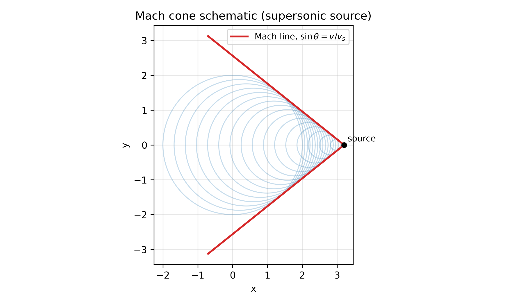

## 多普勒效应（Doppler Effect）

当波源与观察者之间存在相对运动时，观察到的频率（或波长）会发生变化，这称为多普勒效应。
本页以“**介质中的波（如声波）**”为主（存在介质参考系），并给出典型推导与例题。

??? warning "注意"
    声波多普勒效应依赖介质（空气）作为“特权参考系”。  
    电磁波在真空中的多普勒效应应使用相对论推导（本页末尾给出最基本公式）。

## 1. 基本符号与约定

- 介质中波速：$v$（声速）
- 声源本征频率：$f$（声源静止于介质时发声频率）
- 观察者测得频率：$f'$
- 观察者速度（相对介质）：$v_o$，取“朝向声源”为正
- 声源速度（相对介质）：$v_s$，取“朝向观察者”为正

在此约定下：

- 观察者向声源运动：$v_o>0$，频率升高。
- 声源向观察者运动：$v_s>0$，波前被压缩，频率升高。

## 2. 观察者运动、声源静止

声源静止，介质中频率仍为 $f$、波长 $\lambda=v/f$。

观察者以速度 $v_o$ 迎向波前，相当于波前相对观察者的到达速度为 $v+v_o$，单位时间穿过观察者的波峰数为

$$
 f' = \dfrac{v+v_o}{\lambda}=\dfrac{v+v_o}{v/f}=f\left(1+\dfrac{v_o}{v}\right).
$$

若观察者远离声源（沿传播反方向运动），将 $v_o\to -|v_o|$ 即可。

## 3. 声源运动、观察者静止

观察者静止，关键在于：声源移动改变了相邻波峰在空间中的间距（波长）。

声源周期 $T=1/f$。在一个周期内，声源前进距离 $v_s T$。

- 声源向观察者运动（沿传播方向）：前方波长变为

$$
 \lambda' = vT - v_sT=(v-v_s)T=\dfrac{v-v_s}{f}.
$$

观察者测得频率

$$
 f' = \dfrac{v}{\lambda'}=\dfrac{v}{(v-v_s)/f}=\dfrac{f}{1-\dfrac{v_s}{v}}.
$$

- 声源远离观察者：$v_s\to -|v_s|$，即

$$
 f' = \dfrac{f}{1+\dfrac{|v_s|}{v}}.
$$

## 4. 一般情况：声源与观察者都运动

综合 2、3 两步（先由声源运动得到波长，再由观察者运动得到到达速率）：

$$
 f' = f\dfrac{v+v_o}{v-v_s}.
$$

这是声波多普勒最常用公式（在我们约定符号下）。

??? note "符号最容易错的地方"
    许多教材用“朝向对方为正”分别定义 $v_o, v_s$，但传播方向在前方/后方会改变，导致符号混乱。  
    这里固定采用“朝向对方为正”，并直接使用 $f'=f\frac{v+v_o}{v-v_s}$，最稳妥。

## 5. 冲击波与马赫角（声源超声速）

若声源速度 $v_s>v$，波前无法在前方传播，形成冲击波。波前包络形成马赫锥（或二维为马赫线）。

马赫数：

$$
 \mathrm{Ma}=\dfrac{v_s}{v}.
$$

马赫角 $\theta$ 满足几何关系：

$$
\sin\theta=\dfrac{v}{v_s}=\dfrac{1}{\mathrm{Ma}}.
$$

??? note "图例"
    

    圆弧表示声源在过去不同位置发出的波前；红色包络线为冲击波前沿。夹角满足 $\sin\theta=v/v_s$。

??? note "例题 3：马赫角与冲击波前沿"
    声速 $v=340\,\text{m/s}$，飞机速度 $v_s=510\,\text{m/s}$。  
    (1) 求马赫数与马赫角 $\theta$；(2) 说明为何此时“前方听不到声音”，但会在冲击波前沿听到爆音。

    **解：**(1)  
    $$  
    \mathrm{Ma}=\dfrac{v_s}{v}=\dfrac{510}{340}=1.5,  
    $$  
    $$  
    \sin\theta=\dfrac{1}{\mathrm{Ma}}=\dfrac{2}{3}\Rightarrow \theta\approx 41.8^\circ.  
    $$

    (2) 因为 $v_s>v$，声源发出的波前在介质中传播速度不足以追上并传播到“声源前方”，波前在几何上形成包络（冲击波）。观察者只有在冲击波前沿到达时才会接收到高幅值的压力跃变，表现为爆音。

## 6. 典型例题

??? note "例题 1：救护车靠近"
    声速 $v=340\,\text{m/s}$。救护车鸣笛频率 $f=800\,\text{Hz}$，以 $v_s=30\,\text{m/s}$ 向静止观察者驶来，求听到的频率。

    **解：**观察者静止 $v_o=0$，

    $$  
    f'=f\dfrac{v}{v-v_s}=800\cdot\dfrac{340}{340-30}\approx 877\,\text{Hz}.  
    $$

??? note "例题 2：观察者迎向声源"
    声源静止 $f=500\,\text{Hz}$，观察者以 $v_o=10\,\text{m/s}$ 迎向声源，声速 $v=340\,\text{m/s}$，求 $f'$。

    **解：**

    $$  
    f'=f\left(1+\dfrac{v_o}{v}\right)=500\left(1+\dfrac{10}{340}\right)\approx 514.7\,\text{Hz}.  
    $$

## 7. 相对论多普勒（电磁波，最简结果）

真空中电磁波无介质参考系。若相对速度为 $u$（沿视线方向，接近为正），则

$$
 f'=f\sqrt{\dfrac{1+\beta}{1-\beta}},\quad \beta=\dfrac{u}{c}.
$$

远离则 $u\to -|u|$。

（更完整的推导属于狭义相对论内容，可参见近代物理章节。）
