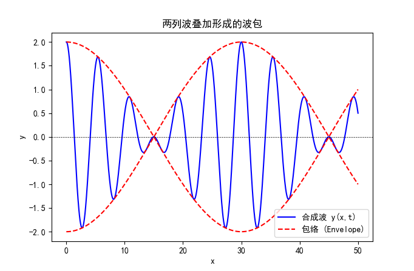
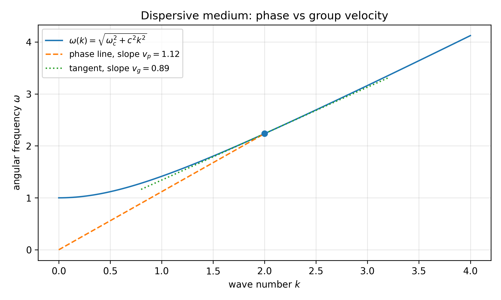

## 简谐波（Harmonic Waves）

「简谐波」指在空间与时间上呈正弦（或余弦）形式的波，是线性波动中最基本的解．
它既是理解波动方程、波速、相速度/群速度、干涉衍射等现象的基石，也是把一般波形分解为频率分量（傅里叶分析）的核心对象．

## 0. 什么是波动

波动是自然界中一种普遍存在的现象，它描述了某种扰动在空间和时间上的传播．我们在日常生活中可以观察到许多波动的例子：

-   **水波**：当一颗石子投入平静的湖面时，水面会出现一圈圈向外扩散的波纹，这就是水波．
-   **声波**：我们通过空气中的声波听到声音．声波是由物体振动引起的空气分子密度的周期性变化．
-   **光波**：太阳光穿过窗户照亮房间，光波是一种电磁波，它不需要介质也能传播．
-   **地震波**：地震发生时，地壳的震动会以波的形式传播，形成地震波．

波动的本质是能量的传播，而不是物质的移动．例如，当水波传播时，水分子只是围绕其平衡位置做上下或前后的振动，而不是随着波一起移动．

波动可以分为两大类：

1.  **机械波**：需要介质传播的波，例如水波、声波和地震波．机械波的传播依赖于介质中粒子的相互作用．
2.  **电磁波**：不需要介质也能传播的波，例如光波、无线电波和 X 射线．电磁波是由电场和磁场相互作用形成的．

波动的基本特性包括：

-   **振幅**：描述波动的强度．
-   **波长**：相邻两个波峰或波谷之间的距离．
-   **频率**：每秒内波动完成的周期数．
-   **波速**：波在介质中传播的速度．

通过研究波动，我们能够理解许多自然现象的规律，例如声音的传播、光的折射与干涉、地震的成因等．波动也是现代科技的基础，例如无线通信、激光技术和医学成像等领域都依赖于对波动的深入理解．

## 1. 一维简谐行波的表达式

沿 $x$ 轴传播的简谐行波可写为

$$
y(x,t)=A\cos(\omega t - kx+\varphi).
$$

-   $A$：振幅
-   $k$：波数
-   $\omega$：角频率
-   $\varphi$：初相位

波长与周期：

$$
\lambda=\dfrac{2\pi}{k},\quad T=\dfrac{2\pi}{\omega},\quad f=\dfrac{1}{T}.
$$

我们可以用 **相位传输法** 来理解这个简谐波的方程．对于一个从原点开始上下振动的波源，其振动表达式为 $y(0,t)=A\cos(\omega t+\varphi)$．当波源在时间 $t$ 处于某一相位时，距离波源 $x$ 处的点需要等到时间 $t+\frac{x}{v}$ 才能感受到这个相位的变化（其中 $v$ 是波速）．因此，距离 $x$ 处的点的振动可以表示为：

$$
y(x,t) = A\cos\left(\omega \left(t - \dfrac{x}{v}\right) + \varphi\right)
$$

令 $k=\frac{\omega}{v}$，则得到简谐波的标准形式：

$$
y(x,t)=A\cos(\omega t - kx+\varphi)
$$

更一般地，如果这个波源位于 $x=x_0$，则振动表达式为

$$
y(x,t) = A\cos\left(\omega t - k(x-x_0) + \varphi\right)
$$

**相速度（phase velocity）**：保持相位 $\omega t-kx+\varphi=\text{常数}$，得

$$
 v_p=\dfrac{dx}{dt}=\dfrac{\omega}{k}.
$$

若改为 $kx+\omega t$，则表示向 $-x$ 传播．

??? note "相位的理解"
    相位相同意味着「波形上相同位置」（如同一个波峰）．相速度描述波形特征点移动的速度，不一定等于能量或信息传递速度（色散介质中尤为重要）．

## 2. 由波动方程得到简谐波

一维无耗散波动方程（波速 $v$）

$$
\dfrac{\partial^2 y}{\partial t^2}=v^2\dfrac{\partial^2 y}{\partial x^2}.
$$

代入试探解 $y=A\cos(kx-\omega t)$：

$$
\dfrac{\partial^2 y}{\partial t^2}=-\omega^2 A\cos(kx-\omega t),\quad
\dfrac{\partial^2 y}{\partial x^2}=-k^2 A\cos(kx-\omega t).
$$

满足方程需要

$$
\omega^2=v^2k^2\quad\Rightarrow\quad \omega=vk.
$$

因此

$$
 v_p=\dfrac{\omega}{k}=v.
$$

**结论**：在「无色散」的理想介质中，相速度等于波动方程中的波速 $v$．

## 3. 叠加与相位差：干涉的最小模型

两列同频同方向简谐波叠加：

$$
\begin{aligned}
 y_1 &= A\cos(kx-\omega t),\\
 y_2 &= A\cos(kx-\omega t+\Delta\varphi).
\end{aligned}
$$

则

$$
 y=y_1+y_2=2A\cos\left(\dfrac{\Delta\varphi}{2}\right)\cos\left(kx-\omega t+\dfrac{\Delta\varphi}{2}\right).
$$

合成振幅

$$
A_{\text{res}}=2A\left|\cos\left(\dfrac{\Delta\varphi}{2}\right)\right|.
$$

若相位差来自程差 $\Delta x$：$\Delta\varphi=k\Delta x=\frac{2\pi}{\lambda}\Delta x$．

-   增强干涉：$\Delta\varphi=2m\pi \Leftrightarrow \Delta x=m\lambda$
-   相消干涉：$\Delta\varphi=(2m+1)\pi \Leftrightarrow \Delta x=(m+\tfrac12)\lambda$

## 4. 驻波（Standing Waves）

两列同频同振幅、相向传播的行波叠加：

$$
\begin{aligned}
 y_1&=A\cos(kx-\omega t),\\
 y_2&=A\cos(kx+\omega t).
\end{aligned}
$$

相加得到

$$
 y=2A\cos(kx)\cos(\omega t).
$$

这就是驻波：

-   空间因子：$2A\cos(kx)$ 决定各点振幅
-   时间因子：$\cos(\omega t)$ 表示各点同频振动

### 4.1 波节与波腹

-   波节（node）：$\cos(kx)=0 \Rightarrow kx=(m+\tfrac12)\pi$

$$
 x=\left(m+\frac12\right)\dfrac{\lambda}{2}
$$

-   波腹（antinode）：$|\cos(kx)|=1 \Rightarrow kx=m\pi$

$$
 x=m\dfrac{\lambda}{2}.
$$

### 4.2 弦的固有频率（两端固定）

长度 $L$ 的弦两端固定：$y(0,t)=y(L,t)=0$．
驻波形式 $y=2A\sin(kx)\cos(\omega t)$（换用 $\sin$ 更满足边界），则

$$
\sin(kL)=0\Rightarrow k_n=\dfrac{n\pi}{L},\quad n=1,2,3,\dots
$$

频率

$$
 f_n=\dfrac{\omega_n}{2\pi}=\dfrac{v k_n}{2\pi}=\dfrac{nv}{2L}.
$$

其中弦波速 $v=\sqrt{T/\mu}$（张力 $T$、线密度 $\mu$），推导见 [连续介质中的波](wave-in-continuous-medium.md)．

### 4.3 半波损失与驻波的产生

当波在介质界面反射时，可能会发生 **半波损失**（相位变化 $\pi$）．

-   固定端反射：发生半波损失

我们可以把固定端看作一个波节，反射波相对于入射波相位差 $\pi$，即 $y_2=-y_1=A\cos(kx+\omega t+\pi)=-A\cos(kx+\omega t)$．

-   自由端反射：不发生半波损失

我们可以把自由端看作一个波腹，反射波与入射波同相位．$y_2 = y_1 = A\cos(kx+\omega t)$．

接下来我们通过一个例题来更好地理解半波损失．

??? note "例题"
    一列入射波沿弦向 $+x$ 方向传播，
    
    $$
    y_i(x,t)=A\cos(kx-\omega t).  
    $$
    
    弦在 $x=0$ 处固定．求反射波 $y_r(x,t)$，并写出叠加后的波形，指出 $x=0$ 处为何一定是波节．
    
    \*\* 解：\*\* 固定端边界条件为 $y(0,t)=0$，即
    
    $$
    y_i(0,t)+y_r(0,t)=0\quad\forall t.  
    $$
    
    设反射波形如
    
    $$
    y_r(x,t)=A\cos(kx+\omega t+\phi).  
    $$
    
    代入 $x=0$：$A\cos(-\omega t)+A\cos(\omega t+\phi)=0$ 对任意 $t$ 成立，需有 $\phi=\pi$，因此
    
    $$
    \boxed{\ y_r(x,t)=A\cos(kx+\omega t+\pi)=-A\cos(kx+\omega t)\ }.  
    $$
    
    总波为
    
    $$
    y=y_i+y_r=A\cos(kx-\omega t)-A\cos(kx+\omega t)=2A\sin(kx)\sin(\omega t).  
    $$
    
    可见 $x=0$ 处 $\sin(kx)=0$ 恒成立，故该端点为波节；这对应「固定端反射发生半波损失（相位反转 $\pi$）」．

### 5. 色散与群速度

#### 5.0 为什么需要群速度？——相速度的局限

首先，我们熟知的 **相速度**  $v_p=\frac{\omega}{k}$ 描述的是一个 **无限长、单一频率** 的简谐波（也叫单色波）的波峰/波谷在空间中移动的速度．它回答的问题是：「这个特定相位的点跑得多快？」

但是，**现实中几乎不存在完美的单色波**．信息（如一个脉冲、一段声音、一个光信号）总是由 **许多不同频率的简谐波叠加** 而成，形成一个 **波包**．在能传递信号的波包中，不同频率的波可能以略微不同的相速度传播，这会导致波包在传播过程中形状发生改变．

这时就产生了一个关键问题：**这个承载着能量的「波包」整体，其运动速度是多少？** 这个速度就是 **群速度**，它是波包中心或包络线的传播速度，通常也是能量和信息的传播速度．

#### 5.1 从两个波的叠加开始理解

为了最简单直观地理解波包和群速度，我们从「构建」一个最简单的波包开始：**把两个频率和波数都非常接近的简谐波叠加起来**．

设这两列波为：

$$
\begin{aligned}
y_1 &= A \cos(k_1 x - \omega_1 t), \\
y_2 &= A \cos(k_2 x - \omega_2 t).
\end{aligned}
$$

其中，$k_1 \approx k_2$，$\omega_1 \approx \omega_2$．

**第一步：叠加** 利用三角函数和差化积公式：$\cos\alpha+\cos\beta=2\cos\left(\frac{\alpha-\beta}{2}\right)\cos\left(\frac{\alpha+\beta}{2}\right)$．
令 $\alpha=k_1x-\omega_1t$，$\beta=k_2x-\omega_2t$，则：

$$
\begin{aligned}
y = y_1 + y_2 &= 2A \cos\left( \dfrac{(k_1 - k_2)x - (\omega_1 - \omega_2)t}{2} \right) \cdot \cos\left( \dfrac{(k_1 + k_2)x - (\omega_1 + \omega_2)t}{2} \right)
\end{aligned}
$$

**第二步：引入「平均量」和「差量」概念** 为了使式子更清晰，我们定义：

-   **平均波数** 和 **平均频率**：$\bar{k}=\frac{k_1+k_2}{2}$，$\bar{\omega}=\frac{\omega_1+\omega_2}{2}$
-   **波数差** 和 **频率差**：$\Delta k = k_1 - k_2$，$\Delta \omega = \omega_1 - \omega_2$（注意 $\Delta k$ 和 $\Delta \omega$ 都很小）

代入上式，得到：

$$
\boxed{y(x,t) = \underbrace{2A \cos\left( \dfrac{\Delta k}{2} x - \dfrac{\Delta \omega}{2} t \right)}_{\text{缓慢变化的包络}} \cdot \underbrace{\cos\left( \bar{k} x - \bar{\omega} t \right)}_{\text{快速振荡的载波}} }
$$

**第三步：解读这个结果——拍（Beat）** 这个结果描绘了一个非常经典的物理图像：**拍**．

1.  **载波**：高频部分 $\cos(\bar{k}x - \bar{\omega}t)$．它的波数约为 $\bar{k}$，频率约为 $\bar{\omega}$，以 **平均相速度**  $v_p = \bar{\omega} / \bar{k}$ 传播．
2.  **包络**：低频部分 $2A \cos\left( \frac{\Delta k}{2} x - \frac{\Delta \omega}{2} t \right)$．它像一个缓慢变化的振幅调制，形状像一条平滑的曲线，将载波「包裹」在里面．这个包络线就代表了我们直观看到的「波包」．

下图清晰地展示了两列波叠加形成波包，以及包络（虚线）与载波（实线）的关系：

*图中实线代表合成波 y(x,t)，虚线代表其包络．包络的移动速度即为群速度．*

**第四步：求解包络的传播速度（群速度）** 包络线是一个波动本身：$E(x,t) = 2A \cos\left( \frac{\Delta k}{2} x - \frac{\Delta \omega}{2} t \right)$．
要跟踪包络线上任何一个特定点（比如一个峰值）的移动，就需要该点的 **相位保持恒定**．

设包络的相位为常数：$\frac{\Delta k}{2} x - \frac{\Delta \omega}{2} t = \text{常数}$．

对这个方程两边关于时间 $t$ 求导（注意 $x$ 是 $t$ 的函数，因为我们跟踪的是那个固定的相位点）：

$$
\dfrac{\Delta k}{2} \cdot \dfrac{dx}{dt} - \dfrac{\Delta \omega}{2} = 0
$$

$$
\Rightarrow \dfrac{dx}{dt} = \dfrac{\Delta \omega}{\Delta k}
$$

这个 $dx/dt$ 就是包络峰值的移动速度，即 **包络速度**．

**第五步：从「两个波」推广到「连续多个波」——群速度的定义** 我们刚才用的是两个频率分量的特殊波包．现实中的波包包含无数个频率连续分布的成分．
当 $\Delta k \to 0$ 时，两个波数无限接近，上述的包络速度公式就变成了导数形式：

$$
v_g = \lim_{\Delta k \to 0} \dfrac{\Delta \omega}{\Delta k} = \boxed{\dfrac{d\omega}{dk}}
$$

??? note "图例"
    
    
    图中虚线过原点的割线斜率为相速度 $v_p=\omega/k$；切线斜率为群速度 $v_g=d\omega/dk$．

这就是 **群速度** 的通用定义．它依赖于介质的一个基本属性——色散关系 $\omega(k)$．

#### **5.2 核心对比与物理意义总结**

| 特性        | 相速度 $v_p$                 | 群速度 $v_g$                   |
| :-------- | :------------------------ | :-------------------------- |
| **定义**    | $v_p = \dfrac{\omega}{k}$ | $v_g = \dfrac{d\omega}{dk}$ |
| **描述对象**  | 单色简谐波的 **等相位面** 的移动速度     | 波包 \*\* 包络（整体形状）\*\* 的移动速度  |
| **物理角色**  | 纯单色波的传播速度（不传递信息）          | **能量与信息** 的传播速度             |
| **与色散关系** | 由色散关系直接给出                 | 是色散关系的导数                    |

**比喻**：
想象一场游行．**相速度** 好比队列中每个成员 **原地踏步** 时，手臂上下挥动的波峰传递的速度（很快）．**群速度** 好比整个游行 **方阵** 沿着大街向前行进的 **整体速度**（较慢）．你看游行队伍时，首先注意到的是方阵整体的移动（群速度），而不是每个人手臂的挥动（相速度）．

#### **5.3 与色散的关系**

-   **无色散介质**：$\omega$ 与 $k$ 成正比，即 $\omega = c k$（如真空中的电磁波）．此时 $v_p = c$，且 $v_g = d\omega/dk = c$．相速度等于群速度，波包在传播中 **不会变形**．
-   **有色散介质**：$\omega(k)$ 不是简单的正比关系（如光在玻璃中，水波在深水中）．此时 $v_p \neq v_g$．波包在传播过程中 **会逐渐扩散、变形**，因为其中不同频率的成分「跑」得不一样快．

## 6. 简谐波的能量

### 6.1 质元的能量

波传播时，介质质元在振动，具有动能与势能．以弦波为例，弦上质元密度 $\rho$，取一体积为 $\Delta V$ 的质元，质元质量 $m=\rho \Delta V$．

设该质元的振动表达式为

$$
y=A\cos(\omega t - kx),
$$

则质元速度

$$
v_y=\dfrac{\partial y}{\partial t}=-\omega A\sin(\omega t - kx)
$$

接下来我们证明质元的动能和势能具有相同的形式．

??? note "证明过程"
    质元的动能为：
    
    $$
    \Delta E_k = \dfrac{1}{2} m v_y^2 = \dfrac{1}{2} \rho \Delta V \omega^2 A^2 \sin^2(\omega t - kx).  
    $$
    
    接下来计算质元的势能．考虑弦波中长度为 $\Delta x$ 的一小段弦，其原长为 $\Delta x$．当波传播时，该弦段发生形变，长度变为 $\Delta s$．弦的张力为 $T$，且在小振动下视为常量．势能等于张力乘以伸长量，即
    
    $$
    \Delta E_p = T (\Delta s - \Delta x).  
    $$
    
    计算伸长量 $\Delta s - \Delta x$．弦段两端点的横向位移分别为 $y(x,t)$ 和 $y(x+\Delta x, t)$，纵向位移忽略不计（横波）．弦段长度近似为
    
    $$
    \Delta s = \sqrt{(\Delta x)^2 + (\Delta y)^2} \approx \Delta x \left[ 1 + \dfrac{1}{2}\left( \dfrac{\partial y}{\partial x} \right)^2 \right],  
    $$
    
    其中 $\Delta y = y(x+\Delta x,t) - y(x,t) \approx \frac{\partial y}{\partial x} \Delta x$．因此，
    
    $$
    \Delta s - \Delta x \approx \dfrac{1}{2} \left( \dfrac{\partial y}{\partial x} \right)^2 \Delta x.  
    $$
    
    代入势能表达式得
    
    $$
    \Delta E_p \approx \dfrac{1}{2} T \left( \dfrac{\partial y}{\partial x} \right)^2 \Delta x.  
    $$
    
    对于给定的波函数 $y = A \cos(\omega t - kx)$，求偏导得
    
    $$
    \dfrac{\partial y}{\partial x} = -k A \sin(\omega t - kx),  
    $$
    
    所以
    
    $$
    \left( \dfrac{\partial y}{\partial x} \right)^2 = k^2 A^2 \sin^2(\omega t - kx).  
    $$
    
    弦上横波的波速 $v$ 满足 $v = \sqrt{T / \rho}$，其中 $\rho$ 为弦的体密度（若弦的横截面积为 $S$，则线密度 $\mu = \rho S$，波速也可表示为 $v = \sqrt{T / \mu}$）．因此 $T = \rho v^2$．另外，波数 $k$ 与角频率 $\omega$ 满足 $\omega = v k$，即 $v = \omega / k$．
    
    将 $T$ 和 $\left( \frac{\partial y}{\partial x} \right)^2$ 代入 $\Delta E_p$：
    
    $$
    \Delta E_p = \dfrac{1}{2} \rho v^2 \cdot k^2 A^2 \sin^2(\omega t - kx) \Delta x = \dfrac{1}{2} \rho \dfrac{\omega^2}{k^2} \cdot k^2 A^2 \sin^2(\omega t - kx) \Delta x = \dfrac{1}{2} \rho \omega^2 A^2 \sin^2(\omega t - kx) \Delta x.  
    $$
    
    注意到质元的体积 $\Delta V = S \Delta x$，其中 $S$ 为弦的横截面积．代入上式得
    
    $$
    \Delta E_p = \dfrac{1}{2} \rho \omega^2 A^2 \sin^2(\omega t - kx) \Delta V.  
    $$
    
    这与动能表达式 $\Delta E_k = \frac{1}{2} \rho \Delta V \omega^2 A^2 \sin^2(\omega t - kx)$ 形式完全相同．因此，质元的动能和势能具有相同的形式，且同步变化．
    
    证明完毕．

我们发现，对于单个质元，$\Delta E_k + \Delta E_p \ne \text{const}$，这是因为波在传播过程中，能量在不同质元之间传递．所以对于整个振动系统，机械能依然是守恒的．

### 6.2 能量密度与能流

单位体积中波的能量称为 **能量密度**  $w$：

$$
w=w_k+w_p=\dfrac{\Delta E_k+\Delta E_p}{\Delta V}=\rho \omega^2 A^2 \sin^2(\omega t - kx)
$$

时间平均能量密度：

$$
\langle w \rangle = \dfrac{1}{T}\int_0^T w \, dt = \dfrac{1}{T} \int_0^T \rho \omega^2 A^2 \sin^2(\omega t - kx) \, dt = \dfrac{1}{2} \rho \omega^2 A^2
$$

单位时间通过垂直于波传播方向某一面积的能量称为通过该面积的 **能流**  $P$（单位为瓦特，$W$）：

$$
P=w v_p S=\rho \omega^2 A^2 v \sin^2(\omega t - kx) S
$$

时间平均能流：

$$
\langle P \rangle = \dfrac{1}{T} \int_0^T P \, dt = \dfrac{1}{T} \int_0^T \rho \omega^2 A^2 v \sin^2(\omega t - kx) S \, dt = \dfrac{1}{2} \rho \omega^2 A^2 v S
$$

把平均能流除以面积 $S$，得到 **能流密度**  $I$，也把它称为波的 **强度**：

$$
I=\dfrac{\langle P \rangle}{S}=\dfrac{1}{2} \rho \omega^2 A^2 v_p
$$

### 6.3

如果波不被介质吸收，那么在单位时间内穿过任意波面的能量是相等的，于是我们有：

$$
I_1 S_1 = I_2 S_2
$$

-   平面波：$S_1=S_2$，则 $I_1=I_2$，强度不变．$A = \text{const}$
-   球面波：$S=4\pi r^2$，则 $I \propto \frac{1}{r^2}$，强度与距离平方成反比．$A \propto \frac{1}{r}$
-   柱面波：$S=2\pi r h$，则 $I \propto \frac{1}{r}$，强度与距离成反比．$A \propto \frac{1}{\sqrt{r}}$

## 7. 能量与强度（不同介质形式略有差异）

对具体介质（弦、声波、电磁波），能量密度与能流表达不同，但共同点是：

-   强度 $I$ 往往与振幅平方成正比：$I\propto A^2$．
-   线性无耗散下，时间平均能流与群速度相关（进阶结论）．

声波与弦波的能量推导可在 [连续介质中的波](wave-in-continuous-medium.md) 中找到．
