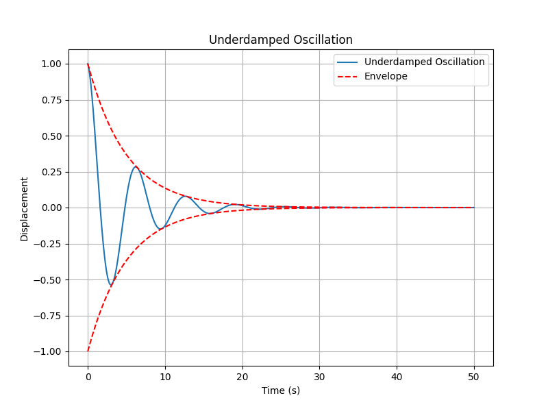
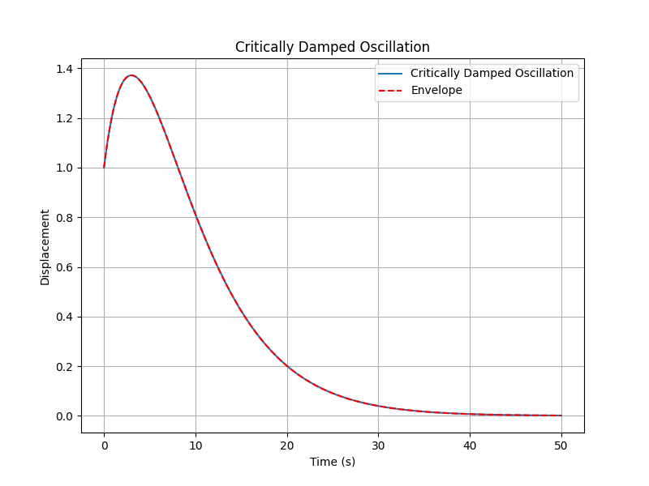
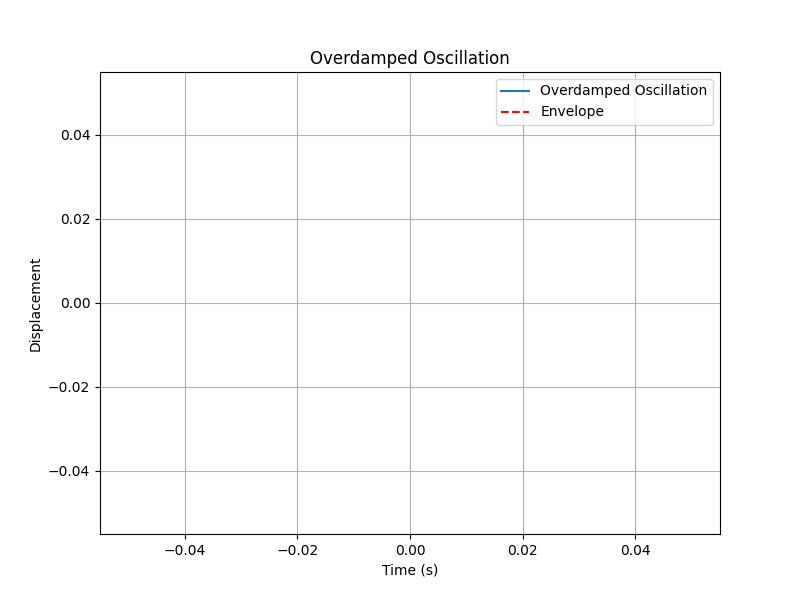

author: Leafuke, 匿名同学 

线性振动是物理学中一种重要的运动形式，广泛存在于各种物理系统中。它通常指系统在平衡位置附近的小幅度振动，其运动方程可以用线性微分方程描述。

## 简单谐振动

如果某一物量在平衡点附近往复振动，且随时间的变化是余弦（或正弦）的函数形式，我们就把这种振动称为简谐振动。

### 运动方程推导

简单谐振动是最基本的线性振动形式，其运动方程为：

$$
\frac{d^2x}{dt^2} + \omega^2 x = 0
$$

这一方程可以通过牛顿第二定律推导得到。例如，对于一个质量为 $m$ 的物体，受到的回复力 $F$ 满足胡克定律：

$$
F = -kx
$$

根据牛顿第二定律：

$$
F = m\frac{d^2x}{dt^2}
$$

代入回复力表达式：

$$
m\frac{d^2x}{dt^2} = -kx
$$

整理得：

$$
\frac{d^2x}{dt^2} + \frac{k}{m}x = 0
$$

令 $\omega = \sqrt{\frac{k}{m}}$，即得简单谐振动的运动方程。

### 解的形式

该方程的通解为：

$$
x(t) = A \cos(\omega t + \phi)
$$

其中：
- $A$ 为振幅，振子离开平衡位置的最大位移的绝对值，由初始条件决定。是求解上述微分方程时引入的常量；
- $\phi$ 为初相位，初始时刻振子的相位，由初始条件决定。是求解上述微分方程时引入的常量；
- $\omega$ 为角频率（圆频率），在简谐振动的几何表示中，表示旋转矢量的角速度；
- $x$ 为位移，表示振子相对于平衡位置的偏移量。

??? note "例1"
    设一个质量为 $m$ 的物体连接在弹簧上，弹簧劲度系数为 $k$。求该系统的角频率 $\omega$ 及其运动方程。
    
    **解：**
    易得运动方程为：

    $$
    \frac{d^2x}{dt^2} + \frac{k}{m}x = 0
    $$
    
    角频率：
    
    $$
    \omega = \sqrt{\frac{k}{m}}
    $$
    
    因此，运动方程为：
    
    $$
    x(t) = A \cos\left(\sqrt{\frac{k}{m}}t + \phi\right)
    $$
    
    其中 $A$ 和 $\phi$ 由初始条件决定。

??? note "例2"
    设一个质量为 $m$ 的物体连接在摆绳上，摆长为 $l$。求该单摆系统的角频率 $\omega$ 及其运动方程。
    
    **解：**

    $$
    M = -mgl\sin\theta = I\beta = ml^2 \frac{d^2\theta}{dt^2}
    $$

    对于小角度摆动， $$ \sin\theta \approx \theta $$，单摆的运动方程为：

    $$
    \frac{d^2\theta}{dt^2} + \frac{g}{l}\theta = 0
    $$

    角频率：

    $$
    \omega = \sqrt{\frac{g}{l}}
    $$

    因此，运动方程为：

    $$
    \theta(t) = A \cos\left(\sqrt{\frac{g}{l}}t + \phi\right)
    $$

    其中 $A$ 和 $\phi$ 由初始条件决定。

??? warning "小角度近似"
    在单摆的例子中，我们使用了小角度近似 $$ \sin\theta \approx \theta $$。这一近似仅在摆动角度较小时成立（通常小于约 10 度）。对于较大的摆动角度，运动方程将变得非线性，不能再用简单谐振动的形式描述。

??? warning "简谐振动的判断"
    并非所有往复振动都是简谐振动。简谐振动要求回复力与位移成正比且方向相反，即满足**胡克定律的形式**。对于非线性系统或大幅度振动，运动方程可能不再是线性的，不能用简谐振动的形式描述。我们往往也可以通过得到相应的**特征微分方程**来判断振动是否为简谐振动。

### 周期与频率

振动的周期 $T$ 和频率 $f$ 分别为：

$$
T = \frac{2\pi}{\omega}, \quad f = \frac{1}{T} = \frac{\omega}{2\pi}.
$$

### 相位
振动的相位 $\theta$ 定义为：

$$
\theta = \omega t + \phi.
$$

相位表示振动在某一时刻所处的位置状态。规定 $ 0 < \theta < 2\pi $。

对于两个同频简谐振动，其相位差 $\Delta \theta$ 为：

$$
\Delta \theta = \theta_1 - \theta_2 = \phi_1 - \phi_2.
$$

若 $\Delta \theta = 0$，则两振动**同相**，若 $\Delta \theta = \pi$，则两振动**反相**。
若 $0 < \Delta \theta < \pi$，则称 $ x_1 $ 比 $ x_2 $ **超前**，若 $\pi < \Delta \theta < 2\pi$，则则称 $ x_1 $ 比 $ x_2 $ **落后**。

#### x, v, a 三者的相位关系

$$
x(t) = A \cos(\omega t + \phi)
$$

$$
v(t) = -A\omega \cos(\omega t + \phi + \frac{\pi}{2}) = A\omega \sin(\omega t + \phi)
$$

$$
a(t) = -A\omega^2 \cos(\omega t + \phi + \pi) = -A\omega^2 \cos(\omega t + \phi)
$$

由此可见，速度 $v$ 比位移 $x$ 超前 $\frac{\pi}{2}$，加速度 $a$ 与位移 $x$ 反相。你可以想想为什么会有这样的相位关系。

## 能量分析

### 动能与势能

简单谐振动的能量包括动能和势能，其表达式分别为：

- 动能：

$$
E_k = \frac{1}{2}mv^2 = \frac{1}{2}m\omega^2A^2\sin^2(\omega t + \phi)
$$

在一个周期内的平均值：

$$
\overline{E_k} = \frac{1}{T}\int_0^T E_k dt = \frac{1}{4}kA^2
$$

- 势能：

$$
E_p = \frac{1}{2}kx^2 = \frac{1}{2}kA^2\cos^2(\omega t + \phi)
$$

在一个周期内的平均值：

$$
\overline{E_p} = \frac{1}{T}\int_0^T E_p dt = \frac{1}{4}kA^2
$$

### 总能量守恒

总能量为动能与势能之和：

$$
E = E_k + E_p = \frac{1}{2}kA^2 = \frac{1}{2}m\omega^2A^2
$$

总能量在振动过程中保持不变，动能和势能在振动过程中相互转化。

### 简谐振动的几何表示

简谐振动可以通过旋转矢量的投影来几何表示。设一个长度为 $A$ 的旋转矢量以角速度 $\omega$ 绕原点逆时针旋转，其在水平轴上的投影即为简谐振动的位移 $x(t)$：

## 简正模

在多自由度系统中，线性振动可以分解为若干个独立的简正模（Normal Modes）。每个简正模对应一个特定的频率和振动模式，系统的总振动可以看作这些简正模的叠加。

### 用复数表示简谐振动
简谐振动

$$
x(t) = A \cos(\omega t + \varphi)
$$

也可以用复数的实部和虚部表示：

$$
\widetilde{x}(t)=Ae^{i(\omega t+\varphi)}\
$$

其中，$A$ 为振幅，$\omega$ 为角频率，$\varphi$ 为初相位。

上式的右端又可以写为 $ (Ae^{i\varphi})e^{i\omega t}=\widetilde{A}e^{i\omega t} $，其中 $Ae^{i\varphi}=\widetilde{A}$  是一个复常数，表示振动的初始状态，称为**复振幅**。

$$
\widetilde{x}(t)=\widetilde{A}e^{i\omega t}
$$

如果我们取上式的实部，就得到了简谐振动的标准形式：

$$
x(t)=\mathrm{Re}(\widetilde{x}(t))=\mathrm{Re}(\widetilde{A}e^{i\omega t})=A\cos(\omega t+\varphi)
$$

用 $ \widetilde{x}(t) $ 表示简谐振动，则速度和加速度为

$$
\begin{cases}
\widetilde{v}(t)=\frac{d\widetilde{x}(t)}{dt}=i\omega \widetilde{A}e^{i\omega t}=i\omega \widetilde{x}(t)\\
\widetilde{a}(t)=\frac{d\widetilde{v}(t)}{dt}=\frac{d^2\widetilde{x}(t)}{dt^2}=-\omega^2 \widetilde{A}e^{i\omega t}=-\omega^2 \widetilde{x}(t)
\end{cases}
$$

??? note "例题"
    已知一个线性三原子分子 $A_2B$ 的模型。假定相邻原子之间的结合力是弹性力，它们正比于原子的间距，求分子可能的纵向运动形式和相应的振动角频率。

## 阻尼振动

### 运动方程

当系统受到阻尼力作用时，振动会逐渐衰减，其运动方程为：

$$
\frac{d^2x}{dt^2} + 2\beta \frac{dx}{dt} + \omega^2 x = 0
$$

其中 $\beta$ 为阻尼系数，描述阻尼的强弱。

### 解的形式

根据阻尼的大小，解的形式不同：

1. **欠阻尼振动**（$\beta < \omega$）:

$$
x(t) = A e^{-\beta t} \cos(\omega_d t + \phi)
$$

其中 $\omega_d = \sqrt{\omega^2 - \beta^2}$ 为阻尼振动的角频率。

??? note "图例"
    

2. **临界阻尼**（$\beta = \omega$）:

$$
x(t) = (C_1 + C_2 t)e^{-\beta t}
$$

??? note "图例"
    

3. **过阻尼**（$\beta > \omega$）:

$$
x(t) = C_1 e^{r_1 t} + C_2 e^{r_2 t}
$$

其中 $r_1$ 和 $r_2$ 为两个负实根。

??? note "图例"
    

### 能量衰减

欠阻尼振动中，系统的总能量随时间指数衰减：

$$
E(t) = E_0 e^{-2\beta t}
$$

## 强迫振动

### 运动方程

当系统受到周期性外力作用时，其运动方程为：

$$
\frac{d^2x}{dt^2} + 2\beta \frac{dx}{dt} + \omega^2 x = F_0 \cos(\Omega t)
$$

其中：
- $F_0$ 为外力的振幅；
- $\Omega$ 为外力的角频率。

### 稳态解

稳态解为：

$$
x(t) = A \cos(\Omega t - \delta)
$$

其中：
- $A = \frac{F_0}{\sqrt{(\omega^2 - \Omega^2)^2 + (2\beta\Omega)^2}}$ 为稳态振幅；
- $\delta = \arctan\left(\frac{2\beta\Omega}{\omega^2 - \Omega^2}\right)$ 为相位差。

### 共振现象

当驱动力频率接近系统的固有频率时，即 $\Omega \approx \omega$，系统的振幅达到最大值，称为**共振**。

共振条件下的振幅为：

$$
A_{\text{res}} = \frac{F_0}{2\beta\omega}
$$

## 应用

线性振动在工程、物理和日常生活中有广泛的应用，例如：

- 钟摆的运动：简单谐振动的经典例子；
- 弹簧-质量系统：描述机械振动；
- 电路中的交流电振荡：电感-电容回路的振荡；
- 建筑物的抗震设计：利用阻尼减小振幅。