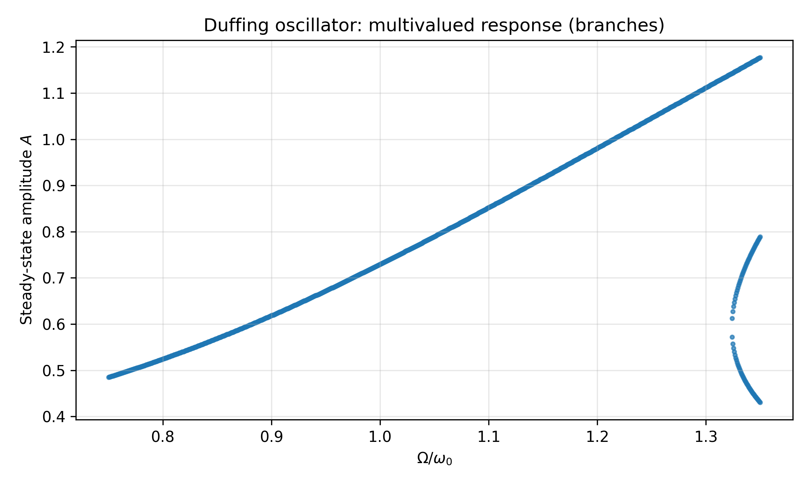

??? warning "注意"
    非线性振动对大一学生的要求不高，可以直接跳到本章节的 **自激振动** 部分，了解基本概念即可。

## 非线性振动（Nonlinear Oscillations）

线性振动理论（如简谐振动、线性阻尼、线性受迫）建立在“**力与位移（或速度）成正比**”的近似上。
当振幅不再很小、恢复力/阻尼出现高次项、或系统存在几何/材料非线性时，系统方程常变为非线性微分方程：

$$
\ddot x+F(x,\dot x,t)=0\quad\text{或}\quad \ddot x+F(x,\dot x,t)=\text{外驱动}.
$$

非线性会带来：

-   频率随振幅变化（非等时性）
-   多稳态与跳跃现象
-   自激振动与极限环
-   倍周期分岔与混沌（进阶）

本页给出竞赛/入门学习中最常见的几类模型与关键推导。

??? warning "注意"
    非线性系统一般不满足叠加原理；频域分析与相量法很多时候需要谨慎使用。

## 1. 非线性恢复力：从势能展开看起

若平衡点附近势能可展开为

$$
U(x)=U(0)+\frac12kx^2+\frac13\alpha x^3+\frac14\beta x^4+\cdots
$$

则恢复力

$$
F=-\dfrac{dU}{dx}=-kx-\alpha x^2-\beta x^3-\cdots
$$

代入牛顿第二定律：

$$
 m\ddot x+kx+\alpha x^2+\beta x^3+\cdots=0.
$$

在很多场景中，最低阶非线性项就足以描述主要效应。

## 2. Duffing 振子（最经典的非线性模型）

Duffing 方程（含三次非线性）

$$
\ddot x+2\gamma\dot x+\omega_0^2 x+\varepsilon x^3=\dfrac{F_0}{m}\cos(\Omega t).
$$

-   $\varepsilon>0$：**硬化弹簧**（振幅越大，等效刚度越大，频率上移）。
-   $\varepsilon<0$：**软化弹簧**（频率下移）。

下面给出一个常用的近似推导：在弱阻尼、弱非线性、近共振时，求稳态近似振幅 - 频率关系。

### 2.1 谐波平衡法（只保留基频）

假设稳态近似为

$$
 x(t)\approx A\cos(\Omega t-\delta).
$$

则

$$
 x^3=A^3\cos^3(\Omega t-\delta)=\dfrac{A^3}{4}\left[3\cos(\Omega t-\delta)+\cos(3\Omega t-3\delta)\right].
$$

若系统响应主要集中在驱动频率 $\Omega$，忽略 $3\Omega$ 的高次谐波项，得到

$$
 x^3\approx \dfrac{3A^3}{4}\cos(\Omega t-\delta).
$$

代回方程，把同频项系数匹配（将 $\cos(\Omega t-\delta)$ 和 $\sin(\Omega t-\delta)$ 分离），可得幅相关系：

$$
\left[\left(\omega_0^2+\dfrac{3\varepsilon}{4}A^2-\Omega^2\right)^2+(2\gamma\Omega)^2\right]A^2=\left(\dfrac{F_0}{m}\right)^2.
$$

??? note "图例"
    
    
    上图用数值方式解出了上式在不同 $\Omega$ 下可能的稳态振幅分支（硬化型 $\varepsilon>0$ 示意）。在某些频段会出现多值，物理上对应跳跃/滞回现象。

这是 Duffing 振子最重要的结论之一：**共振曲线会因非线性而弯折，并可能出现多值与跳跃**。

??? note "理解"
    线性受迫振动中，稳态振幅
    
    $$
    A=\dfrac{F_0/m}{\sqrt{(\omega_0^2-\Omega^2)^2+(2\gamma\Omega)^2}}  
    $$
    
    现在只需把 $\omega_0^2$ 替换为一个随 $A$ 变化的等效量 $\omega_0^2+\frac{3\varepsilon}{4}A^2$。

## 3. 非等时性：频率随振幅变化（无阻尼无驱动）

考虑无阻尼无驱动的 Duffing 自由振动：

$$
\ddot x+\omega_0^2 x+\varepsilon x^3=0.
$$

能量守恒：

$$
E=\frac12\dot x^2+\frac12\omega_0^2 x^2+\frac14\varepsilon x^4.
$$

若振幅为 $A$（转折点 $\dot x=0, x=A$），则

$$
E=\frac12\omega_0^2 A^2+\frac14\varepsilon A^4.
$$

周期可由积分给出（一般为椭圆积分）：

$$
T=4\int_0^A\dfrac{dx}{\sqrt{2(E-U(x))}}.
$$

在弱非线性 $|\varepsilon|A^2\ll\omega_0^2$ 下，可做近似得到频率修正（只给常用结果）：

$$
\omega(A)\approx \omega_0\left(1+\dfrac{3\varepsilon A^2}{8\omega_0^2}\right).
$$

-   $\varepsilon>0$：频率随振幅增大而增大。
-   $\varepsilon<0$：频率随振幅增大而减小。

## 4. Van der Pol 振子与自激振动（入门版）

Van der Pol 方程

$$
\ddot x-\mu(1-x^2)\dot x+\omega_0^2 x=0,\quad \mu>0.
$$

其阻尼项 $-\mu(1-x^2)\dot x$ 在 $|x|<1$ 时为“负阻尼”（能量注入），在 $|x|>1$ 时为正阻尼（能量耗散），导致系统趋向稳定的 **极限环**（自维持振动）。

### 4.1 能量观点（定性推导）

定义能量

$$
E=\frac12\dot x^2+\frac12\omega_0^2 x^2.
$$

对时间求导并代入方程：

$$
\dot E=\dot x(\ddot x+\omega_0^2 x)=\mu(1-x^2)\dot x^2.
$$

-   当 $|x|<1$，$\dot E>0$：能量增长，振幅变大。
-   当 $|x|>1$，$\dot E<0$：能量衰减，振幅变小。

因此存在一个稳定的振幅区间，系统最终进入稳定周期运动。

??? note "例题：Van der Pol 极限环振幅的量级估计（小 $\mu$）"
    对 Van der Pol 方程
    
    $$
    \ddot x-\mu(1-x^2)\dot x+\omega_0^2 x=0,\quad \mu>0,  
    $$
    
    在 $\mu\ll 1$ 情况下用能量平均法估计极限环振幅的量级（给出结论即可）。
    
    \*\* 解：\*\* 把系统视为“弱非线性振子 + 缓慢能量变化”。  
    近似取 $x\approx A\cos(\omega_0 t)$，则 $\dot x\approx -A\omega_0\sin(\omega_0 t)$。  
    能量满足
    
    $$
    \dot E=\mu(1-x^2)\dot x^2.  
    $$
    
    在一个周期内做平均（只保留到 $A^4$ 的量级）：
    
    $$
    \langle \dot E\rangle\propto \left\langle (1-A^2\cos^2\omega_0 t)\,A^2\omega_0^2\sin^2\omega_0 t\right\rangle  
    =A^2\omega_0^2\left(\frac12-\dfrac{A^2}{8}\right).  
    $$
    
    稳态极限环对应 $\langle \dot E\rangle=0$，因此
    
    $$
    \frac12-\dfrac{A^2}{8}=0\Rightarrow \boxed{A\approx 2}.  
    $$
    
    这说明：在弱非线性下，Van der Pol 振子的稳定振幅是一个与初始条件无关的常数量级（约为 2）。

## 5. 什么时候必须用非线性？（经验判断）

-   频率/周期随振幅明显变化。
-   受迫振动出现跳跃、滞回、多个稳态。
-   响应出现明显高次谐波（$2\Omega,3\Omega$ 等）。
-   系统出现自激振动（无需外驱动仍能稳定振荡）。

如果你的题目或实验现象包含以上特征，线性模型往往不够，需要引入非线性项。

## 6. 入门了解版

### 6.1 自激振动（Self-Excited Oscillations）

自激振动是指系统在没有外部周期性驱动的情况下，能够维持自身振荡的现象。自然界中的自激振动例子有：风吹树梢。生活中的例子有：钟摆时钟中的擒纵机构、小提琴的弓弦振动、自来水管的喘振。

#### 干摩擦引起的自激振动

干摩擦力通常与速度方向相反，大小近似恒定。当系统振幅较小时，摩擦力做正功，能量输入大于耗散，振幅增大；当振幅较大时，摩擦力做负功，能量耗散大于输入，振幅减小。最终系统达到一个稳定的振幅，实现自激振动。

想象一个传送带上放置一个物体，物体的一侧通过弹簧与墙相连，传送带以恒定速度运动。当物体与传送带之间存在干摩擦时，物体会在传送带上产生振动，这种振动就是由于干摩擦引起的自激振动。

#### 由机械控制的自激振动

钟表的擒纵机构就是一个典型的机械控制自激振动系统。摆锤通过擒纵轮与齿轮相连，摆锤的振动使得擒纵轮周期性地释放能量给齿轮，从而维持摆锤的振动。这种机制确保了钟表能够持续运行。
