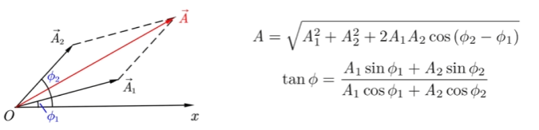
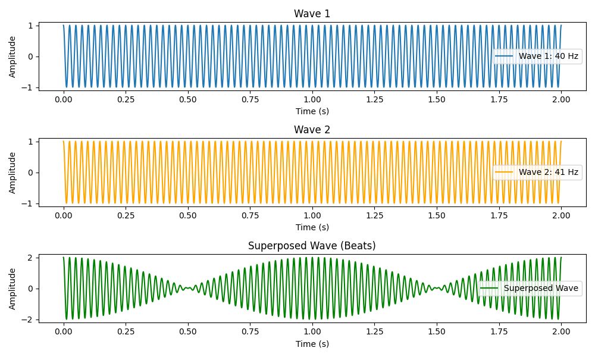
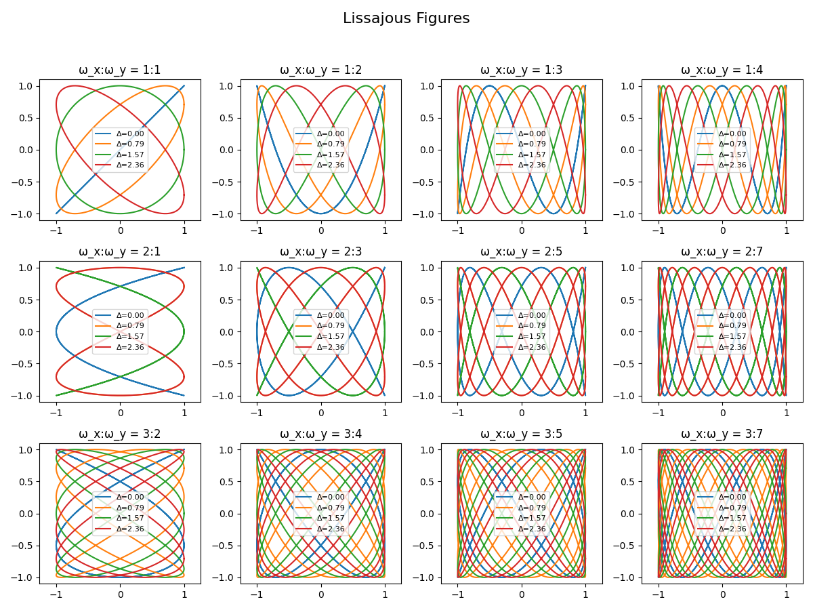

author: Leafuke

## 振动的合成与分解（Superposition of Oscillations）

本页讨论“**线性系统**”中振动的叠加原理：多个振动可以直接相加；也讨论把复杂振动分解成简单振动（尤其是简谐分量）的基本方法。

??? warning "注意"
    本页默认讨论线性范围（小振幅、线性恢复力、线性阻尼等）。当系统显著非线性时，叠加原理一般不再成立，参见 [非线性振动](nonlinear.md)。

## 1. 线性叠加原理

若系统满足线性微分方程

$$
\mathcal{L}[x](t)=f(t)
$$

其中 $\mathcal{L}$ 是线性算子（例如 $m\ddot x+b\dot x+kx$），则有：

- 若 $x_1$ 对应外力 $f_1$，$x_2$ 对应外力 $f_2$，则 $x=x_1+x_2$ 对应外力 $f=f_1+f_2$。
- 特别地，齐次方程（$f=0$）的解满足任意线性组合仍为解。

这就是叠加原理在振动中的数学基础。

## 2. 同方向简谐振动的合成（相同频率）

考虑两个同频简谐振动

$$
\begin{aligned}
 x_1(t) &= A_1\cos(\omega t+\varphi_1),\\
 x_2(t) &= A_2\cos(\omega t+\varphi_2).
\end{aligned}
$$

合成振动 $x=x_1+x_2$ 仍为同频简谐振动：

$$
 x(t)=A\cos(\omega t+\varphi).
$$

### 2.1 相量法（矢量合成）

令复相量

$$
\tilde x = A e^{i\varphi},\quad x(t)=\Re\{\tilde x e^{i\omega t}\}.
$$

则

$$
\tilde x = \tilde x_1+\tilde x_2 = A_1e^{i\varphi_1}+A_2e^{i\varphi_2}.
$$

由复数模与辐角得：

$$
A^2=A_1^2+A_2^2+2A_1A_2\cos(\Delta\varphi),\quad \Delta\varphi=\varphi_2-\varphi_1.
$$

相位满足

$$
\tan\varphi=\frac{A_1\sin\varphi_1+A_2\sin\varphi_2}{A_1\cos\varphi_1+A_2\cos\varphi_2}.
$$

#### 旋转矢量法

如果你觉得计算比较复杂，那么不妨通过矢量作图来理解相量法。将两个振动的振幅作为矢量的长度，相位作为矢量与水平轴的夹角，然后将两个矢量首尾相接，得到的合矢量的长度和方向即为合成振动的振幅和相位。

你可以在上图中作合适的辅助线来计算合成振幅 $A$ 和相位 $\varphi$。

### 2.2 特殊情形

- **同相**：$\Delta\varphi=0\Rightarrow A=A_1+A_2$（最大增强）。
- **反相**：$\Delta\varphi=\pi\Rightarrow A=|A_1-A_2|$（相消）。
- **正交相位**：$\Delta\varphi=\pi/2\Rightarrow A=\sqrt{A_1^2+A_2^2}$。

??? note "例题：两简谐同频合成"
    已知 $x_1=3\cos(\omega t)$，$x_2=4\cos(\omega t+\pi/3)$，求合成振幅。

    **解：**

    $$
    A^2=3^2+4^2+2\cdot 3\cdot 4\cos\frac{\pi}{3}=9+16+24\cdot\frac12=37
    $$

    所以 $A=\sqrt{37}$。

## 3. 拍（Beats）：频率接近的简谐振动合成

设

$$
\begin{aligned}
 x_1 &= A\cos(\omega_1 t),\\
 x_2 &= A\cos(\omega_2 t),\quad \omega_1\approx\omega_2.
\end{aligned}
$$

用和差化积公式 $\cos a+\cos b=2\cos\frac{a-b}{2}\cos\frac{a+b}{2}$ 得

$$
 x(t)=2A\cos\left(\frac{\Delta\omega}{2}t\right)\cos\left(\bar\omega t\right),
$$

其中 $\Delta\omega=\omega_1-\omega_2$，$\bar\omega=(\omega_1+\omega_2)/2$。

- 快速振动角频率：$\bar\omega$。
- 包络（振幅调制）角频率：$|\Delta\omega|/2$。
- **拍频**（每秒振幅最大次数）：

$$
 f_{\text{beat}}=|f_1-f_2|=\frac{|\Delta\omega|}{2\pi}.
$$

值得注意的是，这里的拍频并不是 $ \frac{|\Delta\omega|}{4\pi} $ ，从图中我们也可以看出，**振幅**（恒正）变化的周期是我们平常所说的振动变化周期的二分之一。

??? note "例题：拍频"
    两音叉频率分别为 $440\,\text{Hz}$ 与 $442\,\text{Hz}$，一起敲响，拍频是多少？

    **解：** $f_{\text{beat}}=|442-440|=2\,\text{Hz}$。

## 4. 正交方向简谐振动合成：李萨如图形（Lissajous）

当两个相互垂直的简谐振动频率不同时，合成的轨迹与频率之比和两者的相位都有关系，并且图形一般比较复杂，难以用简单的几何图形描述。但是，当两者的频率成整数比时，轨迹是闭合的，这种图形称为李萨如图形。

设

$$
\begin{cases}
 x=A\cos(\omega_x t+\alpha),\\
 y=B\cos(\omega_y t+\beta).
\end{cases}
$$

- 若 $\omega_x=\omega_y=\omega$，可消去 $t$ 得轨迹为椭圆；相位差决定椭圆形状。

以 $\alpha=0$ 为例：

$$
\left(\frac{x}{A}\right)^2+\left(\frac{y}{B}\right)^2-2\frac{x}{A}\frac{y}{B}\cos\delta=\sin^2\delta,
\quad \delta=\beta-\alpha.
$$

- 若 $\omega_x:\omega_y$ 为有理比，则轨迹闭合，常用于示波器测频与测相。

### 李萨如图形的频率比判断方式
观察李萨如图形时，可以通过数图形在水平方向和垂直方向上各自的最大交点数来判断频率比。例如，如果图形在水平方向上有3个最大交点，而在垂直方向上有2个最大交点，那么频率比就是3:2。

### 同步锁频现象

当两个频率接近的振动相互作用时，可能会出现同步锁频现象，即两个振动最终以相同的频率振动。

## 5. 振动的分解：傅里叶观点（最小必要版）

任意“足够好”的周期函数 $x(t)$（周期 $T$）可展开为

$$
 x(t)=\frac{a_0}{2}+\sum_{n=1}^\infty\left[a_n\cos(n\omega_0 t)+b_n\sin(n\omega_0 t)\right],\quad \omega_0=\frac{2\pi}{T}.
$$

系数由正交性给出：

$$
\begin{aligned}
 a_n &= \frac{2}{T}\int_0^T x(t)\cos(n\omega_0 t)\,dt,\\
 b_n &= \frac{2}{T}\int_0^T x(t)\sin(n\omega_0 t)\,dt.
\end{aligned}
$$

**物理意义**：线性系统对不同频率分量“各自响应，再相加”，这使得傅里叶分解在振动与波中极其重要。

??? note "练习"
    用傅里叶级数写出周期方波（幅值 $\pm A$）的展开，并观察其只含奇次谐波。
