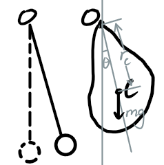

# 复摆 (Compound Pendulum)

复摆是刚体绕固定水平轴摆动的一种运动形式。与单摆不同，复摆不仅考虑质点的质量，还需要考虑刚体的质量分布和转动惯量。复摆是刚体力学中的重要内容，广泛应用于重力加速度的测量和机械系统的分析。

---

## 1. 复摆的定义

复摆是指一个刚体绕固定水平轴在重力作用下摆动的运动形式。刚体的质量分布和转动惯量对复摆的运动有重要影响。

**与单摆的区别**：
- 单摆：假设摆锤为质点，摆长固定。
- 复摆：刚体的质量分布和转动惯量需要考虑，摆动的等效长度由刚体的几何和质量分布决定。

---

## 2. 复摆的运动方程

复摆的运动可以通过牛顿力学或拉格朗日力学推导。以下是基于转动动力学的推导：

1. 刚体绕固定轴的转动惯量为 $I$，刚体的总质量为 $M$，重心到转轴的距离为 $h$。
2. 刚体受到重力矩：

$$
\tau = -Mgh \sin\theta
$$

   其中 $\theta$ 是摆动角度。
3. 根据转动定律：

$$
I \frac{\mathrm{d}^2\theta}{\mathrm{d}t^2} = \tau
$$

4. 联立得：

$$
I \frac{\mathrm{d}^2\theta}{\mathrm{d}t^2} + Mgh \sin\theta = 0
$$

当摆角 $\theta$ 较小时，$\sin\theta \approx \theta$，方程线性化为：

$$
\frac{\mathrm{d}^2\theta}{\mathrm{d}t^2} + \frac{Mgh}{I}\theta = 0
$$

这是一个简谐运动方程，其角频率为：

$$
\omega = \sqrt{\frac{Mgh}{I}}
$$

---

## 3. 复摆的周期公式

复摆的周期 $T$ 与角频率 $\omega$ 的关系为：

$$
T = \frac{2\pi}{\omega} = 2\pi \sqrt{\frac{I}{Mgh}}
$$

其中：
- $I$ 是刚体绕转轴的转动惯量；
- $M$ 是刚体的总质量；
- $h$ 是重心到转轴的距离。

---

## 4. 等效长度

复摆的周期公式可以写成与单摆类似的形式：

$$
T = 2\pi \sqrt{\frac{L_\text{eq}}{g}}
$$

其中 $L_\text{eq}$ 为复摆的等效长度，定义为：

$$
L_\text{eq} = \frac{I}{M h}
$$

等效长度是一个虚拟的摆长，表示复摆的运动与单摆的等效关系。

---

## 5. 实验应用

复摆常用于测量重力加速度 $g$。通过测量复摆的周期 $T$ 和等效长度 $L_\text{eq}$，可以计算 $g$：

$$
T = 2\pi \sqrt{\frac{L_\text{eq}}{g}} \implies g = \frac{4\pi^2 L_\text{eq}}{T^2}
$$

实验步骤：
1. 测量复摆的周期 $T$；
2. 计算刚体的转动惯量 $I$ 和重心到转轴的距离 $h$；
3. 计算等效长度 $L_\text{eq}$；
4. 代入公式计算 $g$。

---

## 6. 示例计算

**问题**：
一均匀细棒长度为 $L = 1\,\mathrm{m}$，质量为 $M = 2\,\mathrm{kg}$，绕一端的水平轴摆动。求其周期。

**解答**：
1. 转动惯量：

$$
I = \frac{1}{3}ML^2 = \frac{1}{3} \cdot 2 \cdot 1^2 = \frac{2}{3}\,\mathrm{kg \cdot m^2}
$$

2. 重心到转轴的距离：

$$
h = \frac{L}{2} = \frac{1}{2} = 0.5\,\mathrm{m}
$$

3. 周期：

$$
T = 2\pi \sqrt{\frac{I}{Mgh}} = 2\pi \sqrt{\frac{\frac{2}{3}}{2 \cdot 9.8 \cdot 0.5}} = 2\pi \sqrt{\frac{1}{29.4}} \approx 1.16\,\mathrm{s}
$$

**结果**：
复摆的周期约为 $1.16\,\mathrm{s}$。
