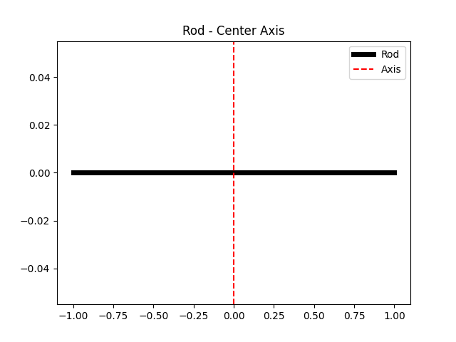
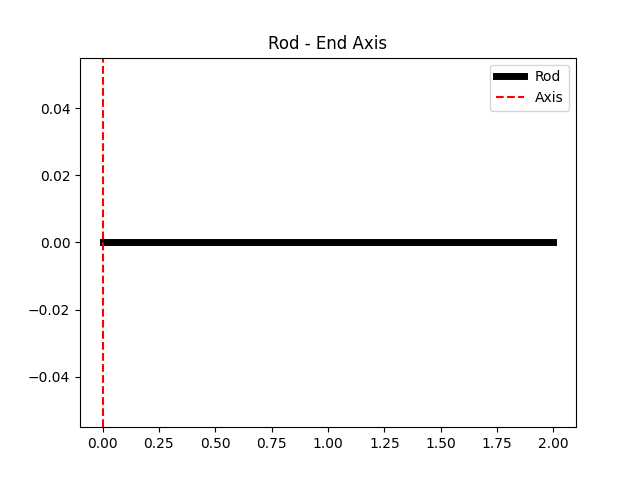
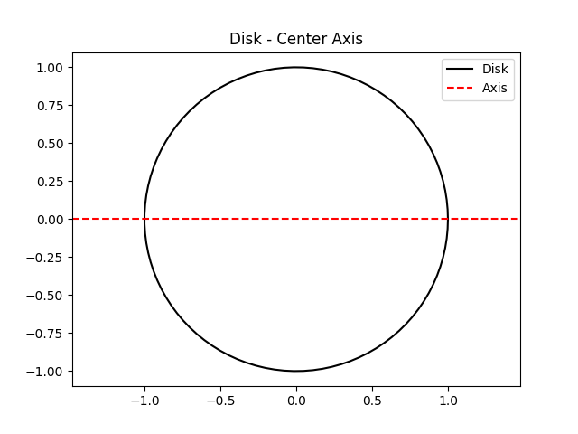
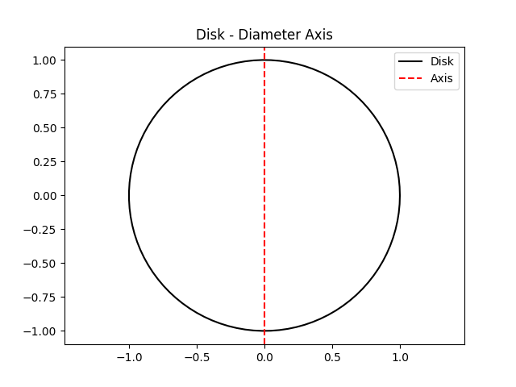
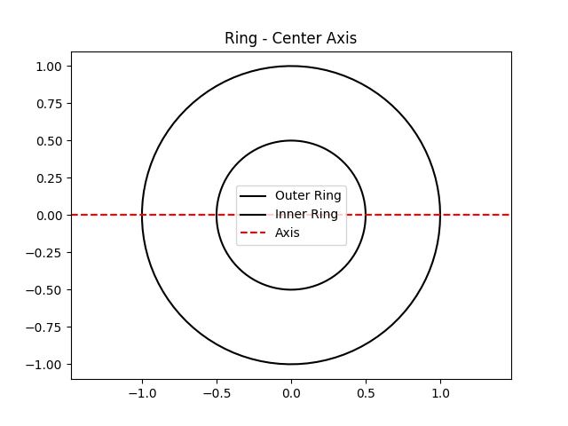
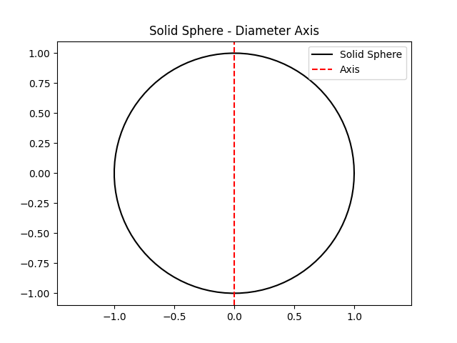
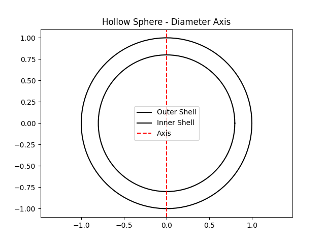
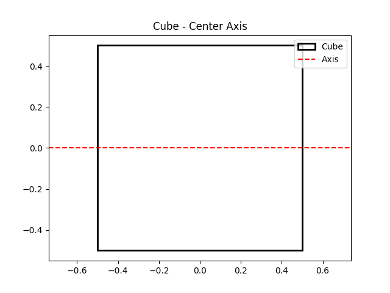
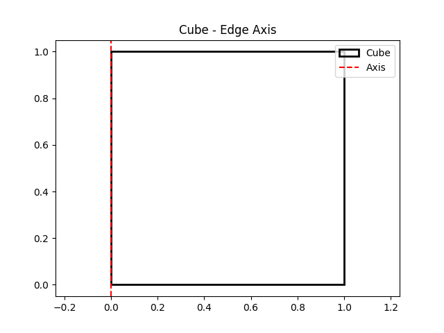

## 转动惯量 (Moment of Inertia)

转动惯量是描述刚体绕某一转轴转动时惯性大小的物理量．它是刚体力学中的一个重要概念，与线性运动中的质量有着密切的对应关系．转动惯量不仅取决于刚体的质量，还与质量分布及转轴的位置密切相关．

***

## 1. 转动惯量的定义

转动惯量的数学定义为：

$$
I = \int r^2 \, \mathrm{d}m
$$

其中：

-   $I$ 是转动惯量，单位为 $\mathrm{kg \cdot m^2}$；
-   $r$ 是刚体中质量元 $\mathrm{d}m$ 到转轴的垂直距离；
-   $\mathrm{d}m$ 是刚体中微小质量元．

转动惯量在转动运动中对应于线性运动中的质量．质量描述物体对线性加速度的抗性，而转动惯量描述物体对角加速度的抗性．

***

## 2. 常见刚体的转动惯量推导

以下是几种常见刚体的转动惯量及其推导过程：

### 2.1 均匀细棒绕中心轴转动

**刚体描述**：一根长度为 $L$、质量为 $M$ 的均匀细棒，绕其中心垂直于棒的轴转动．

**推导过程**：

1.  取细棒的微小质量元 $\mathrm{d}m$，其长度为 $\mathrm{d}x$，质量为：

$$
\mathrm{d}m = \dfrac{M}{L} \mathrm{d}x
$$

2.  到转轴的距离为 $r = x$，转动惯量为：

$$
I = \int_{-L/2}^{L/2} x^2 \mathrm{d}m = \int_{-L/2}^{L/2} x^2 \dfrac{M}{L} \mathrm{d}x
$$

3.  计算积分：

$$
I = \dfrac{M}{L} \int_{-L/2}^{L/2} x^2 \mathrm{d}x = \dfrac{M}{L} \cdot \dfrac{1}{3} \left[ x^3 \right]_{-L/2}^{L/2} = \dfrac{1}{12}ML^2
$$

**结果**：

$$
I = \dfrac{1}{12}ML^2
$$

***

### 2.2 均匀圆盘绕中心轴转动

**刚体描述**：一质量为 $M$、半径为 $R$ 的均匀圆盘，绕其中心垂直于圆盘平面的轴转动．

**推导过程**：

1.  取圆盘上的微小质量元 $\mathrm{d}m$，其面积为 $\mathrm{d}A = 2\pi r \, \mathrm{d}r$，质量为：

$$
\mathrm{d}m = \dfrac{M}{\pi R^2} \cdot 2\pi r \, \mathrm{d}r = \dfrac{2M}{R^2} r \, \mathrm{d}r
$$

2.  到转轴的距离为 $r$，转动惯量为：

$$
I = \int_0^R r^2 \mathrm{d}m = \int_0^R r^2 \cdot \dfrac{2M}{R^2} r \, \mathrm{d}r
$$

3.  计算积分：

$$
I = \dfrac{2M}{R^2} \int_0^R r^3 \, \mathrm{d}r = \dfrac{2M}{R^2} \cdot \dfrac{1}{4}r^4 \Big|_0^R = \dfrac{1}{2}MR^2
$$

**结果**：

$$
I = \dfrac{1}{2}MR^2
$$

***

### 2.3 均匀实心球绕直径转动

**刚体描述**：一质量为 $M$、半径为 $R$ 的均匀实心球，绕其直径转动．

**推导过程**：

1.  取球内的微小质量元 $\mathrm{d}m$，其体积为 $\mathrm{d}V = 4\pi r^2 \, \mathrm{d}r$，质量为：

$$
\mathrm{d}m = \dfrac{M}{\dfrac{4}{3}\pi R^3} \cdot 4\pi r^2 \, \mathrm{d}r = \dfrac{3M}{R^3} r^2 \, \mathrm{d}r
$$

2.  到转轴的距离为 $r$，转动惯量为：

$$
I = \int_0^R r^2 \mathrm{d}m = \int_0^R r^2 \cdot \dfrac{3M}{R^3} r^2 \, \mathrm{d}r
$$

3.  计算积分：

$$
I = \dfrac{3M}{R^3} \int_0^R r^4 \, \mathrm{d}r = \dfrac{3M}{R^3} \cdot \dfrac{1}{5}r^5 \Big|_0^R = \dfrac{2}{5}MR^2
$$

**结果**：

$$
I = \dfrac{2}{5}MR^2
$$

***

## 3. 常见刚体的转动惯量表

| 刚体类型  | 转轴位置        | 转动惯量 $I$           | 图示                                                   |
| ----- | ----------- | ------------------ | ---------------------------------------------------- |
| 均匀细棒  | 通过中心垂直于棒的轴  | $\frac{1}{12}ML^2$ |               |
| 均匀细棒  | 通过一端垂直于棒的轴  | $\frac{1}{3}ML^2$  |                   |
| 均匀圆盘  | 通过中心垂直于圆盘的轴 | $\frac{1}{2}MR^2$  |              |
| 均匀圆盘  | 通过直径        | $\frac{1}{4}MR^2$  |            |
| 均匀圆环  | 通过中心垂直于圆环的轴 | $MR^2$             |              |
| 均匀实心球 | 通过直径        | $\frac{2}{5}MR^2$  |   |
| 均匀空心球 | 通过直径        | $\frac{2}{3}MR^2$  |  |
| 均匀正方体 | 通过中心垂直于某一面  | $\frac{1}{6}Ma^2$  |             |
| 均匀正方体 | 通过一条边       | $\frac{1}{3}Ma^2$  |                |

***

## 4. 平行轴定理 (Parallel Axis Theorem)

平行轴定理用于计算刚体绕平行于其质心轴的任意轴的转动惯量．它的数学表达式为：

$$
I = I_c + Md^2
$$

其中：

-   $I$ 是刚体绕新轴的转动惯量；
-   $I_c$ 是刚体绕质心轴的转动惯量；
-   $M$ 是刚体的总质量；
-   $d$ 是新轴与质心轴之间的距离．

**应用场景**：
平行轴定理在计算非质心轴转动惯量时非常有用．例如，计算一根均匀细棒绕一端转动的转动惯量时，可以利用平行轴定理：

$$
I = I_c + Md^2 = \dfrac{1}{12}ML^2 + M\left(\dfrac{L}{2}\right)^2 = \dfrac{1}{3}ML^2
$$

***

## 5. 正交轴定理 (Perpendicular Axis Theorem)

正交轴定理适用于平面刚体，描述了刚体绕两条互相垂直且位于刚体平面内的轴与绕垂直于平面的轴的转动惯量之间的关系．其数学表达式为：

$$
I_z = I_x + I_y
$$

其中：

-   $I_z$ 是刚体绕垂直于平面的轴的转动惯量；
-   $I_x$ 和 $I_y$ 是刚体绕平面内两条互相垂直轴的转动惯量．

**应用场景**：
正交轴定理在计算平面刚体（如圆盘、矩形板）绕垂直于平面的轴的转动惯量时非常有用．例如，对于均匀圆盘：

-   绕直径的转动惯量为 $I_x = I_y = \frac{1}{4}MR^2$；
-   绕垂直于圆盘平面的轴的转动惯量为：

$$
I_z = I_x + I_y = \dfrac{1}{4}MR^2 + \dfrac{1}{4}MR^2 = \dfrac{1}{2}MR^2
$$

***
