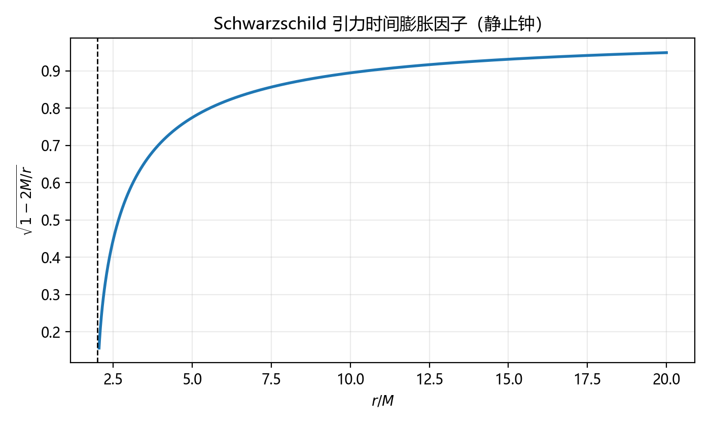
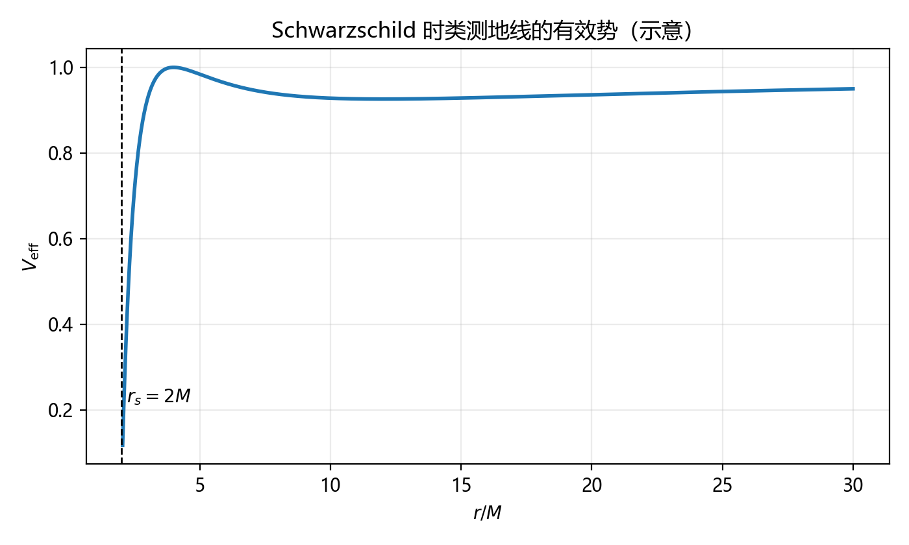
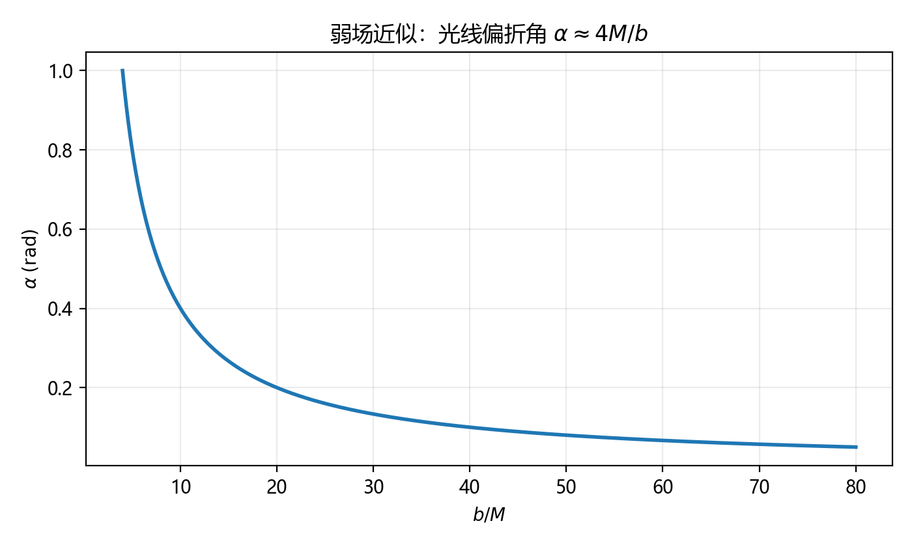

## 广义相对论基础（General Relativity Basics）

本章目标：从“等效原理”出发，建立广义相对论的最小数学工具箱（张量、度规、协变导数、曲率），给出爱因斯坦场方程的常见推导动机与弱场极限，并以 Schwarzschild 时空为主线串起经典检验（引力红移、光线偏折、近日点进动、Shapiro 延迟）与典型考题。

为方便计算，本文会在不同小节切换单位：

- **几何单位**：$c=G=1$（常用于黑洞/测地线推导）
- **SI 单位**：保留 $c,G$（适合数值估算与实验量级）

??? note "符号约定（请先看）"
	 - 指标：希腊字母 $\mu,\nu,\dots=0,1,2,3$，其中 $x^0=ct$。
	 - 度规号：本文默认 **$(-,+,+,+)$**（时间分量为负）。
	 - 爱因斯坦求和约定：重复上下指标自动求和。
	 - 4-速度：$u^\mu=\dfrac{dx^\mu}{d\tau}$，其中 $\tau$ 为固有时。

---

## 0. 从“引力是什么”到“时空几何”

牛顿引力把引力看作一种作用于物体的力：

$$
\mathbf{F}=m\mathbf{g},\qquad \nabla\cdot\mathbf{g}=-4\pi G\rho.
$$

然而两个关键事实迫使我们升级理论：

1. **惯性质量 = 引力质量**（实验精度极高）
2. 光也会被引力影响（偏折、延迟、红移），而光“没有静止质量”

广义相对论的核心观点是：

> 引力不是一种“额外的力”，而是**时空几何（度规）**的体现；自由落体沿着时空中的**测地线**运动。

---

## 1. 等效原理：广义相对论的出发点

### 1.1 弱等效原理（WEP）

所有自由落体在同一重力场中具有相同的加速度，与其内部组成无关。

这等价于“惯性质量 $m_i$ 与引力质量 $m_g$ 相等”，从而

$$
m_i \mathbf{a}=m_g\mathbf{g}\ \Rightarrow\ \mathbf{a}=\mathbf{g}.
$$

### 1.2 爱因斯坦等效原理（EEP）

在任意一点附近，总能选择一个局部惯性系，使得该点附近的物理定律与狭义相对论相同。

直观表述：

- 封闭电梯里做实验：无法区分“处于均匀重力场静止”与“在无重力的空间做匀加速运动”。

### 1.3 用等效原理推导引力红移（最经典的 1 页推导）

考虑一部在深空中以加速度 $a$ 匀加速上升的电梯。电梯底部发出频率 $\nu_\text{emit}$ 的光子向上，顶部接收。

顶部在光子飞行时间 $\Delta t\approx h/c$ 内获得速度增量 $\Delta v\approx a\Delta t = ah/c$。

对顶部而言，接收到的光发生相对论多普勒效应（弱速）：

$$
\frac{\nu_\text{rec}}{\nu_\text{emit}}\approx 1-\frac{\Delta v}{c}=1-\frac{ah}{c^2}.
$$

由等效原理，把匀加速与匀重力 $g=a$ 等价，得到引力场中“向上爬升”会**红移**：

$$
\boxed{\ \frac{\Delta\nu}{\nu}\approx-\frac{gh}{c^2}\ }\qquad (gh\ll c^2)
$$

同理可得时间膨胀：上方的钟走得更快。

---

## 2. 最小数学工具箱：度规、张量与协变导数

### 2.1 间隔与度规（metric）

狭义相对论中 Minkowski 间隔：

$$
ds^2=\eta_{\mu\nu}dx^\mu dx^\nu=-c^2dt^2+dx^2+dy^2+dz^2.
$$

广义相对论把 $\eta_{\mu\nu}$ 推广为随位置变化的 $g_{\mu\nu}(x)$：

$$
\boxed{\ ds^2=g_{\mu\nu}(x)\,dx^\mu dx^\nu\ }
$$

物理意义：度规决定“距离/时间”的测量方式，因此也决定自由粒子的运动。

### 2.2 固有时与 4-速度

对时类轨迹（可作为粒子世界线），定义固有时：

$$
d\tau=\frac{1}{c}\sqrt{-ds^2}.
$$

因此

$$
u^\mu=\frac{dx^\mu}{d\tau},\qquad u_\mu u^\mu=-c^2.
$$

### 2.3 指标升降

$$
v_\mu=g_{\mu\nu}v^\nu,\qquad v^\mu=g^{\mu\nu}v_\nu,
$$

其中 $g^{\mu\nu}$ 是 $g_{\mu\nu}$ 的矩阵逆：$g^{\mu\alpha}g_{\alpha\nu}=\delta^\mu_{\ \nu}$。

### 2.4 为什么需要协变导数？

在曲面/曲时空中，普通偏导 $\partial_\mu$ 作用在张量上不再保持“张量变换律”。需要引入带“连接”的导数：

$$
\nabla_\mu v^\nu = \partial_\mu v^\nu + \Gamma^{\nu}_{\ \mu\lambda}v^\lambda.
$$

其中 $\Gamma^{\nu}_{\ \mu\lambda}$ 为 Christoffel 符号（Levi-Civita 连接）。

### 2.5 Christoffel 符号的公式

在无挠、度规相容（$\nabla_\alpha g_{\mu\nu}=0$）的假设下：

$$
\boxed{\ \Gamma^{\rho}_{\ \mu\nu}=\frac12 g^{\rho\sigma}\left(\partial_\mu g_{\nu\sigma}+\partial_\nu g_{\mu\sigma}-\partial_\sigma g_{\mu\nu}\right)\ }
$$

??? note "小提醒：Christoffel 不是张量"
	 它依赖坐标系选择（可以在某点选取局部惯性系使其为 0），但它组合成的曲率张量是坐标不变量。

---

## 3. 测地线：自由落体的方程

### 3.1 从“极值固有时”推导测地线方程

自由粒子在两事件间走“固有时最大”（或作用量极值）的路径：

$$
S=-mc\int d\tau=-mc\int \sqrt{-g_{\mu\nu}\dot x^\mu\dot x^\nu}\,d\lambda,
$$

其中 $\dot x^\mu=\dfrac{dx^\mu}{d\lambda}$，$\lambda$ 是参数。

对该拉格朗日量做变分（略去常数并选取仿射参数），可得欧拉-拉格朗日方程最终化为：

$$
\boxed{\ \frac{d^2 x^\rho}{d\tau^2}+\Gamma^{\rho}_{\ \mu\nu}\frac{dx^\mu}{d\tau}\frac{dx^\nu}{d\tau}=0\ }
$$

这就是测地线方程：自由落体“没有外力”，但坐标加速度可不为零。

### 3.2 牛顿极限：测地线如何还原 $\mathbf{a}=\mathbf{g}$

在弱场、低速下，度规可写成

$$
g_{00}\approx -(1+2\Phi/c^2),\qquad |\Phi|\ll c^2.
$$

测地线的空间分量（只保留一阶小量）给出

$$
\frac{d^2 x^i}{dt^2}\approx-\partial_i\Phi,
$$

即恢复牛顿引力势 $\Phi$ 的运动方程。

---

## 4. 曲率：引力的“强度”如何编码

### 4.1 曲率来自“绕一圈不回原位”

在平直空间，把向量平移绕一圈会回到原向量；在曲空间则会发生偏转。数学上表现为协变导数不对易：

$$
\left(\nabla_\mu\nabla_\nu-\nabla_\nu\nabla_\mu\right)v^\rho
=R^{\rho}_{\ \sigma\mu\nu}v^\sigma.
$$

这里 $R^{\rho}_{\ \sigma\mu\nu}$ 是 Riemann 曲率张量。

### 4.2 Riemann、Ricci 与标量曲率

从 Christoffel 可写出：

$$
R^{\rho}_{\ \sigma\mu\nu}=\partial_\mu\Gamma^{\rho}_{\ \nu\sigma}-\partial_\nu\Gamma^{\rho}_{\ \mu\sigma}
+\Gamma^{\rho}_{\ \mu\lambda}\Gamma^{\lambda}_{\ \nu\sigma}-\Gamma^{\rho}_{\ \nu\lambda}\Gamma^{\lambda}_{\ \mu\sigma}.
$$

收缩得到 Ricci 张量与标量曲率：

$$
R_{\mu\nu}=R^{\rho}_{\ \mu\rho\nu},\qquad R=g^{\mu\nu}R_{\mu\nu}.
$$

### 4.3 爱因斯坦张量与 Bianchi 恒等式

定义

$$
G_{\mu\nu}=R_{\mu\nu}-\frac12 g_{\mu\nu}R.
$$

它满足重要恒等式（几何上“守恒”）：

$$
\boxed{\ \nabla_\mu G^{\mu\nu}=0\ }
$$

这将迫使右边的物质源也满足能动量守恒：$\nabla_\mu T^{\mu\nu}=0$。

---

## 5. 爱因斯坦场方程：几何 = 物质

### 5.1 形式与常数

广义相对论最核心的方程：

$$
\boxed{\ G_{\mu\nu}=\frac{8\pi G}{c^4}T_{\mu\nu}\ }
$$

其中 $T_{\mu\nu}$ 为能动量张量，描述能量密度、动量流、压强/剪应力等。

### 5.2 为什么是 $G_{\mu\nu}$？（最常用的“推导动机”）

我们希望左边是：

1. 由度规及其一、二阶导数组成（对应“局域”引力）
2. 对称二阶张量（与 $T_{\mu\nu}$ 匹配）
3. 满足协变守恒 $\nabla_\mu(\text{左边})=0$
4. 弱场极限还原泊松方程 $\nabla^2\Phi=4\pi G\rho$

在这些条件下，最自然且最简单的选择就是 $G_{\mu\nu}$。

??? note "更系统的推导：Hilbert–Einstein 作用量"
    
	 取总作用量
	 $$
	 S=\frac{c^3}{16\pi G}\int R\sqrt{-g}\,d^4x+S_{\text{matter}}.
	 $$
	 对 $g_{\mu\nu}$ 变分可得 $G_{\mu\nu}=\frac{8\pi G}{c^4}T_{\mu\nu}$。
    
	 （完整变分细节较长，竞赛/入门通常只要求理解“为何是 $R$、为何要 $\sqrt{-g}$、为何能得到守恒”。）

### 5.3 常见物质：理想流体的 $T_{\mu\nu}$

宇宙学与恒星结构常用“理想流体”：

$$
T^{\mu\nu}=(\rho c^2+p)u^\mu u^\nu + p\,g^{\mu\nu},
$$

其中 $\rho$ 为质量密度（或能量密度除以 $c^2$），$p$ 为各向同性压强。

---

## 6. 弱场近似与线性化引力（选学但很实用）

设

$$
g_{\mu\nu}=\eta_{\mu\nu}+h_{\mu\nu},\qquad |h_{\mu\nu}|\ll 1.
$$

在线性近似与合适规范（如 Lorenz 规范）下，场方程会变成“波动方程”形式，真空中存在引力波解。

### 6.1 线性化方程的标准形（了解即可）

定义迹反转（trace-reversed）扰动

$$
\bar h_{\mu\nu}\equiv h_{\mu\nu}-\frac12\eta_{\mu\nu}h,\qquad h\equiv\eta^{\alpha\beta}h_{\alpha\beta}.
$$

在 Lorenz 规范

$$
\partial_\mu \bar h^{\mu\nu}=0
$$

下，Einstein 方程线性化为

$$
\boxed{\ \Box\bar h_{\mu\nu}=-\frac{16\pi G}{c^4}T_{\mu\nu}\ }\qquad (\Box\equiv-\frac{1}{c^2}\partial_t^2+\nabla^2)
$$

真空区 $T_{\mu\nu}=0$ 给出波动方程：$\Box\bar h_{\mu\nu}=0$。

### 6.2 引力波最小图景：TT 规范与应变

对沿 $+z$ 传播的平面引力波，可在横向-无迹（TT）规范下写成

$$
ds^2\approx -c^2dt^2 + \left(1+h_+\right)dx^2+\left(1-h_+\right)dy^2+2h_\times dxdy+dz^2,
$$

其中 $h_+,h_\times$ 为两种偏振。它们对应干涉仪（LIGO 类）测到的**应变** $h\sim\Delta L/L$。

对于入门最关键的是：在静态弱场、低速下

$$
g_{00}\approx -(1+2\Phi/c^2),\qquad \nabla^2\Phi=4\pi G\rho.
$$

因此广义相对论与牛顿引力在日常尺度高度一致，只在精密实验/强引力处显著。

---

## 7. Schwarzschild 时空：最重要的精确解

### 7.1 度规（真空、球对称、静态）

对质量 $M$ 的球对称真空外部，Einstein 方程给出 Schwarzschild 解：

$$
\boxed{
ds^2=-\left(1-\frac{2GM}{rc^2}\right)c^2dt^2
+\left(1-\frac{2GM}{rc^2}\right)^{-1}dr^2+r^2(d\theta^2+\sin^2\theta\,d\phi^2)
}
$$

定义 Schwarzschild 半径

$$
r_s=\frac{2GM}{c^2}.
$$

当 $r=r_s$ 时，$g_{tt}$ 变号、$g_{rr}$ 发散（在该坐标系下）。这对应事件视界；更好的坐标（Eddington–Finkelstein、Kruskal）能消除坐标奇点。

### 7.2 静止观测者的引力时间膨胀

对固定 $r,\theta,\phi$ 的静止钟，$dr=d\theta=d\phi=0$，有

$$
d\tau=\sqrt{1-\frac{r_s}{r}}\,dt.
$$

因此远处观察者看到近处的钟变慢。



### 7.3 能量与角动量守恒（测地线的第一积分）

Schwarzschild 度规对 $t$、$\phi$ 不显含，导致守恒量：

$$
E\equiv\left(1-\frac{r_s}{r}\right)c^2\frac{dt}{d\tau},\qquad
L\equiv r^2\frac{d\phi}{d\tau}.
$$

在赤道面 $\theta=\pi/2$ 可将测地线化为“一维有效势”问题。

### 7.4 有效势（时类测地线）

在几何单位 $G=c=1$ 下，$r_s=2M$，并可写成

$$
\left(\frac{dr}{d\tau}\right)^2+V_{\mathrm{eff}}(r)=E^2,
$$

其中（典型形式）

$$
V_{\mathrm{eff}}(r)=\left(1-\frac{2M}{r}\right)\left(1+\frac{L^2}{r^2}\right).
$$



### 7.5 光子球与 ISCO（竞赛很常考的两个半径）

在几何单位 $G=c=1$ 的 Schwarzschild 时空：

- **光子球（photon sphere）**：不稳定的圆形光子轨道
	$$
	\boxed{\ r_{\text{ph}}=3M=\frac{3}{2}r_s\ }
	$$
- **最内稳定圆轨道（ISCO，时类）**：稳定圆轨道存在的内边界
	$$
	\boxed{\ r_{\text{ISCO}}=6M=3r_s\ }
	$$

直观理解：越靠近黑洞，时空曲率越强，有效势的“势阱”结构改变，稳定圆轨道会消失。

---

## 8. 经典检验与常用结果（入门必会）

### 8.1 引力红移（精确形式：Schwarzschild）

两静止观测者分别在 $r_1$（发射）与 $r_2$（接收，通常更远）处：

$$
\boxed{
\frac{\nu_2}{\nu_1}=\sqrt{\frac{1-r_s/r_1}{1-r_s/r_2}}
}
$$

当 $r_2\to\infty$：

$$
\frac{\nu_\infty}{\nu_r}=\sqrt{1-\frac{r_s}{r}}.
$$

### 8.2 光线偏折（弱场近似）

对冲量参数（impact parameter）$b$，弱场一阶：

$$
\boxed{\ \alpha\approx\frac{4GM}{bc^2}\ }
$$



### 8.3 近日点进动（弱场、近开普勒轨道）

椭圆轨道半长轴 $a$、偏心率 $e$，每一周额外进动角

$$
\boxed{\ \Delta\phi\approx\frac{6\pi GM}{a(1-e^2)c^2}\ }
$$

### 8.4 Shapiro 时间延迟（选学）

雷达信号掠过质量 $M$ 的天体会产生额外往返时间延迟。对“从 $r_1$ 发出、掠过最近距离 $b$、到 $r_2$ 接收”的几何，弱场近似常见写法为

$$
\boxed{\ \Delta t_{\text{Shapiro}}\approx\frac{2GM}{c^3}\ln\left(\frac{4r_1 r_2}{b^2}\right)\ }
$$

（不同教材对几何定义略有差异，但共同点是：它随 $GM/c^3$ 线性增长，并含对数项。）

### 8.5 宇宙学一瞥：FRW 度规与 Friedmann 方程（选读）

在“大尺度均匀各向同性”的宇宙假设下，度规可写为 FRW 形式：

$$
ds^2=-c^2dt^2+a(t)^2\left[\frac{dr^2}{1-kr^2}+r^2(d\theta^2+\sin^2\theta\,d\phi^2)\right],
$$

其中 $a(t)$ 为尺度因子，$k=0,\pm1$ 表示空间曲率符号。

代入 Einstein 方程并取物质为理想流体，可得 Friedmann 方程（最常用版本）：

$$
\boxed{\ \left(\frac{\dot a}{a}\right)^2=\frac{8\pi G}{3}\rho-\frac{kc^2}{a^2}+\frac{\Lambda c^2}{3}\ }
$$

以及加速度方程

$$
\boxed{\ \frac{\ddot a}{a}=-\frac{4\pi G}{3}\left(\rho+\frac{3p}{c^2}\right)+\frac{\Lambda c^2}{3}\ }
$$

并由 $\nabla_\mu T^{\mu\nu}=0$ 得到连续性方程

$$
\dot\rho+3\frac{\dot a}{a}\left(\rho+\frac{p}{c^2}\right)=0.
$$

---

## 9. 例题（含全过程推导与计算）

### 例题 1：用弱场近似估算地球表面与高空的引力红移

已知地球半径 $R\approx 6.37\times 10^6\,\text{m}$，质量 $M\approx 5.97\times 10^{24}\,\text{kg}$。在高度 $h\ll R$ 处的钟与地面钟相比，频率相对变化 $\Delta\nu/\nu$ 约为多少？

**解：**

弱场中

$$
\frac{\Delta\nu}{\nu}\approx-\frac{\Delta\Phi}{c^2}.
$$

地球引力势（取无穷远为 0）为 $\Phi(r)=-GM/r$，因此

$$
\Delta\Phi=\Phi(R+h)-\Phi(R)=-\frac{GM}{R+h}+\frac{GM}{R}.
$$

当 $h\ll R$，用展开

$$
\frac{1}{R+h}\approx\frac{1}{R}\left(1-\frac{h}{R}\right),
$$

得

$$
\Delta\Phi\approx -\frac{GM}{R}\left(1-\frac{h}{R}\right)+\frac{GM}{R}=\frac{GM}{R^2}h=gh.
$$

所以

$$
\boxed{\ \frac{\Delta\nu}{\nu}\approx-\frac{gh}{c^2}\ }
$$

若取 $h=1000\,\text{m}$、$g\approx 9.8\,\text{m/s}^2$，则

$$
\left|\frac{\Delta\nu}{\nu}\right|\approx\frac{9.8\times 1000}{(3.0\times 10^8)^2}\sim 1.1\times 10^{-13}.
$$

**结论：**千米量级高度差带来 $10^{-13}$ 量级的频移（原子钟可测）。

---

### 例题 2：Schwarzschild 时空中的静止钟差（精确公式）

在 Schwarzschild 外部时空中，两只静止钟分别位于 $r_1$ 与 $r_2$（$r_2>r_1>r_s$）。若远处坐标时间过了 $\Delta t$，两钟的固有时分别为多少？两者比值？

**解：**

静止钟有 $dr=d\theta=d\phi=0$，于是

$$
d\tau=\sqrt{1-\frac{r_s}{r}}\,dt.
$$

积分得到

$$
\Delta\tau(r)=\sqrt{1-\frac{r_s}{r}}\,\Delta t.
$$

所以

$$
\boxed{\ \frac{\Delta\tau_1}{\Delta\tau_2}=\sqrt{\frac{1-r_s/r_1}{1-r_s/r_2}}\ }
$$

与引力红移公式一致（频率与时间尺度互为倒数）。

---

### 例题 3：弱场光线偏折（给出标准推导骨架）

证明在弱场近似下，掠过质量 $M$ 的光线偏折角为 $\alpha\approx\dfrac{4GM}{bc^2}$。

**解题思路骨架：**

1. 弱场近似度规（各向同性形式）可写为
	$$
	ds^2\approx-(1+2\Phi/c^2)c^2dt^2+(1-2\Phi/c^2)(dx^2+dy^2+dz^2),\quad \Phi=-\frac{GM}{r}.
	$$
2. 对光线 $ds^2=0$，可得到等效“折射率”
	$$
	n(r)\approx 1-\frac{2\Phi}{c^2}=1+\frac{2GM}{rc^2}.
	$$
3. 用几何光学近似（费马原理）
	$$
	\delta\int n\,dl=0
	$$
	把光线当作在介质中传播的射线。
4. 在小偏折近似中，偏折角约为
	$$
	\alpha\approx\int_{-\infty}^{+\infty}\frac{\partial}{\partial b}\left(\frac{2GM}{c^2\sqrt{x^2+b^2}}\right)dx
	=\frac{4GM}{bc^2}.
	$$

---

### 例题 4：近日点进动公式（从有效势到近似解）

给出椭圆轨道的相对论修正导致的每周进动

$$
\Delta\phi\approx\frac{6\pi GM}{a(1-e^2)c^2}.
$$

**推导要点：**

1. 对 Schwarzschild 测地线，可得到轨道方程的近似形式（令 $u=1/r$）
	$$
	\frac{d^2u}{d\phi^2}+u=\frac{GM}{L^2}+3\frac{GM}{c^2}u^2.
	$$
2. 把 $3\frac{GM}{c^2}u^2$ 视为小扰动，设开普勒解
	$$
	u_0=\frac{GM}{L^2}(1+e\cos\phi).
	$$
3. 扰动会把角频率从 1 改成 $1-\delta$，使得一周后相位多走
	$$
	\Delta\phi\approx 2\pi\delta=\frac{6\pi GM}{a(1-e^2)c^2}.
	$$

（竞赛层面通常要求记结论并能解释“为何是小扰动导致的频率偏移”。）

---

### 例题 5：求 Schwarzschild 的光子球半径与 ISCO 半径

在几何单位 $G=c=1$ 下，证明 Schwarzschild 时空中光子的圆轨道半径为 $r=3M$，时类最内稳定圆轨道半径为 $r=6M$。

**解（思路 + 关键步骤）：**

1. 对赤道面运动，利用守恒量可把径向运动写成
	$$
	\left(\frac{dr}{d\lambda}\right)^2+V_{\text{eff}}(r)=E^2.
	$$
2. **圆轨道条件**：$r=\text{常数}$ 意味着
	$$
	\frac{dr}{d\lambda}=0\quad\Rightarrow\quad V_{\text{eff}}(r)=E^2,
	$$
	且要“保持在圆轨道上”还需
	$$
	\frac{dV_{\text{eff}}}{dr}=0.
	$$
3. **光子（零质量）**的有效势（形式上）为
	$$
	V_{\text{eff}}^{(\text{null})}(r)=\left(1-\frac{2M}{r}\right)\frac{L^2}{r^2}.
	$$
	求导并令 $dV/dr=0$ 得
	$$
	r=3M.
	$$
4. **时类（有质量）**圆轨道的稳定性由二阶导数决定：稳定要求 $\dfrac{d^2V_{\text{eff}}}{dr^2}>0$。
	对 Schwarzschild，稳定圆轨道存在于 $r>6M$；临界点为
	$$
	r_{\text{ISCO}}=6M.
	$$

---

### 例题 6：径向自由落体到达视界需要多少固有时？坐标时间会怎样？

考虑从 $r=r_0$（静止释放）径向下落到 $r=r_s$。定性说明：

- 自由落体者的固有时 $\tau$ 是否有限？
- 远处静止观察者的坐标时间 $t$ 是否有限？

**解（定性 + 关键结论）：**

1. 对下落者，$\tau$ 是沿世界线积分得到的真实物理时间。
2. 在 Schwarzschild 坐标下，$t$ 在靠近 $r_s$ 时会出现对数发散（这是坐标效应）。
3. 结论：
	- **固有时有限**：自由落体者在有限 $\tau$ 内穿过视界。
	- **坐标时间发散**：远处观察者用 $t$ 描述会看到物体“永远接近但不穿过”视界。

（若需要具体积分表达式，可在后续补充“径向测地线第一积分”并做积分计算。）

---

### 例题 7：掠日光线偏折角的数量级估算

取 $b\approx R_\odot\approx 7.0\times10^8\,\text{m}$，$M\approx M_\odot\approx2.0\times10^{30}\,\text{kg}$。

**解：**

$$
\alpha\approx\frac{4GM}{bc^2}.
$$

代入 $G\approx6.67\times10^{-11}$、$c\approx3.0\times10^8$，得

$$
\alpha\sim\frac{4\times 6.67\times10^{-11}\times2.0\times10^{30}}{7.0\times10^8\times (3.0\times10^8)^2}
\sim 8.5\times10^{-6}\,\text{rad}.
$$

换算为角秒（$1\,\text{rad}\approx 206265\,\text{arcsec}$）：

$$
\alpha\sim 1.75\,\text{arcsec}.
$$

这就是经典的“掠日偏折约 1.75 角秒”。

---

### 例题 8：水星近日点进动的数量级估算

已知水星轨道参数（可查表）：半长轴 $a\approx5.79\times10^{10}\,\text{m}$，偏心率 $e\approx0.206$，太阳质量 $M\approx M_\odot$。估算每周进动角。

**解：**

$$
\Delta\phi\approx\frac{6\pi GM}{a(1-e^2)c^2}.
$$

代入数值可得每一周（每绕太阳一圈）约 $\sim 5\times10^{-7}\,\text{rad}$ 量级，对应约 $0.1\,\text{arcsec}$ 量级。累积到每世纪（约 415 圈）即得到著名的 $\sim 43\,\text{arcsec/century}$。

---

## 10. 习题（含提示/答案要点）

### 10.1 基础题

1. 证明：在局部惯性系中，某点可令 $\Gamma^{\rho}_{\ \mu\nu}=0$，但一般不能令 $\partial_\sigma g_{\mu\nu}=0$ 同时在邻域处处为 0。
2. 设弱场度规 $g_{00}=-(1+2\Phi/c^2)$，证明静止钟的频移满足 $\Delta\nu/\nu\approx-\Delta\Phi/c^2$。
3. 写出理想流体 $T^{\mu\nu}$ 并解释各项物理意义。

### 10.2 计算题（更贴近竞赛/考题）

1. **黑洞视界尺度估算**：太阳质量 $M_\odot\approx 2.0\times 10^{30}\,\text{kg}$，求 $r_s$ 的数量级。
	- 答案要点：$r_s=2GM/c^2\approx 3\,\text{km}$。
2. **引力时间膨胀**：若某天体 $r_s=10\,\text{km}$，在 $r=40\,\text{km}$ 静止的钟相对于无穷远的钟慢多少？
	- 提示：$d\tau/dt=\sqrt{1-r_s/r}$。
3. **光偏折角数值**：太阳半径 $R_\odot\approx 7.0\times 10^8\,\text{m}$，质量 $M_\odot$，估算掠日光线偏折角。
	- 提示：$\alpha\approx 4GM/(bc^2)$，取 $b\approx R_\odot$。

4. **光子球数值**：对某黑洞 $r_s=30\,\text{km}$，求光子球半径 $r_{\text{ph}}$ 与 ISCO 半径 $r_{\text{ISCO}}$。
	- 答案要点：$r_{\text{ph}}=\tfrac{3}{2}r_s$，$r_{\text{ISCO}}=3r_s$。

5. **引力波应变量级**：若某引力波通过地球时的应变 $h\sim10^{-21}$，LIGO 级别的臂长 $L\sim4\,\text{km}$，估算长度变化 $\Delta L$。
	- 答案要点：$\Delta L\sim hL\sim 4\times10^{-18}\,\text{m}$。

---

## 11. 用 Python 复现/绘制示意图（可选）

本文插图由 Python 生成并保存在 `docs/modern/images/`：

- `schwarzschild_time_dilation_factor.png`
- `schwarzschild_effective_potential.png`
- `light_deflection_weak_field.png`

??? note "示例代码（生成弱场光偏折图）"
    
	 ```python
	 import numpy as np
	 import matplotlib.pyplot as plt
	 M = 1.0
	 b = np.linspace(4.0, 80.0, 800)
	 alpha = 4*M/b
	 plt.plot(b, alpha)
	 plt.xlabel(r'$b/M$')
	 plt.ylabel(r'$\alpha\;\mathrm{(rad)}$')
	 plt.title(r'弱场近似：$\alpha \approx 4M/b$')
	 plt.grid(True, alpha=0.25)
	 plt.show()
	 ```

---

## 参考与延伸阅读

- Misner, Thorne, Wheeler, *Gravitation*（体系最全，但很厚）
- Schutz, *A First Course in General Relativity*（入门友好）
- Carroll, *Spacetime and Geometry*（现代写法，推导清晰）
