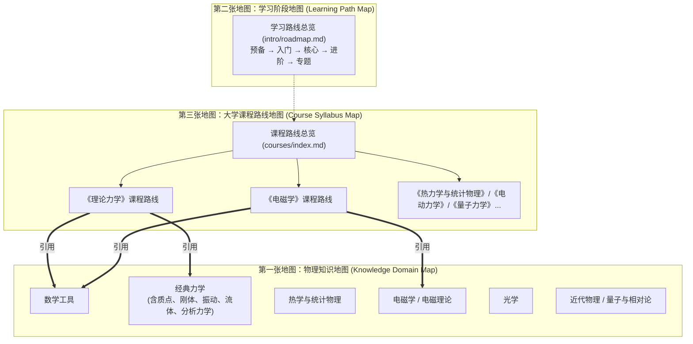

# RFC: Physics Learning Wiki 信息架构与双层知识体系

- **文档编号**: RFC-2026-09-18-IA
- **主题**: 本科物理知识体系、课程路线与信息架构双层解耦设计
- **状态**: Accepted
- **日期**: 2026-09-18
- **作者**: Physics Learning Wiki Team

---

## 1. 摘要 (Summary)

Physics Learning Wiki 的目标是面向物理爱好者与本科生建立系统化的物理学习站点．随着内容从大一基础物理向大二专业核心课扩展，当前信息架构暴露出了分类维度混用、课程视角缺失、成熟度失衡等结构性瓶颈．

本 RFC 确立项目的核心信息架构原则：

> **正文按知识领域唯一存储，课程与学习阶段通过路线页组织．**

同时确立「三张地图」模型（物理知识地图、学习阶段地图、大学课程地图），明确定义经典力学/理论力学/分析力学、电磁学/电动力学、热物理、近代物理等核心概念的映射关系，并引入三态页面生命周期（`stable` / `draft` / `planned`）以实现视觉完成度与实际完成度的统一．

---

## 2. 动机与现状诊断 (Motivation & Background)

### 2.1 症状表现：「理论力学在哪里？」
在原有导航中，力学被归类在「经典力学」下，包含运动学、动力学、刚体力学、振动与波、引力、流体力学以及预留的分析力学（拉格朗日力学与哈密顿力学）．当读者步入大学二年级开始学习《理论力学》时，无法在导航中找到对应入口．

若直接新建平行的 `docs/theoretical-mechanics/` 目录，势必需要重新书写运动学、牛顿动力学、质点系动力学、刚体转动等内容，从而产生大量同源重复正文，破坏维基维护的一致性．

### 2.2 根源分析：四套分类维度的混用
审计现有顶层导航可发现，站点混杂了四套互不兼容的分类轴：
1. **物理学知识领域**：经典力学、电磁学、光学；
2. **大学课程命名习惯**：热学、近代物理；
3. **方法与基础设施**：数学工具、实验物理、计算物理与工具；
4. **学习活动支线**：章节小测、物理竞赛．

当读者同时面对「知识分类」、「学习阶段」和「学校课表」时，单棵目录树无法同时回答三个不同维度的问题：
- 知识目录回答：*「这个知识在物理学体系中属于哪里？」*
- 阶段路线回答：*「从零开始自学，应该按什么先后顺序读？」*
- 课程路线回答：*「我学校正在上这门课，在 Wiki 里对应哪些内容？」*

### 2.3 建设页与成熟页同权重问题
现有电磁学、光学及近代物理的大量章节正文为精确的 `TO DO` 占位，但在左侧导航树中与包含数万字详尽推导与例题的成熟页面平级展示，导致读者产生「整门课已完备」的错觉，点开后产生较大的体验落差．

---

## 3. 核心架构设计 (Architecture Design)

### 3.1 核心原则：双层架构与单源真理 (Single Source of Truth)
- **底层（知识树，唯一真源）**：所有物理概念、定理、公式推导与例题，在整个 Wiki 中拥有**且仅拥有唯一一份正文存储位置**．严格按照学科客观物理领域划分，不因课程设置的变动而搬迁．
- **上层（路线图，视角与编排）**：学习路线总览、本科物理主线、大学课程路线（如《理论力学》、《电磁学》）作为轻量视图，仅通过超链接聚合底层正文，不复制正文内容．

### 3.2 「三张地图」体系模型



1. **第一张地图：物理知识地图**（底层知识真源）
   - 回答：*「物理学是什么、概念的物理分类是什么」*．
   - 包含：经典力学、热学与统计物理、电磁学、光学、近代物理、数学工具等．
2. **第二张地图：学习阶段地图**（学习顺序引导）
   - 回答：*「从自学者视角，我下一步应该学什么」*．
   - 现有的 `intro/roadmap.md` 按预备、入门、核心、进阶、专题展开．
3. **第三张地图：大学课程地图**（高校课表映射）
   - 回答：*「我现在大学正在上这门课，在 Wiki 里从哪里切入」*．
   - 存放在 `docs/courses/`，包括《理论力学》、《电磁学》、《热统》、《电动力学》、《量子力学》等．

---

## 4. 核心术语与领域边界约定 (Terminology & Domain Boundaries)

为指导后续内容建设，在此明确四组典型关系的定位：

### 4.1 经典力学 — 理论力学 — 分析力学

| 概念名称 | 本质属性 | 在 Wiki 中的角色 | 存放与组织方式 |
| :--- | :--- | :--- | :--- |
| **经典力学** (Classical Mechanics) | 物理学宏观理论领域 | 稳定的知识大类（底层真源） | `docs/mechanics/`，包含运动学、动力学、刚体、振动波、引力、流体与分析力学 |
| **分析力学** (Analytical Mechanics) | 经典力学的进阶形式体系 | 经典力学的高阶知识模块 | `docs/mechanics/analytical/`（拉格朗日力学、哈密顿力学、变分法应用） |
| **理论力学** (Theoretical Mechanics) | 大学本科核心基础课程 | **课程路线视图 (Syllabus)** | `docs/courses/theoretical-mechanics.md`，按课表顺序串联数学工具、质点系、刚体、非惯性系、达朗贝尔原理、分析力学 |

### 4.2 电磁学 — 电动力学

| 概念名称 | 本质属性 | 在 Wiki 中的角色 | 组织策略 |
| :--- | :--- | :--- | :--- |
| **电磁学** (Electromagnetism) | 大学普通物理核心模块 | 电磁领域的基础正文与实验图像 | `docs/electromagnetism/`（静电场、恒定磁场、感应、电路、初等麦克斯韦方程） |
| **电动力学** (Electrodynamics) | 理论物理「四大力学」之一 | 电磁领域的进阶理论与课程路线 | 近期以课程路线形式接入；未来进阶正文（规范场、多极辐射、相对论电动力学）沉淀为电磁理论的高阶章节 |

### 4.3 热学 — 热力学与统计物理

| 概念名称 | 本质属性 | 在 Wiki 中的角色 | 组织策略 |
| :--- | :--- | :--- | :--- |
| **热学** (Thermal Physics) | 普通物理课程视角 | 宏观态、气体动理论与定律基础 | 现有 `docs/thermodynamics/` 正文保持稳定 |
| **统计物理** (Statistical Physics) | 微观微态数、系综与相变 | 热物理领域的进阶理论模块 | 沿用现有统计物理章节，未来提供《大学热学》与《热力学与统计物理》两条差异化课程路线 |

### 4.4 近代物理 — 量子力学 / 相对论

- **现状评估**：当前 `modern/` 将广义相对论、狭义相对论、量子力学、原子物理、固体物理和核物理并列，属于典型的大一通识课目录．
- **演进策略**：
  1. 近期**不进行物理文件迁移**，保持 URL 稳定；
  2. 随着内容积累，量子力学 (`quantum/`) 和相对论 (`relativity/`) 将升级为独立一级知识域；
  3. `docs/modern/` 未来将蜕变/保留为面向初学者的《近代物理导论》课程路线．

---

## 5. 页面生命周期规范 (Page Lifecycle & Status Standard)

为消除「视觉完成度与实际完成度脱节」的矛盾，引入页面状态管理机制：

### 5.1 页面三态定义

| 状态值 (`status`) | 准入条件 | 检索与 SEO 策略 | 导航展现原则 |
| :--- | :--- | :--- | :--- |
| `stable` | 具有明确的物理图像、公式推导、核心例题、误区提示与前后衔接，达到正式阅读标准 | 默认 `index, follow`，进入 sitemap | 正常收录于导航与主学习路线 |
| `draft` | 具备核心推导与知识骨架，基本完成正文，但例题或图解仍在补充中 | 允许索引，建议标明完善中 | 正常收录于导航，注明起草阶段 |
| `planned` | 目前仅为大纲占位或包含 `TO DO`，尚未具备自洽阅读价值 | 强制添加 `noindex, follow`，排除于 sitemap | 保持 URL 可访问；在学科首页以「建设中看板」展示，主学习路线中清晰标明待建设 |

### 5.2 Frontmatter 规范示例

```yaml
---
status: planned
author: Physics Learning Wiki Team
description: 讨论拉格朗日方程的变分推导与广义动量守恒（建设中）
meta:
  - name: robots
    content: noindex, follow
---
```

---

## 6. 演进路线图 (Evolution Roadmap)

1. **第一阶段（本阶段：步骤 1~3）**：
   - 确立信息架构 RFC 与三态规范；
   - 新建 `docs/courses/`，上线《理论力学》与《电磁学》课程路线；
   - 升级《经典力学》与《电磁学》概览页为「导学与内容状态看板」，规范占位页元数据，保持全部现有 URL 不变．
2. **第二阶段（内容建设）**：
   - 配合理论力学课程，完善分析力学主线（约束、虚位移、达朗贝尔原理、拉格朗日方程、中心力、微振动、哈密顿力学）；
   - 补全电磁学主干章节正文．
3. **第三阶段（高级架构迁移）**：
   - 待量子力学与相对论章节丰富后，拆分 `modern/` 为独立知识域，并配置 HTTP 301 重定向保证旧外链长期有效．
