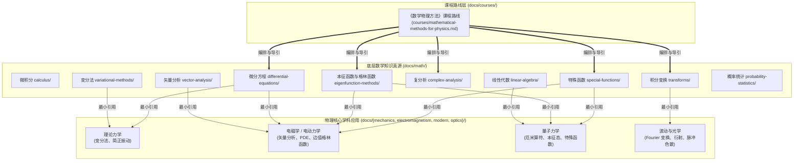

# RFC: 《数学物理方法》课程路线与数学工具库 (math/) 重构规范

- **文档编号**: RFC-2026-09-18-MATH
- **主题**: 落实 Issue #14 愿景：以《数学物理方法》课程为中轴重构底层数学工具库
- **关联文档**: [RFC-2026-09-18-IA](./2026-09-18-information-architecture-rfc.md)
- **状态**: Accepted
- **日期**: 2026-09-18
- **作者**: Physics Learning Wiki Team

---

## 1. 摘要 (Summary)

本 RFC 旨在解决 Physics Learning Wiki 中数学工具模块（`docs/math/`）的结构性失衡与定位偏差问题，全面落实 Issue #14 提出的**“顺序学习”与“最小数学引用”**双重目标。

随着站点内容向大学二年级理论物理（理论力学、电动力学、量子力学、热力学与统计物理）扩展，现有的数学工具目录表现为初等数学清单，缺少面向物理本科核心理论的支撑。本 RFC 确立：

1. **《数学物理方法》作为课程路线而非独立知识域**：在 `docs/courses/` 下设立《数学物理方法》课程路线，负责学习阶段规划与教学大纲映射；真正的数学知识正文单源存储于 `docs/math/` 中；
2. **“物理驱动 (Why-first)”的数学编写范式**：杜绝脱离物理背景的纯公理化推导，统一遵循：
   $$\boxed{\text{物理问题} \to \text{数学困难} \to \text{数学工具} \to \text{物理解}}$$
3. **数学工具库模块化解耦与重构**：
   - 将常微分方程与变分法从微积分目录中解耦，独立为 `differential-equations/` 和 `variational-methods/`；
   - 拆解单篇压缩的复变函数（`complex.md`）为系统化子模块（`complex-analysis/`）；
   - 拆解单篇罗列的特殊函数（`special-functions.md`）为基于物理来源的子模块（`special-functions/`）；
   - 新增积分变换（`transforms/`）、偏微分方程、Sturm–Liouville 理论与格林函数（`eigenfunction-methods/`）；
   - 扩充线性代数算符谱理论（`linear-algebra/`），为量子力学提供坚实的代数底座。

---

## 2. 现状诊断与 Issue #14 的破局点 (Motivation & Problem Statement)

### 2.1 现状失衡：方差分析详细 vs 偏微分方程空白
审计现有 `docs/math/` 可发现明显的资源分配错位：
- **概率与统计**拥有 10 篇结构完备的高成熟度页面；
- 与此形成鲜明对比的是，大二物理本科生迫切需要的数学基础设施严重缺失：
  - 常微分方程仅 1 篇基础入门页，二阶线性微分方程、阻尼振子、幂级数解法均未深入；
  - 复变函数仅 1 篇，将解析性、柯西定理与留数定理高度压缩；
  - 傅里叶级数与傅里叶变换完全缺失；
  - 偏微分方程（拉普拉斯方程、波动方程、热传导方程）及其分离变量法完全缺失；
  - Sturm–Liouville 本征值问题与格林函数完全缺失；
  - 狄拉克 $\delta$ 函数与多种特殊函数被混装在一篇 `special-functions.md` 中。

### 2.2 Issue #14 的核心诉求与数理方法的契合性
Issue #14 指出：物理维基中的数学内容必须同时满足两个互相竞争的场景：
1. **场景 A（自洽顺序学习）**：读者可以按数学自身的逻辑链条由浅入深阅读；
2. **场景 B（物理正文最小引用）**：物理正文（如讲到拉格朗日力学、静电边值、氢原子能级时）能够精准链接到对应数学工具的最小完备知识点，而无需迫使读者通读整本数学教材。

《数学物理方法》课程刚好处于这一交汇点：它是物理系学生学习将高等数学工具运用于场论与动力学系统的第一门专业课。通过以《数学物理方法》为骨架重构 `math/`，能够一举理顺跨模块引用的所有底层接口。

---

## 3. 架构设计：双层映射与中轴模型 (Architecture Model)

### 3.1 知识与课程的双层关系

### 3.2 数理方法的统一“知识贯通主线”
本站数学物理方法主线突出以下核心联系：
1. **微分算符 $\to$ 线性代数推广**：微分算子 $L = -\frac{\mathrm{d}}{\mathrm{d}x}\left[p(x)\frac{\mathrm{d}}{\mathrm{d}x}\right] + q(x)$ 推广了有限维对称矩阵；
2. **Sturm–Liouville 理论 $\to$ 特殊函数统一母体**：Legendre 多项式、Bessel 函数、Hermite 多项式不是孤立的公式背诵，而是不同坐标系下自共轭微分算子的正交完备本征函数；
3. **量子力学前置衔接**：算子自伴性（Hermitian）、正交完备性 $\sum |n\rangle\langle n| = I$、谱展开定理与量子力学观测量本征值问题 $\hat{H}\psi = E\psi$ 形成无缝衔接。

---

## 4. 编写范式：物理驱动原则 (Editorial Standard)

所有数学页面必须遵循以下写作约定，杜绝“为讲数学而讲数学”：

1. **物理问题引入**：页面首节必须交代该数学工具起源于何种物理困境（如：为什么温度梯度指向最快上升方向？为什么求解点电荷电势需要引入 $\delta$ 函数？为什么两端固定弦的振动只允许分立驻波？）；
2. **适度数学严谨性**：聚焦于物理学家所需的解析性质、计算范式、正交完备性及几何图像，省略与物理主线无关的纯测度论或实变函数论细节；
3. **双向衔接标注**：
   - 页面头部通过 Admonition 标明前置数学依赖；
   - 页面尾部设立“物理应用与后续衔接”板块，列举其在电磁学、力学、量子力学中的直接场景并提供内链；
4. **统一公式规范**：
   - 微分算符使用正体微分号 $\mathrm{d}x$；
   - 分数使用 `\dfrac` 提高可读性；
   - 向量使用粗体矢号 $\boldsymbol{r}$ 或 $\vec{r}$，算符使用帽子记号 $\hat{A}$；
   - 狄拉克符号规范写作 $|\psi\rangle$ 与 $\langle\phi|$。

---

## 5. 迁移与链接兼容性约定 (URL Backward Compatibility)

在拆分和移动旧文件时，必须严格保证不产生死链：
1. `docs/math/calculus/ode.md` $\to$ 保留为跳转引导别名页，指向 `docs/math/differential-equations/ode-intro.md`；
2. `docs/math/calculus/variational.md` $\to$ 保留为跳转引导别名页，指向 `docs/math/variational-methods/calculus-of-variations.md`；
3. `docs/math/complex.md` $\to$ 保留为过渡页，指向 `docs/math/complex-analysis/`；
4. `docs/math/special-functions.md` $\to$ 保留为概览页，指向 `docs/math/special-functions/`；
5. 全站现有引用在完成后统一校正为新语义路径。
