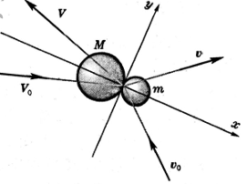
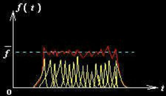
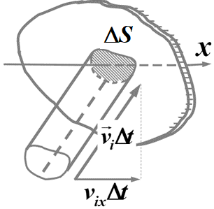
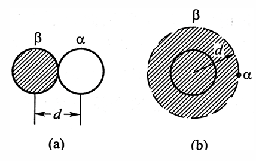

# 气体

气体通常是热学里最先详细研究的物态，因为它最容易建立简洁模型。气体分子之间平均距离较大、相互作用相对容易近似处理，所以很多温度、压强和状态方程的直观关系，会先在气体这里变得清晰。

## 学习目标

读完本页后，你应该能够：

- 陈述理想气体的微观假设（质点、经典粒子、无相互作用、完全弹性碰撞）和统计假设（均匀分布、各向同性）
- 从分子弹性碰撞的能量交换出发，论证分子平均平动动能与热力学温度的正比关系，并说明温度是统计概念
- 从微观角度推导理想气体压强公式 $p = \frac{2}{3}n\overline{\varepsilon_t}$，并推广到极端相对论情形
- 结合压强公式和温度关系推导理想气体物态方程，得出玻尔兹曼常数 $k$ 和分子的平均平动动能 $\overline{\varepsilon_t} = \frac{3}{2}kT$
- 计算给定条件下气体的方均根速率，并解释不同质量分子在同一温度下方均根速率的差异
- 用微观理论解释阿伏伽德罗定律和道尔顿分压定律
- 说明实际气体与理想气体的偏差来源，写出范德瓦尔斯方程并解释修正项 $a$、$b$ 的物理意义
- 理解对应态原理和位力展开的基本思想

## 为什么要先单独讲气体

气体是热学中最先详细研究的物态。气体分子间平均距离较大，相互作用相对容易近似处理——可以先忽略分子力得到理想气体模型，再以范德瓦尔斯修正等形式把分子力的影响逐步加回来。这使得温度、压强、物态方程等核心概念的微观本质在气体这里最先变得清晰，为后续讨论固体和液体打下基础。

## 本页将重点处理什么

1. 从微观假设出发，通过分子弹性碰撞的能量交换论证温度与分子平均平动动能的正比关系
2. 推导理想气体压强公式，并由此导出物态方程、方均根速率、玻尔兹曼常数等关键结果
3. 用微观理论解释阿伏伽德罗定律和道尔顿分压定律
4. 引入实际气体模型（范德瓦尔斯方程、对应态原理、位力展开）

## 核心内容

### 理想气体的微观假设

1. 质点（分子线度<<分子间平均距离）  
2. 遵从牛顿力学规律（经典粒子）  
3. 除碰撞瞬间，分子间、分子与器壁间无相互作用力  
4. 分子间、分子与器壁间的碰撞为完全弹性碰撞，即平动动能不向内部自由度（如转动、振动、激发等）转移

### 关于分子集体运动的统计假设

1. 通过碰撞分子速度不断变化。  
2. 无外场时，平衡态分子按位置均匀分布。即 $n=\frac{dN}{dV}=\frac{N}{V}$  
3. **平衡态**分子速度按方向的分布是均匀的（各向同性）。  

$$
\overline{v_x} = \overline{v_y} = \overline{v_z} = 0, \quad \overline{v_x^2} = \overline{v_y^2} = \overline{v_z^2} = \frac{1}{3}\overline{v^2}, \quad \overline{v_\alpha^2} = \frac{1}{N}\sum_{i=1}^N v_{\alpha i}^2.
$$

???+ warning "注意"
    1. $dV$ 应是**宏观小微观大**的体积元。例如：标准状态下，$1\,\text{cm}^3$ 的空气中有 $2.7 \times 10^{19}$ 个分子。
    若 $dV = 10^{-15}\,\text{m}^3$，则 $dV$ 内有 $10^{10}$ 个分子！   
    2. 涨落：各时刻的 $\frac{dN}{dV}$ 值相对于平均值 $n$ 的差别。通常 $dV$ 取足够大，使这一涨落比起平均值 $n$ 可以小到忽略不计。

### 分子弹性碰撞

下面我们从两个分子碰撞的行为加入合理的统计假设得到气体分子热运动的**微观**统计行为与宏观热力学量T的关系。  
现在我们仔细地考查一下两个分子碰撞中能量的交换。这两个分子可以都是气体中的，也可以一个是气体中的，另一个是器壁中的。设它们具有不同的质量 $m$ 和 $M$。令它们在碰撞前的速度分别为 $\boldsymbol{v}_0$ 和 $\boldsymbol{V}_0$，碰撞后的速度分别为 $\boldsymbol{v}$ 和 $\boldsymbol{V}$。把分子看成球形，取两球中心联线为直角坐标系的 $x$ 轴，由于碰撞中垂直于 $x$ 轴的速度分量不改变，问题就简化成只有 $x$ 方向一维了。在此方向上分子 $M$ 损失的动能为

$$
\Delta \varepsilon = \frac{1}{2}M\left(V_{0x}^2 - V_x^2\right) = \frac{1}{2}M\left(V_{0x}-V_x\right)\left(V_{0x}+V_x\right). \tag{1}
$$

由于弹性碰撞中动能守恒，这也是分子 $m$ 获得的动能。根据我们在[动量与能量 - 弹性碰撞](../../mechanics/dynamics/momentum-energy.md)中得到的公式。把式中的符号适当地换过来，有

$$
V_x = \frac{(M-m)V_{0x} + 2mv_{0x}}{M+m},
$$

 
从而

$$
\begin{cases}
V_{0x} - V_x = \dfrac{2m\left(V_{0x}-v_{0x}\right)}{M+m}, \\
V_{0x} + V_x = \dfrac{2\left(MV_{0x}+mv_{0x}\right)}{M+m}.
\end{cases}
$$

<!-- 为了使各自由度之间达到热平衡，还得假定碰撞过程中平动与内部自由度之间有能量交换。但在已经达到热平衡的气体中它们收支相抵，讨论某些问题（如推导物态方程）时可以不考虑这类能量交换。——这段话待研究 -->

代入(1)式，得

$$
\Delta \varepsilon = \frac{2mM}{(M+m)^2}\left[MV_{0x}^2 + mv_{0x}^2 + (m-M)v_{0x}V_{0x}\right]. \tag{2}
$$

以上是单次碰撞的结果，$\Delta\varepsilon$ 可正可负。我们假定

1. $M$、$m$ 各代表一类分子，宏观效果是两类分子之间大量碰撞的平均。   
2. 气体和器壁宏观上都是静止的，从而每类分子沿任何正负两个方向的概率都相等。

$V_{0x}$ 和 $v_{0x}$ 的平均 $\overline{V_{0x}}=\overline{v_{0x}}=0$。再者，因 $M$、$m$ 两类分子的热运动都是随机的，且在方向上彼此没有关联，故 $\overline{v_{0x}V_{0x}}$ 也等于 0。取(2)式的平均，得

$$
\overline{\Delta\varepsilon} = \frac{2mM}{(M+m)^2}\left(M\overline{V_{0x}^2} - m\overline{v_{0x}^2}\right). \tag{3}
$$

上式右端正比于两分子碰撞前后 $x$ 方向平均动能之差。由于分子热运动是各向同性的，与 $x$ 垂直的另外两个方向平均动能与 $x$ 方向一样，故 $x$ 方向的平均动能是各方向平均动能的 1/3。故(3)式又可写为

$$
\overline{\Delta\varepsilon} = \frac{2mM}{3(M+m)^2}\left(M\overline{V^2} - m\overline{v^2}\right) \propto \frac{1}{2}M\overline{V^2} - \frac{1}{2}m\overline{v^2}. \tag{4}
$$

若 $M$ 类分子的平均动能大于 $m$ 类分子，则 $\overline{\Delta\varepsilon}>0$，动能由 $M$ 类分子传给 $m$ 类分子；反之，若 $M$ 类分子的平均动能小于 $m$ 类分子，则 $\overline{\Delta\varepsilon}<0$，动能由 $m$ 类分子传给 $M$ 类分子；$\overline{\Delta\varepsilon}=0$ 表示平均起来两类分子之间能量交换为0。

如[上节 - 热量及其本质](./heat-and-its-nature.md)所述，热量即热运动的能量，故 $\overline{\Delta\varepsilon}$ 的正负决定了热量传递的方向，$\overline{\Delta\varepsilon}=0$ 时 $M$、$m$ 两类分子之间达到热平衡。如此看来，按照热力学第零定律，分子的平均动能在宏观上具有温度的特征。我们暂时假定，分子的平均动能正比于热力学温度：

$$
\overline{\varepsilon} = \frac{1}{2}m\overline{v^2} = KT, \tag{1.26}
$$

- 其中 $\overline{\varepsilon}$ 是分子的平均动能，$K$ 是比例常量，$T$ 是热力学温度。

因为热平衡状态温度相等的概念适用于任何物体，上式里的比例常量 $K$ 应该是普适的。下面我们将进一步论证这个结论，并把这个普适常量定下来。

???+ warning "注意"
    1. 温度T是描述热力学系统平衡态的宏观状态参量。  
    2. 温度T是一个统计概念，只能用来描述大量分子的集体状态，单个分子谈论它的温度毫无意义。  
    3. 温度所反映的运动是分子的无规则运动(分子热运动 $\overline{\varepsilon_t}$ )，和物体的整体运动无关。是相对于系统的质心参考系测量的。系统内所有分子的平动动能的总和就是系统的内动能。
    4. 分子热运动的平均转动动能和平均振动动能也都和温度有直接的联系。

 
### 理想气体压强公式
 
上面我们讨论了温度的微观意义，现在来看压强的微观意义。

什么是压强？

物体中通过内部假想截面$\Delta S$相互作用的法向应力。

- 应力：作用在单位面积上的力。

气体压强由哪部分贡献？  
1. 分子力：$\Delta S$ 两侧附近的分子相互作用着；
2. 分子运动：大量分子携带着动量穿过 $\Delta S$ 的平均效果是均
匀而持续的压力。
- 对理想气体，只有 2 部分的贡献。

> 大量分子产生持续的平均冲力曲线

#### 推导前置定义

| 符号 | 定义与公式 |
| ---- | ---- |
| $m$ | 单个气体分子质量 |
| $N$ | 容器内气体分子总数量 |
| $V$ | 容器容积（气体总体积） |
| $n$ | 总分子数密度：单位体积内的所有气体分子总数，公式为 $n=\frac{N}{V}$ |
| $n_i$ | 速度为$\vec{v}_i$的分子数密度：单位体积内速度大小方向等于$\vec{v}_i$的分子数量，公式为 $n_i=\frac{N_i}{V}$ 其中 $N_i$ 是速度等于$\vec{v}_i$的分子总数 |

总分子数：

$$
N=\sum_i N_i
$$

总分子数密度：

$$
n=\sum_i n_i
$$

#### 冲量与压强的微观推导

一个分子对器壁上 $\Delta S$ 的冲量 —— $2p_{ix}$。

> **分子动量改变：** $p_{ix} \to -p_{ix}$

$\Delta t$ 时间内所有动量为 $p_i$ 的分子对 $\Delta S$ 的冲量（考虑斜柱体积）：

$$
\begin{aligned}
\Delta I_i &= (n_i v_{ix} \Delta t \Delta S)(2 p_{ix}) \\
&= 2 n_i p_{ix} v_{ix} \Delta t \Delta S
\end{aligned}
$$

$\Delta t$ 时间内所有分子对 $\Delta S$ 的冲量：

> 注意：$v_{ix} > 0$ 与 $v_{ix} < 0$ 分子各占一半。

$$
\Delta I = \sum_{v_{ix} > 0} \Delta I_i = \frac{1}{2} \sum_i \Delta I_i = \Delta t \Delta S \sum_i n_i p_{ix} v_{ix}
$$

**压强：**

$$
= \frac{\Delta F}{\Delta S} = \frac{\Delta I}{\Delta t \Delta S} = \sum_i n_i p_{ix} v_{ix}
$$

#### 求统计平均值

$$
= \sum_i n_i p_{ix} v_{ix} = n \sum_i \frac{n_i}{n} p_{ix} v_{ix} = n \overline{p_x v_x}
$$

其中：

$$
\overline{p_x v_x} = \frac{1}{n} \sum_i n_i p_{ix} v_{ix} = \frac{\sum_i n_i p_{ix} v_{ix}}{\sum_i n_i}
$$

由于动量和速度分布的各向同性，则：

$$
\overline{p_x v_x} = \overline{p_y v_y} = \overline{p_z v_z}
$$

$$
\overline{\vec{p} \cdot \vec{v}} = \overline{p_x v_x} + \overline{p_y v_y} + \overline{p_z v_z} = 3 \overline{p_x v_x}
$$

故总压强公式可以写成如下形式：

$$
= \frac{1}{3} n \overline{\vec{p} \cdot \vec{v}} \quad \text{（理想气体的压强公式）}
$$

#### 不同情形下的压强公式

##### 非相对论情形

$$
\vec{p} = m\vec{v}, \quad \vec{p} \cdot \vec{v} = mv^2 = 2\varepsilon
$$

$$
= \frac{1}{3} n \overline{\vec{p} \cdot \vec{v}} = \frac{1}{3} nm \overline{v^2} = \frac{2}{3} n \overline{\varepsilon_t}
$$

> **说明：** 三个统计平均量 $p, n$ 和 $\overline{\varepsilon_t}$ 之间相互联系的一个统计规律，而不是一个力学规律。

##### 极端相对论情形

$$
p = \frac{m_0 \vec{v}}{\sqrt{1 - v^2 / c^2}}
$$

当 $v \approx c$ 时：

$$
p = \frac{\sqrt{\varepsilon^2 - m_0^2 c^4}}{c} \approx \varepsilon / c
$$

$$
\vec{p} \cdot \vec{v} \approx pc \approx \varepsilon
$$

代入压强公式：

$$
= \frac{1}{3} n \overline{\vec{p} \cdot \vec{v}} = \frac{1}{3} n \overline{\varepsilon}
$$

> 在讨论光子气体时大有用处！

???+ tips "提示"
    压强不是只在器壁处才有，气体内部也是有压强的。器壁上气体的压强也与气体内部一样。

下面我们回到非相对论情形，讨论非相对论粒子组成的理想气体。
 
### 理想气体定律的推导
 
下面我们利用理想气体压强公式推导几条定律。

#### 1. 理想气体物态方程

从理想气体压强公式出发：

$$
p = \frac{2}{3} n \overline{\varepsilon}
$$

其中：
- $n = N/V$ —— 分子数密度
- $\overline{\varepsilon} = \alpha T$ —— 分子平均平动动能（与温度成正比）

代入得：

$$
pV = \frac{2}{3} N \alpha T
$$

引入物质的量 $\nu$ 和阿伏伽德罗常数 $N_A$：

$$
N = \nu N_A
$$

则：

$$
pV = \nu \frac{2}{3} N_A \alpha T
$$

##### 与实验定律对比

对比之前根据气体三大定律推导出来的物态方程 $pV = \nu RT$，可知：

$$
\frac{2}{3} N_A \alpha = R
$$

解得：

$$
\alpha = \frac{3}{2} \frac{R}{N_A} = \frac{3}{2} k
$$

其中：

$$
k = \frac{R}{N_A} = 1.380649 \times 10^{-23} \text{ J/K}
$$

$k$ 称为**玻尔兹曼常数**。

##### 分子的平均平动动能

因此：

$$
\overline{\varepsilon_t} = \frac{3}{2} kT
$$

压强公式可写为：

$$
p = nkT
$$

> **重要结论**：温度是分子平均平动动能的量度，温度越高，分子平均平动动能越大。

#### 2. 方均根速率

方均根速率可以用来表征分子平均平动动能情况。

由：

$$
\overline{\varepsilon_t} = \frac{1}{2} m \overline{v^2} = \frac{3}{2} kT
$$

可得方均根速率：

$$
v_{\text{rms}} = \sqrt{\overline{v^2}} = \sqrt{\frac{3kT}{m}} = \sqrt{\frac{3RT}{M}}
$$

其中：
- $m$ —— 单个分子质量
- $M$ —— 摩尔质量（$M = mN_A$）

**重要性质**：同一温度下，质量大的分子其方均根速率小。

??? note "例题"
    求零摄氏度时，氢气和氧气分子的平均平动动能和方均根速率。
    解：
    温度 $T = 0^\circ\text{C} = 273.15\text{ K}$
    ##### 平均平动动能
    由于平均平动动能只与温度有关：
    
    $$
    \overline{\varepsilon_t} = \frac{3}{2} kT = \frac{3}{2} \times 1.38 \times 10^{-23} \times 273.15 \approx 5.65 \times 10^{-21} \text{ J}
    $$

    氢气和氧气分子的平均平动动能**相同**。
    ##### 方均根速率
    **氢气**（$M_{\text{H}_2} = 2 \times 10^{-3} \text{ kg/mol}$）：

    $$
    v_{\text{rms, H}_2} = \sqrt{\frac{3RT}{M_{\text{H}_2}}} = \sqrt{\frac{3 \times 8.31 \times 273.15}{2 \times 10^{-3}}} = 1.84 \times 10^3 \text{ m/s}
    $$

    **氧气**（$M_{\text{O}_2} = 32 \times 10^{-3} \text{ kg/mol}$）：

    $$
    v_{\text{rms, O}_2} = \sqrt{\frac{3RT}{M_{\text{O}_2}}} = \sqrt{\frac{3 \times 8.31 \times 273.15}{32 \times 10^{-3}}} = 461 \text{ m/s}
    $$

    > **发现**：结果与声波在空气中传播的速率同数量级。

##### 结论

1. 同一温度下，不同气体的分子平均**平动**动能**相等**，为 $\frac{3}{2} kT$。
2. 分子质量越大，方均根速率**越小**。
3. 氢气分子的方均根速率约为氧气的 $\sqrt{32/2} = 4$ 倍。

#### 3. 玻尔兹曼常数 $k$ 与普适气体常数 $R$ 的物理意义

根据分子平均平动动能公式：

$$
\overline{\varepsilon_t} = \frac{3}{2} kT
$$

玻尔兹曼常数 $k$ 可以看成是**温度与能量之间的单位换算比率**。它建立了微观粒子热运动能量（单位：焦耳 J）与宏观温度（单位：开尔文 K）之间的桥梁。

而根据摩尔内能公式：

$$
E_t^{\text{mol}} = N_A \overline{\varepsilon_t} = \frac{3}{2} RT
$$

普适气体常数 $R$ 则是**温度与每摩尔物质所含能量之间的单位换算比率**。它连接的是宏观尺度下的“摩尔量”与温度。

> **关键关系**：  
> $R = N_A k$
> 即：1 摩尔粒子的总“热容系数”等于单个粒子的热容系数乘以阿伏伽德罗常数。

#### 4. 各种能量单位之间的换算关系

在统计物理和热力学中，不同领域习惯使用不同的能量单位。下表提供了常用能量单位间的换算因子（基于 $T=1\,\text{K}$ 时的能量值或等效能量）。

##### 各种能量单位之间的换算关系

|          | eV             | K              | aJ*            | kJ/mol         | kcal/mol       |
|----------|----------------|----------------|----------------|----------------|----------------|
| **eV**   | 1              | $1.16 \times 10^4$ | $1.60 \times 10^{-1}$ | $9.6 \times 10^1$ | $2.3 \times 10^1$ |
| **K**    | $0.86 \times 10^{-4}$ | 1              | $1.38 \times 10^{-5}$ | $8.3 \times 10^{-3}$ | $1.98 \times 10^{-3}$ |
| **aJ**   | 6.25           | $7.25 \times 10^4$ | 1              | $6.0 \times 10^2$ | $1.43 \times 10^2$ |
| **kJ/mol** | $1.04 \times 10^{-2}$ | $1.20 \times 10^2$ | $1.66 \times 10^{-3}$ | 1              | $2.4 \times 10^{-1}$ |
| **kcal/mol** | $4.4 \times 10^{-2}$ | $5.0 \times 10^2$ | $6.9 \times 10^{-3}$ | 4.2            | 1              |

> *注：$1\,\text{aJ} = 10^{-18}\,\text{J}$ （attojoule，阿焦耳）*

??? tip "使用说明"
    - 表格中的数值表示：**1 单位行对应的能量 = 列标题单位的多少倍**。
    - 例如：第一行第二列 “$1.16 \times 10^4$” 表示：  

        $$
        1\,\text{eV} = 1.16 \times 10^4\,\text{K} \cdot k
        $$  
        
        即：1 电子伏特对应的“温度当量”约为 11600 K（通过 $E = kT$ 转换）。  
    - 同理，第三行第一列 “6.25” 表示：  

    $$
    1\,\text{aJ} = 6.25\,\text{eV}
    $$  
    
    因为 $1\,\text{eV} = 1.602 \times 10^{-19}\,\text{J} = 0.1602\,\text{aJ}$，所以倒数即为 6.25。   
    - 这些换算是基于以下基本常数：
    - $k = 1.380649 \times 10^{-23}\,\text{J/K}$
    - $N_A = 6.02214076 \times 10^{23}\,\text{mol}^{-1}$
    - $1\,\text{eV} = 1.602176634 \times 10^{-19}\,\text{J}$
    - $1\,\text{kcal} = 4184\,\text{J}$

### 阿伏伽德罗定律

*   原本是一条经验的定律；
*   从实验事实得知标准状态下的摩尔体积 $\omega_0=22.41410 \text{ L/mol}$ 是个与物质无关的普适常数。根据 $R=p_0\omega_0/T_0$，可知气体常量 $R$ 也是普适的。
*   根据这章节的微观理论，从微观上可以解释阿伏伽德罗定律。

$$
\overline{\varepsilon} = \alpha T \quad \text{热平衡状态温度相等，适用于任何物体，} \alpha \text{ 是普适的。}
$$

$$
\alpha = \frac{3}{2} \frac{R}{N_A} \text{ 普适} \rightarrow R \text{ 普适} \rightarrow \omega_0 \text{ 普适}
$$

### 道尔顿分压定律

混合气体的压强等于**各组分的分压强**之和，即

$$
p = p_\alpha + p_\beta + \cdots
$$

由于混合气体中各组分处于热平衡，它们的温度相同，因而各组分的分压强

$$
p_\alpha = \frac{2}{3} n_\alpha \overline{\varepsilon_\alpha} = n_\alpha kT, \quad p_\beta = \frac{2}{3} n_\beta \overline{\varepsilon_\beta} = n_\beta kT, \cdots
$$

因而总压强

$$
p = (n_\alpha + n_\beta + \cdots)kT = nkT
$$

??? note "例题"
    **题目**：已知空气中几种主要组分的分压百分比是氮($\text{N}_2$) 78%，氧($\text{O}_2$) 21%，氩($\text{Ar}$) 1%，求它们的质量百分比和空气在标准状态下的密度。

    **解**：因温度相同，
    
    $$
    \frac{p_\alpha}{p} = \frac{n_\alpha kT}{nkT} = \frac{n_\alpha}{n} = \frac{v_\alpha N_A / V}{v N_A / V} = \frac{v_\alpha}{v}
    $$
    
    各组分的质量比
    
    $$
    v_{\text{N}_2} M_{\text{N}_2}^{\text{mol}} : v_{\text{O}_2} M_{\text{O}_2}^{\text{mol}} : v_{\text{Ar}} M_{\text{Ar}}^{\text{mol}} = 0.78 \times 28 : 0.21 \times 32 : 0.01 \times 40
    $$
    
    $$
    m_{\text{N}_2} : m_{\text{O}_2} : m_{\text{Ar}} = 75.4\% : 23.2\% : 1.4\%
    $$
    
    再归一，可得

    $$
    \rho = \frac{v_{\text{N}_2} M_{\text{N}_2}^{\text{mol}} + v_{\text{O}_2} M_{\text{O}_2}^{\text{mol}} + v_{\text{Ar}} M_{\text{Ar}}^{\text{mol}}}{v \cdot 22.4 \text{ L/mol}} = \frac{0.78 \times 28\text{g} + 0.21 \times 32\text{g} + 0.01 \times 40\text{g}}{22.4 \times 10^3 \text{ cm}^3}
    $$
    
    标准状态下空气的密度为
    
    $$
    = 1.29 \times 10^{-3} \text{ g/cm}^3 = 1.29 \text{ kg/m}^3
    $$
 
### 实际气体
 
在推导理想气体物态方程时，我们几乎把分子力完全忽略了，但在实际气体中它还是有影响的。不过在气态中分子力的效应毕竟比较小，我们把它当作对理想气体模型的修正来处理。

分子力的效应表现在**体积**和**压强**两个方面。先看它对体积的影响。如 [热量及其本质 - 分子力](./heat-and-its-nature.md) 所述，分子力由短程的排斥力和较为长程的吸引力组成，对体积的影响主要在于前者。  

- 体积

形象地说，排斥力的作用相当于分子有一个有一定半径的硬壳，在硬壳占有的体积内，其他分子是不能侵入的，所以应从理想气体物态方程中的体积$V$里把这部分体积扣除。所有分子占有的体积正比于气体中分子总数，亦即正比于气体的摩尔数$\nu$。于是我们把式中的$V$换成$V^*=V-\nu b$，这里$b$是1 mol气体的所有分子所占有的体积，$V^*$代表每个分子真正能够在其中自由活动的有效体积。

- 压强

压强来源：  
- 分子运动 —— 动理压强 $p_k$  
- 分子力（相互作用势，影响主要在于较为长程的吸引力部分）—— 内压强 $p_U$

对于处在气体内部的一个分子，周围分子给它的吸引力平均说来抵消了，从而对它的自由飞行不产生影响，只要把体积的修正考虑进去，下式对描写$p_k$仍旧是有效的，即

$$
p_k = \frac{2}{3} n \overline{\varepsilon} = \frac{\nu R T}{V^*} = \frac{\nu R T}{V - \nu b}.
$$

现在来看内压强 $p_U$，它代表气体的内聚力，正比于施力者和受力者的粒子数密度。

$$
p_U \propto n^2 \propto \frac{\nu^2}{V^2} \quad \text{或} \quad p_U = - \frac{\nu^2 a}{V^2}
$$

> 其中 $a$ 是反映分子之间吸引力的常量（吸引势）。

则气体对器壁的实际压强 $p$ 为：

$$
p = p_k + p_U = \frac{\nu RT}{V - \nu b} - \frac{\nu^2 a}{V^2}
$$

> 这里的$p$是气体内部某一点的压强，作用在器壁上的压强怎么样？器壁对气体分子的吸引力会对压强产生什么影响？你不妨自己思考看看。

<!-- 这里其实应该要来一个更好的，通俗易懂的解释，我之前表述中的一些地方其实也值得解释一番，但是我暂时没有这么多精力啦，等待后来人吧~ -->

整理后得到**范德瓦尔斯物态方程**（1910年诺贝尔物理奖）：

$$
\left( p + \frac{\nu^2 a}{V^2} \right) (V - \nu b) = \nu RT
$$

**问题**：那么， $a$ 和 $b$ 怎么定出来？  
哈，那当然是由实验来确定啦！ 

#### 范德瓦耳斯修正量 $a, b$ 的实验值

| 气体 | $a / [\text{atm} \cdot (\text{L} \cdot \text{mol}^{-1})^2]$ | $b / (\text{L} \cdot \text{mol}^{-1})$ |
| :--- | :---: | :---: |
| He | 0.0341 | 0.0234 |
| H$_2$ | 0.247 | 0.0265 |
| O$_2$ | 1.369 | 0.0315 |
| N$_2$ | 1.361 | 0.0385 |
| CO$_2$ | 3.643 | 0.0427 |
| H$_2$O | 5.507 | 0.0304 |

> **注意**：使用的时候注意转换成国际单位制。

#### 对应态原理

三个临界参量之间还有一个简单的关系，$K$ 叫做**临界系数**：

$$
K = \frac{\nu R T_K}{p_K V_K} = \frac{8}{3} = 2.667
$$

这个无量纲的比值 $K$ 叫做临界系数。利用临界参量可以把范德瓦尔斯方程**无量纲化**：

定义对比参数：

$$
\tau = T / T_K, \quad \omega = V / V_K, \quad \pi = p / p_K 
$$

代入原方程可得**对应态方程**：

$$
\left( \pi + \frac{3}{\omega^2} \right) (3\omega - 1) = 8\tau \quad \text{或} \quad \pi = \frac{8\tau}{3\omega - 1} - \frac{3}{\omega^2}
$$

此式是一个用对比参数表示的状态方程式。特点是式中不包含反映个别物质特性的常数。

**范德瓦尔斯提出的两参数对应态原理**：在相同的对比状态下，所有的物质表现出相同的性质。即对于不同的气体，当具有相同的对比温度和对比压力时，则具有相同的对比体积（或压缩因子）。

系统地处理非理想气体物态方程的方法是位力展开(virial expansion)，即将压强与温度的关系按密度的幂次展开：
 

$$
p = \frac{\nu R T}{V} \left[ 1 + \frac{\nu}{V} B(T) + \left( \frac{\nu}{V} \right)^2 C(T) + \cdots \right]
$$

 
式中的B(T)和C(T)分别称为第二和第三位力系数，它们都只是温度的函数。  
位力系数的表达式可由统计物理理论导出，其数值也可由实验来测定。将范德瓦耳斯方程按密度$(\nu/V)$的幂次展开，

$$
p = \frac{\nu R T}{V} \left( 1 - \frac{\nu b}{V} \right)^{-1} - \frac{\nu^2 a}{V^2} = \frac{\nu R T}{V} \left[ 1 + \frac{\nu b}{V} + \left( \frac{\nu b}{V} \right)^2 + \cdots \right] - \frac{\nu^2 a}{V^2},
$$
 
与范德瓦尔斯方程对比即可得范德瓦耳斯气体的位力系数：

$$
B(T) = b - \frac{a}{R T}, \quad C(T) = b^2.
$$

B(T)在低温下是负的，高温时变正，在转折点

$$
T_B = \frac{a}{R b}
$$

处为0。这时物态方程与理想气体的玻意耳定律偏离最小，转折温度$T_B$称为玻意耳温度。

## 学习衔接

- 建议先读：[物质聚集态随状态参量的转化与共存](./phase-transitions-and-coexistence.md)
- 读完本页后可以继续阅读：[固体](./solid.md)