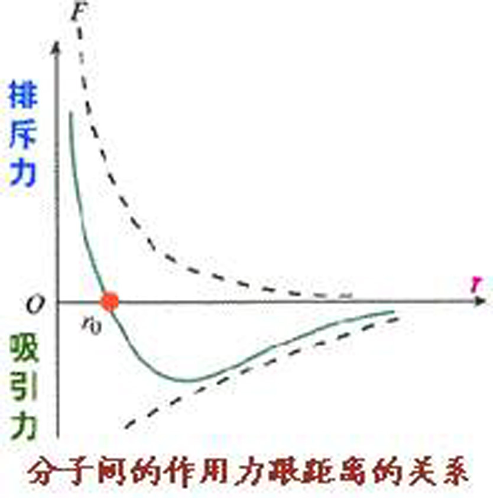
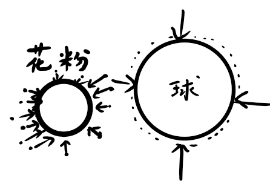

## 热量及其本质

“热量”是热学中最容易被误解的词之一。日常语言很容易让人以为热量像水一样“装在物体里面”，物体热一点就是“热量多一点”。但物理学中的热量并不是系统拥有的存货，而是能量以特定方式跨越系统边界时的记账名称。

## 学习目标

读完本页后，你应该能够：

- 初步了解热量、热容和潜热等基本概念。
- 了解热量的微观本质
- 理解热量与内能、功的区别与联系。
- 解释为什么热量是过程量，而不是状态量。

## 为什么这里必须讲“热量的本质”

许多初学者会把下面几句话混在一起：

- “这个物体温度高。”
- “这个物体有很多热量。”
- “这个物体内能很大。”
- “给它加热以后它吸收了热。”

这几句话在口语里似乎差不多，但在热学里必须严格区分。否则一到热力学定律、相变或热机问题，就会不断把状态量和过程量混写，最后变成“会代公式但不知道公式在记什么”。

## 研究对象与前提

本页讨论的是宏观系统与外界之间的能量交换。为避免符号混乱，先约定：

- 系统**吸收**热量时记作 $Q>0$；
- 系统**对外做功**时记作 $W<0$；
- 系统内部储存的能量用内能 $U$ 表示。

在后续热力学定律页面里，我们会更系统地讨论这些量之间的关系；本页先把概念地基打稳。

## 核心概念与物理图景

### 热量是什么

热量是**由于温度差而发生的能量传递**。只有当系统和外界之间因为温差而交换能量时，我们才把跨边界传递的这部分能量记为热量。

因此，热量有两个关键特征：

- 它描述的是**传递过程**，不是系统内部“存着什么”；
- 它必须和**边界**联系起来谈，因为热量本质上是跨边界的能量交换。

### 热容

某物质温度升高（或降低）$1\ \text{K}$ 所需吸收（或放出）的热量称为该物质的**热容**，用 $C$ 表示，在国际单位制中单位为焦耳每开尔文（J/K）。热容是物质的一个重要性质，反映了物质储存热能的能力。  
热容正比于物质的量。单位质量的热容称为**比热容**或**比热**，记作 $c$，单位为焦耳每千克每开尔文（J/(kg·K)）。每摩尔物质的热容称为**摩尔热容**，记作 $C^{mol}$，单位为焦耳每摩尔每开尔文（J/(mol·K)）。某些物质的比热容见下表：

| 物质 | 比热容 $c$ (J/(kg·K)) | 物质 | 比热容 $c$ (J/(kg·K)) |
| --- | --- | --- | --- |
| 水 | $4190$ | 海水 | $3900$ |
| 铝 | $900$ | 冰(-10℃) | $2220$ |
| 铜 | $387$ | 乙醇 | $2430$ |

关于热容的计算，我们将在之后的章节进行更深入的讨论。

### 潜热

相转变（如熔化、汽化）过程中吸收或放出的热量称为潜热。它正比于物质的量。我们把单位质量的潜热记作 $\Lambda$，单位为焦耳每千克（J/kg）。摩尔潜热记作 $\Lambda^{mol}$，单位为焦耳每摩尔（J/mol）。各种相变过程的潜热有具体的名称，如熔化热、汽化热、升华热等。某些物质的相变潜热见下表：

| 物质 | 熔点 /K | $\Lambda_{熔化}$ | 沸点 /K | $\Lambda_{汽化}$ |
| --- | --- | --- | --- | --- |
| 水 | 273.15 | 333 | 373.15 | 2256 |
| 氢 | 14.0 | 58.6 | 20.3 | 452 |
| 氧 | 54.8 | 13.8 | 90.2 | 213 |

### 分子力

分子力是分子之间的相互作用力，通常包括吸引力和斥力两部分。分子力的存在使得物质具有内能，并且在热学过程中起着重要作用。分子力的强弱和范围决定了物质的状态（固态、液态、气态）以及相变行为。

分子力将在之后的章节重点讨论，此处不做过多展开。

## 分子运动

热学中的分子运动是指组成物质的分子或原子在热能作用下的随机运动。这些运动包括平移、振动和旋转等不同形式。分子运动的强烈程度与温度有关，温度越高，分子运动越剧烈。分子运动是热量传递的基础，也是热学现象的根源。

- 布朗运动

对于一个宏观的物体，周围分子的撞击所传递给它的动量平均相互抵消，但由于涨落现象，在各个瞬时里或多或少有些不平衡。受力的物体越小，力的涨落效果越明显，这就是引起布朗粒子作无规则运动的原因。

- 热运动

热运动是指物质内部的分子或原子在热能作用下的随机运动。热运动是热学现象的根源，也是热量传递的基础。热运动的强烈程度与温度有关，温度越高，热运动越剧烈。  
分子热运动的能量中势能部分使它们趋于团聚，动能部分使它们趋于飞散，此二对立的因素总处于竞争的状态。大体来说：

| 平均动能与势能的关系 | 物质的状态 |
| --- | --- |
| $\frac{1}{2}m\overline{v^2} << E_B$ | 固态 |
| $\frac{1}{2}m\overline{v^2} \approx E_B$ | 液态 |
| $\frac{1}{2}m\overline{v^2} >> E_B$ | 气态 |

??? note "热运动的特点"
    - 微观粒子的运动永不停息、无规则。
    每个粒子的运动有极大的**偶然性**——无序性。
    - 对大量粒子的整体，运动表现出必然的、确定的规律——**统计规律**。

### 热量、内能、功到底怎么区分

- **内能 $U$**：系统状态的一部分，描述系统内部储存的能量。
- **热量 $Q$**：由于温差发生的能量传递，是过程量。
- **功 $W$**：由于宏观力学作用发生的能量传递，也是过程量。

同一个最终状态，可以通过不同方式到达：

- 放在热源旁边升温，主要通过热量改变内能；
- 用搅拌器做功，也可以让系统升温；
- 绝热压缩气体，同样可能让温度升高。

这说明系统真正“拥有”的是内能，不是热量。热量和功只是内能变化的两种常见通道。

???+ note "热量和功的异同"
    1. 都是过程量，与具体过程有关  
    2. 等效性：改变系统热运动状态作用相同  
    3. 功与热量的物理本质不同。功是宏观运动分子热运动。热量是分子热运动分子热运动  
    4. 一个具体过程是传热还是做功往往跟所选择的系统的组成有关。“热得快”烧水过程：水和电阻丝作为系统（宏观电功），单独考虑水作为系统（传热）

### 为什么说热量不是状态量

如果热量是状态量，那么系统一旦处于某个状态，就应该对应确定的“热量值”。可实验告诉我们，同一个初态和末态之间，热量大小会随着过程不同而变化。

例如让一杯水从 $20^\circ\text{C}$ 升到 $30^\circ\text{C}$：

- 可以把它放到温水中，让它吸热；
- 也可以用机械搅拌持续做功，让它升温；
- 还可以两种方式并用。

末态可能相同，但“以热量形式传进来的能量”显然不唯一，所以热量不可能只由状态决定。

## 为什么热量是过程量而不是状态量

可以把上面的判断整理成一条更清楚的逻辑链：

1. 系统的宏观状态可以改变，而改变状态时系统内能可能发生变化。
2. 这类变化既可能来自温差驱动的能量传递，也可能来自做功。
3. 对同一个初态和末态，不同过程中的热量传递并不唯一。
4. 因而热量不能只由系统状态决定，而必须依赖具体过程。
5. 所以热量是过程量；系统真正储存的是内能，而不是热量。

## 例题：混合热水和冷水时，热量在记什么

把 $0.20\ \text{kg}$、温度为 $80^\circ\text{C}$ 的热水与 $0.30\ \text{kg}$、温度为 $20^\circ\text{C}$ 的冷水混合。忽略容器吸热与散热，求平衡温度。取水的比热容为 $c=4.2\times 10^3\ \text{J/(kg·K)}$。

### 建模思路

把“热水 + 冷水”整体看成系统。由于容器绝热近似良好、又忽略外界做功，系统与外界之间几乎没有能量交换，所以内部满足：

- 热水放出的热量大小等于冷水吸收的热量大小；
- 最终两部分水达到同一平衡温度 $T_f$。

因此有

$$
m_h c(T_h-T_f)=m_c c(T_f-T_c).
$$

代入数值：

$$
0.20(80-T_f)=0.30(T_f-20).
$$

解得

$$
T_f = 44^\circ\text{C}.
$$

### 结果解释

这个例题里，“热量”记的是热水到冷水之间传递的能量，而不是最后的混合水“拥有了多少热量”。混合结束后，系统只有一个新的平衡状态；能被看成状态量的是这个新状态对应的内能，而不是某个残留在里面的“热量库存”。

??? note "补充理解：为什么打气筒会变热"
    给自行车打气时，气体常常会升温。这个现象提醒我们：温度升高并不自动意味着“吸收了热量”。如果压缩过程足够快，气体和外界几乎来不及交换热量，温度升高主要来自外界对气体做功。

## 常见误区与边界条件

!!! warning "常见误区"
    - 热量不是系统“含有”的量，系统含有的是内能。
    - 公式 $Q=mc\Delta T$ 只在不发生相变且比热容近似不变时才可直接使用。
    - 温度高不等于内能一定大，内能还与质量、物态和自由度有关。
    - 温度升高不一定因为吸热，也可能因为外界对系统做功。

!!! tip "学习建议"
    遇到热学题目时，先画清楚系统边界，再问两件事：能量是因为温差进出边界，还是因为力学作用进出边界？把这一步分清，后面的式子才不容易混。

## 学习衔接

- 建议先读：[温度](./temperature.md)
- 读完本页后可以继续阅读：[物质聚集态随状态参量的转化与共存](./phase-transitions-and-coexistence.md)、[气体](./gas.md)

如果你想继续追问“温度和热量改变后，物质为什么会变成另一种状态”，下一页最自然的去向是 [物质聚集态随状态参量的转化与共存](./phase-transitions-and-coexistence.md)。
