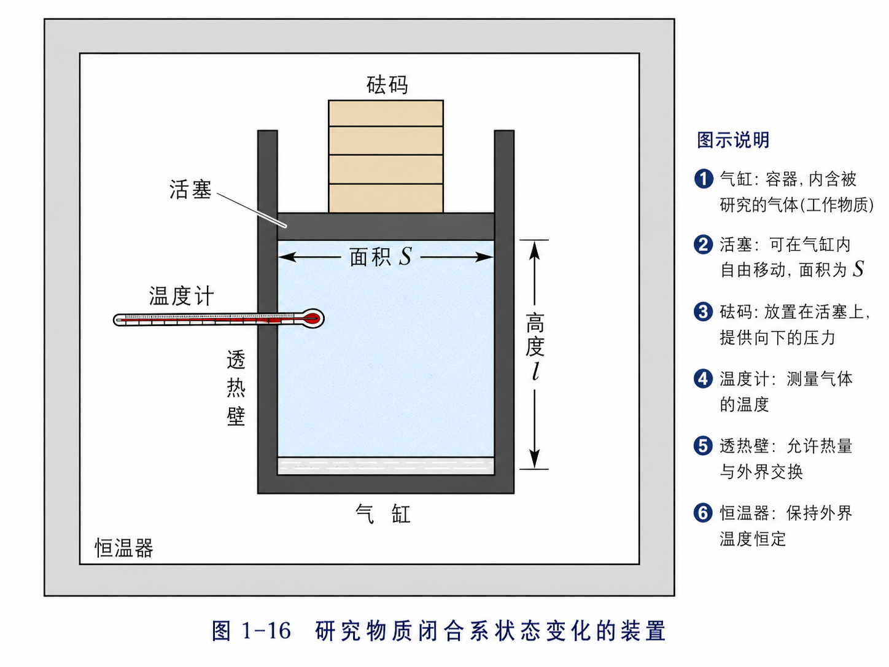
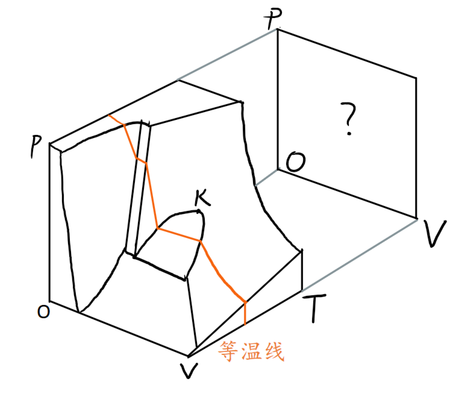
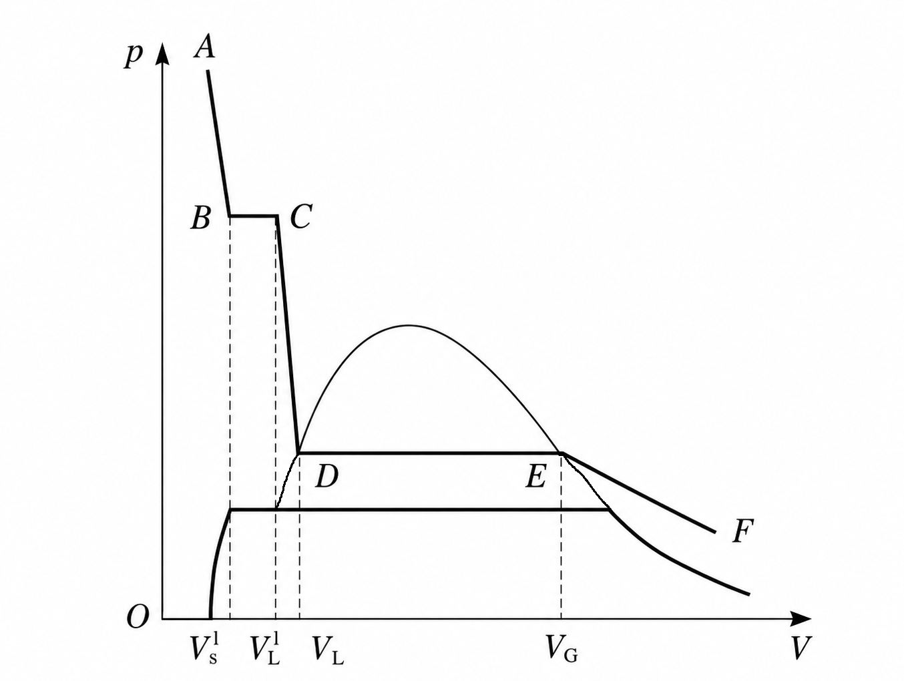
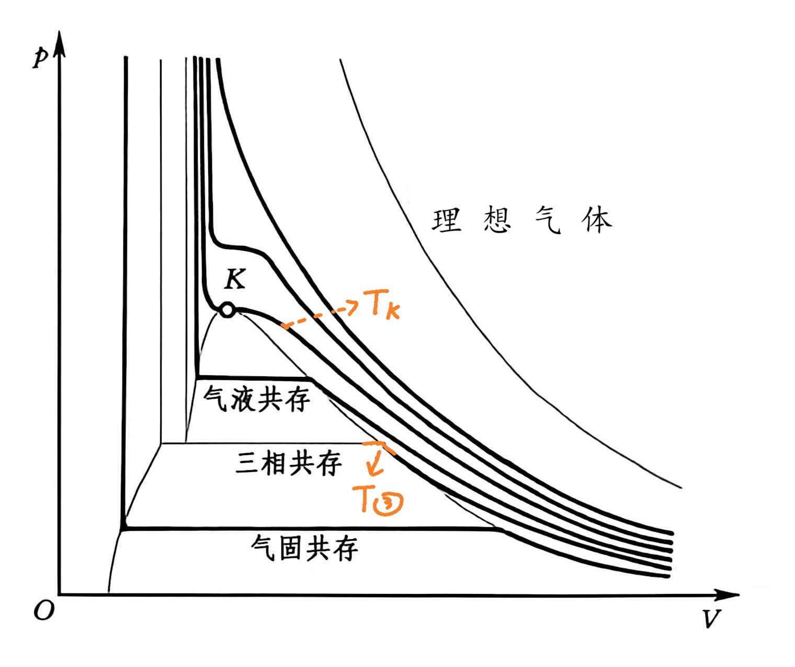
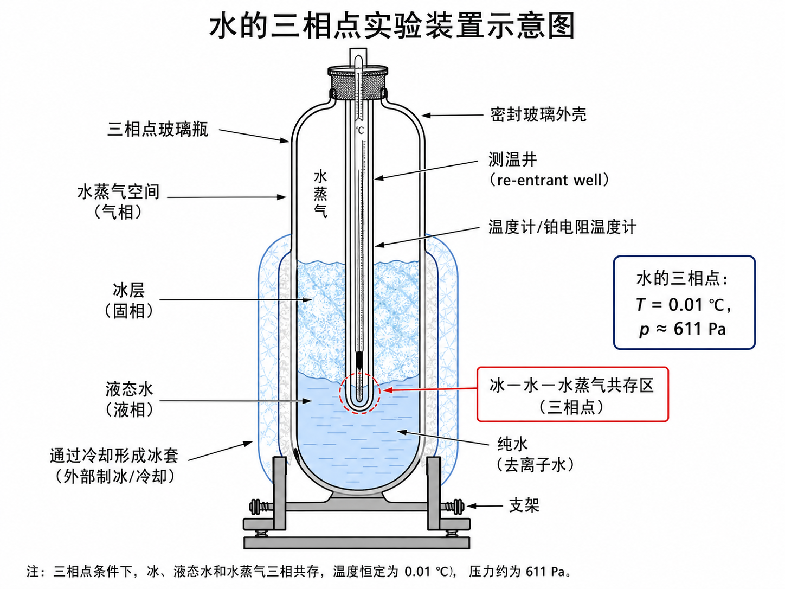
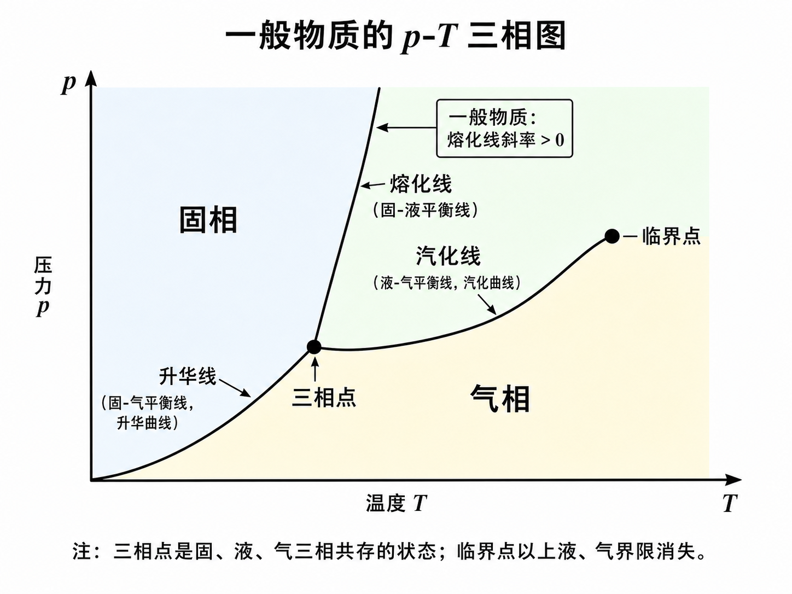

# 物质聚集态随状态参量的转化与共存

这一页负责把“温度”和“热量”进一步放进真实物质行为中来看。光知道系统会升温、降温还不够，我们还要问：为什么有时系统吸热后温度上升，有时却先发生熔化、沸腾或升华？为什么某些状态下两种物态还能同时存在？

这一页也往往是考察的重点和难点。

## 学习目标

读完本页后，你应该能够：

- 说清为什么纯物质在热平衡态下只需要两个独立状态参量来描述。
- 读懂 p-V 图中的水平共存段，并用杠杆定则判断两相比例。
- 区分临界点、三相点以及 p-T 三相图中的主要共存边界。

## 本页将重点处理什么

正文扩写时，这一页会沿着下面的主线展开：

1. 先限定研究对象：纯物质、闭合容器、热平衡态，以及为何只讨论状态参量而不是一般过程。
2. 再固定温度看等温线，识别气液共存、固液共存和对应的杠杆定则。
3. 然后比较不同温度下等温线的变化，找到临界点和三相点。
4. 最后把 p-V-T 曲面投影到 p-T 面上，读出三相图和各条共存线的物理意义。

## 核心内容

在日常生活中，我们发现物质有气、液、固三种常见的聚集态。倒一杯开水，你能直观地感受液、气共存（虽然你看不见水蒸气）；在冷饮中放入冰块，你能看到固、液共存——事实上，此时液面之上是存在水蒸气的，因此这实际上是固液气共存的状态。  
然而，这些都不是此处要讨论的实验规律，原因有三：一、物相还在转化，未出于热平衡；二、容器敞开，气态的体积不定；三、物质组分不纯，特别是水汽混在空气中，其分压不等于液面承受的全部压强。

为了得到确定的实验规律，我们把单一的纯物质密封在闭合容器里，研究它们出于热平衡态下的性质。实验装置如图所示：

我们通过实验发现，被封存物质的三个状态参量 $p$、$T$ 和 $V$ 都是可调节的，但是它们并不能完全独立地设置，比如，在一定的温度下，压强增加必然会导致体积减小。我们发现，三个状态参量中只有两个是独立的，第三个状态参量可以由前两个状态参量唯一确定。也就是说，物质的状态可以用两个状态参量来描述。于是，我们可以做出某种物质的 $p$-$T$、$p$-$V$ 或 $T$-$V$ 图来描述它的状态变化规律。

### 等温线 多相共存

我们可以得到一个长成这样的 p-V-T 曲面，但是p-V-T 曲面是立体的，函数关系难以一目了然。我们不妨将一个参量固定，去研究其他两个参量之间的依赖关系。这相当于取一个垂直于某轴的平面去切割 p-V-T 曲面，将割线投影到平面上去研究。

首先我们把温度固定，即用垂直于 T 轴的一个平面去切割 p-V-T 曲面，这样得到的割线称为等温线，它们在 pV 面上的投影见下图。   

> 本图是**通常**物质的 p-V-T 曲面。想想看水的 p-V-T 曲面是什么样子的？

该 p-V 图中的等温线引人注目的特征是它在有的地方是水平的，即体积 V 可以在一定范围内改变而不改变压强。这些都是两相或三相共存的地方，让我们仔细地讨论其中的一段。

> 仿照《新概念物理教程 热学》图 1-18 绘制

#### 气液共存的杠杆定则

看图1-18中的等温线 ABCDEF，其 BC、DE 两段是水平的，说明两相共存时压强固定，体积变化只改变相比例。

$F \to E$ : 纯气态压缩，体积减小，压强升高。  
$E \to D$ : 气液共存，体积变化不改变压强。不断有更多物质被液化，但维持液面上气态的压强不变，这个压强就是该物质在该温度下的**饱和蒸气压**。  
$D \to C$ : 纯液态压缩，体积减小，压强升高。  
$C \to B$ : 气固共存，体积变化不改变压强。不断有更多物质被固化。

以气液共存段 $E \to D$ 为例。压缩过程中，体系始终维持在该温度下的饱和蒸气压上。E、D 两点分别对应纯气态和纯液态，因此

$$
V_E = \nu V_g^\mathrm{mol},\qquad V_D = \nu V_L^\mathrm{mol},
$$

其中 $\nu$ 是总摩尔数。设气、液两相的摩尔分数为

$$
x_g = \frac{v_g}{\nu},\qquad x_L = \frac{v_L}{\nu},\qquad x_g + x_L = 1,
$$

并记平均摩尔体积

$$
\overline{V} = \frac{V}{\nu},
$$

则有

$$
\overline{V} = x_g V_g^\mathrm{mol} + x_L V_L^\mathrm{mol}.
$$

整理可得

$$
x_g = \frac{\overline{V} - V_L^\mathrm{mol}}{V_g^\mathrm{mol} - V_L^\mathrm{mol}},\qquad
x_L = \frac{V_g^\mathrm{mol} - \overline{V}}{V_g^\mathrm{mol} - V_L^\mathrm{mol}}.\tag{1}
$$

这就是气液共存的杠杆定则：平均摩尔体积在两端摩尔体积之间的位置，直接决定气、液两相的比例。

同理，$C \to B$ 段对应固液共存。若把气相换成固相，把 \(V_g^\mathrm{mol}\) 换成 \(V_s^\mathrm{mol}\)，就得到完全同型的关系式。

刚才我们所选择的那条等温线是比较典型的，它全面反映了气、液、固三态的转变过程。下面只看温度变化会带来什么结果。

#### 临界点

如图，当等温线的温度升高时，气液共存线逐渐缩短，说明气、液体积的差别在减小。到 $T_K$ 时，共存线缩成一点 $K$，气液之间不再有突变，转变变为连续过程。$K$ 称为临界点，$T_K$ 称为临界温度。高于临界温度后，不能再用等温压缩把气体液化。

#### 三相点

当等温线的温度降低时，气液共存线与固液共存线彼此靠近；到 $T_0$ 时，两条线合并，液态不再出现。再降到 $T_\odot$ 时，气、液、固三态同时共存，这个温度叫三相点。

三相点的温度与外界压强无关，因此可以作为非常稳定的温标固定点。水的三相点装置如图1-22所示。

??? note "水三相点的制备"
    实验时先将三相点管预冷，再在温度计管内形成冰衣；当冰衣长到合适厚度后，让其表面薄薄融化一层，把杂质留在外侧水里。这样，温度计外壁附近就能得到纯冰、纯水和水蒸气共存状态。

#### p-T 三相图

把 p-V-T 曲面投影到 p-T 面上，三相共存线和两相共存面的投影会合于三相点的投影 $\Theta$。其中 $\Theta K$、$\Theta L$、$\Theta S$ 分别是气液、固液、气固共存边界；$\Theta K$ 还是饱和蒸气压随温度变化的曲线，$S\Theta$ 则是固态共存时的饱和蒸气压曲线。临界点 $K$ 以上，气液之间没有清晰分界，过渡是连续的。

这张图把各相的存在区和相互转变路径放在一起，适合用来判断某个温度和压强下物质处于哪一相区。

| 物质 | $p_K / 10^5\,\text{Pa}$ | $T_K / \text{K}$ | $V_K^{\text{mol}} / (\text{m}^3 \cdot \text{mol}^{-1})$ | $p_3 / 10^5\,\text{Pa}$ | $T_3 / \text{K}$ | $V_3^{\text{mol}} / (\text{m}^3 \cdot \text{mol}^{-1})$ |
|------|------------------------|-----------------|------------------------------------------------------|-------------------------|-----------------|------------------------------------------------------|
| Ne   | 27                     | 44              | $42 \times 10^{-6}$                                   | 0.43                    | 24              | $16 \times 10^{-6}$                                   |
| Ar   | 49                     | 151             | $72 \times 10^{-6}$                                   | 0.68                    | 84              | $28 \times 10^{-6}$                                   |
| Kr   | 55                     | 209             | $92 \times 10^{-6}$                                   | 0.73                    | 116             | $35 \times 10^{-6}$                                   |
| N₂   | 34                     | 126             | $90 \times 10^{-6}$                                   | 0.12                    | 63              | $17 \times 10^{-6}$                                   |
| CO₂  | 74                     | 304             | $94 \times 10^{-6}$                                   | 5.10                    | 216             | $42 \times 10^{-6}$                                   |
| H₂O  | 221                    | 647             | $59 \times 10^{-6}$                                   | 0.006                   | 273.16          | $18 \times 10^{-6}$                                   |
| O₂   | 50                     | 155             | $73 \times 10^{-6}$                                   | 9.0015                  | 54              | $24 \times 10^{-6}$                                   |
| H₂   | 13                     | 33              | $65 \times 10^{-6}$                                   | 0.072                   | 14              | $25 \times 10^{-6}$                                   |
 
> 上表列出了几种常见物质的临界点和三相点数据。

## 学习衔接

- 建议先读：[温度](./temperature.md)、[热量及其本质](./heat-and-its-nature.md)
- 读完本页后可以继续阅读：[气体](./gas.md)、[液体](./liquid.md)

从这一页开始，第一章会逐步从抽象概念转向不同物态的具体特征。
