## 循环过程和卡诺循环

## 学习目标

读完本页后，你应该能够：

- 解释循环过程的基本概念，区分正循环（热机）和逆循环（制冷机）
- 写出热机效率的一般定义，并理解其物理意义
- 描述卡诺循环的四个过程，计算各过程的功和热量
- 推导卡诺效率公式，理解其与温度的关系
- 分析奥托循环、迪赛尔循环和斯特林循环的 p-V 图和效率
- 比较不同热机循环的特点、优缺点和应用场景
- 了解不可逆因素对实际热机效率的影响

## 本页将重点处理什么

1. 循环过程的热力学基础：定义、分类、效率计算方法
2. 卡诺循环：理想基准，详细过程分析与效率推导
3. 实际热机循环：奥托、迪赛尔、斯特林循环的 p-V 图、过程分析、效率计算
4. 不可逆因素对实际热机效率的影响
5. 现实应用案例：地热发电、核电站

## 符号约定

为统一符号，本文采用以下约定：

1. **下标约定**：下标 $1$ 表示高温（热源/状态），下标 $2$ 表示低温（热源/状态）
2. **撇号约定**：右上角带撇（$'$）的量表示放热或系统对外做功，不带撇的量表示吸热或外界对系统做正功

例如：
- $Q_1$：系统从高温热源**吸收**的热量（吸热，不带撇）
- $Q_2'$：系统向低温热源**放出**的热量（放热，带撇）
- $A$：外界对系统做的功（外界对系统做正功，不带撇）
- $A'$：系统对外做的功（系统对外做功，带撇）

## 核心内容

### 循环过程

**循环过程（Cycle process）** 是指热力学系统经历一系列状态变化后，最终回到初始状态的过程。由于内能 $U$ 是状态量，系统经历一个完整循环后，内能变化为零：

$$
\Delta U = \oint \text{d}U = 0
$$

根据热力学第一定律 $Q = \Delta U + A$，对于循环过程有：

$$
\oint \delta Q = \oint \delta A
$$

即：**循环过程中净吸热等于净做功**。

#### 正循环与逆循环

根据循环进行的方向，可以分为：

- **正循环（Direct cycle）**：系统沿顺时针方向在 p-V 图上进行循环，净功 $A' > 0$，系统对外做功。此时 $Q_1 > Q_2'$，系统从高温热源吸热，向低温热源放热，称为**热机**。
- **逆循环（Reverse cycle）**：系统沿逆时针方向在 p-V 图上进行循环，净功 $A < 0$，外界对系统做功。此时热量从低温热源传向高温热源，称为**制冷机**或**热泵**。

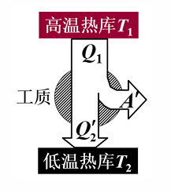
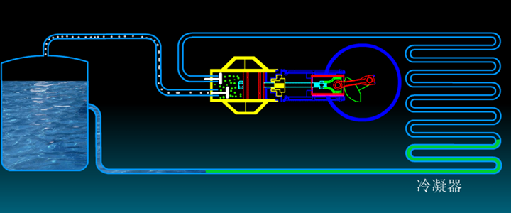
> 热机示意图

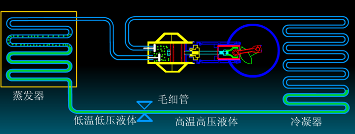
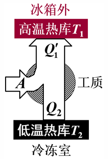
> 制冷机示意图

#### 热机效率

对于热机，我们关心的是：吸收的热量中有多少转化为有用的功。定义**热机效率**为：

$$
\eta = \dfrac{A'}{Q_1} = \dfrac{Q_1 - Q_2'}{Q_1} = 1 - \dfrac{Q_2'}{Q_1}
$$

其中：
- $Q_1$：系统从高温热源吸收的热量（吸热，不带撇）
- $Q_2'$：系统向低温热源放出的热量（放热，带撇）
- $A' = Q_1 - Q_2'$：系统对外做的净功（系统对外做功，带撇）

???+ warning "注意"
    效率 $\eta$ 总是小于 1 的。这意味着不可能把吸收的热量全部转化为功——总有一部分热量需要排放到低温热源。这是热力学第二定律的体现（将在第四章详细讨论）。

### 理想气体卡诺循环及其效率

**卡诺循环（Carnot cycle）** 是由法国工程师萨迪·卡诺（Sadi Carnot）于 1824 年提出的一种理想热机循环。它由两个等温过程和两个绝热过程组成，是理论上效率最高的热机循环。

卡诺循环工作在两个热源之间：
- **高温热源**（温度 $T_1$）：提供热量
- **低温热源**（温度 $T_2$）：吸收排放的热量

#### 卡诺循环的四个过程

设工作物质为 $\nu$ 摩尔理想气体，初始状态为 $(p_1, V_1, T_1)$。

**过程 1→2：等温膨胀（吸热）**

气体与高温热源 $T_1$ 接触，从状态 1 等温膨胀到状态 2。由于温度不变，内能不变（理想气体），根据热力学第一定律：

$$
Q_1 = A'_{1 \to 2} = \int_{V_1}^{V_2} p \,\mathrm{d}V = \nu R T_1 \ln\dfrac{V_2}{V_1}
$$

气体从高温热源吸收热量 $Q_1$，对外做功。

**过程 2→3：绝热膨胀（降温）**

气体与热源脱离，进行绝热膨胀，温度从 $T_1$ 降到 $T_2$，体积从 $V_2$ 膨胀到 $V_3$。此过程中：

$$
Q = 0, \quad A'_{2 \to 3} = -\Delta U = \nu C_V^{mol}(T_1 - T_2)
$$

满足绝热方程：

$$
T_1 V_2^{\gamma-1} = T_2 V_3^{\gamma-1}
$$

**过程 3→4：等温压缩（放热）**

气体与低温热源 $T_2$ 接触，从状态 3 等温压缩到状态 4。内能不变，外界对气体做功，气体向低温热源放出热量：

$$
Q_2' = -A_{3 \to 4} = -\int_{V_3}^{V_4} p \,\mathrm{d}V = \nu R T_2 \ln\dfrac{V_3}{V_4}
$$

**过程 4→1：绝热压缩（升温）**

气体与热源脱离，进行绝热压缩，温度从 $T_2$ 回升到 $T_1$，体积从 $V_4$ 压缩回 $V_1$。此过程中：

$$
Q = 0, \quad A_{4 \to 1} = -\Delta U = \nu C_V^{mol}(T_2 - T_1)
$$

满足绝热方程：

$$
T_2 V_4^{\gamma-1} = T_1 V_1^{\gamma-1}
$$

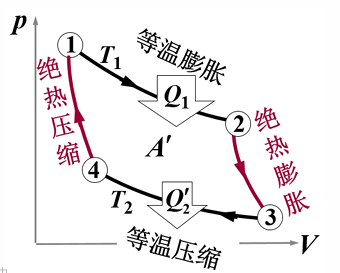

#### 卡诺效率的推导

根据热机效率定义：

$$
\eta_C = 1 - \dfrac{Q_2'}{Q_1}
$$

代入等温过程的热量表达式：

$$
\dfrac{Q_2'}{Q_1} = \dfrac{\nu R T_2 \ln(V_3/V_4)}{\nu R T_1 \ln(V_2/V_1)} = \dfrac{T_2 \ln(V_3/V_4)}{T_1 \ln(V_2/V_1)}
$$

利用两个绝热过程的约束条件：

$$
T_1 V_2^{\gamma-1} = T_2 V_3^{\gamma-1}, \quad T_2 V_4^{\gamma-1} = T_1 V_1^{\gamma-1}
$$

两式相除：

$$
\dfrac{V_2^{\gamma-1}}{V_1^{\gamma-1}} = \dfrac{V_3^{\gamma-1}}{V_4^{\gamma-1}} \implies \dfrac{V_2}{V_1} = \dfrac{V_3}{V_4}
$$

因此：

$$
\dfrac{Q_2'}{Q_1} = \dfrac{T_2}{T_1}
$$

最终得到**卡诺效率**：

$$
\boxed{\eta_C = 1 - \dfrac{T_2}{T_1}}
$$

???+ tip "重要结论"
    卡诺效率只取决于高温热源温度 $T_1$ 和低温热源温度 $T_2$，与工作物质无关。温度差越大，效率越高。

#### 卡诺定理简介

卡诺定理指出：**所有工作在相同高温热源 $T_1$ 和低温热源 $T_2$ 之间的热机，可逆热机的效率最高，且所有可逆热机效率相同。**

这意味着：
1. 卡诺效率 $\eta_C = 1 - T_2/T_1$ 是热机效率的**理论上限**  
2. 任何实际热机的效率都不可能超过卡诺效率  
3. 不可逆因素（如摩擦、有限温差传热）会降低效率

???+ warning "注意"
    卡诺定理的严格证明需要热力学第二定律（将在第四章讨论）。这里我们只给出结论，重点在于理解其物理意义。

???+ tip "实际循环的效率参考"
    液体燃料火箭：$\eta = 48\%$  
    柴油机：$\eta = 37\%$  
    汽油机：$\eta = 25\%$  
    蒸汽机：$\eta = 8\%$  
    因此如果你算出一个很大的效率，就要怀疑你的计算是否正确啦。

### 其他循环

#### 奥托循环（Otto Cycle）——汽油机的理想模型

**奥托循环**是四冲程汽油发动机的理想热力学循环，由德国工程师尼古拉斯·奥托（Nikolaus Otto）于 1876 年实现。

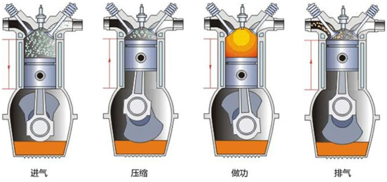

##### 工作原理

奥托循环由以下四个过程组成：

1. **a→b：绝热压缩**：活塞向上运动，压缩混合气体，体积从 $V_1$ 减小到 $V_2$
2. **b→c：等体加热**：火花塞点火，混合气体燃烧，体积不变，压强和温度急剧升高
3. **c→d：绝热膨胀**：高温高压气体推动活塞向下运动，对外做功，体积从 $V_2$ 膨胀到 $V_1$
4. **d→a：等体放热**：排气阀打开，压强迅速下降（热力学分析中简化为等体放热）

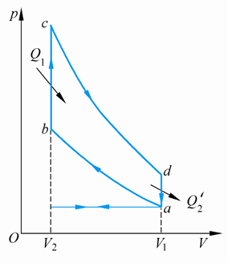

##### 过程分析

**过程 a→b：绝热压缩**

压缩比定义为 $r = V_1/V_2$（$r > 1$）。由绝热方程：

$$
T_b = T_a \left(\dfrac{V_1}{V_2}\right)^{\gamma-1} = T_a r^{\gamma-1}
$$

外界对气体做功，温度升高。

**过程 b→c：等体加热**

气体吸收热量 $Q_1$，温度从 $T_b$ 升高到 $T_c$：

$$
Q_1 = \nu C_V^{mol}(T_c - T_b)
$$

体积不变，不做功。

**过程 c→d：绝热膨胀**

气体对外做功，温度降低：

$$
T_d = T_c \left(\dfrac{V_2}{V_1}\right)^{\gamma-1} = T_c \left(\dfrac{1}{r}\right)^{\gamma-1} = \dfrac{T_c}{r^{\gamma-1}}
$$

**过程 d→a：等体放热**

气体放出热量 $Q_2'$，温度从 $T_d$ 降低到 $T_a$：

$$
Q_2' = \nu C_V^{mol}(T_d - T_a)
$$

##### 效率计算

$$
\eta_{\text{Otto}} = 1 - \dfrac{Q_2'}{Q_1} = 1 - \dfrac{T_d - T_a}{T_c - T_b}
$$

利用绝热关系 $T_b = T_a r^{\gamma-1}$ 和 $T_d = T_c / r^{\gamma-1}$：

$$
\eta_{\text{Otto}} = 1 - \dfrac{T_c/r^{\gamma-1} - T_a}{T_c - T_a r^{\gamma-1}} = 1 - \dfrac{1}{r^{\gamma-1}}
$$

$$
\boxed{\eta_{\text{Otto}} = 1 - \dfrac{1}{r^{\gamma-1}}}
$$

##### 特点

- **优点**：结构简单，压缩比高时效率高  
- **缺点**：压缩比过高会导致爆震（异常燃烧），限制了实际效率  
- **应用**：汽油发动机，转速高，功率密度大

??? note "例题：计算奥托循环效率"
    **题目**：一台汽油发动机的压缩比为 $r = 8$，工作物质为空气（$\gamma = 1.4$）。求该发动机的理论效率。

    **解答**：  
    代入奥托效率公式：

    $$  
    \eta_{\text{Otto}} = 1 - \dfrac{1}{r^{\gamma-1}} = 1 - \dfrac{1}{8^{0.4}} \approx 1 - 0.435 = 0.565  
    $$

    理论效率约为 56.5%。实际汽油机效率通常在 25%~35% 之间，因为存在摩擦、散热损失、不完全燃烧等不可逆因素。

#### 迪赛尔循环（Diesel Cycle）——柴油机的理想模型

**迪赛尔循环**是四冲程柴油发动机的理想热力学循环，由德国工程师鲁道夫·迪赛尔（Rudolf Diesel）于 1893 年发明。

##### 工作原理

迪赛尔循环与奥托循环的主要区别在于：**加热过程是等压加热而非等体加热**。这是因为柴油机靠压缩点火，燃烧过程持续一段时间，活塞继续下行。

迪赛尔循环由以下过程组成：

1. **1→2：绝热压缩**：空气被压缩到很高温度（压缩比比汽油机更高）
2. **2→3：等压加热**：柴油喷入高温空气中自燃，燃烧过程中压强基本不变，体积膨胀
3. **3→4：绝热膨胀**：高温高压气体推动活塞做功
4. **4→1：等体放热**：排气，压强下降

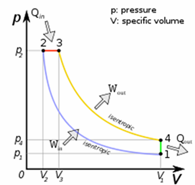

##### 过程分析

**过程 1→2：绝热压缩**

压缩比 $r = V_1/V_2$，温度升高：

$$
T_2 = T_1 r^{\gamma-1}
$$

**过程 2→3：等压加热**

定义**截止比**（预胀比）$\rho = V_3/V_2$（$\rho > 1$），表示燃烧过程中体积膨胀的程度。等压过程中：

$$
Q_1 = \nu C_p^{mol}(T_3 - T_2) = \nu C_p^{mol} T_2(\rho - 1)
$$

由等压过程 $V/T = \text{const}$，得 $T_3 = T_2 \rho$。

**过程 3→4：绝热膨胀**

膨胀比为 $V_4/V_3 = (V_4/V_2) \cdot (V_2/V_3) = r/\rho$，因此：

$$
T_4 = T_3 \left(\dfrac{V_3}{V_4}\right)^{\gamma-1} = T_3 \left(\dfrac{\rho}{r}\right)^{\gamma-1} = T_1 \rho^\gamma
$$

**过程 4→1：等体放热**

$$
Q_2' = \nu C_V^{mol}(T_4 - T_1) = \nu C_V^{mol}(T_1 \rho^\gamma - T_1) = \nu C_V^{mol} T_1(\rho^\gamma - 1)
$$

##### 效率计算

$$
\eta_{\text{Diesel}} = 1 - \dfrac{Q_2'}{Q_1} = 1 - \dfrac{C_V^{mol} T_1(\rho^\gamma - 1)}{C_p^{mol} T_2(\rho - 1)} = 1 - \dfrac{1}{\gamma} \cdot \dfrac{\rho^\gamma - 1}{\rho - 1} \cdot \dfrac{T_1}{T_2}
$$

代入 $T_2 = T_1 r^{\gamma-1}$：

$$
\boxed{\eta_{\text{Diesel}} = 1 - \dfrac{1}{r^{\gamma-1}} \cdot \dfrac{\rho^\gamma - 1}{\gamma(\rho - 1)}}
$$

##### 特点

- **优点**：压缩比高（可达 15~25），效率比汽油机高；不易爆震；扭矩大
- **缺点**：结构笨重，转速低；喷油系统复杂
- **应用**：柴油发动机，广泛用于卡车、船舶、发电机

??? note "例题：比较奥托循环和迪赛尔循环效率"
    **题目**：某汽油机压缩比 $r_{\text{Otto}} = 8$，某柴油机压缩比 $r_{\text{Diesel}} = 20$，截止比 $\rho = 2$，$\gamma = 1.4$。比较两者的理论效率。

    **解答**：

    汽油机（奥托循环）：  
    $$  
    \eta_{\text{Otto}} = 1 - \dfrac{1}{8^{0.4}} \approx 0.565 = 56.5\%  
    $$

    柴油机（迪赛尔循环）：  
    $$  
    \eta_{\text{Diesel}} = 1 - \dfrac{1}{20^{0.4}} \cdot \dfrac{2^{1.4} - 1}{1.4(2-1)} \approx 1 - 0.301 \times 1.219 = 0.633 = 63.3\%  
    $$

    柴油机效率更高，主要因为压缩比更大。

#### 斯特林循环（Stirling Cycle）——外燃机的理想模型

**斯特林循环**是由苏格兰牧师罗伯特·斯特林（Robert Stirling）于 1816 年发明的一种闭式再生循环。它由两个等温过程和两个等体过程组成，理论上效率等于卡诺效率。

##### 工作原理

斯特林循环的关键特点是使用**回热器（Regenerator）**，在等体过程中储存和释放热量，从而实现接近卡诺效率的热力学循环。

斯特林循环由以下四个过程组成：

1. **A→B：等温压缩**：气体与高温热源接触，等温压缩，放热 $Q_1'$  
2. **B→C：等体冷却**：气体体积不变，通过回热器将热量传递给回热器，温度从 $T_1$ 降到 $T_2$  
3. **C→D：等温膨胀**：气体与低温热源接触，等温膨胀，吸热 $Q_2$
4. **D→A：等体加热**：气体体积不变，从回热器吸收热量，温度从 $T_2$ 回升到 $T_1$

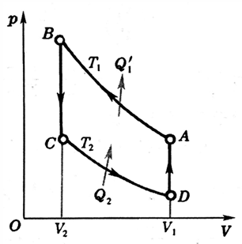
> 逆向斯特林循环

##### α型与β型斯特林循环

斯特林发动机有两种主要构型：

**α型斯特林循环**：
- 使用两个独立的气缸（动力活塞和置换活塞）
- 结构简单，但密封困难
- 适合大功率应用

**β型斯特林循环**：
- 使用单个气缸，两个活塞在同一轴上
- 结构紧凑，密封性好
- 适合小功率应用

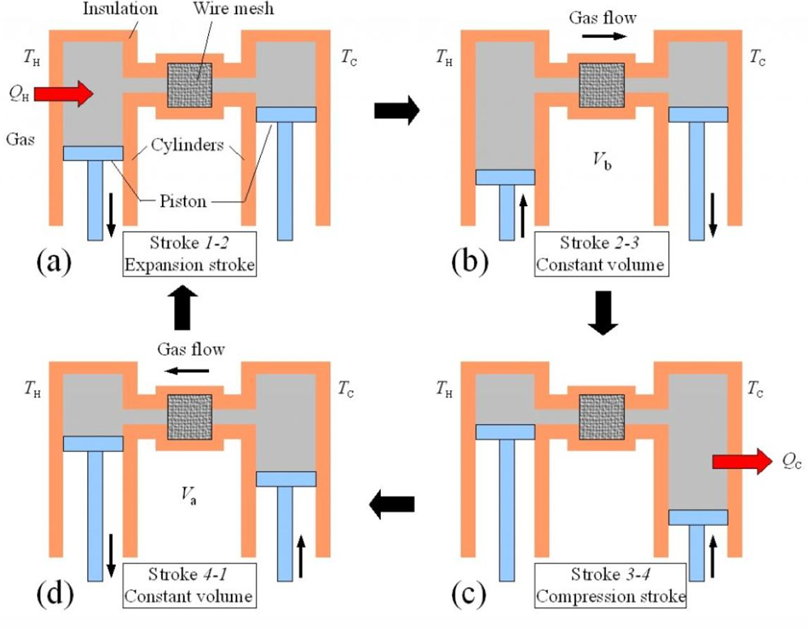
> $\alpha$ 型斯特林循环
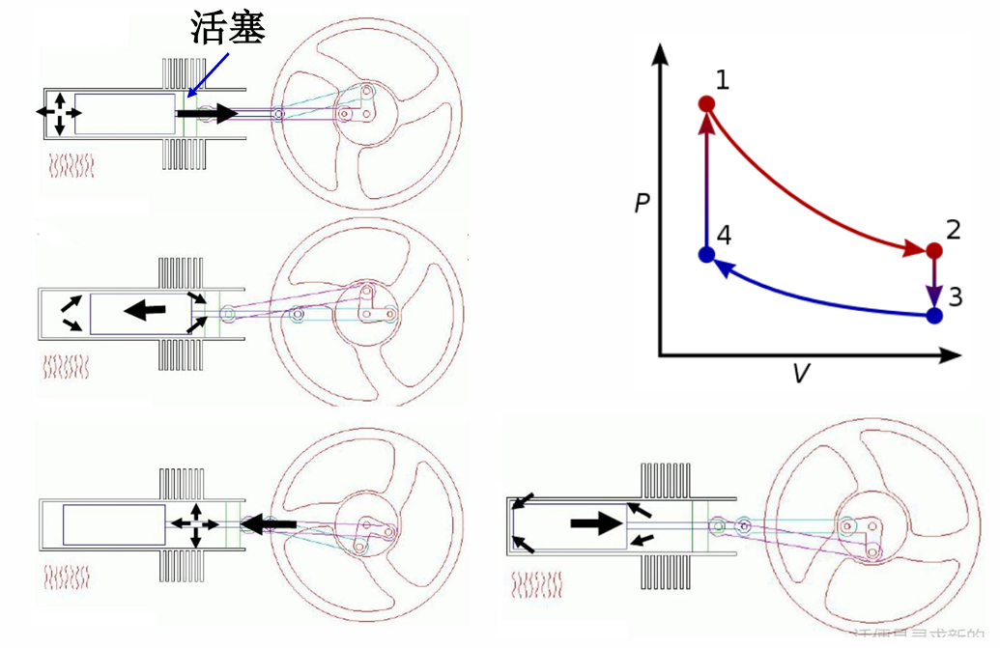
> $\beta$ 型斯特林循环

##### 过程分析

**过程 A→B：等温压缩**

外界对气体做功，气体向高温热源 $T_1$ 放热：

$$
Q_1' = -A_{A \to B} = \nu R T_1 \ln\dfrac{V_1}{V_2}
$$

**过程 B→C：等体冷却**

体积不变，不做功。气体通过回热器释放热量：

$$
Q_{BC} = \nu C_V^{mol}(T_2 - T_1) < 0
$$

**过程 C→D：等温膨胀**

气体从低温热源 $T_2$ 吸热，对外做功：

$$
Q_2 = A'_{C \to D} = \nu R T_2 \ln\dfrac{V_1}{V_2}
$$

（注意 $V_B = V_C = V_2$，$V_A = V_D = V_1$）

**过程 D→A：等体加热**

体积不变，不做功。气体从回热器吸收热量：

$$
Q_{DA} = \nu C_V^{mol}(T_1 - T_2) > 0
$$

##### 效率计算

循环净功：

$$
A' = Q_1' + Q_{BC} + Q_2 + Q_{DA}
$$

由于 $Q_{BC} + Q_{DA} = 0$（回热器中储存和释放的热量相互抵消），因此：

$$
A' = Q_1' + Q_2
$$

效率：

$$
\eta_{\text{Stirling}} = 1 - \dfrac{|Q_2|}{|Q_1'|} = 1 - \dfrac{T_2 \ln(V_1/V_2)}{T_1 \ln(V_1/V_2)} = 1 - \dfrac{T_2}{T_1}
$$

$$
\boxed{\eta_{\text{Stirling}} = 1 - \dfrac{T_2}{T_1} = \eta_C}
$$

##### 特点

- **优点**：理论效率等于卡诺效率（效率最高）；可使用外燃，燃料适应性广；运转平稳，噪音小
- **缺点**：功率密度低；需要回热器，结构复杂；响应速度慢
- **应用**：太阳能热发电、潜艇动力、微型热电联产

???+ tip "回热器的作用"
    回热器是斯特林循环的关键部件。它在等体冷却过程中储存气体释放的热量，然后在等体加热过程中将这些热量返回给气体。这样，等体过程中的热量交换只在气体和回热器之间进行，不需要与外部热源交换，从而提高了效率。

### 各循环效率对比

| 循环类型 | 效率公式 | 主要参数 | 理论效率特点 |
| :--- | :--- | :--- | :--- |
| 卡诺循环 | $\eta_C = 1 - \dfrac{T_2}{T_1}$ | 温度 $T_1$, $T_2$ | 效率最高，只与温度有关 |
| 奥托循环 | $\eta_{\text{Otto}} = 1 - \dfrac{1}{r^{\gamma-1}}$ | 压缩比 $r$ | 压缩比越大，效率越高 |
| 迪赛尔循环 | $\eta_{\text{Diesel}} = 1 - \dfrac{1}{r^{\gamma-1}} \cdot \dfrac{\rho^\gamma - 1}{\gamma(\rho - 1)}$ | 压缩比 $r$，截止比 $\rho$ | 压缩比大，效率高；截止比增加，效率降低 |
| 斯特林循环 | $\eta_{\text{Stirling}} = 1 - \dfrac{T_2}{T_1}$ | 温度 $T_1$, $T_2$ | 理论上等于卡诺效率 |

### 各循环特点对比

| 循环类型 | 工作方式 | 优点 | 缺点 | 典型应用 |
| :--- | :--- | :--- | :--- | :--- |
| 卡诺循环 | 理想循环 | 效率最高 | 理论模型，无法实现 | 热机效率的理论基准 |
| 奥托循环 | 内燃，等体加热 | 结构简单，转速高，功率密度大 | 易爆震，效率受限 | 汽油发动机 |
| 迪赛尔循环 | 内燃，等压加热 | 压缩比高，效率高，扭矩大 | 结构笨重，转速低 | 柴油发动机 |
| 斯特林循环 | 外燃，等温+等体 | 效率高，噪音小，燃料适应性广 | 功率密度低，响应慢 | 太阳能热发电，潜艇 |

### 不可逆因素对实际热机效率的影响

实际热机的效率总是低于理论效率，主要原因是各种**不可逆因素**：

1. **摩擦损失**：活塞与气缸壁之间、轴承等处的摩擦会消耗部分功
2. **有限温差传热**：实际传热需要温差，导致不可逆损失
3. **不完全燃烧**：燃料不能完全燃烧，释放的热量少于理论值
4. **散热损失**：部分热量通过气缸壁散失到环境中
5. **泵气损失**：进气和排气过程中消耗的功
6. **节流损失**：气体通过阀门时的不可逆膨胀

???+ warning "实际效率 vs 理论效率"
    | 发动机类型 | 理论效率 | 实际效率 |  
    | :--- | :---: | :---: |  
    | 汽油机（奥托循环） | 50%~60% | 25%~35% |  
    | 柴油机（迪赛尔循环） | 60%~70% | 35%~45% |  
    | 斯特林发动机 | 接近卡诺效率 | 30%~40% |

    实际效率的提高主要依赖于：减少摩擦、改善燃烧、优化热管理、提高压缩比（在材料允许范围内）。

### 现实案例

#### 热机做功发电——地热资源

**地热发电**是利用地球内部的热能来驱动热机发电的技术。地热能是一种可再生能源，具有稳定、可靠、清洁的特点。

##### 基本原理

地热发电的核心思想是：**将地下的热能转化为机械能，再转化为电能**。根据地热资源的温度不同，主要有三种发电方式：

**1. 干蒸汽发电（高温地热，>235°C）**

地下蒸汽直接引入汽轮机做功，这是最简单的地热发电方式。

```
高温蒸汽 → 汽轮机 → 发电机 → 电力
         ↓
      冷凝器 → 冷却水
```

**2. 闪蒸发电（中高温地热，150~235°C）**

高压热水在低压容器中突然蒸发（闪蒸），产生蒸汽驱动汽轮机。

**3. 双循环发电（中低温地热，<150°C）**

使用低沸点工质（如异丁烷、异戊烷），通过换热器从地热流体中吸收热量，工质蒸发后驱动汽轮机。

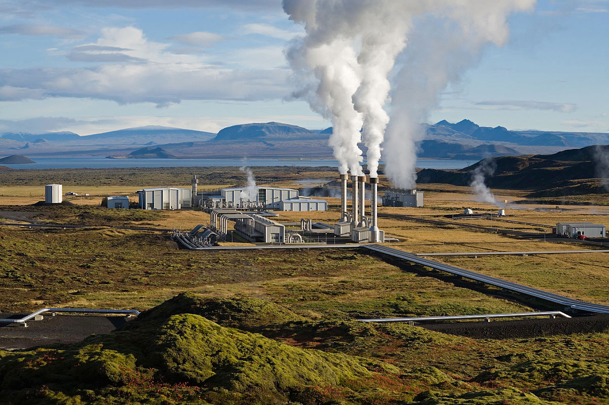

##### 热力学分析

地热发电可以简化为一个热机循环：

- **高温热源**：地热流体（温度 $T_1$）
- **低温热源**：环境（温度 $T_2 \approx 300\,\text{K}$）

理论最大效率（卡诺效率）：

$$
\eta_{\text{max}} = 1 - \dfrac{T_2}{T_1}
$$

例如，对于 200°C（473 K）的地热资源：

$$
\eta_{\text{max}} = 1 - \dfrac{300}{473} \approx 0.366 = 36.6\%
$$

实际地热发电效率通常在 10%~20% 之间，主要受以下因素限制：
- 地热流体温度有限
- 换热过程中的不可逆损失
- 工质的热力学性质
- 环境温度变化

???+ tip "地热发电的优势"
    - **可再生**：地热能来自地球内部放射性衰变，可持续利用  
    - **稳定**：不受天气影响，24 小时稳定发电  
    - **清洁**：几乎不排放温室气体  
    - **占地面积小**：相比太阳能和风能，单位功率占地面积小

#### 核电站

**核电站**是利用核裂变反应释放的热能来发电的设施。核电站的核心是核反应堆，它相当于传统火电站的"锅炉"，但使用的燃料是铀-235 或钚-239 等核燃料。

##### 核裂变与热能释放

核裂变是重原子核（如铀-235）吸收中子后分裂为两个较轻原子核的过程，同时释放大量能量和 2~3 个中子：

$$
{}^{235}\text{U} + n \rightarrow \text{裂变产物} + 2\sim3n + \text{能量}
$$

每次裂变释放约 200 MeV 的能量，这些能量主要转化为裂变产物的动能（即热能）。

##### 循环过程——沸水堆核电站

**沸水堆（BWR, Boiling Water Reactor）** 是一种直接循环的核电站，冷却剂在反应堆中直接沸腾产生蒸汽，然后驱动汽轮机发电。

**工作流程：**

1. **反应堆加热**：冷却水在反应堆中被核裂变加热，直接沸腾产生蒸汽（约 285°C，7 MPa）
2. **汽轮机做功**：高温高压蒸汽进入汽轮机，推动叶片旋转，对外做功
3. **冷凝**：做功后的乏蒸汽在冷凝器中被冷却水冷凝成水
4. **给水**：冷凝水通过给水泵重新送回反应堆

```
反应堆 → 汽轮机 → 发电机 → 电力
   ↑        ↓
   └──给水泵──冷凝器──┘
```

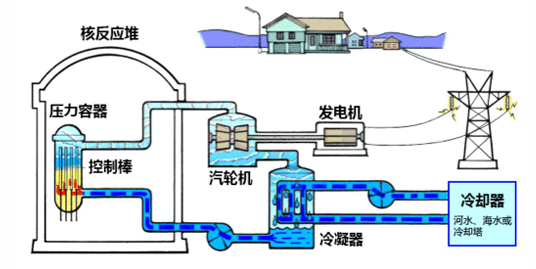

**热力学分析：**

- **高温热源**：核反应堆（冷却剂温度约 285°C = 558 K）
- **低温热源**：环境（冷却水温度约 25°C = 298 K）

理论最大效率：

$$
\eta_{\text{max}} = 1 - \dfrac{T_2}{T_1} = 1 - \dfrac{298}{558} \approx 0.466 = 46.6\%
$$

实际效率约为 30%~35%。

##### 循环过程——压水堆核电站

**压水堆（PWR, Pressurized Water Reactor）** 是世界上应用最广泛的核电站类型，采用间接循环设计。

**工作流程：**

**一回路（放射性）：**
1. 高压水（约 155 bar）在反应堆中被加热到约 320°C（不沸腾）
2. 高温高压水进入蒸汽发生器，将热量传递给二回路
3. 冷却后的水通过主泵送回反应堆

**二回路（非放射性）：**
1. 二回路水在蒸汽发生器中吸收热量，产生蒸汽（约 280°C，7 MPa）
2. 蒸汽驱动汽轮机做功
3. 乏蒸汽冷凝后送回蒸汽发生器

```
一回路：反应堆 → 蒸汽发生器 → 主泵 → 反应堆
                    ↓
二回路：蒸汽发生器 → 汽轮机 → 发电机 → 电力
           ↑          ↓
           └──给水泵──冷凝器──┘
```

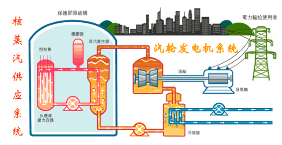

**热力学分析：**

压水堆的热力学效率与沸水堆类似，理论最大效率约为 45%~50%，实际效率约为 33%~37%。

???+ warning "核电站效率的限制因素"
    核电站效率受以下因素限制：  
    1. **材料限制**：反应堆材料（如锆合金包壳）的耐温性能限制了工作温度  
    2. **安全考虑**：为防止冷却剂沸腾导致堆芯过热，需要保持足够高的压力  
    3. **热交换损失**：压水堆中二次热交换导致不可逆损失  
    4. **环境温度**：冷却水温度受季节和地理位置影响

    这些因素使得核电站效率低于同温度的化石燃料电站。

## 学习衔接

- 建议先读：[热力学第一定律对理想气体的应用](images/./first-law-ideal-gas.md)（等温、绝热、等体、等压过程的分析）
- 相关背景：[气体的热容 内能和焓](images/./gas-heat-capacity-internal-energy-enthalpy.md)（热容、内能、焓的概念）
- 读完本页后可以继续阅读：[第四章 热力学第二定律](images/../chapter-4/index.md)（卡诺定理的严格证明、熵的概念、热力学第二定律的表述）
