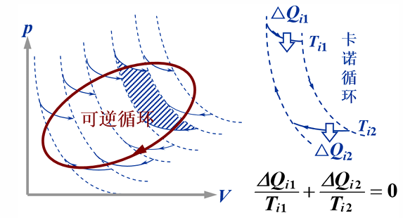
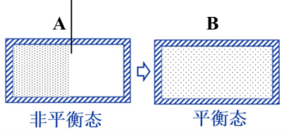

## 克劳修斯不等式与熵定理

热力学第二定律有两种定性表述——开尔文表述和克劳修斯表述，但它们只能告诉我们过程 "能不能" 发生，却无法定量描述过程进行的方向和限度．我们需要一个 **定量的数学判据** 来判断过程的方向．克劳修斯不等式正是从卡诺定理出发推导出的这一数学表述；而从克劳修斯不等式中，可以自然地引出一个重要的态函数——**熵**．

## 学习目标

读完本页后，你应该能够：

-   从卡诺定理出发推导克劳修斯不等式
-   理解克劳修斯等式和不等式的物理意义
-   从克劳修斯等式出发定义态函数熵
-   计算理想气体、混合气体、相变和化学反应过程的熵变
-   陈述熵增原理，并用其判断孤立系统中过程的方向
-   理解玻尔兹曼熵的统计意义，以及克劳修斯熵与玻尔兹曼熵的统一

## 克劳修斯不等式

### 从卡诺定理到克劳修斯不等式

回顾卡诺定理：所有工作在相同高温热源 $T_1$ 和低温热源 $T_2$ 之间的热机，可逆热机效率最高，且所有可逆热机效率相同．

对于 **可逆热机**，其效率等于卡诺效率：

$$
\eta = 1 - \dfrac{Q_2'}{Q_1} = 1 - \dfrac{T_2}{T_1}
$$

其中 $Q_1$ 是从高温热源吸收的热量，$Q_2'$ 是向低温热源放出的热量（绝对值）．整理得：

$$
\dfrac{Q_1}{T_1} = \dfrac{Q_2'}{T_2}
$$

注意：如果我们规定 $Q$ 表示系统 **吸收** 的热量（吸热为正，放热为负），则 $Q_2 = -Q_2'$，上式变为：

$$
\dfrac{Q_1}{T_1} + \dfrac{Q_2}{T_2} = 0 \quad \text{（可逆卡诺循环）}
$$

对于 **不可逆热机**，由卡诺定理 $\eta < \eta_C$，即：

$$
1 - \dfrac{Q_2'}{Q_1} < 1 - \dfrac{T_2}{T_1}
$$

同样令 $Q_2 = -Q_2'$，可得：

$$
\dfrac{Q_1}{T_1} + \dfrac{Q_2}{T_2} < 0 \quad \text{（不可逆卡诺循环）}
$$

### 可逆循环——克劳修斯等式

现在将上述结果推广到 **任意可逆循环**．设想用一系列可逆的绝热线和等温线，将任意可逆循环分割成无数个无限小的卡诺循环：

每个小卡诺循环都满足：

$$
\dfrac{\delta Q_1}{T_1} + \dfrac{\delta Q_2}{T_2} = 0
$$

当分割的卡诺循环数目趋于无穷时，所有小卡诺循环的等温线首尾相连，恰好构成原循环的边界．由于相邻小循环的公共绝热路径上的过程互为逆过程，热量相互抵消，因此对所有小循环求和的结果等于沿原循环边界路径的积分：

$$
\oint \dfrac{\delta Q}{T} = 0 \quad \text{（可逆循环）}
$$

???+ warning "克劳修斯等式"
    对于 **任意可逆循环**，有：
    
    $$
    \oint \dfrac{\delta Q}{T} = 0  
    $$
    
    其中 $\delta Q$ 为系统从温度为 $T$ 的热源吸收的微小热量，$T$ 为热源的温度．

???+ tip "物理意义"
    克劳修斯等式说明：在可逆循环中，$\delta Q / T$ 沿闭合路径的积分为零．这意味着 $\delta Q / T$ 的积分与路径无关，只取决于初末状态——这正是 **态函数** 存在的充要条件．换言之，存在一个状态函数，其变化量等于 $\delta Q / T$ 的积分．这个态函数就是 **熵**．

???+ warning "关于符号和温度的约定"
    -   $Q$ 是系统从热源 **吸收** 的热量：吸热时 $Q > 0$，放热时 $Q < 0$．
    -   $T$ 是 **热源** 的温度．对于可逆过程，热源温度等于系统温度；对于不可逆过程，二者可能不同．
    -   "可逆" 二字不可省略！只有可逆循环才能写等号．

### 不可逆循环——克劳修斯不等式

对于不可逆循环，由卡诺定理，每个小卡诺循环的效率均低于卡诺效率，因此：

$$
\dfrac{\delta Q_1}{T_1} + \dfrac{\delta Q_2}{T_2} < 0
$$

对所有小卡诺循环求和并取极限，得到：

$$
\oint \dfrac{\delta Q}{T} < 0 \quad \text{（不可逆循环）}
$$

### 克劳修斯不等式的统一表述

综合可逆与不可逆两种情况：

???+ warning "克劳修斯不等式"
    对于 **任意循环过程**（可逆或不可逆），有：
    
    $$
    \oint \dfrac{\delta Q}{T} \leq 0  
    $$
    
    其中等号 "$=$"适用于可逆循环，不等号"$<$" 适用于不可逆循环．
    
    -   $\delta Q$ 为系统从温度为 $T$ 的热源吸收的微小热量；
    -   $T$ 为热源的温度（对于可逆过程等于系统温度）．

## 熵的定义

### 从克劳修斯等式到态函数

克劳修斯等式 $\oint(\delta Q/T) = 0$（适用于任意可逆循环）具有深刻的数学含义：$\delta Q/T$ 沿任意闭合路径的积分等于零．根据数学分析中的定理，这意味着 $\delta Q/T$ 在两个状态之间的积分与路径无关（只要所取路径为可逆路径）．而这正是 **态函数存在的充要条件**．换言之，存在一个状态函数，其变化量恰好等于 $\delta Q/T$ 的可逆路径积分．我们将这个态函数定义为 **熵**，记作 $S$：

???+ warning "熵的定义"
    系统从状态 1 经 **可逆过程** 变化到状态 2 时，其熵变定义为：
    
    $$
    \Delta S = S_2 - S_1 = \int_1^2 \left(\dfrac{\delta Q}{T}\right)_{\text{可逆}}  
    $$
    
    其中 $\delta Q$ 为系统在可逆过程中从温度为 $T$ 的热源吸收的微小热量．熵的国际单位为 $\text{J/K}$（焦耳每开尔文）．

### 熵是态函数

熵 $S$ 是一个 **态函数**，这意味着：

-   熵的值只取决于系统当前所处的状态，与系统如何到达该状态无关
-   两个确定状态之间的熵变 $\Delta S$ 是一个确定的值，不随连接这两个状态的过程不同而改变
-   **但是**：计算 $\Delta S$ 时，积分 **必须** 沿可逆路径进行
-   如果实际过程是不可逆的，则必须设计一个连接相同初末状态的假想可逆过程来计算 $\Delta S$

???+ tip "注意事项"
    1.  $\Delta S$ 只是状态 1 和状态 2 的函数，与连接这两个状态的实际过程无关．实际过程可以是可逆的，也可以是不可逆的．
    2.  但在实际计算 $\Delta S$ 时，积分 **必须** 沿连接状态 1 和状态 2 的 **任意可逆路径** 进行！如果原来的正过程是不可逆的，则必须设计一个假想的可逆过程来计算 $\Delta S$！
    3.  当系统由若干部分组成时，整个系统的熵变等于各部分熵变之和．熵是一个 **广延量**，具有可加性．

## 熵的计算

下面我们来看几种常见过程的熵变计算．计算熵变的一般方法是：设计一条连接相同初末态的可逆路径，沿该路径积分 $\delta Q/T$．

### 理想气体的熵

从可逆过程的热力学第一定律出发：

$$
\mathrm{d}U = \delta Q - p\,\mathrm{d}V \quad \Longrightarrow \quad \delta Q = \mathrm{d}U + p\,\mathrm{d}V
$$

对于理想气体，$\mathrm{d}U = \nu C_V^{\text{mol}} \mathrm{d}T$，且 $pV = \nu RT$，代入熵的定义：

$$
\mathrm{d}S = \dfrac{\delta Q}{T} = \dfrac{\nu C_V^{\text{mol}} \mathrm{d}T}{T} + \dfrac{p\,\mathrm{d}V}{T} = \nu C_V^{\text{mol}} \dfrac{\mathrm{d}T}{T} + \nu R \dfrac{\mathrm{d}V}{V}
$$

对上式从状态 1 到状态 2 积分，得到以 $(T, V)$ 为变量的熵变公式．类似地，利用 $V = \nu RT/p$ 消去体积，可以得到以 $(T, p)$ 为变量的熵变公式：

???+ warning "理想气体的熵变公式"
    以 $(T, V)$ 为变量：
    
    $$
    \Delta S(T, V) = \nu C_V^{\text{mol}} \ln\dfrac{T_2}{T_1} + \nu R \ln\dfrac{V_2}{V_1}  
    $$
    
    以 $(T, p)$ 为变量：
    
    $$
    \Delta S(T, p) = \nu C_p^{\text{mol}} \ln\dfrac{T_2}{T_1} - \nu R \ln\dfrac{p_2}{p_1}  
    $$
    
    其中 $\nu$ 为物质的量，$C_V^{\text{mol}}$ 和 $C_p^{\text{mol}}$ 分别为摩尔定容热容和摩尔定压热容．

### 多方过程的熵变

对于多方过程 $pV^n = \text{const}$，其体积 - 温度关系为：

$$
\dfrac{V_2}{V_1} = \left(\dfrac{T_2}{T_1}\right)^{\!\dfrac{1}{1-n}}
$$

将此关系代入 $\Delta S(T, V)$ 公式：

$$
\Delta S = \nu C_V^{\text{mol}} \ln\dfrac{T_2}{T_1} + \nu R \cdot \dfrac{1}{1-n} \ln\dfrac{T_2}{T_1} = \nu \left(C_V^{\text{mol}} + \dfrac{R}{1-n}\right) \ln\dfrac{T_2}{T_1}
$$

定义多方过程的摩尔热容 $C_n = C_V^{\text{mol}} + \dfrac{R}{1-n}$，则熵变可统一写为：

$$
\Delta S = \nu C_n \ln\dfrac{T_2}{T_1}
$$

???+ tip "多方过程熵变的统一性"
    多方过程的熵变公式 $\Delta S = \nu C_n \ln(T_2/T_1)$ 将各种常见过程统一在一个表达式中．通过取不同的多方指数 $n$，可以得到对应的热容和熵变：
    
    |   过程   | 多方指数 $n$ |      热容 $C_n$      |                熵变 $\Delta S$               |
    | :----: | :------: | :----------------: | :----------------------------------------: |
    |   等温   |    $1$   |          —         |         $\nu R \ln\dfrac{V_2}{V_1}$        |
    |   等体   | $\infty$ | $C_V^{\text{mol}}$ | $\nu C_V^{\text{mol}} \ln\dfrac{T_2}{T_1}$ |
    |   等压   |    $0$   | $C_p^{\text{mol}}$ | $\nu C_p^{\text{mol}} \ln\dfrac{T_2}{T_1}$ |
    | 绝热（可逆） | $\gamma$ |         $0$        |                     $0$                    |
    
    注意等温过程中 $n=1$ 时 $C_n$ 发散，需要回到原始公式单独计算；可逆绝热过程是等熵过程，熵变为零．

??? note "例题：理想气体的熵变"
    **题目**：$1\;\text{mol}$ 单原子理想气体（$C_V^{\text{mol}} = \dfrac{3}{2}R$），从状态 $a$（$T_a = 300\;\text{K}$，$V_a = 3.0 \times 10^{-2}\;\text{m}^3$）变化到状态 $b$（$T_b = 450\;\text{K}$，$V_b = 2.0 \times 10^{-2}\;\text{m}^3$）．求 $\Delta S_{ab}$．
    
    **解答**：熵是态函数，$\Delta S$ 只取决于初末态，与路径无关．我们可以选取不同的可逆路径来验证这一点．
    
    **路径 1：等温 + 等体**
    
    先等温膨胀从 $a$ 到 $c$（$T = 300\;\text{K}$，$V_c = V_b$），再等体升温从 $c$ 到 $b$：
    
    $$
    \Delta S_{ac} = \nu R \ln\dfrac{V_b}{V_a} = R \ln\dfrac{2.0}{3.0} = -R \ln\dfrac{3}{2}  
    $$
    
    $$
    \Delta S_{cb} = \nu C_V^{\text{mol}} \ln\dfrac{T_b}{T_c} = \dfrac{3}{2}R \ln\dfrac{450}{300} = \dfrac{3}{2}R \ln\dfrac{3}{2}  
    $$
    
    $$
    \Delta S_{ab} = -R \ln\dfrac{3}{2} + \dfrac{3}{2}R \ln\dfrac{3}{2} = \dfrac{1}{2}R \ln\dfrac{3}{2} \approx 1.69\;\text{J/K}  
    $$
    
    **路径 2：可逆绝热 + 等体**
    
    先可逆绝热膨胀从 $a$ 到 $d$（$V_d = V_b$，温度变为 $T_d$），再等体升温从 $d$ 到 $b$．
    
    由绝热关系 $TV^{\gamma-1} = \text{const}$（$\gamma = 5/3$）：
    
    $$
    T_d = T_a \left(\dfrac{V_a}{V_d}\right)^{\!\gamma-1} = 300 \times \left(\dfrac{3.0}{2.0}\right)^{\!2/3} \approx 393.1\;\text{K}  
    $$
    
    $$
    \Delta S_{ad} = 0 \quad \text{（可逆绝热过程，等熵）}  
    $$
    
    $$
    \Delta S_{db} = \dfrac{3}{2}R \ln\dfrac{450}{393.1} \approx \dfrac{3}{2} \times 8.314 \times 0.1352 \approx 1.69\;\text{J/K}  
    $$
    
    $$
    \Delta S_{ab} = 0 + 1.69 = 1.69\;\text{J/K}  
    $$
    
    两条路径得到相同的结果 $\Delta S_{ab} \approx 1.69\;\text{J/K}$，验证了熵是态函数，熵变与路径无关．

### 混合气体的熵

熵是 **广延量**，具有可加性：混合气体的总熵等于各组分气体熵之和．

对于总压为 $p$、温度为 $T$ 的理想气体混合物：

-   第 $i$ 种组分的 **摩尔分数**：$c_i = \nu_i / \nu$，其中 $\nu_i$ 为该组分的物质的量，$\nu = \sum_i \nu_i$ 为总物质的量
-   第 $i$ 种组分的 **分压**：$p_i = c_i \cdot p$
-   第 $i$ 种组分占据的体积：$V_i = (p_i / p) \cdot V$

当不同的理想气体混合（每种气体初始时处于各自的分压 $p_i$、占据体积 $V_i$，然后混合到总压 $p$、总体积 $V$）时，可以推导出混合熵为：

$$
\Delta S_{\text{mix}} = -\nu R \sum_i c_i \ln c_i
$$

???+ warning "混合熵公式"
    不同理想气体在等温等压下混合的熵变为：
    
    $$
    \Delta S_{\text{mix}} = -\nu R \sum_i c_i \ln c_i  
    $$
    
    由于 $0 < c_i < 1$，故 $\ln c_i < 0$，因此 $\Delta S_{\text{mix}} > 0$．混合过程是 **不可逆** 的，符合熵增原理．

???+ tip "吉布斯佯谬"
    如果参与混合的是 **同一种** 理想气体（即气体种类完全相同），则混合前后的热力学状态实际上没有区别，混合熵为零．经典热力学无法自然地解释这一点——这就是 **吉布斯佯谬**（Gibbs paradox）．该佯谬只有借助 **量子统计力学**，考虑全同粒子的不可分辨性，才能得到圆满解释．

### 相变的熵

**可逆相变：** 在相变温度 $T$（如沸点、熔点）下，相变过程是可逆等温过程，其熵变为：

$$
\Delta S = \dfrac{L}{T}
$$

其中 $L$ 为相变潜热（吸热时 $L > 0$，放热时 $L < 0$）．

**不可逆相变：** 如果实际相变过程不在平衡相变温度下发生（如过冷水结冰），则必须设计一条连接相同初末态的 **可逆路径** 来计算熵变．

??? note "例题：过冷水凝固的熵变"
    **题目**：水在 $T' < 273.15\;\text{K}$、$1\;\text{atm}$ 下过冷（即处于亚稳态的液态水）．当它在温度 $T'$ 下凝固为冰时，求系统和环境的总熵变．
    
    **解答**：过冷水在 $T'$ 下凝固是不可逆相变．我们需要设计一条连接相同初末态的可逆路径来计算系统熵变．设水的摩尔定压热容为 $C_{p,l}$，冰的摩尔定压热容为 $C_{p,s}$，摩尔凝固潜热为 $\Lambda$（正值）．
    
    **设计三步可逆路径：**
    
    1.  将过冷水从 $T'$ 可逆等压升温至 $273.15\;\text{K}$
    2.  在 $273.15\;\text{K}$ 下可逆等温凝固
    3.  将冰从 $273.15\;\text{K}$ 可逆等压降温至 $T'$
    
    **系统的熵变：**
    
    $$
    \Delta S_{\text{sys}} = \int_{T'}^{273.15} \dfrac{C_{p,l}}{T}\,\mathrm{d}T - \dfrac{\Lambda}{273.15} + \int_{273.15}^{T'} \dfrac{C_{p,s}}{T}\,\mathrm{d}T  
    $$
    
    其中第二步放热，故取负号．
    
    **环境的熵变：** 环境视为温度恒为 $T'$ 的大热源，其吸热量等于系统放热量的负值：
    
    $$
    \Delta S_{\text{env}} = \dfrac{Q_{\text{env}}}{T'} = \dfrac{-Q_{\text{sys}}}{T'}  
    $$
    
    其中系统实际放出的热量为 $Q_{\text{sys}} = -Q_{\text{env}}$，可由焓变计算．
    
    **总熵变：** 可以证明 $\Delta S_{\text{total}} = \Delta S_{\text{sys}} + \Delta S_{\text{env}} > 0$，即过冷水凝固是不可逆过程，满足热力学第二定律．

### 化学反应的熵

**标准摩尔熵**  $S^\circ_m$：在标准状态（$298.15\;\text{K}$，$1\;\text{atm}$）下，$1\;\text{mol}$ 物质的 **绝对熵**．这些值由实验测量和热力学第三定律确定，可在热力学数据表中查到．

**标准反应熵：**

$$
\Delta S^\circ_{\text{反应}} = \sum_i \nu_i S^\circ_{m,i}
$$

其中 $\nu_i$ 为化学计量系数（产物取正值，反应物取负值）．

**常见物质的标准摩尔熵：**

|                       物质                      | $S^\circ_m\;(\text{J}\cdot\text{mol}^{-1}\cdot\text{K}^{-1})$ |
| :-------------------------------------------: | :-----------------------------------------------------------: |
|             $\text{H}_2\text{(g)}$            |                            $130.7$                            |
|             $\text{O}_2\text{(g)}$            |                            $205.2$                            |
|             $\text{N}_2\text{(g)}$            |                            $191.6$                            |
|            $\text{H}_2\text{O(l)}$            |                             $69.9$                            |
|            $\text{CO}_2\text{(g)}$            |                            $213.8$                            |
| $\text{C}_6\text{H}_{12}\text{O}_6\text{(s)}$ |                            $212.1$                            |

??? note "例题：光合作用的熵变"
    **题目**：计算光合作用的标准反应熵：
    
    $$
    6\text{CO}_2\text{(g)} + 6\text{H}_2\text{O(l)} \longrightarrow \text{C}_6\text{H}_{12}\text{O}_6\text{(s)} + 6\text{O}_2\text{(g)}  
    $$
    
    **解答**：利用标准摩尔熵表，代入标准反应熵公式：
    
    $$
    \Delta S^\circ = \left[S^\circ(\text{C}_6\text{H}_{12}\text{O}_6) + 6\,S^\circ(\text{O}_2)\right] - \left[6\,S^\circ(\text{CO}_2) + 6\,S^\circ(\text{H}_2\text{O})\right]  
    $$
    
    $$
    = [212.1 + 6 \times 205.2] - [6 \times 213.8 + 6 \times 69.9]  
    $$
    
    $$
    = 1443.3 - 1702.2 = -258.9\;\text{J/(mol·K)}  
    $$
    
    **讨论**：系统（反应物和产物）的熵变为负值，这是因为反应将无序的气体分子转化为有序的固体（葡萄糖），系统的有序度增加．然而，光合作用的总熵变仍然满足热力学第二定律——太阳辐射为环境提供了大量低熵能量，使得环境的熵增加量足以补偿系统熵的减少，**宇宙的总熵仍然增加**．

## 熵增原理

从克劳修斯不等式可以推导出热力学第二定律最有力的定量表述——**熵增原理**．

对于一个 **绝热系统**（$\delta Q = 0$），克劳修斯不等式变为：

$$
\oint \dfrac{\delta Q}{T} \leq 0 \implies \Delta S \geq 0
$$

-   可逆绝热过程：$\Delta S = 0$（等熵过程）
-   不可逆绝热过程：$\Delta S > 0$

???+ warning "熵增加原理"
    对于一个 **孤立系统**（或与外界无热交换、无功交换的绝热系统），其熵永不减少：
    
    $$
    \Delta S_{\text{孤立}} \geq 0  
    $$
    
    -   "$=$" 适用于可逆过程（系统处于平衡态）
    -   "$>$" 适用于不可逆过程（自发过程）
    -   "$<$" 是不可能发生的
    
    熵增加原理是热力学第二定律的 **定量数学表述**，它给出了过程方向的判据：孤立系统的熵只能增加或保持不变，绝不会减少．

### 应用方法

要判断一个过程能否自发进行，需要按以下步骤操作：

1.  将 **系统** 及其 **环境** 合在一起，构成一个 **孤立系统**
2.  计算总熵变：$\Delta S_{\text{孤立}} = \Delta S_{\text{系统}} + \Delta S_{\text{环境}}$
3.  根据 $\Delta S_{\text{孤立}}$ 的符号判断：
    -   $\Delta S_{\text{孤立}} > 0$：不可逆过程（自发过程）
    -   $\Delta S_{\text{孤立}} = 0$：可逆过程（系统处于平衡态）
    -   $\Delta S_{\text{孤立}} < 0$：不可能发生

???+ tip "自发过程与不可逆过程的辨析"
    1.  熵增原理只能判断绝热过程是否 **不可逆**，但不能直接判断是否 **自发**．然而，在孤立系统中，不可逆过程必然是自发的．
    2.  自然界中的自发过程都是不可逆的，但不可逆过程 **不一定** 是自发的——例如，对系统做功可以使系统经历一个不可逆过程，但这个过程不是自发的．
    3.  绝热过程可以与环境交换 **功**（但不交换热量），因此绝热系统不一定是孤立系统．只有同时隔绝热和功的系统才是孤立系统．

### 熵增原理的应用

#### 自由膨胀

气体向真空膨胀（绝热，不做功），是典型的不可逆过程．由玻尔兹曼熵或直接计算可得：

$$
\Delta S = \nu R \ln\dfrac{V_2}{V_1} > 0
$$

由于 $V_2 > V_1$，熵变为正值，满足熵增原理．该过程的详细讨论将在玻尔兹曼熵部分展开．

#### 热传递过程

??? note "例题：热传导过程的熵变"
    **题目**：一个温度为 $T_B$ 的大热源与一个温度为 $T_A$ 的物体 A 进行热接触（$T_B > T_A$），保持等压．最终物体 A 与热源达到热平衡，温度为 $T_B$．求总熵变．
    
    **解答**：
    
    **物体 A 的熵变：** 物体 A 经历等压过程从 $T_A$ 升温到 $T_B$，设计可逆等压路径：
    
    $$
    \Delta S_A = \int_{T_A}^{T_B} \dfrac{C_p\,\mathrm{d}T}{T} = C_p \ln\dfrac{T_B}{T_A}  
    $$
    
    其中 $C_p$ 为物体 A 的定压热容．
    
    **热源 B 的熵变：** 热源温度恒为 $T_B$，其释放的热量为 $Q = C_p(T_B - T_A)$（等于物体 A 吸收的热量），因此：
    
    $$
    \Delta S_B = \dfrac{-Q}{T_B} = -\dfrac{C_p(T_B - T_A)}{T_B}  
    $$
    
    **总熵变：**
    
    $$
    \Delta S = \Delta S_A + \Delta S_B = C_p \ln\dfrac{T_B}{T_A} - C_p\dfrac{T_B - T_A}{T_B}  
    $$
    
    **证明 $\Delta S > 0$：** 令 $x = T_B / T_A > 1$，则：
    
    $$
    \Delta S = C_p \left(\ln x - 1 + \dfrac{1}{x}\right)  
    $$
    
    利用不等式 $\ln x > 1 - \dfrac{1}{x}$（当 $x > 1$ 时成立），可得 $\ln x - 1 + 1/x > 0$，因此：
    
    $$
    \Delta S > 0  
    $$
    
    这证明热传导是不可逆过程，满足熵增原理．

#### 扩散过程

两种不同的理想气体在等温等压下混合，混合熵为：

$$
\Delta S_{\text{mix}} = -\nu R \sum_i c_i \ln c_i > 0
$$

扩散过程是不可逆的，满足熵增原理．具体计算已在混合气体的熵部分给出．

#### 摩擦生热

摩擦将有序的宏观机械能（动能）转化为无序的微观热运动能量（热能），系统的熵增加．例如，一个物体在粗糙表面上滑动，摩擦力做功将动能转化为热量，导致物体和表面的温度升高，$\Delta S > 0$．这也是一个典型的不可逆过程，满足熵增原理．

## 热力学熵与玻尔兹曼熵的统一

前面我们从宏观角度定义了克劳修斯熵 $\mathrm{d}S = \delta Q_{\text{可逆}}/T$，它是热力学第二定律的定量表述．然而，熵的本质是什么？为什么孤立系统的熵总是增加？这些问题需要从微观角度来回答．

### 玻尔兹曼熵

玻尔兹曼给出了熵的统计力学定义：

???+ warning "玻尔兹曼熵公式"
    $$
    S = k \ln \Omega  
    $$
    
    其中 $k = 1.381 \times 10^{-23}\;\text{J/K}$ 为玻尔兹曼常数，$\Omega$ 为该宏观态对应的 **微观状态数**（即实现该宏观态的所有可能微观构型的数目）．

玻尔兹曼熵的核心思想：宏观态的微观实现方式越多（$\Omega$ 越大），该宏观态出现的概率就越大，系统的熵也越高．熵本质上是系统 **无序程度** 或 **微观状态数** 的度量．

### 自由膨胀的微观推导

考虑 $N$ 个可分辨粒子从体积 $V$ 自由膨胀到体积 $2V$：

-   **膨胀前**：所有粒子都在左半部分，$\Omega_1 = 1$
-   **膨胀后**：每个粒子可以出现在左半部分或右半部分，$\Omega_2 = 2^N$

熵变为：

$$
\Delta S = k \ln \dfrac{\Omega_2}{\Omega_1} = k \ln 2^N = Nk \ln 2
$$

由 $N = \nu N_A$（$N_A$ 为阿伏伽德罗常数）和 $kN_A = R$，可得：

$$
\Delta S = \nu R \ln 2
$$

而从宏观热力学计算（自由膨胀，$V_2 = 2V_1$，等温）：

$$
\Delta S = \nu R \ln\dfrac{V_2}{V_1} = \nu R \ln 2
$$

两者完全一致！这证明了玻尔兹曼熵与克劳修斯熵的 **统一性**．

### 第二定律的统计本质

从统计物理的角度看，热力学第二定律并非绝对精确的定律，而是一个 **统计规律**．

考虑 $N$ 个粒子在左、右两部分的分布：$k$ 个粒子在左半部分的概率服从 **二项分布**：

$$
P(k) = \binom{N}{k} \left(\dfrac{1}{2}\right)^N
$$

当 $N$ 很大时，该分布在 $k/N = 1/2$ 附近变得极其尖锐．对于 $1\;\text{mol}$ 气体（$N = 6.023 \times 10^{23}$），所有粒子自发回到左半部分的概率为：

$$
P = \dfrac{1}{2^{6.023 \times 10^{23}}}
$$

这个概率小得令人难以置信——即使等待整个宇宙的年龄，也几乎不可能观察到这样的事件．因此，宏观上我们观测到的 "熵增" 实际上是 **压倒性概率** 的体现．

### 克劳修斯熵与玻尔兹曼熵的一般统一

在统计物理中可以一般性地证明：对于平衡态附近的过程，克劳修斯熵与玻尔兹曼熵是一致的——两者都正比于宏观态概率的对数．克劳修斯熵从宏观（唯象）角度出发，玻尔兹曼熵从微观（统计）角度出发，二者殊途同归．

???+ tip "熵的物理意义"
    -   **低熵**→ 有序、集中、概率低的宏观态
    -   **高熵**→ 无序、分散、概率高的宏观态
    -   $S = k\ln\Omega$：熵度量了孤立系统的 **无序程度**
    -   热量从高温物体流向低温物体，意味着能量在空间中更加 **分散** 和 "降级"——这正是熵增的微观图景

### 能量品质的退化

不可逆过程在能量利用上的后果，总是使一定的能量 $E_d$ 从能做功的形式变为不能做功的形式——这就是 "退降的" 能量．

以 **有限温差热传导** 为例：设高温热源 $T_B$ 与低温热源 $T_A$ 接触（$T_B > T_A$），热量 $|Q|$ 从 $B$ 传到 $A$．假设环境温度为 $T_0$（$T_0 \leq T_A < T_B$），我们可以分别用卡诺机从两个热源提取有用功：

-   **传热前**：热量 $|Q|$ 在 $T_B$ 中，可做功

$$
A_i = |Q| \cdot \eta_C = |Q|\left(1 - \dfrac{T_0}{T_B}\right)
$$

-   **传热后**：热量 $|Q|$ 传到 $T_A$，可做功

$$
A_f = |Q|\left(1 - \dfrac{T_0}{T_A}\right)
$$

由于 $T_B > T_A$，故 $A_i > A_f$．退降的能量为：

$$
E_d = A_i - A_f = |Q| \cdot T_0\left(\dfrac{1}{T_A} - \dfrac{1}{T_B}\right)
$$

注意到 $|Q|/T_A$ 是 $A$ 吸收的热量除以温度，$|Q|/T_B$ 是 $B$ 放出的热量除以温度，两者之差正是总熵变 $\Delta S$，因此：

$$
E_d = T_0 \cdot \Delta S_{\text{总}}
$$

???+ tip "物理意义"
    熵增本质上度量了能量 **品质的损失**．虽然能量总量不变（热力学第一定律），但能量的 "可用性" 降低了——这就是热力学第二定律更深层的物理内涵．任何不可逆过程都伴随着能量品质的退化，而退化的程度正比于熵的增加．

## 第二定律的诘难与佯谬

热力学第二定律自提出以来，经历了若干深刻的理论挑战．这些诘难不仅没有推翻第二定律，反而加深了我们对熵和不可逆性的理解．

### 施密特的诘难

玻尔兹曼的 $H$ 定理证明了 $H$ 函数随时间单调下降，最终趋向平衡态．然而，施密特（Schmidt）指出：

-   $H$ 函数 **并非严格单调下降**——即使在平衡态附近，$H$ 也会围绕极小值产生 **涨落**
-   对宏观系统而言，$H$ 下降的概率远大于增长的概率，因此宏观上观察到的行为是 "单调" 的
-   但在微观层面，涨落始终存在

这一诘难提醒我们：热力学第二定律本质上是一个 **统计规律**，而非绝对精确的力学定律．

### 策尔梅洛的诘难

策尔梅洛（Zermelo）援引庞加莱（Poincaré）的 **始态复现定理**：对于一个有限、保守的力学系统，只要等待足够长的时间，系统的状态将无限接近其初始状态．

这意味着熵增加的过程终将 "逆转"——系统会自发回到低熵状态，这似乎与第二定律矛盾．然而：

-   对于宏观系统（如 $1\;\text{mol}$ 气体），庞加莱回归时间远超宇宙年龄（约 $10^{10}$ 年），完全没有现实意义
-   因此，第二定律对宏观系统仍然精确成立

### 吉布斯佯谬

考虑两种理想气体在等温等压下混合：

-   **不同种气体** 混合：$\Delta S_{\text{mix}} = -\nu R \sum_i c_i \ln c_i > 0$
-   **同种气体**"混合"：$\Delta S_{\text{mix}} = 0$（热力学状态实际未变）

问题在于：如果两种气体的差异逐渐缩小（变得越来越 "相似"），混合熵应当连续地趋于零——但经典热力学无法给出这种连续过渡，这就是 **吉布斯佯谬**（Gibbs paradox）．

解决：微观粒子的 **全同性**（indistinguishability）由量子力学自然保证．全同粒子不可分辨，因此同种气体的混合熵严格为零；不同种气体的混合熵由量子统计力学的正确计数给出，两种情况之间不存在连续过渡．

### 麦克斯韦妖与信息熵

麦克斯韦（Maxwell）提出了一个著名的思想实验：在一个分隔的容器中放置一个微小的 "妖"（demon），它能观察每个分子的运动速度，并控制中间的小门——只让快分子通过到一侧、慢分子到另一侧．这样，妖似乎能在不做功的情况下制造温差，从而降低系统的熵，违背第二定律．

问题的关键在于：妖必须 **获取并存储** 每个分子运动的信息．信息的获取和擦除过程本身伴随着熵的产生．正如兰道尔（Landauer）所指出的：**信息是负熵**——麦克斯韦妖把负熵输给了系统，但妖自身（及其记忆装置）的熵增加足以补偿，**总熵仍然增加**．

???+ tip "信息与熵"
    兰道尔原理（Landauer's principle）指出：擦除 1 比特信息至少产生 $k \ln 2$ 的熵（$k$ 为玻尔兹曼常数）．这建立了信息论与热力学之间的深刻联系——信息处理是有热力学代价的．

## 常见误区

???+ warning "常见误区"
    **1. (✓) 自然界自发发生的宏观热力学过程一定是不可逆过程．**
    
    正确．自然界中所有自发发生的宏观过程都伴随着不可逆因素（如有限温差传热、摩擦、扩散等），因此都是不可逆过程．严格意义上的可逆过程是一种理想化的极限情况．
    
    **2. (✗) 不可逆过程一定是自发过程．**
    
    错误．反例：**绝热压缩** 是不可逆的，但不是自发的——它需要外界对系统做功．不可逆性只说明过程不能原路逆向进行，而 "自发" 指的是不需要外界干预就能发生的过程．
    
    **3. (✗) 熵增加的过程一定是自发过程．**
    
    错误．熵增原理 $\Delta S \geq 0$ 只对 **孤立系统**（或等价的绝热系统）成立．对于非孤立系统，系统自身的熵可以减少（如制冷机中工质的熵减少），只要环境的熵增加更多，总熵仍然增加．判断自发性必须看 **总熵变** $\Delta S_{\text{系统}} + \Delta S_{\text{环境}}$，而不仅仅是系统自身的熵变．
    
    **4. (✗) 为计算绝热不可逆过程的熵变，可在始末态之间设计一条绝热可逆途径．**
    
    错误．可逆绝热过程（等熵过程）的 $\Delta S = 0$，但不可逆绝热过程的 $\Delta S > 0$——这意味着二者的初末态并不相同！熵是态函数，不可逆绝热过程的末态与可逆绝热过程的末态不同（例如绝热自由膨胀的末态温度与可逆绝热膨胀的末态温度不同）．因此，不能用绝热可逆途径来连接绝热不可逆过程的初末态．
    
    **5. (✗) 在任意可逆过程中 $\Delta S = 0$，不可逆过程中 $\Delta S > 0$．**
    
    错误．这个说法 **只对绝热过程或孤立系统成立**．对于一般的可逆过程（如等温膨胀、等压升温），系统的熵变 $\Delta S \neq 0$．熵增原理 $\Delta S \geq 0$ 的适用条件是 **孤立系统**（或绝热系统），不能随意推广到任意过程．
    
    **6. (✗) 平衡态熵最大．**
    
    错误．熵最大原理只对 **孤立系统** 成立．对于非孤立系统，平衡态的熵未必最大．例如，一个与高温热源接触的系统在平衡态时的熵，可能小于它与低温热源接触时的平衡态熵．
    
    **7. (✗) 循环过程 $\Delta S_{\text{系统}} = 0$，所以一定是可逆循环．**
    
    错误．循环过程中系统回到了初态，所以 **系统的** 熵变 $\Delta S_{\text{系统}} = 0$，但这与过程是否可逆无关！关键在于 **环境** 的熵变：可逆循环中环境的熵变也为零（$\Delta S_{\text{环境}} = 0$），而不可逆循环中环境的熵变大于零（$\Delta S_{\text{环境}} > 0$）．因此总熵变 $\Delta S_{\text{总}} = \Delta S_{\text{系统}} + \Delta S_{\text{环境}} > 0$（不可逆循环），满足熵增原理．

## 学习衔接

-   上一节：[卡诺定理的应用](./carnot-theorem-applications.md)
-   下一节：[热平衡与自由能](./thermal-equilibrium-and-free-energy.md)
