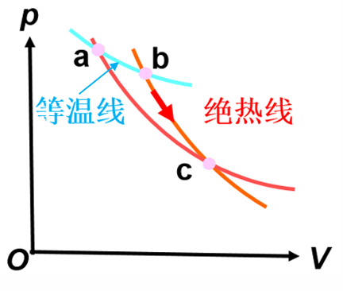
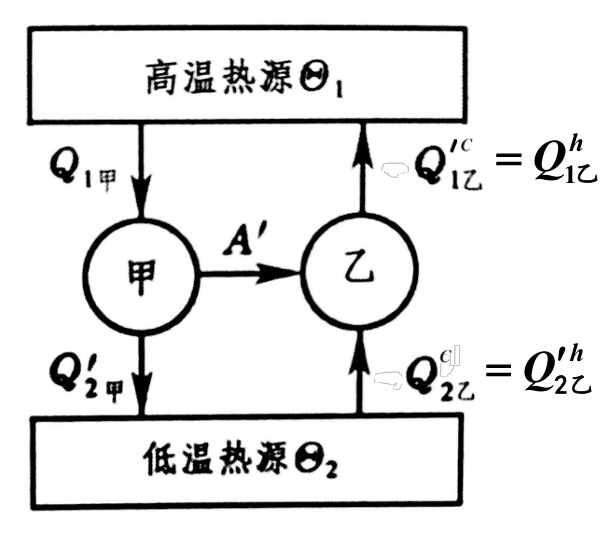

# 热力学第二定律的表述和卡诺定理

热力学第一定律告诉我们能量守恒，但没有指明过程的方向。热量从高温传向低温不违反第一定律，反过来也不违反——但现实中只会自发发生前者。这种"方向性"正是热力学第二定律要回答的核心问题。

## 学习目标

读完本页后，你应该能够：

- 举例说明自然现象中的不可逆过程，区分可逆与不可逆过程
- 陈述热力学第二定律的开尔文表述和克劳修斯表述
- 用反证法证明两种表述的等价性
- 用反证法证明卡诺定理，理解其物理意义
- 从卡诺定理出发理解热力学温标的定义

## 自然现象的不可逆性

在日常生活中，许多过程天然具有一个"方向"：

- **功热转换**：摩擦可以使机械能完全转化为热能（功→热），这是自发的。但反过来，从单一热源吸取热量使之完全变为功，却不会自发发生。
- **热传导**：两个温度不同的物体接触时，热量自动从高温物体传向低温物体，直到两者温度相等。反过来——热量自动从低温传向高温——从未被观察到。
- **自由膨胀**：一个容器中间有隔板，左半边充满气体，右半边是真空。打开隔板后气体自发膨胀充满整个容器，但气体不会自发地收缩回左半边。

这些过程的共同特征是：**它们都有一个自发进行的方向，而反方向不会自发发生。**

???+ tip "第一定律的局限"
    热力学第一定律（能量守恒）并不能解释这种方向性。例如，热量从低温传向高温并不违反能量守恒——但现实中不会自发发生。我们需要一条新的定律来描述自然过程的方向性，这就是**热力学第二定律**。

???+ note "总结"
    自然界的过程是有方向性的，不可逆的，沿某些方向可以自发地进行，反过来则不能，虽然两者都不违反能量守恒定律。  
    前面提到那些原过程都是自发进行的，而逆过程却要外界付出代价，不能自发进行。外界付出了代价，其状态就发生了变化，不能再自发地复原，不可逆。  
    只有理想的无耗散准静态过程是可逆的。但这一理想化过程严格来说并不存在。自然界发生的过程都是不可逆的。

## 可逆与不可逆过程

为了精确讨论过程的方向性，需要严格定义可逆与不可逆过程。

**可逆过程**是指：系统经历一个过程后，如果能使系统和外界**同时**完全恢复到初始状态，而不留下任何变化，则该过程称为可逆过程。  
或者说：一个系统由某一状态出发，经过某一过程达到另一状态，如果存在另一过程，它能使系统和外界完全复原（即系统回到原来的状态，同时消除了系统对外界引起的一切影响），则原来的过程称为可逆过程。

**不可逆过程**是指：不能使系统和外界同时完全复原的过程。

不可逆性的来源主要有两类：

1. **耗散效应**：如摩擦、粘滞、电阻等，这些因素会将有序能量转化为无序的热运动能量。例如，有摩擦的气缸活塞在膨胀和压缩一个来回后，系统和外界都无法复原。
2. **非平衡态过程**：如有限温差传热、自由膨胀等，这些过程偏离平衡态太远，无法用统一的状态参量描述。例如，热量通过有限温差从高温传向低温的过程是不可逆的。

???+ note "各种不可逆性的等价性"
    值得注意的是，各种不可逆性之间是相互关联的。一种不可逆过程可以用来导致另一种不可逆过程。例如，可以利用有限温差传热来驱动一个过程，使其对外做功产生摩擦热。这种等价性正是热力学第二定律不同表述能够互相推导的物理基础。

??? note "你知道吗？"
    - 只有理想的无耗散的准静态过程，才是可逆过程。非准静态过程是不可逆过程。实际热力学过程既不可能完全无耗散，又不可能是完全的准静态过程。所以自然过程(实际过程)没有绝对的可逆性过程。  
    - 非平衡和耗散等因素的存在，是导致过程不可逆的原因，只有当过程中的每一步，系统都无限接近平衡态，而且没有摩擦等耗散因素时，过程才是可逆的。  
    - 不可逆过程并不是不能在反方向进行的过程，而是当逆过程完成后，对外界的影响不能消除。  
    还应强调指出，实际过程的不可逆性是针对由大量微观粒子组成的热力学系统而言的。单个或少量粒子的力学过程都是可逆的。  
    - 准静态过程进行时可能发生能量耗散，不一定是可逆过程。  
    - 在一定的条件和要求下，可以把可逆过程当作实际过程的近似和简化。更重要的是，理想的可逆过程的引入及其与实际的不可逆过程的区分，是表述热力学第二定律、引入熵和熵增加原理的依据。

??? note "几个可逆过程的例子"
    1. 气体无摩擦、准静态压缩
    2. **准静态**传热
    3. 卡诺循环——准静态过程进行

## 热力学第二定律的开尔文表述

1851 年，开尔文勋爵（Lord Kelvin）提出了热力学第二定律的一种表述：

???+ warning "开尔文表述（1851）"
    **不可能从单一热源吸取热量，使之完全变为有用功，而不产生其他影响。**又可以表述成：**第二类永动机不可能。**

注意表述中"不产生其他影响"这一限定条件。理想气体等温膨胀时，确实把吸收的热量全部转化为功——但同时气体的体积增大了（产生了其他影响）。开尔文表述排除的，是那种**唯一效果**是从单一热源吸热并全部做功的过程。

开尔文表述的一个重要推论是：**第二类永动机不可能实现。** 所谓第二类永动机，是指能从单一热源（如海洋、大气）不断吸取热量并全部转化为功的机器。这种机器并不违反能量守恒（第一定律），但违反了热力学第二定律。如果第二类永动机能够实现，就可以从海洋中取热来做功，而海洋的内能几乎是无穷的——这显然不符合经验事实。

??? note "例题"
    证明：用热力学第二定律证明，在 p-V 图上两条绝热线不相交。  
    利用反证法。设两条绝热线相交于c点，在两条绝热线上寻找温度相同的两点a,b。在a,b之间做一条等温线，abca构成一个循环过程，在此循环过程中，  
    $Q_{ab}=A$
    这就构成了从单一热源吸收热量的热机。这就违背了热力学第二定律的开尔文表述。因此两条绝热线不能相交。  
    

??? note "例题"
    证明：用热力学第二定律证明，在 p-V 图上一条等温线和一条绝热线不能相交两次。  
    利用反证法。假设在 $p-V$ 图上一条等温线和一条绝热线能够相交两次，设交点为 $A$ 和 $B$。  
    我们可以让系统沿等温线从状态 $A$ 变到状态 $B$，然后再沿绝热线从状态 $B$ 回到状态 $A$，从而构成一个由两个过程组成的闭合循环。  
    在这个循环中，系统只在等温过程中与温度为 $T$ 的单一热源接触并交换热量，而绝热过程无热量交换。  
    - 如果此循环的进行方向使整个循环对外做净正功（$A > 0$），那么根据热力学第一定律，系统必须从该单一热源吸收相等的净热量（$Q = A > 0$）来做功，这就构成了一个从单一热源吸热并完全转化为功的机器，直接违背了**开尔文表述**。  
    - 如果此循环对外做净负功，我们可以让系统反向进行该循环（绝热线逆向加等温线逆向），这时的逆循环就会对外做净正功，同样构成了从单一热源吸热并完全转化为功的机器，违背了开尔文表述。  
    因此，假设不成立，一条等温线和一条绝热线不能相交两次。

## 热力学第二定律的克劳修斯表述

1850 年，克劳修斯（Rudolf Clausius）从热传导的角度提出了另一种表述：

???+ warning "克劳修斯表述（1850）"
    **热量不能自动地从低温物体传向高温物体。**

"自动地"意味着不需要外界做功或其他影响。制冷机确实可以把热量从低温热源传到高温热源，但需要外界对系统做功——这不是"自动地"。

两种表述看似不同——一个说的是热功转换的方向性，另一个说的是热传导的方向性——但它们实际上是**完全等价的**。下面我们来证明这一点。

## 两种表述的等价性

要证明两种表述等价，需要证明：**违反开尔文表述 $\Leftrightarrow$ 违反克劳修斯表述**，即违反一种表述必然导致违反另一种。

### 方向一：违反开尔文表述 → 违反克劳修斯表述

假设存在一台热机 $M$，它能从单一热源 $T_1$ 吸取热量 $Q_1$，完全转化为功 $A' = Q_1$，而不产生其他影响（违反开尔文表述）。

现在用这台热机输出的功 $A'$ 来驱动一台可逆制冷机，使制冷机从低温热源 $T_2$（$T_2 < T_1$）吸取热量 $Q_2'$，并向高温热源 $T_1$ 放出热量 $Q_1 = A' + Q_2'$。

两台机器联合工作的总效果是：热量 $Q_2'$ 从低温热源 $T_2$ 传到了高温热源 $T_1$，而没有产生任何其他影响。这**违反了克劳修斯表述**。

### 方向二：违反克劳修斯表述 → 违反开尔文表述

假设热量 $Q$ 可以自动地从低温热源 $T_2$ 传到高温热源 $T_1$，而不产生其他影响（违反克劳修斯表述）。

现在在两个热源之间放置一台可逆热机，使其从高温热源 $T_1$ 吸取热量 $Q_1 = Q$，向低温热源 $T_2$ 放出热量 $Q_2'$，对外做功 $A' = Q_1 - Q_2'$。

联合工作的总效果是：从低温热源 $T_2$ 吸取了净热量 $Q - Q_2'$，全部转化为功 $A'$，而没有产生任何其他影响。这**违反了开尔文表述**。

???+ tip "等价性的物理意义"
    两种表述的等价性说明：热功转换的方向性和热传导的方向性本质上是同一回事。自然界的不可逆性有多种表现形式，但它们的根源是共同的。

## 卡诺定理

1824 年，萨迪·卡诺在研究热机效率时提出了一个重要定理，后来由开尔文和克劳修斯用热力学第二定律给出了严格证明。

???+ note "卡诺定理"
    **所有工作在相同高温热源 $T_1$ 和低温热源 $T_2$ 之间的热机：**
    1. **可逆热机的效率最高**
    2. **所有可逆热机的效率相同，与工作物质无关**

    即：对于任何热机，效率 $\eta \leq \eta_C$，其中 $\eta_C$ 是可逆热机（卡诺热机）的效率。

### 反证法证明

我们用反证法来证明卡诺定理的第一条。思路是：假设存在一台不可逆热机效率高于可逆热机，然后推出矛盾。

**构造联合系统：**

设有两台热机：
- **甲机**：不可逆热机，效率为 $\eta_{\text{甲}}$
- **乙机**：可逆热机，效率为 $\eta_{\text{乙}}$

两台热机工作在相同的高温热源 $T_1$ 和低温热源 $T_2$ 之间。

**假设** $\eta_{\text{甲}} > \eta_{\text{乙}}$（不可逆热机效率更高）。

由于乙机是可逆的，我们可以让它**逆向运行**（作为制冷机）。现在让甲机的输出功来驱动乙机做逆循环。

**分析联合系统的热量交换：**

设甲机在一个循环中：  
- 从高温热源 $T_1$ 吸热 $Q_1$  
- 向低温热源 $T_2$ 放热 $Q_2'$  
- 对外做功 $A' = Q_1 - Q_2'$

乙机做逆循环，接受甲机的功 $A'$：  
- 从低温热源 $T_2$ 吸热 $Q_2^{(\text{乙})}$  
- 向高温热源 $T_1$ 放热 $Q_1^{(\text{乙})} = A' + Q_2^{(\text{乙})}$

由于 $\eta_{\text{甲}} > \eta_{\text{乙}}$，即 $\dfrac{A'}{Q_1} > \dfrac{A'}{Q_1^{(\text{乙})}}$，可得 $Q_1^{(\text{乙})} > Q_1$。

联合系统在一个循环中的净效果：

- **高温热源**净吸热：$\Delta Q_1 = Q_1^{(\text{乙})} - Q_1 > 0$
- **低温热源**净放热：$\Delta Q_2 = Q_2^{(\text{乙})} - Q_2' = \Delta Q_1 > 0$（由第一定律）
- **对外做功**：$A' - A' = 0$

现在出现两种情况：

**情况①**：$\Delta Q_1 = \Delta Q_2 = 0$

这意味着 $Q_1^{(\text{乙})} = Q_1$，$Q_2^{(\text{乙})} = Q_2'$，即甲机和乙机的热力学效果完全相同。但甲机是不可逆的，不可能与可逆机完全相同——**矛盾**。

**情况②**：$\Delta Q_1 = \Delta Q_2 > 0$

联合系统的唯一效果是：热量 $\Delta Q_2$ 从低温热源 $T_2$ 自动传到了高温热源 $T_1$，而没有产生任何其他影响（没有做功，没有其他变化）。这**违反了克劳修斯表述**——**矛盾**。

因此，假设 $\eta_{\text{甲}} > \eta_{\text{乙}}$ 不成立，必有：

$$
\eta_{\text{甲}} \leq \eta_{\text{乙}}
$$

即**不可逆热机的效率不可能高于可逆热机**。

### 定理第二条的证明

要证明所有可逆热机效率相同，只需将上面证明中的"甲机"换成另一台可逆热机。由于两台都是可逆的，既可以用甲机驱动乙机，也可以用乙机驱动甲机，得到：

$$
\eta_{\text{甲}} \leq \eta_{\text{乙}} \quad \text{且} \quad \eta_{\text{乙}} \leq \eta_{\text{甲}}
$$

因此 $\eta_{\text{甲}} = \eta_{\text{乙}}$，即**所有可逆热机效率相同**。

### 推论

卡诺定理有两个重要推论：

1. **卡诺效率是热机效率的理论上限**：由于卡诺热机（可逆热机）的效率为 $\eta_C = 1 - \dfrac{T_2}{T_1}$，任何热机的效率都不可能超过这个值。

2. **可逆热机效率与工作物质无关**：无论用什么气体做工质，只要工作在相同的两个热源之间，可逆热机的效率都相同。这说明卡诺效率只取决于两个热源的温度，是一个纯粹的热力学量。

???+ warning "注意"
    卡诺定理证明了效率的上限，但没有说实际热机能达到这个效率。实际热机由于摩擦、有限温差传热、不完全燃烧等不可逆因素，效率总是低于卡诺效率。

## 热力学温标

### 动机

前面我们使用的温度概念依赖于具体的测温物质。例如，理想气体温标假设气体满足 $pV = \nu RT$，但实际气体并不严格满足这个方程。能否定义一个**完全不依赖于测温物质**的温标？

卡诺定理给出了答案。

### 从卡诺定理出发

卡诺定理指出：所有可逆热机的效率与工作物质无关，只是两个热源温度的函数。对于工作在温度 $\Theta_1$ 和 $\Theta_2$（用某种温标表示）之间的可逆热机，其效率为：

$$
\eta = 1 - \frac{Q_2'}{Q_1}
$$

由于 $\eta$ 只是两个温度的函数，可以写成：

$$
\frac{Q_2'}{Q_1} = 1 - \eta = f(\Theta_1, \Theta_2)
$$

其中 $f(\Theta_1, \Theta_2)$ 是一个待定函数。

### 函数组合律

考虑三个温度 $\Theta_1 > \Theta_2 > \Theta_3$。一台可逆热机工作在 $\Theta_1$ 和 $\Theta_3$ 之间，可以等效为两台可逆热机串联：一台工作在 $\Theta_1$ 和 $\Theta_2$ 之间，另一台工作在 $\Theta_2$ 和 $\Theta_3$ 之间。

由此可得函数的组合律：

$$
f(\Theta_3, \Theta_1) = f(\Theta_3, \Theta_2) \cdot f(\Theta_2, \Theta_1)
$$

### 温标的选取

将组合律改写为：

$$
\frac{Q_3'}{Q_1} = \frac{Q_3'}{Q_2'} \cdot \frac{Q_2'}{Q_1}
$$

即 $f(\Theta_3, \Theta_1) = f(\Theta_3, \Theta_2) / f(\Theta_1, \Theta_2)$。

这说明 $f$ 可以写成两个函数的比值：

$$
f(\Theta_1, \Theta_2) = \frac{\psi(\Theta_2)}{\psi(\Theta_1)}
$$

其中 $\psi$ 是某个待定函数。最简单的选取是令 $\psi(\Theta) = \Theta$，即：

$$
f(\Theta_1, \Theta_2) = \frac{\Theta_2}{\Theta_1}
$$

### 热力学温标的定义

选取上述函数形式后，可逆热机的效率变为：

$$
\eta = 1 - \frac{Q_2'}{Q_1} = 1 - \frac{\Theta_2}{\Theta_1}
$$

即：

$$
\frac{Q_2'}{Q_1} = \frac{\Theta_2}{\Theta_1}
$$

这样定义的温标 $\Theta$ 称为**热力学温标**（或**开尔文温标**），单位为**开尔文（K）**。

???+ tip "热力学温标的意义"
    热力学温标的定义完全基于热力学第二定律（通过卡诺定理），不依赖于任何具体物质的性质。两个热力学温度的比值被定义为在这两个温度之间工作的可逆热机与热源交换热量的比值。这是物理学中最基本的温度定义。

### 与理想气体温标的关系

对于理想气体，卡诺循环的效率恰好为 $\eta = 1 - T_2/T_1$，其中 $T$ 是理想气体温标。因此，在理想气体温标有效的范围内，热力学温标与理想气体温标的数值完全一致。

### 三相点

热力学温标还需要一个基准点来确定温度的数值。国际上规定：**水的三相点**（纯水在固、液、气三相平衡共存时的状态）的热力学温度定义为：

$$
T_{\text{三相点}} = 273.16 \, \text{K}
$$

由此，1 K 等于水的三相点热力学温度的 $1/273.16$。摄氏温度 $t$ 与热力学温度 $T$ 的关系为：

$$
t / {°\text{C}} = T / \text{K} - 273.15
$$

## 学习衔接

- 上一节：[热力学第一定律对理想气体的应用](../chapter-3/first-law-ideal-gas.md)
- 下一节：[卡诺定理的应用](./carnot-theorem-applications.md)
