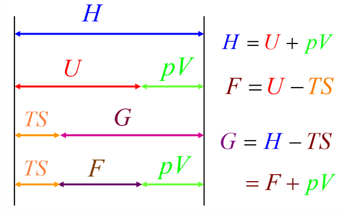

## 热平衡与自由能

熵增原理为孤立系统提供了判断过程方向的判据。然而，实际系统往往并非孤立系统——它们与恒温热源接触，或处于恒温恒压条件下。我们需要更一般的平衡判据，使之适用于这些常见的约束条件。亥姆霍兹自由能和吉布斯自由能正是为此目的而引入的热力学势函数，它们为不同约束下的自发过程方向和平衡条件提供了简洁而有力的判据。

## 学习目标

读完本页后，你应该能够：

- 陈述孤立系统的熵判据
- 推导亥姆霍兹自由能和吉布斯自由能的定义及判据
- 理解自由能的物理意义
- 列出四个热力学势的基本方程和麦克斯韦关系
- 陈述物体系内部的热平衡、力学平衡和化学平衡条件

## 孤立系统的热平衡判据

回顾熵增原理：对于孤立系统（$\mathrm{d}U = 0$，$\mathrm{d}V = 0$），熵增原理给出 $\mathrm{d}S \geq 0$。在平衡态处，$\mathrm{d}S = 0$，即熵达到极大值。

???+ warning "孤立系统的熵判据"
    在保持内能和体积不变的约束下，平衡态与所有可能的虚变动态相比，其熵取极大值：

    $$  
    \mathrm{d}S_{U,V} \geq 0  
    $$

    等号 "$=$" 对应平衡态（可逆过程），不等号 "$>$" 对应不可逆过程（自发过程）。

例如，一个气球向真空膨胀：将气体、气球膜和周围真空作为一个整体看待，总内能 $U$ 和总体积 $V$ 不变。膨胀结束后，系统的熵达到极大值，系统处于平衡态。

然而，熵判据要求系统是孤立的——约束条件为恒定 $U$ 和 $V$。但在实验和工程中，我们更常遇到的是系统与恒温热源接触（恒定 $T$），或同时与恒温恒压环境接触（恒定 $T$ 和 $p$）。在这些条件下，用熵判据并不方便，因为需要同时追踪系统和热源的熵变。为此，我们引入自由能函数，将判据转化为仅涉及系统自身状态量的形式。

## 定温定体条件下的热平衡判据 - 亥姆霍兹自由能

### 推导

考虑系统 $\Sigma$ 与温度为 $T$ 的恒温热源 $\Sigma'$ 接触，二者合起来构成孤立系统。设系统经历一个微小过程，其中系统从热源吸收热量 $\delta Q$。

总熵变满足熵增原理：

$$
\mathrm{d}S_0 = \mathrm{d}S + \mathrm{d}S' \geq 0
$$

其中 $\mathrm{d}S$ 为系统的熵变，$\mathrm{d}S'$ 为热源的熵变。热源温度恒为 $T$，其熵变为：

$$
\mathrm{d}S' = \dfrac{-\delta Q}{T}
$$

注意：系统吸收的热量等于热源放出的热量，故热源的 $\delta Q' = -\delta Q$。

对于系统，在体积不变的条件下（$\mathrm{d}V = 0$），热力学第一定律给出：

$$
\mathrm{d}U = \delta Q
$$

因此：

$$
\mathrm{d}S' = -\dfrac{\mathrm{d}U}{T}
$$

代入总熵变不等式：

$$
\mathrm{d}S - \dfrac{\mathrm{d}U}{T} \geq 0
$$

两边乘以 $T$（$T > 0$）：

$$
T\,\mathrm{d}S - \mathrm{d}U \geq 0
$$

即：

$$
\mathrm{d}(U - TS) \leq 0
$$

### 定义

???+ warning "亥姆霍兹自由能"
    亥姆霍兹自由能（Helmholtz free energy）定义为：

    $$  
    F = U - TS  
    $$

    其中 $U$ 为内能，$T$ 为温度，$S$ 为熵。$F$ 是一个态函数，具有能量的量纲。

### 判据

在恒温恒容条件下，由上述推导可得：

$$
\mathrm{d}F_{T,V} \leq 0
$$

- $\mathrm{d}F < 0$：自发过程（不可逆）
- $\mathrm{d}F = 0$：平衡态（可逆过程）
- $\mathrm{d}F > 0$：不可能自发发生

???+ tip "物理意义"
    在恒温恒容条件下，平衡态与所有可能的虚变动态相比，亥姆霍兹自由能取极小值。系统总是自发地朝着 $F$ 减小的方向演化，直到 $F$ 达到极小值——此时系统达到平衡。

### 基本方程

由 $F = U - TS$，对其全微分：

$$
\mathrm{d}F = \mathrm{d}U - T\,\mathrm{d}S - S\,\mathrm{d}T
$$

利用热力学第一定律 $\mathrm{d}U = T\,\mathrm{d}S - p\,\mathrm{d}V$（可逆过程），代入得：

$$
\mathrm{d}F = -S\,\mathrm{d}T - p\,\mathrm{d}V
$$

这是亥姆霍兹自由能的基本方程，其自然变量为 $T$ 和 $V$。由该方程可以读出：

$$
S = -\left(\dfrac{\partial F}{\partial T}\right)_V, \quad p = -\left(\dfrac{\partial F}{\partial V}\right)_T
$$

## 定温定压条件下的热平衡判据 - 吉布斯自由能

### 推导

现在考虑系统 $\Sigma$ 与温度为 $T$、压强为 $p$ 的恒温恒压热源 $\Sigma'$ 接触，二者合起来构成孤立系统。

总熵变满足：

$$
\mathrm{d}S_0 = \mathrm{d}S + \mathrm{d}S' \geq 0
$$

热源温度恒为 $T$，其熵变为：

$$
\mathrm{d}S' = \dfrac{-\delta Q}{T}
$$

对于系统，在恒压条件下（$\mathrm{d}p = 0$），吸收的热量等于焓变：

$$
\delta Q = \mathrm{d}H
$$

因此：

$$
\mathrm{d}S' = -\dfrac{\mathrm{d}H}{T}
$$

代入总熵变不等式：

$$
\mathrm{d}S - \dfrac{\mathrm{d}H}{T} \geq 0
$$

两边乘以 $T$：

$$
T\,\mathrm{d}S - \mathrm{d}H \geq 0
$$

即：

$$
\mathrm{d}(H - TS) \leq 0
$$

### 定义

???+ warning "吉布斯自由能"
    吉布斯自由能（Gibbs free energy）定义为：

    $$  
    G = H - TS = U + pV - TS  
    $$

    其中 $H$ 为焓，$U$ 为内能，$p$ 为压强，$V$ 为体积，$T$ 为温度，$S$ 为熵。$G$ 是一个态函数，具有能量的量纲。

### 判据

在恒温恒压条件下：

$$
\mathrm{d}G_{T,p} \leq 0
$$

- $\mathrm{d}G < 0$：自发过程（不可逆）
- $\mathrm{d}G = 0$：平衡态（可逆过程）
- $\mathrm{d}G > 0$：不可能自发发生

### 基本方程

由 $G = H - TS$，对其全微分：

$$
\mathrm{d}G = \mathrm{d}H - T\,\mathrm{d}S - S\,\mathrm{d}T
$$

利用 $\mathrm{d}H = T\,\mathrm{d}S + V\,\mathrm{d}p$，代入得：

$$
\mathrm{d}G = -S\,\mathrm{d}T + V\,\mathrm{d}p
$$

这是吉布斯自由能的基本方程，其自然变量为 $T$ 和 $p$。由该方程可以读出：

$$
S = -\left(\dfrac{\partial G}{\partial T}\right)_p, \quad V = \left(\dfrac{\partial G}{\partial p}\right)_T
$$

### 与非体积功的关系

对于一个可逆的等温等压过程，我们来推导吉布斯自由能变化与系统对外做功之间的关系。

由第一定律，系统内能的变化为：

$$
\mathrm{d}U = \delta Q + \delta A_{\text{体}} + \delta A_{\text{非体}}
$$

其中 $\delta A_{\text{体}} = -p\,\mathrm{d}V$ 为外界对系统做的体积功，$\delta A_{\text{非体}}$ 为外界对系统做的非体积功（如电功等）。

对于可逆过程，$\delta Q = T\,\mathrm{d}S$，因此：

$$
\mathrm{d}U = T\,\mathrm{d}S - p\,\mathrm{d}V + \delta A_{\text{非体}}
$$

现在计算 $\mathrm{d}G$：

$$
\mathrm{d}G = \mathrm{d}H - T\,\mathrm{d}S - S\,\mathrm{d}T = \mathrm{d}U + p\,\mathrm{d}V + V\,\mathrm{d}p - T\,\mathrm{d}S - S\,\mathrm{d}T
$$

在等温（$\mathrm{d}T = 0$）等压（$\mathrm{d}p = 0$）条件下：

$$
\mathrm{d}G = \mathrm{d}U + p\,\mathrm{d}V - T\,\mathrm{d}S
$$

将 $\mathrm{d}U = T\,\mathrm{d}S - p\,\mathrm{d}V + \delta A_{\text{非体}}$ 代入：

$$
\mathrm{d}G = (T\,\mathrm{d}S - p\,\mathrm{d}V + \delta A_{\text{非体}}) + p\,\mathrm{d}V - T\,\mathrm{d}S = \delta A_{\text{非体}}
$$

记系统对外做的非体积功为 $\delta A'_{\text{非体}} = -\delta A_{\text{非体}}$，则：

$$
\mathrm{d}G = -\delta A'_{\text{非体}}
$$

???+ tip "吉布斯自由能的物理意义"
    在可逆的等温等压过程中，系统对外做的非体积功等于吉布斯自由能的减少量：

    $$  
    \delta A'_{\text{非体}} = -\mathrm{d}G  
    $$

    对于不可逆的等温等压过程，系统对外做的非体积功小于吉布斯自由能的减少量，即 $\delta A'_{\text{非体}} < -\mathrm{d}G$。因此，$-\Delta G$ 是等温等压过程中系统对外做非体积功的**最大值**。这也说明在等温等压条件下，$\Delta G < 0$ 的过程可以对外做功，具有自发进行的趋势。

??? note "例题：判断相变方向"
    **题目**：在 $1\;\text{atm}$、$263\;\text{K}$（$-10\,°\text{C}$）下，过冷水凝固成冰。已知该温度下水的摩尔凝固潜热 $\Lambda = 6004\;\text{J/mol}$，水和冰的摩尔定压热容分别为 $C_{p,l} = 75.3\;\text{J/(mol·K)}$，$C_{p,s} = 36.8\;\text{J/(mol·K)}$。试用吉布斯自由能判据判断该过程的方向。

    **解答**：在等温等压条件下，过程方向由 $\Delta G$ 的符号决定。我们需要计算 $\Delta G = G_{\text{冰}} - G_{\text{水}}$ 在 $263\;\text{K}$ 下的值。

    由于 $263\;\text{K}$ 不是平衡相变温度（平衡温度为 $273.15\;\text{K}$），不能直接用 $\Delta G = 0$。我们可以利用 $\Delta G$ 与温度的关系：

    $$  
    \left(\dfrac{\partial \Delta G}{\partial T}\right)_p = -\Delta S  
    $$

    在 $273.15\;\text{K}$ 下，水和冰平衡共存，$\Delta G(273.15) = 0$。从 $273.15\;\text{K}$ 积分到 $263\;\text{K}$：

    $$  
    \Delta G(263) = \Delta G(273.15) + \int_{273.15}^{263} (-\Delta S)\,\mathrm{d}T = -\int_{273.15}^{263} \Delta S\,\mathrm{d}T  
    $$

    其中 $\Delta S = S_{\text{冰}} - S_{\text{水}}$，在温度 $T$ 附近：

    $$  
    \Delta S(T) = \Delta S(273.15) + \int_{273.15}^{T} \dfrac{C_{p,s} - C_{p,l}}{T'}\,\mathrm{d}T' = -\dfrac{\Lambda}{273.15} + (C_{p,s} - C_{p,l})\ln\dfrac{T}{273.15}  
    $$

    代入数值（$\Delta S(273.15) = -6004/273.15 \approx -21.98\;\text{J/(mol·K)}$）并积分，可得 $\Delta G(263) < 0$。因此在 $263\;\text{K}$ 下，水凝固成冰是自发过程——这与经验一致。

## 热力学函数关系

在前面几节中，我们依次引入了内能 $U$、焓 $H$、亥姆霍兹自由能 $F$ 和吉布斯自由能 $G$。这四个热力学势并非彼此独立，它们之间通过勒让德变换相联系，构成了热力学的完整函数体系。

### 四个热力学势的相互关系

四个热力学势之间的关系可以通过以下定义来理解：

$$
H = U + pV
$$

$$
F = U - TS
$$

$$
G = H - TS = U + pV - TS = F + pV
$$

它们之间的变换关系可以用下图表示：

### 基本方程与麦克斯韦关系

每个热力学势都有自己的基本微分方程和自然变量。由基本方程的全微分性质，可以得到所谓的**麦克斯韦关系**——这是由二阶偏导数的对称性（施瓦茨定理）所保证的：

$$
\dfrac{\partial^2 f}{\partial x \, \partial y} = \dfrac{\partial^2 f}{\partial y \, \partial x}
$$

???+ note "四个热力学势的完整关系"

    | 热力学势 | 基本方程 | 自然变量 | 麦克斯韦关系 |  
    |:---:|:---:|:---:|:---:|  
    | 内能 $U$ | $\mathrm{d}U = T\,\mathrm{d}S - p\,\mathrm{d}V$ | $S, V$ | $\left(\dfrac{\partial T}{\partial V}\right)_S = -\left(\dfrac{\partial p}{\partial S}\right)_V$ |  
    | 焓 $H$ | $\mathrm{d}H = T\,\mathrm{d}S + V\,\mathrm{d}p$ | $S, p$ | $\left(\dfrac{\partial T}{\partial p}\right)_S = \left(\dfrac{\partial V}{\partial S}\right)_p$ |  
    | 亥姆霍兹自由能 $F$ | $\mathrm{d}F = -S\,\mathrm{d}T - p\,\mathrm{d}V$ | $T, V$ | $\left(\dfrac{\partial S}{\partial V}\right)_T = \left(\dfrac{\partial p}{\partial T}\right)_V$ |  
    | 吉布斯自由能 $G$ | $\mathrm{d}G = -S\,\mathrm{d}T + V\,\mathrm{d}p$ | $T, p$ | $\left(\dfrac{\partial S}{\partial p}\right)_T = -\left(\dfrac{\partial V}{\partial T}\right)_p$ |

麦克斯韦关系的意义在于：它将不易直接测量的量（如熵随体积或压强的变化）转化为容易测量的量（如温度、压强、体积之间的关系），在实际计算中极为有用。

### 麦克斯韦关系的应用：能态方程与焓态方程

麦克斯韦关系的一个重要应用是：将不易直接测量的物理量（如熵随体积或压强的变化）转化为容易测量的量（如物态方程中的 $p, V, T$ 关系）。

#### 能态方程

以 $T$ 和 $V$ 为自变量，将内能和熵展开为全微分：

$$
\mathrm{d}U = \left(\dfrac{\partial U}{\partial T}\right)_V \mathrm{d}T + \left(\dfrac{\partial U}{\partial V}\right)_T \mathrm{d}V
$$

$$
\mathrm{d}S = \left(\dfrac{\partial S}{\partial T}\right)_V \mathrm{d}T + \left(\dfrac{\partial S}{\partial V}\right)_T \mathrm{d}V
$$

将 $\mathrm{d}S$ 代入热力学基本方程 $\mathrm{d}U = T\,\mathrm{d}S - p\,\mathrm{d}V$：

$$
\mathrm{d}U = T\left(\dfrac{\partial S}{\partial T}\right)_V \mathrm{d}T + \left[T\left(\dfrac{\partial S}{\partial V}\right)_T - p\right] \mathrm{d}V
$$

比较两个 $\mathrm{d}U$ 表达式中 $\mathrm{d}V$ 的系数，并利用麦克斯韦关系 $\left(\dfrac{\partial S}{\partial V}\right)_T = \left(\dfrac{\partial p}{\partial T}\right)_V$，得到**能态方程**：

???+ warning "能态方程"

    $$
    \left(\dfrac{\partial U}{\partial V}\right)_T = T\left(\dfrac{\partial p}{\partial T}\right)_V - p
    $$

    该方程将内能对体积的依赖转化为物态方程中 $p$ 与 $T$ 的关系，可通过实验直接测量。

#### 焓态方程

类似地，以 $T$ 和 $p$ 为自变量，将焓和熵展开，代入 $\mathrm{d}H = T\,\mathrm{d}S + V\,\mathrm{d}p$，利用麦克斯韦关系 $\left(\dfrac{\partial S}{\partial p}\right)_T = -\left(\dfrac{\partial V}{\partial T}\right)_p$，得到**焓态方程**：

???+ warning "焓态方程"

    $$
    \left(\dfrac{\partial H}{\partial p}\right)_T = -T\left(\dfrac{\partial V}{\partial T}\right)_p + V
    $$

    该方程将焓对压强的依赖转化为物态方程中 $V$ 与 $T$ 的关系。

#### 例题：范德瓦尔斯气体的热力学函数

??? note "例题：范德瓦尔斯气体的内能和熵"
    **题目**：求范德瓦尔斯气体的内能 $U(T, V)$ 和熵 $S(T, V)$。

    范德瓦尔斯方程为：

    $$
    \left(p + \dfrac{\nu^2 a}{V^2}\right)(V - \nu b) = \nu RT
    $$

    **解答**：

    **内能**：由能态方程，需要计算 $\left(\dfrac{\partial p}{\partial T}\right)_V$。从范德瓦尔斯方程解出 $p$：

    $$
    p = \dfrac{\nu RT}{V - \nu b} - \dfrac{\nu^2 a}{V^2}
    $$

    求偏导：

    $$
    \left(\dfrac{\partial p}{\partial T}\right)_V = \dfrac{\nu R}{V - \nu b}
    $$

    代入能态方程：

    $$
    \left(\dfrac{\partial U}{\partial V}\right)_T = T \cdot \dfrac{\nu R}{V - \nu b} - \left(\dfrac{\nu RT}{V - \nu b} - \dfrac{\nu^2 a}{V^2}\right) = \dfrac{\nu^2 a}{V^2}
    $$

    积分得到内能：

    $$
    U(T, V) = \int_{T_0}^{T} C_V(T')\,\mathrm{d}T' - \dfrac{\nu^2 a}{V} + \text{const}
    $$

    与理想气体相比，范德瓦尔斯气体的内能多了一项 $-\nu^2 a/V$，这反映了分子间引力的贡献。

    **熵**：利用 $\left(\dfrac{\partial S}{\partial V}\right)_T = \left(\dfrac{\partial p}{\partial T}\right)_V = \dfrac{\nu R}{V - \nu b}$ 和 $\left(\dfrac{\partial S}{\partial T}\right)_V = \dfrac{C_V}{T}$，积分得到：

    $$
    S(T, V) = \int_{T_0}^{T} \dfrac{C_V(T')}{T'}\,\mathrm{d}T' + \nu R \ln(V - \nu b) + \text{const}
    $$

    其他热力学函数（$H, F, G$）可由定义 $H = U + pV$，$F = U - TS$，$G = H - TS$ 结合物态方程求得。

## 物体系内各部分之间的平衡条件

前面讨论的熵判据、亥姆霍兹自由能判据和吉布斯自由能判据，都是针对系统整体是否达到稳定平衡的问题，每种判据对应特定的外部约束条件。现在我们转向另一类重要问题：**一个物体系内部各部分之间**要满足什么条件才能达到平衡？

考虑一个系统被分为 $A$ 和 $B$ 两部分，它们之间可以交换某些物理量（能量、体积、物质等）。下面分别讨论三种平衡条件。

### 热平衡条件

设 $A$ 和 $B$ 两部分可以交换热量（热接触），但各自体积不变、不交换物质。平衡时，总熵取极大值：

$$
\mathrm{d}S = \mathrm{d}S_A + \mathrm{d}S_B = 0
$$

由热力学基本关系 $\mathrm{d}S = \delta Q / T$，以及能量守恒 $\delta Q_A + \delta Q_B = 0$，可得：

$$
\mathrm{d}S = \dfrac{\delta Q_A}{T_A} + \dfrac{\delta Q_B}{T_B} = \delta Q_A \left( \dfrac{1}{T_A} - \dfrac{1}{T_B} \right) = 0
$$

由于 $\delta Q_A$ 是任意的虚变动，因此：

$$
T_A = T_B
$$

???+ tip "热平衡条件"
    当系统内部各部分达到热平衡时，温度在整个系统中是均匀的，即 $T_A = T_B$。

### 力学平衡条件

设 $A$ 和 $B$ 两部分可以交换体积（通过移动活塞等），总内能和总体积不变。假设热平衡已建立（$T_A = T_B$），对体积的虚变动，平衡时总熵取极大值：

$$
\mathrm{d}S = \left( \dfrac{p_A}{T_A} - \dfrac{p_B}{T_B} \right) \mathrm{d}V_A = 0
$$

结合热平衡条件 $T_A = T_B$，得到：

$$
p_A = p_B
$$

???+ tip "力学平衡条件"
    当系统内部各部分达到力学平衡时，压强在整个系统中是均匀的，即 $p_A = p_B$。

### 化学平衡条件

当系统内部各部分之间可以交换物质时，需要引入一个新的状态量——**化学势**。

???+ warning "化学势"
    组分 $i$ 的化学势（chemical potential）定义为：

    $$  
    \mu_i = \left(\dfrac{\partial G}{\partial n_i}\right)_{T, p, n_{j \neq i}}  
    $$

    即在恒温恒压下，保持其他组分物质的量不变，增加一摩尔组分 $i$ 所引起的吉布斯自由能变化。化学势反映了物质的"逃逸趋势"——物质总是倾向于从化学势高的相或区域流向化学势低的相或区域。

**相平衡**：对于同一物质在 $\alpha$ 和 $\beta$ 两相之间的平衡，要求该物质在两相中的化学势相等：

$$
\mu_\alpha = \mu_\beta
$$

**化学反应平衡**：对于化学反应 $\sum_i \nu_i A_i = 0$（其中 $\nu_i$ 为化学计量系数，反应物取负值，产物取正值），平衡条件为：

$$
\sum_i \nu_i \mu_i = 0
$$

???+ tip "化学平衡条件"
    当系统内部各部分达到化学平衡时，每种组分在所有相中的化学势相等；对于化学反应，各组分的化学计量系数与化学势的乘积之和为零。

## 学习衔接

- 上一节：[克劳修斯不等式与熵定理](./clausius-inequality-and-entropy.md)
- 读完本章后可以继续阅读：下一章还没施工完成捏~
