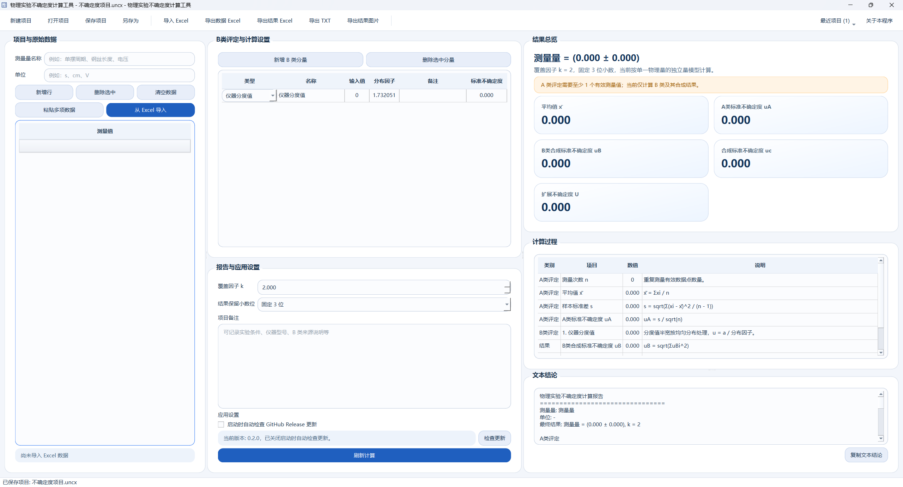

??? tip "页面内容待补充"
    有很多可以补充的东西，欢迎提交 Pull Request 或者 Issue！

## 科学计算工具

本文介绍一些常用的 Python 科学计算工具库，这些库在数据分析、数值计算、机器学习等领域广泛使用。

### 不确定度计算器

开源仓库：[GitHub](https://github.com/Leafuke/Physics-Lab-Uncertainty-Calculator)  
下载地址：[GitHub Releases](https://github.com/Leafuke/Physics-Lab-Uncertainty-Calculator/releases)  
下载地址（加速）：[GH Proxy](https://gh-proxy.org/https://github.com/Leafuke/Physics-Lab-Uncertainty-Calculator)

这是一个专门为物理实验设计的工具，能够帮助你计算测量数据的不确定度。使用这个工具，你可以更准确地评估实验结果的可靠性，并且生成专业的报告。

